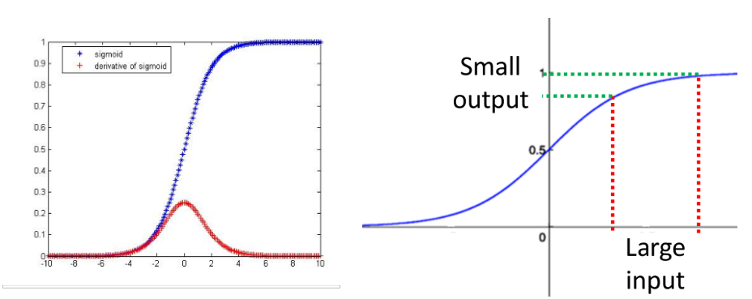
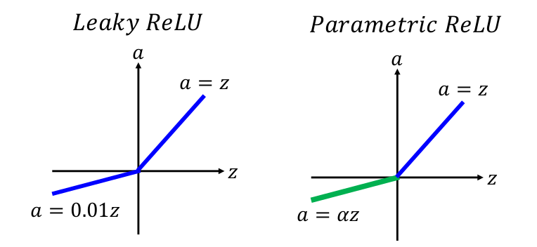
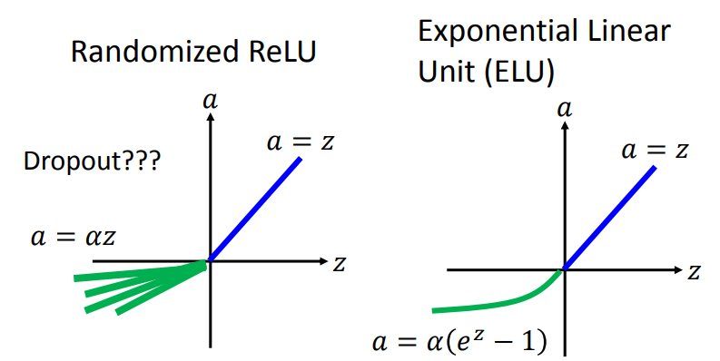
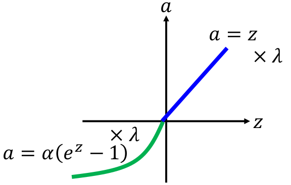
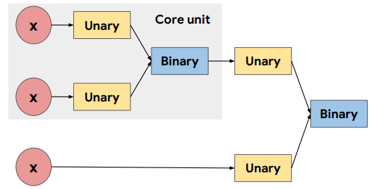
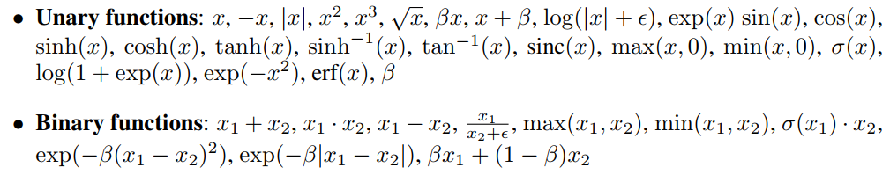
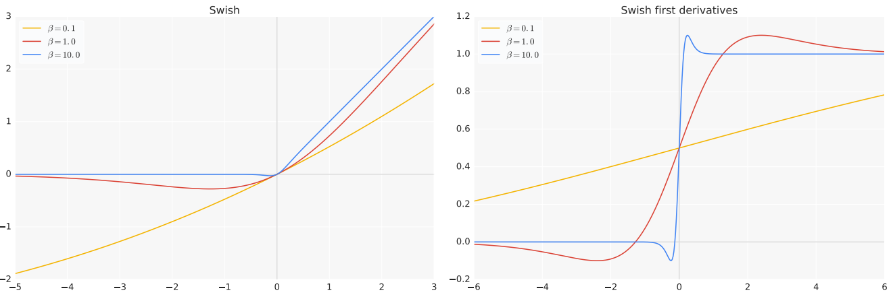

# 激活函数

## 1. 激活函数的作用

使用**激活函数**的目的是为了向网络中加入**非线性因素**：从而加强网络的表示能力，解决**线性模型**无法解决的问题

## 2. 常见激活函数

### ① Sigmoid

也称为Logistic函数：
$$
\sigma(x)=\frac{1}{1+exp(-x)}
$$
存在的主要问题：

1. 梯度消失问题（从左图可以看出来在输入"远离"中心的位置梯度很小，或者更直观的右图---梯度可以用$\Delta y/\Delta x$来近似，可以发现当$\Delta x$大小不变时，远离中心更小）：主要由于反向传播时，“多个”梯度很小的累乘使得前面几层的梯度很大程度上主要依赖于初始化

> tanh：
> $$
> tanh(x)=\frac{e^x-e^{-x}}{e^x+e^{-x}}
> $$
> tanh和sigmoid性质类似，只是输出范围为：[-1, 1]。

### ② ReLU

其表达式为：
$$
f(x)=max(0, x)=\begin{cases} x\quad x\ge 0\\ 0\quad x< 0\end{cases}
$$
主要的几个优点：

1. 计算快（因为没有exp操作）
2. 具有生物学意义（具体啥就略过）
3. 高效的梯度反向传播：克服了梯度消失和梯度爆炸问题
4. 缩放不变性：$max(0,ax)=a\ max(0,x)$
5. 使得神经元具有稀疏性：比如随机初始化时，大概有50%的神经元处于“失活”状态

> 还有一种更“实验化”的解释：ReLU相比Sigmoid能够用更少的神经元来拟合目标函数，可以参考[ReLU的解释](https://zhuanlan.zhihu.com/p/30087747)

### ③ ReLU的变种

> 1. ReLU的大部分变种主要是为了解决“死区”（失活过多）的问题。但说实话，ReLU还是最常见的。几种不同的变种的一些比较：[Empirical Evaluation of Rectified Activations in Convolution Network](https://arxiv.org/pdf/1505.00853.pdf)
> 2. 各种变种其实并不一定会比ReLU效果好，具体问题具体分析。

#### Leaky ReLU & PReLU 

Leaky ReLU和PReLU的表达式：
$$
f(x)=\begin{cases}x\quad\quad if\ x>0\\ \alpha \cdot x\quad if\ x<0\end{cases}
$$
两者的不同在于：Leaky ReLU中的$\alpha$是人为设定的，而PReLU里的这个参数也是随梯度下降更新的（就相当于多增加一个学习参数）

> Leaky ReLU：参数选择较为困难
>
> PReLU：给ReLU带来更大自由度的同时，增加了网络过拟合的风险

#### RReLU & ELU

RReLU：其中的$\alpha$在训练阶段在某个范围内$[lower, upper]$等概率随机选取，而在测试阶段则为固定值（$(lower+upper)/2$）

ELU：具备ReLU的优点，也解决了“死区”问题，但指数操作增加了计算量

#### SELU：ELU的变种

可以视为"ELU"采用更合理的参数：其中$\alpha=1.67326...$，$\lambda=1.050700...$（关于为什么这么设定，作者给出了几十页的证明）：SELU具备ELU所有的优点，同时还具有一个很强大的特性---就是自带归一化的特性（一般采用SELU就不加BN层了）

> 但是这种方法其实对参数初始化是有要求的

### ④ Swish

通过机器自己去寻找到的“最佳组合”激活函数，主要的设计理念如下：

相当于将Unary functions的和Binary functions的所有可能组合“一一”去实验，来获得最佳的组合方式（实际paper中是通过LSTM这种网络来学）

反正最后能够获得一种最佳的组合（其实有好几种都很不错的组合）命名为Swish：
$$
f(x)=x\cdot \sigma(\beta x)=x\cdot\frac{1}{1+exp(-\beta x)}
$$

> 这种激活函数知道一下就好，详见：[Swish](https://arxiv.org/pdf/1710.05941.pdf)

