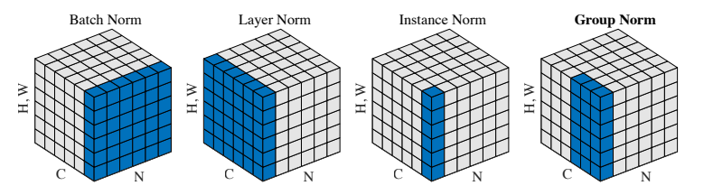
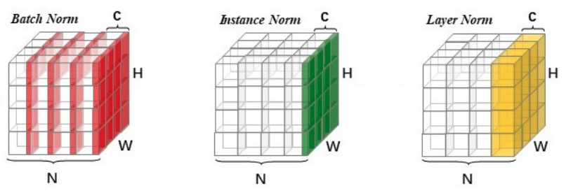
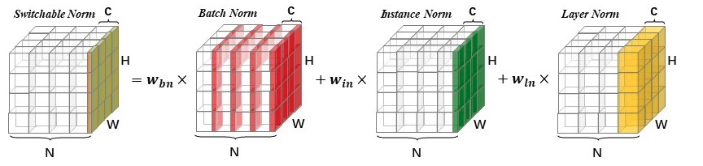

> 下述内容主要来自：[Switchable Normalization](http://htmlpreview.github.io/?https://github.com/switchablenorms/Switchable-Normalization/blob/master/blog_cn/blog_cn.html)，[Group Normalization](https://arxiv.org/pdf/1803.08494.pdf)

# 各类Normalization

首先先来看一下各类Normalization方法的通用表达形式：
$$
\hat{x}_i=\frac{1}{\sigma_i}(x_i-\mu_i)
$$

> 其中的$i=(i_N,i_C,i_H,i_W)$

其中的$\mu$和$\sigma$的计算方法如下所示：
$$
\mu_i=\frac{1}{m}\sum_{k\in S_i}x_{k}\quad \quad \sigma_i=\sqrt{\frac{1}{m}\sum_{k\in S_i}(x_k-\mu_i)^2+\epsilon}
$$
然后来看下不同的Normalization采用的$S_i$的定义

### ① Batch Normalization

在BN里面，$S_i$定义为：
$$
S_i=\{k|k_C=i_C\}
$$

> 其中$i_C$ (和$k_C$)代表$C$这一维度，即同一channel上面共享同样的参数。更简单而言，$\mu$和$\sigma$都是在$(N,H,W)$上面计算获得的---即最后输出的$\mu$的大小其实为$C$（例如，channel=1上面，计算对应通道上面N, H, W全部像素点的均值）--- 即上图中红色部分的均值

### ② Layer Normalization

在LN里面，$S_i$定义为：
$$
S_i=\{k|k_N=i_N\}
$$

> 即LN中$\mu$和$\sigma$是在$(C,H,W)$上面计算所获得的。--- 如上图中黄色部分的均值

### ③ Instance Normalization

在IN里面，$S_i$定义为：
$$
S_i=\{k|k_N=i_N,k_C=i_C\}
$$

> 即IN中$\mu$和$\sigma$是在$(H,W)$上面计算获得的 --- 如上图中绿色部分的均值

### ④ Group Normalization

在GN里面，$S_i$定义为：
$$
S_i=\{k|k_N=i_N,\lfloor \frac{k_C}{C/G}\rfloor = \lfloor \frac{i_C}{C/G}\rfloor \}
$$
其中的G可以看作是预定义的超参数，可以视为介于Instance Normalization和Layer Normalization之间的情况。

> 默认G取32

### ⑤ Switchable Normalization

其实可以看成BN+IN+LN的组合（而前面的系数是学出来的）

