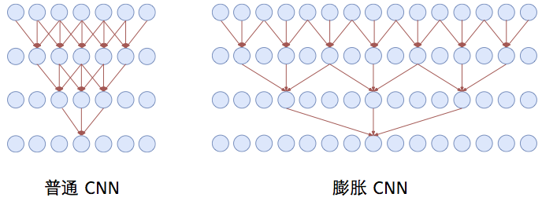

> 这部分主要介绍几种常见的CNN结构
>
> 主要来源于：[理解各种各样的CNN架构](https://zhuanlan.zhihu.com/p/32116277)，[cs231n slide](http://cs231n.stanford.edu/slides/2018/cs231n_2018_lecture09.pdf)，[github](https://github.com/imhuay/Interview_Notes-Chinese/blob/master/%E6%9C%BA%E5%99%A8%E5%AD%A6%E4%B9%A0-%E6%B7%B1%E5%BA%A6%E5%AD%A6%E4%B9%A0-NLP/DL-CNN.md)

# Convolutional Neural Network

为什么这些网络表现如此之好？它们是如何设计出来的？为什么它们设计成那样的结构？

## 1. CNN设计的原理

CNN为什么被广泛应用在图像领域？CNN相比全连接网络主要在于引入了卷积层和池化层(虽然现在很多网络采用`stride=2`来替代池化，但是下述讲的原理也是相通的)

### ① why卷积层

1. 图片上的很多特征并不是根据全图获得的（比如上面图中的鸟嘴，它只由图片中的一小块区域就可以发现）
2. 相同的特征会出现在图片的不同区域（这也是sobel算子等方法可行的原因，此外此处相同的特征未必只针对一张图的不同区域，如上面两幅图中均有鸟嘴，且出现在不同的位置）

> 个人的理解：其实利用了我们对图像认知的先验 --- 图像块之间的低秩性，以及每个图像块其实只有少数几种特征所组成，图像块的稀疏性

### ② why池化层

1. 对"图像"进行下采样并不会改变物体（或者说并不会导致物体的相对位置）

## 2. 为什么CNN模型战胜了传统的计算机视觉方法？

图像分类指的是给定一个图片将其分类成预先定义好的几个类别之一。图像分类的传统流程涉及两个模块：**特征提取**和**分类**。

**特征提取**指的是从原始像素点中提取更高级的特征，这些特征能捕捉到各个类别间的区别。这种特征提取是使用无监督方式，从像素点中提取信息时没有用到图像的类别标签。常用的传统特征包括GIST, HOG, SIFT, LBP等。特征提取之后，使用图像的这些特征与其对应的类别标签训练一个分类模型。常用的分类模型有SVM，LR，随机森林及决策树等。

**上面流程的一大问题**是特征提取不能根据图像和其标签进行调整。如果选择的特征缺乏一定的代表性来区分各个类别，模型的准确性就大打折扣，无论你采用什么样的分类策略。采用传统的流程，目前的一个比较好的方法是使用多种特征提取器，然后组合它们得到一种更好的特征。但是这需要很多启发式规则和人力来根据领域不同来调整参数使得达到一个很好的准确度，这里说的是要接近人类水平。这也就是为什么采用传统的计算机视觉技术需要花费多年时间才能打造一个好的计算机视觉系统（如OCR，人脸验证，图像识别，物体检测等），这些系统在实际应用中可以处理各种各样的数据。有一次，我们用了6周时间为一家公司打造了一个CNN模型，其效果更好，采用传统的计算机视觉技术要达到这样的效果要花费一年时间。

**传统流程的另外一个问题**是它与人类学习识别物体的过程是完全不一样的。自从出生之初，一个孩子就可以感知周围环境，随着他的成长，他接触更多的数据，从而学会了识别物体。这是深度学习背后的哲学，其中并没有建立硬编码的特征提取器。它将特征提取和分类两个模块集成一个系统，通过识别图像的特征来进行提取并基于有标签数据进行分类。

为了理解CNN背后的设计哲学，你可能会问：其目标是什么？

**（1）准确度**

如果你在搭建一个智能系统，最重要的当然是要尽可能地准确。公平地来说，准确度不仅取决于网路，也取决于训练样本数量。因此，CNN模型一般在一个标准数据集ImageNet上做对比。

ImageNet项目仍然在继续改进，目前已经有包含21841类的14,197,122个图片。自从2010年，每年都会举行ImageNet图像识别竞赛，比赛会提供从ImageNet数据集中抽取的属于1000类的120万张图片。每个网络架构都是在这120万张图片上测试其在1000类上的准确度。

**（2）计算量**

大部分的CNN模型都需要很大的内存和计算量，特别是在训练过程。因此，计算量会成为一个重要的关注点。同样地，如果你想部署在移动端，训练得到的最终模型大小也需要特别考虑。你可以想象到，为了得到更好的准确度你需要一个计算更密集的网络。因此，准确度和计算量需要折中考虑。

除了上面两个因素，还有其他需要考虑的因素，如训练的容易度，模型的泛化能力等。下面按照提出时间介绍一些最流行的CNN架构，可以看到它们准确度越来越高。

## 3. 常见的卷积结构

下述`k:kernel_size,  p:padding(默认两边都加), s: stride`

### ① 常规卷积 

|                        k=3, p=0, s=1                         |                        k=4, p=2, s=1                         |                        k=3, p=1, s=1                         |                        k=3, p=2, s=1                         |
| :----------------------------------------------------------: | :----------------------------------------------------------: | :----------------------------------------------------------: | :----------------------------------------------------------: |
| 
  
  | 
  
  | 
  
  | 
  
  |
|                        k=3, p=0, s=2                         |                        k=3, p=1, s=2                         |                        k=3, p=1, s=2                         |                                                              |
| 
  
  | 
  
  | 
  
  |                                                              |

> 注：$h_o=(h_i+2p-dilation\times (k-1)-1)/s+1$

### ② 转置卷积

- 转置卷积（Transposed Convolution），又称反卷积（Deconvolution）、Fractionally Strided Convolution
  > 反卷积的说法不够准确，数学上有定义真正的反卷积，两者的操作是不同的

- 转置卷积是卷积的**逆过程**，如果把基本的卷积（+池化）看做“缩小分辨率”的过程，那么转置卷积就是“**扩充分辨率**”的过程。
  - 为了实现扩充的目的，需要对输入以某种方式进行**填充**。

- 转置卷积与数学上定义的反卷积不同——在数值上，它不能实现卷积操作的逆过程。其内部实际上执行的是常规的卷积操作。
  - 转置卷积只是为了**重建**先前的空间分辨率，执行了卷积操作。

- 虽然转置卷积并不能还原数值，但是用于**编码器-解码器结构**中，效果仍然很好。——这样，转置卷积可以同时实现图像的**粗粒化**和卷积操作，而不是通过两个单独过程来完成。

|                           k=3, s=1                           |                        k=4, s=1, p=2                         |                        k=3, s=1, p=1                         |                        k=3, s=1, p=2                         |
| :----------------------------------------------------------: | :----------------------------------------------------------: | :----------------------------------------------------------: | :----------------------------------------------------------: |
| 
  
  | 
  
  | 
  
  | 
  
  |
|                           k=3, s=2                           |                        k=3, s=2, p=1                         |                     k=3, s=2, p=1, po=1                      |                                                              |
| 
  
  | 
  
  | 
  
  |                                                              |

> $h_o=(h_i-1)*s-2p+k+p_o$

### ③ 空洞卷积

- 空洞卷积（Atrous Convolutions）也称扩张卷积（Dilated Convolutions）、膨胀卷积。

  
 

**空洞卷积的作用**

- 空洞卷积使 CNN 能够**捕捉更远的信息，获得更大的感受野**；同时不增加参数的数量，也不影响训练的速度。
- 示例：Conv1D + 空洞卷积
  

> 这幅图的比较方式其实是不公平的=.=

