> 这部分内容主要来自：[GoogLeNet系列](https://blog.csdn.net/shuzfan/article/details/50738394)，[Inception v2&v3](https://zhuanlan.zhihu.com/p/32702113)，[Inception v3中文版](http://noahsnail.com/2017/10/09/2017-10-9-Inception-V3%E8%AE%BA%E6%96%87%E7%BF%BB%E8%AF%91%E2%80%94%E2%80%94%E4%B8%AD%E6%96%87%E7%89%88/)

# 各种不同的CNN结构

## 1. AlexNet

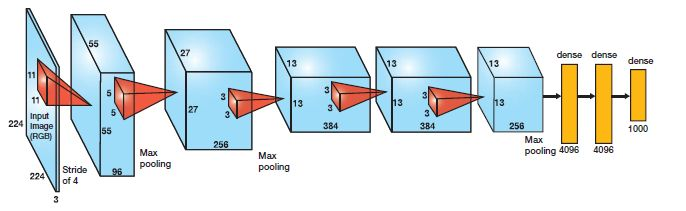

**几个改进的地方：**

1. 更深的网络结构
2. 非线性激活函数：ReLU
3. 防止过拟合的方法：Dropout，Data augmentation
4. 大数据训练：百万级ImageNet图像数据
5. 其他：GPU实现，LRN归一化层的使用

（注：LRN---local responce normalization：主要为了防止激活函数饱和，现在很少看到了）

> 更详细的介绍见：[AlexNet详解](https://zhuanlan.zhihu.com/p/21562756)

## 2. ZFNet

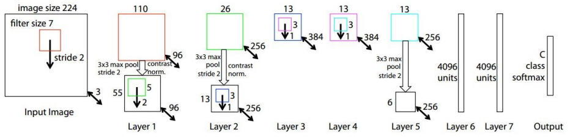

**几个改进的地方**：

1. 第一个卷积层从11x11(s=4)改为7x7(s=2)
2. 第3,4,5个卷积层的通道数从384,384,256变为512,1024,512

## 3. VGG16

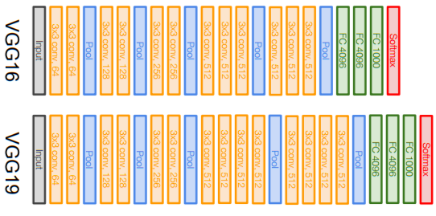

**几个改进的地方**：

1. 采用更小的filter(kernel_size)，更深的网络结构（采用3个3x3的卷积具有和7x7卷积相同的感受野，但是更少的参数量 --- $3*(3^2C^2)$ vs $7^2C^2$）
2. 去掉了Local Response Normalization部分

## 4. NIN (Network in Network)

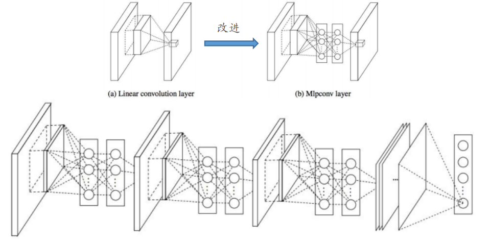

**几个改进的地方**：

1. 将原始CNN中卷积层中的单个感知机替换成了多层感知机（上图中改进的部分）（一种直观的解释：原本的卷积可以理解为同一个kernel下的feature map的均值，而采用改进后的则会进一步增强kernel获得的feature map再进一步融合之后再进行权值组合 --- 比如，类似的特征，通过"内嵌"的fc可以使得这些类似特征具有几乎相同的输出feature map）
2. 放弃传统CNN的全连接层，在最后一层的feature map使用spatial pooling作为NIN的分类的结果。已经证实，全连接层非常容易导致过拟合，极度依赖`dropout`。所以去除全连接层还是有好处的。
3. 这个网络的思想对后续ResNet, GooleNet均有很大的影响

（后续更"先进"的网络里的Block等结构就可以理解为NIN里的Mlpconv的改进）

## 5. GoogLeNet(Inception v1)

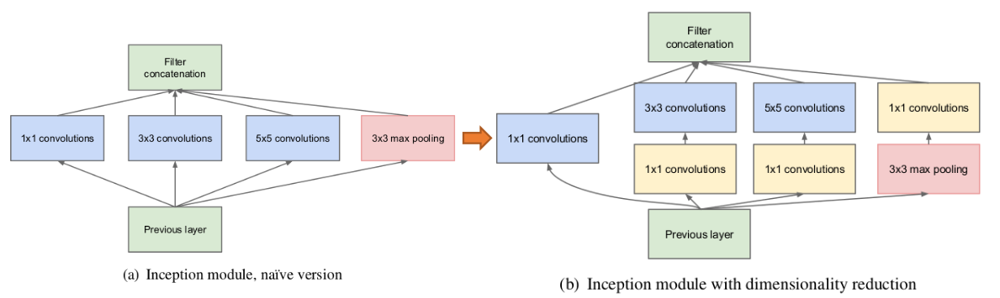

Inception v1结构的核心思想在于用密集成分来近似最优的局部稀疏结构

1. 采用不同大小的卷积核意味着不同大小的感受野，最后拼接意味着不同尺度特征的融合
2. 之所以卷积核大小采用1、3和5，主要是为了方便对齐。设定卷积步长stride=1之后，只要分别设定pad=0、1、2，那么卷积之后便可以得到相同维度的特征，然后这些特征就可以直接拼接在一起了
3. 文章说很多地方都表明pooling挺有效，所以Inception里面也嵌入了
4. 网络越到后面，特征越抽象，而且每个特征所涉及的感受野也更大了，因此随着层数的增加，3x3和5x5卷积的比例也要增加（指的是通道数）
5. (b)结构相对(a)结构主要为了减少计算量，通过1x1的卷积减少维度数

## 6. Inception v2&v3

**一些已经被证明有效的用于设计网络的通用准则和优化方法**：

**规则1：要防止出现特征描述的瓶颈（representational bottleneck）。**所谓特征描述的瓶颈就是中间某层对特征在空间维度进行较大比例的压缩（比如使用pooling时），导致很多特征丢失。虽然Pooling是CNN结构中必须的功能，但我们可以通过一些优化方法来减少Pooling造成的损失。

**规则2：特征的数目越多收敛的越快。**相互独立的特征越多，输入的信息就被分解的越彻底，分解的子特征间相关性低，子特征内部相关性高，把相关性强的聚集在了一起会更容易收敛。这点就是Hebbin原理：fire together, wire together。规则2和规则1可以组合在一起理解，特征越多能加快收敛速度，但是无法弥补Pooling造成的特征损失，Pooling造成的representational bottleneck要靠其他方法来解决。

**规则3：可以压缩特征维度数，来减少计算量。**inception-v1中提出的用1x1卷积先降维再作特征提取就是利用这点。不同维度的信息有相关性，降维可以理解成一种无损或低损压缩，即使维度降低了，仍然可以利用相关性恢复出原有的信息。

**规则4：整个网络结构的深度和宽度（特征维度数）要做到平衡。**只有等比例的增大深度和维度才能最大限度的提升网络的性能。

### inception v2中采用的策略

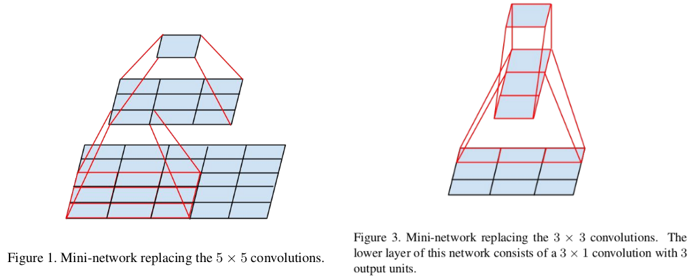

**方法1：**可以将大尺度的卷积分解成多个小尺度的卷积来减少计算量。比如将1个5x5的卷积分解成两个3x3的卷积串联，从图1左侧可以看出两级3x3的卷积的覆盖范围就是5x5，两者的覆盖范围没有区别。假设5x5和两级3x3卷积输出的特征数相同，那两级3x3卷积的计算量就是前者的(3x3+3x3)/5x5=18/25。

**方法2：**可以使用非对称卷积。将nxn的卷积分解成1xn和nx1卷积的串联，例如n=3，分解后就能节省33%的计算量（图１右侧）。作者通过测试发现非对称卷积用在网络中靠中间的层级才有较好的效果（特别是feature map的大小在12x12~20x20之间时）。

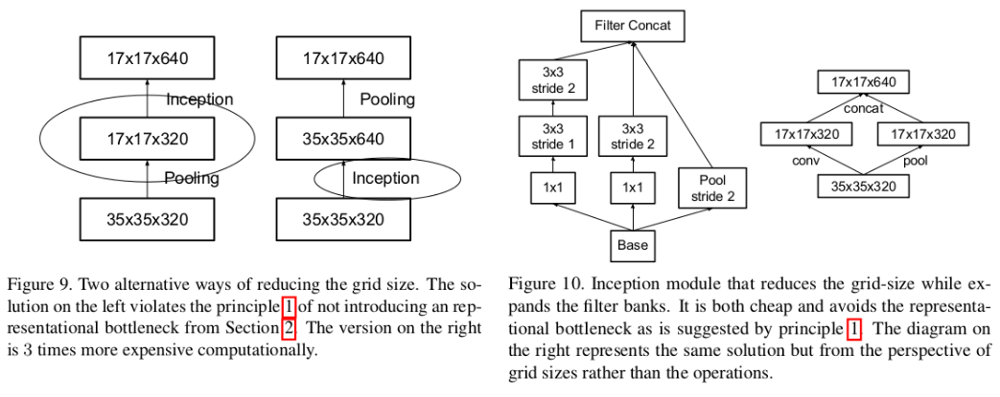

**方法3：**可以使用并行结构来优化Pooling。前面的规则1提到Pooling会造成represtation bottleneck，一种解决办法就是在Pooling前用1x1卷积把特征数加倍（见Figure9右侧），这种加倍可以理解加入了冗余的特征，然后再作Pooling就只是把冗余的信息重新去掉，没有减少信息量。这种方法有很好的效果但因为加入了1x1卷积会极大地增大计算量。替代的方法是使用两个并行的支路，一路1x1卷积，由于特征维度没有加倍计算量相比之前减少了一倍，一路是Pooling，最后再在特征维度拼合到一起（见Figure 10）。这种方法即有很好的效果，又没有增大计算量。

**方法4：**使用Label Smoothing来对网络输出进行正则化（这个就略吧）

### 整体结构

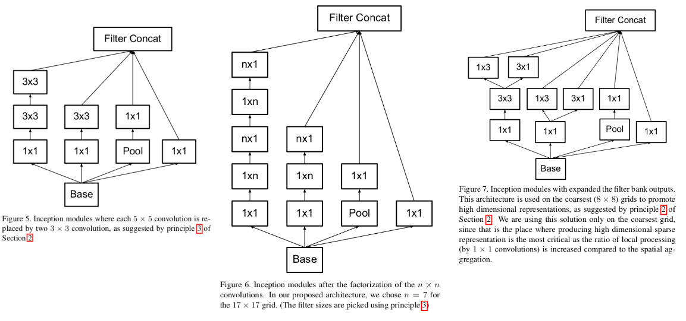

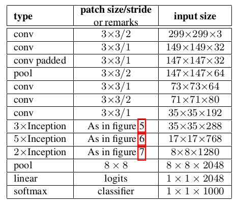

在Inception v2中加入BN层就称之为Inception v3

## 7. Inception v4

这篇自己看论文吧：主要就是采用Inception v2&v3的思想，将网络设计的更精简了，此外又研究了Inception结构和ResNet结构结合的性能。

## 8. ResNet

### 深度网络退化问题

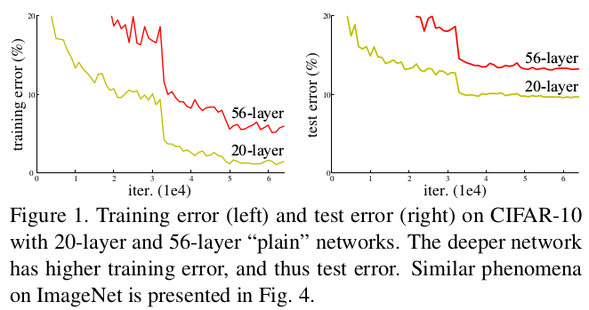

从经验来看，网络的深度对模型的性能至关重要，当增加网络层数后，网络可以进行更加复杂的特征模式的提取，所以当模型更深时理论上可以取得更好的结果。但是更深的网络其性能一定会更好吗？实验发现深度网络出现了退化问题（Degradation problem）：网络深度增加时，网络准确度出现饱和，甚至出现下降。这个现象可以在上图中直观看出来：56层的网络比20层网络效果还要差。这不是过拟合问题，因为56层网络的训练误差同样高。我们知道深层网络存在着梯度消失或者爆炸的问题，这使得深度学习模型很难训练。但是现在已经存在一些技术手段如BatchNorm来缓解这个问题。因此，出现深度网络的退化问题是非常令人诧异的。

### 残差学习

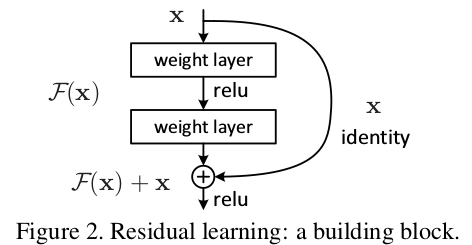

深度网络的退化问题至少说明深度网络不容易训练。但是我们考虑这样一个事实：现在你有一个浅层网络，你想通过向上堆积新层来建立深层网络，一个极端情况是这些增加的层什么也不学习，仅仅复制浅层网络的特征，即这样新层是恒等映射（Identity mapping）。在这种情况下，深层网络应该至少和浅层网络性能一样，也不应该出现退化现象。好吧，你不得不承认肯定是目前的训练方法有问题，才使得深层网络很难去找到一个好的参数。

对于一个堆积层结构（几层堆积而成）当输入为$x$时其学习到的特征记为$H(x)$，现在我们希望其可以学习到残差 $F(x)=H(x)-x$，这样其实原始的学习特征是$F(x)+x$ 。之所以这样是因为残差学习相比原始特征直接学习更容易。当残差为0时，此时堆积层仅仅做了恒等映射，至少网络性能不会下降，实际上残差不会为0，这也会使得堆积层在输入特征基础上学习到新的特征，从而拥有更好的性能。残差学习的结构如上图所示。这有点类似与电路中的“短路”，所以是一种短路连接（shortcut connection）。

为什么残差学习相对更容易，从直观上看残差学习需要学习的内容少，因为残差一般会比较小，学习难度小点。不过我们可以从数学的角度来分析这个问题，从浅层$l$到深层$L$的学习特征为：
$$
x_L=x_l+\sum_{i=l}^{L-1}F(x_i, W_i)
$$
利用链式法则，可以求得梯度反向传播过程如下：
$$
\frac{\partial loss}{\partial x_l}=\frac{\partial loss}{\partial x_L}\cdot \frac{\partial x_L}{\partial x_l}=\frac{\partial loss}{\partial x_L}(1+\frac{\partial}{\partial x_L}\sum_{i=l}^{L-1}F(x_i,W_i))
$$
式子的第一个因子 $\frac{\partial loss}{\partial {{x}_{L}}}$ 表示的损失函数到达$L$的梯度，小括号中的1表明短路机制可以无损地传播梯度，而另外一项残差梯度则需要经过带有weights的层，梯度不是直接传递过来的。残差梯度不会那么巧全为-1，而且就算其比较小，有1的存在也不会导致梯度消失。所以残差学习会更容易。

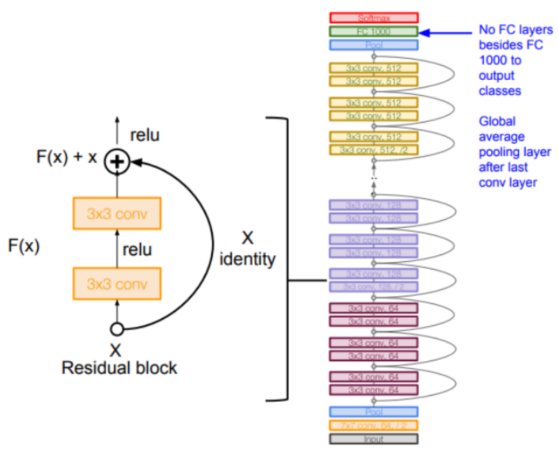

关于完整的结构，直接看论文吧～

## 9. 基于ResNet的改进

### ① residual block的修改

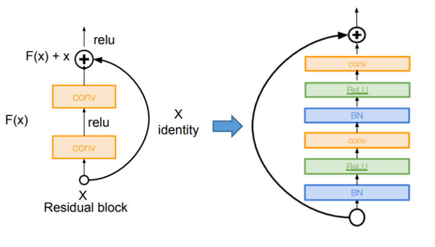

- 采用"更直接的残差连接方式"，这对于反向传播的保留梯度更好（即相当于对输入进行"BN+ReLU"，而不是原来的外部进行ReLU）
- 加入了BN层

> 这部分其实作者试了很多不同的结构，发现这种结构更好

### ② Wide ResNet：采用更"宽"的block结构（应该说更多filter更合适）

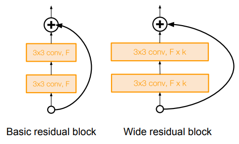

- 一方面说明残差而不是"深度"是网络性能提升的重要原因
- 采用更宽的残差块（filter从F提升到Fxk）
- 50层的宽ResNet可以媲美152层的ResNet
- 增加宽度而不是深度能提高计算效率（更大的并行）

### ③ ResNeXt：单路卷积变多路卷积（Inception的思想）

采用split-transform-merge的思想：先将输入分配到多路，然后每一路进行转换，最后再把所有支路的结果融合

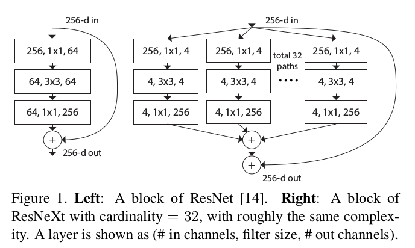

- 从"多条并行的路径"上进行融合（非常类似Inception中的Inception块---只是做的更疯狂彻底了）

## 10. DenseNet

> 内容主要来自：[densenet1](https://www.leiphone.com/news/201708/0MNOwwfvWiAu43WO.html)，[densenet2](https://www.zhihu.com/question/60109389)

DenseNet里面的每个block的结构：（注意：dense结构存在于自己的块中，各块之间不是哦）

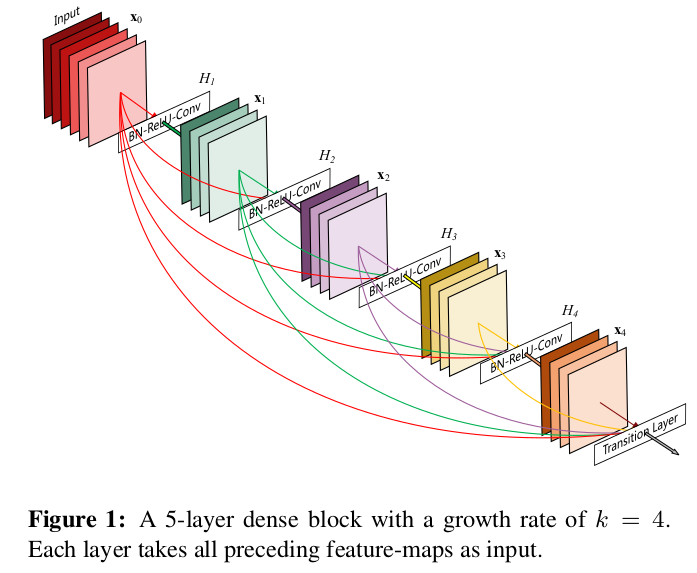

### ① Dense结构的来源

基于两点启发（作者的前一篇文章的实验情况所得）：

1. 神经网络其实并不一定要是一个递进层级结构，也就是说网络中的某一层可以不仅仅依赖于紧邻的上一层的特征，而可以依赖于更前面层学习的特征。
2. 在训练的过程中随机扔掉很多层也不会破坏算法的收敛，说明了 ResNet 具有比较明显的冗余性，网络中的每一层都只提取了很少的特征（即所谓的残差）。实际上，我们将训练好的 ResNet 随机的去掉几层，对网络的预测结果也不会产生太大的影响。既然每一层学习的特征这么少，能不能降低它的计算量来减小冗余呢

因此：**让网络中的每一层都直接与其前面层相连，实现特征的重复利用；同时把网络的每一层设计得特别「窄」，即只学习非常少的特征图（最极端情况就是每一层只学习一个特征图），达到降低冗余性的目的。**第一点是第二点的前提，没有密集连接，我们是不可能把网络设计得太窄的，否则训练会出现欠拟合（under-fitting）现象

### ② Dense结构的优点

1. **省参数**：在 ImageNet 分类数据集上达到同样的准确率，DenseNet 所需的参数量不到 ResNet 的一半。对于工业界而言，小模型可以显著地节省带宽，降低存储开销。
2. **省计算**：因为每层很窄，所以计算很少
3. **抗过拟合。**DenseNet 具有非常好的抗过拟合性能，尤其适合于训练数据相对匮乏的应用。

### ③ 耗显存的解决方案

先来看下大部分框架在实现反向传播时的策略：

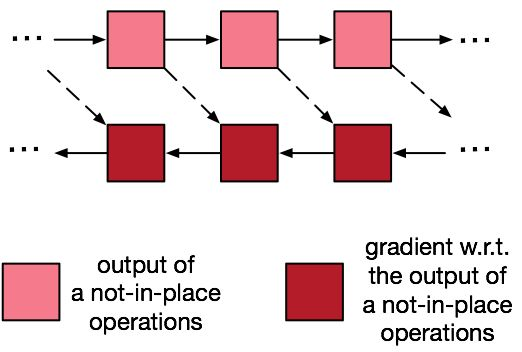

对于反向传播来说：深红色的gradInput算完一块就扔掉（它的出度为1）。

但是浅红色的内存块因为要在 backward 的时候还会被用到，所以不能扔。（而此时前向传播由于concat的缘故导致内存暴涨）～可以用时间换空间，即在需要用粉红块的时候，重新计算即可。

> 主要由于concat操作实际上是将前面的变量复制了一份，所以新开辟了空间

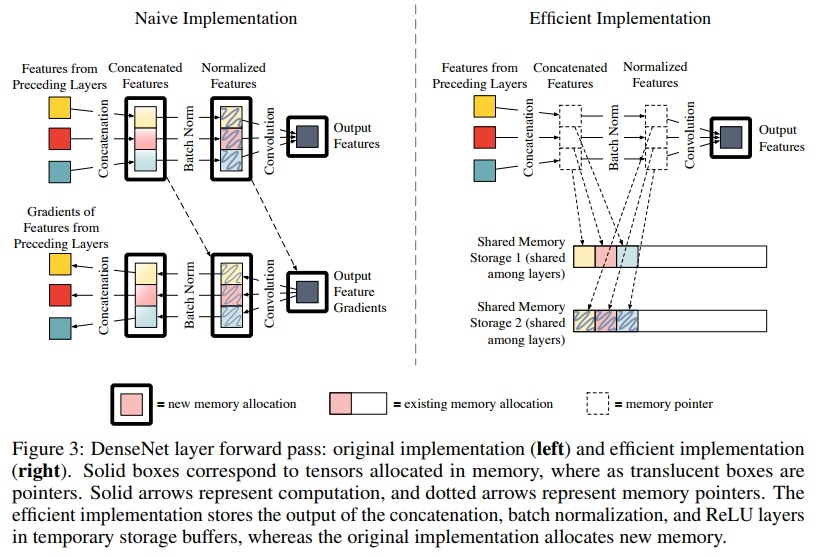

