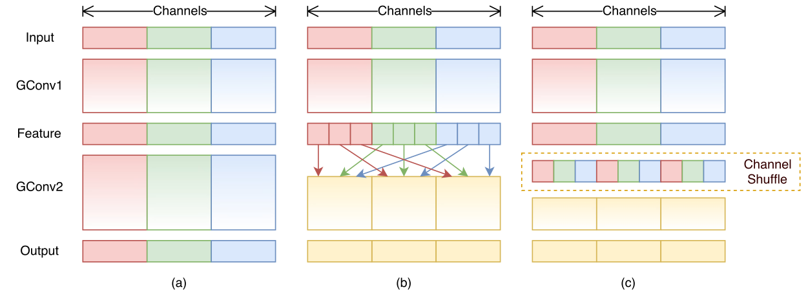
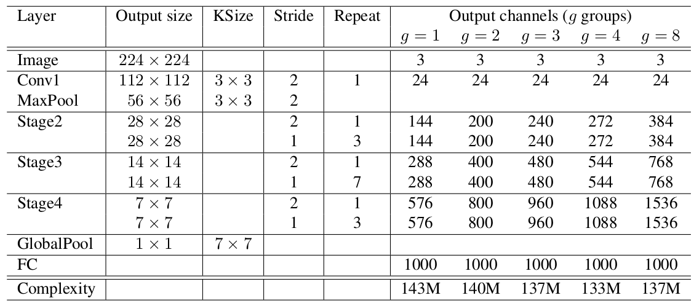

> 这部分主要来自：[轻量化网络](https://zhuanlan.zhihu.com/p/35405071)

# Convolutional Neural Network

## 预备知识

### ① Group Convolution

谈论起MoblieNet/ShuffleNet这些网络结构，就绕不开Group Convolution，甚至可以认为这些网络结构只是Group convolution的变形而已：

> 就是将原本的卷积"划分"为多个"组"进行单独的卷积罢了

## 1. MobileNet v1

> 论文地址：[MobileNets: Efficient Convolutional Neural Networks for Mobile Vision Applications](https://arxiv.org/abs/1704.04861)

> 作者提出了一种能够将计算机视觉应用有效地运行在手机和嵌入式设备上的"轻量级"网络（称之为MobileNets）。MobileNet是采用Depth-wise separable convolutions的流线型架构（具有参数量更少的特点）。此外，作者还引入了两个简单的超参数可以在"速度"和"准确率"之间权衡，这两个超参数能够允许模型构建者根据自己设备的真实需求进行调整。作者做了大量的实验来证明该结构的有效性（不仅证明两个超参数的影响，且将MobileNet运用到各类不同的视觉任务上面均取得了不错的效果）

### ① 核心思想

Mobilenet v1核心是把卷积拆分为Depthwise+Pointwise两部分：

下面举个例子：假设有$N\times H\times W\times C$的输入，同时有$k$个$3\times 3$的卷积（pad=1,s=1）。则普通卷积输出为$N\times H\times W\times k$。如下图所示（假设C=3, k=2）：

Depthwise是指将 $N\times H\times W \times C$的输入分为 $group=C$组，然后每一组做 $3\times3$卷积（channel=1），如下图所示：（这样相当于收集了每个Channel的空间特征，即Depthwise特征）

Pointwise是指对 $N\times H\times W \times C$的输入做 $k$ 个普通的 $1\times1$卷积（channel=C），如下图所示：（这样相当于收集了每个点的特征，即Pointwise特征。Depthwise+Pointwise最终输出也是 $N\times H\times W \times k$：

这样就把一个普通卷积拆分成了Depthwise+Pointwise两部分。这样带来的好处就是减少了计算量：
$$
\frac{depth+point}{conv}=\frac{H\times W\times C\times K\times K+C\times O\times H\times W}{H\times W\times C\times O\times K\times K}=\frac{1}{O}+\frac{1}{K^2}
$$

> 其中$H,W, C$代表输入的长宽和通道数，$O$代表输出的通道数，$K$代表kernel的大小（假设pad=1,s=1）

显然我们可以发现，Depthwise+Pointwise的参数量大致只有原本卷积的$1/K^2$（若$O\gg K^2$）

### ② 整体架构

### ③ 引入两个超参数

#### Width Multiplier：Thinner Models

将输入输出的"channel"数乘以一个$\alpha\in (0, 1]$参数，整体计算量变为：
$$
H\times W\times \alpha C\times K\times K+\alpha C\times \alpha O\times H_o\times W_o
$$

> $\alpha$常取$1, 0.75, 0.5,0.25$，计算量大约为原来的$\alpha^2$

#### Resolution Multiplier：Reduced Representation

将输入和输出的大小乘以一个$\rho\in (0,1]$参数，整体计算量变为：
$$
\rho H\times \rho W\times C\times K\times K+C\times O\times \rho H_o\times \rho W_o
$$

## 2. ShuffleNet 

> 论文地址：[ShuffleNet: An Extremely Efficient Convolutional Neural Network for Mobile Devices](https://arxiv.org/abs/1707.01083)

> 作者提出了一种计算效率非常高(需要的计算量更少)的CNN架构，称之为ShuffleNet。这种结构针对那些运算能力有效的设备 (如只有10-150 MFLOPs---即每秒百万个浮点操作) 是尤其有用的。在该结构中，主要运用了两种操作：pointwise group convolution和channel shuffle，正是这两种操作使得在保证"准确率"的情况下大量减少计算。在ImageNet分类任务和COCO检测任务上面，该结构均超过其他结构(例如，top-1分类错误相较MobileNet下降了7.8%)，且能够将计算控制在廉价的40MFLOPs。在基于ARM的手机设备上，Shuffle Net在保证和AlexNet相近精度的前提下，速度方面提升了近13倍。

### ① 核心思想

Group convolution（类似Depthwise Convolution）+ Channel Shuffle

> (a)常规的group convolution：存在的问题，各个group之间互不相通---所有mobileNet里面采用pointwise操作。(b)解决方案---下一个group conv从上一个feature的不同group抽特征 (c)可以视为b的等价形式，只是实现更方便

将上述思想结构放入到ResNet Block中：

> 注：① 在ResNet中有验证这种bottlenect (大channel→小channel→大channel) 是非常高效的 ② 一般的ResNet的block采用的是3x3 Conv而不是3x3 DWConv  ③ (c) 图对应的是包含下采样的情况

我们来比较一下(a)和(b)之间的计算量：

> 假设输入feature为$H\times W\times C$，bottleneck对应的通道为$M$，$g$代表group成几段

1. ResNet unit（采用的是3x3的Conv而不是上述的DWConv）：$HW(2CM+9 M^2)$
2. ShuffleNet unit（上面的b图）：$HW(2CM/g+9M)$

### ② 整体结构

当然，ShuffleNet有2个重要缺点：

1. Shuffle channel在实现的时候需要大量的指针跳转和Memory set，这本身就是极其耗时的；同时又特别依赖实现细节，导致实际运行速度不会那么理想。
2. Shuffle channel规则是人工设计出来的，不是网络自己学出来的。这不符合网络通过负反馈自动学习特征的基本原则，又陷入人工设计特征的老路（如SIFT/HOG等）。

## 3. MobileNet v2

