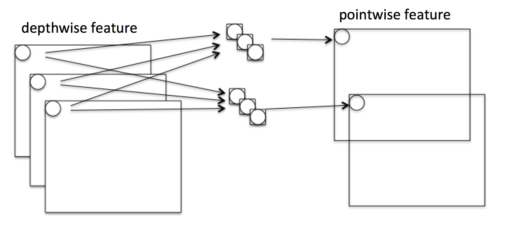

> 这部分主要来自：[轻量化网络](https://zhuanlan.zhihu.com/p/35405071)

# Convolutional Neural Network

## 预备知识

### ① Group Convolution

谈论起MoblieNet/ShuffleNet这些网络结构，就绕不开Group Convolution，甚至可以认为这些网络结构只是Group convolution的变形而已：

> 就是将原本的卷积"划分"为多个"组"进行单独的卷积罢了

## 1. MobileNet v1

> 论文地址：[MobileNets: Efficient Convolutional Neural Networks for Mobile Vision Applications](https://arxiv.org/abs/1704.04861)

> 作者提出了一种能够将计算机视觉应用有效地运行在手机和嵌入式设备上的"轻量级"网络（称之为MobileNets）。MobileNet是采用Depth-wise separable convolutions的流线型架构（具有参数量更少的特点）。此外，作者还引入了两个简单的超参数可以在"速度"和"准确率"之间权衡，这两个超参数能够允许模型构建者根据自己设备的真实需求进行调整。作者做了大量的实验来证明该结构的有效性（不仅证明两个超参数的影响，且将MobileNet运用到各类不同的视觉任务上面均取得了不错的效果）

### ① 核心思想

Mobilenet v1核心是把卷积拆分为Depthwise+Pointwise两部分：

下面举个例子：假设有$N\times H\times W\times C$的输入，同时有$k$个$3\times 3$的卷积（pad=1,s=1）。则普通卷积输出为$N\times H\times W\times k$。如下图所示（假设C=3, k=2）：

Depthwise是指将 $N\times H\times W \times C$的输入分为 $group=C$组，然后每一组做 $3\times3$卷积（channel=1），如下图所示：（这样相当于收集了每个Channel的空间特征，即Depthwise特征）

Pointwise是指对 $N\times H\times W \times C$的输入做 $k$ 个普通的 $1\times1$卷积（channel=C），如下图所示：（这样相当于收集了每个点的特征，即Pointwise特征。Depthwise+Pointwise最终输出也是 $N\times H\times W \times k$：

这样就把一个普通卷积拆分成了Depthwise+Pointwise两部分。这样带来的好处就是减少了计算量：
$$
\frac{depth+point}{conv}=\frac{H\times W\times C\times K\times K+C\times O\times H\times W}{H\times W\times C\times O\times K\times K}=\frac{1}{O}+\frac{1}{K^2}
$$

> 其中$H,W, C$代表输入的长宽和通道数，$O$代表输出的通道数，$K$代表kernel的大小（假设pad=1,s=1）

显然我们可以发现，Depthwise+Pointwise的参数量大致只有原本卷积的$1/K^2$（若$O\gg K^2$）

### ② 整体架构

### ③ 引入两个超参数

#### Width Multiplier：Thinner Models

将输入输出的"channel"数乘以一个$\alpha\in (0, 1]$参数，整体计算量变为：
$$
H\times W\times \alpha C\times K\times K+\alpha C\times \alpha O\times H_o\times W_o
$$

> $\alpha$常取$1, 0.75, 0.5,0.25$，计算量大约为原来的$\alpha^2$

#### Resolution Multiplier：Reduced Representation

将输入和输出的大小乘以一个$\rho\in (0,1]$参数，整体计算量变为：
$$
\rho H\times \rho W\times C\times K\times K+C\times O\times \rho H_o\times \rho W_o
$$

## 2. MobileNet v2

> 论文地址：[MobileNetV2: Inverted Residuals and Linear Bottlenecks](https://arxiv.org/abs/1801.04381)
>
> 说实话，这篇个人并没太看懂里面的一些分析，可以参考：[MobileNetv2解读](https://blog.ddlee.cn/posts/c9816b0a/)

> 在这篇文章中，作者提出了一种新的"手机架构"（mobile architecture）MobileNetv2，这种架构在很多任务和多种模型"尺寸"上面均取得了最好的效果。作者同时给出了如何将该架构和目标检测任务结合，提出了用于目标检测的轻量级架构SSDLite。除此之外，作者还将该架构和DeepLabv3结合起来（称之为DeepLabv3）用于语义分割任务。
>
> 该架构主要基于inverted residual structure (residual structure: 粗-细-粗，inverted residual structure: 细-粗-细)，其中的shortcut connections是连接在两个"细的两端"。中间的扩张层(粗)采用"少参数"的depthwise convolutions结构来对获取特征。除此之外，作者还发现去掉后一个"细"层的非线性层有助于帮助网络更好的保留"表示能力" (representational power)。作者论证了这种方式能够提示性能，因此将够发现运用到架构中。
>
> 这种架构允许对输入/输出域的"表达能力的转移"进行解耦，这有助于进一步分析。作者在ImageNet分类任务，COCO检测任务和VOC分割任务上面均取得了不错的性能，且能保证速度。

## 3. ShuffleNet

> 论文地址：[ShuffleNet: An Extremely Efficient Convolutional Neural Network for Mobile Devices](https://arxiv.org/abs/1707.01083)

> 作者提出了一种计算效率非常高(需要的计算量更少)的CNN架构，称之为ShuffleNet。这种结构针对那些运算能力有效的设备 (如只有10-150 MFLOPs---即每秒百万个浮点操作) 是尤其有用的。在该结构中，主要运用了两种操作：pointwise group convolution和channel shuffle，正是这两种操作使得在保证"准确率"的情况下大量减少计算。在ImageNet分类任务和COCO检测任务上面，该结构均超过其他结构(例如，top-1分类错误相较MobileNet下降了7.8%)，且能够将计算控制在廉价的40MFLOPs。在基于ARM的手机设备上，Shuffle Net在保证和AlexNet相近精度的前提下，速度方面提升了近13倍。

### ① 核心思想

Group convolution（类似Depthwise Convolution）+ Channel Shuffle

> (a)常规的group convolution：存在的问题，各个group之间互不相通---所有mobileNet里面采用pointwise操作。(b)解决方案---下一个group conv从上一个feature的不同group抽特征 (c)可以视为b的等价形式，只是实现更方便

将上述思想结构放入到ResNet Block中：

> 注：① 在ResNet中有验证这种bottlenect (大channel→小channel→大channel) 是非常高效的 ② 一般的ResNet的block采用的是3x3 Conv而不是3x3 DWConv  ③ (c) 图对应的是包含下采样的情况

我们来比较一下(a)和(b)之间的计算量：

> 假设输入feature为$H\times W\times C$，bottleneck对应的通道为$M$，$g$代表group成几段

1. ResNet unit（采用的是3x3的Conv而不是上述的DWConv）：$HW(2CM+9 M^2)$
2. ShuffleNet unit（上面的b图）：$HW(2CM/g+9M)$

### ② 整体结构

当然，ShuffleNet有2个重要缺点：

1. Shuffle channel在实现的时候需要大量的指针跳转和Memory set，这本身就是极其耗时的；同时又特别依赖实现细节，导致实际运行速度不会那么理想。（其实有些方法可以使这个问题没那么严重）
2. Shuffle channel规则是人工设计出来的，不是网络自己学出来的。这不符合网络通过负反馈自动学习特征的基本原则，又陷入人工设计特征的老路（如SIFT/HOG等）。

## 4. ShuffleNet v2 

> 论文地址：[ShuffleNet V2: Practical Guidelines for Efficient CNN Architecture Design](https://arxiv.org/abs/1807.11164)

> 最近，神经网络结构的设计(更轻巧的网络)往往根据"间接的指标"计算复杂度（例如: FLOPs）来进行设计的。但是"直接的指标"（例如：速度）往往取决于一些其他情况（例如内存访问的开销和不同平台的特点等）。因此，这篇论文在指定的平台环境下，直接采用"直接的指标"来进行设计，而不仅仅只考虑FLOPs。通过一系列控制变量法实验，这篇工作提出了一系列设计轻量级网络的建议（或称之为指南）。基于这些发现，一种被称为ShuffleNet V2的新的网络结构被提出，一系列综合的消融实验证明新的网络结构在权衡速度和精确率的情况下取得了当前最好的效果。

### ① 内容目录

- "间接指标"（FLOPs）和"直接指标"（速度）之间存在一定的不同
- 设计轻量级网络的指南（4条建议）
- ShuffleNetV2
- 效果

### ② "间接指标"（FLOPs）和"直接指标"（速度）之间存在一定的不同 

> 第一行：精度与速度之间关系（Batches/sec or Images/sec越大代表越快），可以发现相近精度情况下shufflenet v2最快（GPU和ARM情况下均是）
>
> 第二行：MFLOPs和速度之间的关系，可以发现相近MFLOPs情况下，速度其实相差蛮大的（这也就说明MFLOPs并不能直接和速度挂钩）
>
> 注：ARM上仅仅是测试阶段

下面来分析一下FLOPs和速度之间的"差异"来源于什么：

1. 速度并不仅仅取决于FLOPs的多少，还和很多因素有关：例如  ① 内存访问耗时(memory access cost)---这部分耗时在包含group convolution的情况下越发明显(后面会解释) ② 并行程度(degree of parallelism) --- 相同的FLOPs情况下，并行度更高的结构耗时更少
2. 不同平台下面，相同FLOPs对应的速度也不同：在GPU下面，张量分解反而没有提高运行效率（这在很多ARM或其他平台下往往是提高运行效率的）  

因此，在设计轻量级网络应该考虑下述两个情况：1. 应该采用直接指标(比如速度)而不是间接指标(比如FLOPs)   2. 在特地平台下面去考量，因为很多平台会有所不同。

### ③ 设计准则（指南）

> 两个当前"最好"的轻量级网络各部分所占的时间比。其中ShuffleNet V1（g=3），MobileNet v2（1x）

上面情况也说明速度不仅仅只和FLOPs有关（FLOPs在图中主要是指Conv部分---因为我们计算FLOPs采用的方式）

下面来给出一些准则：

**① 相同通道数(即一个卷积对应的输入输出通道数)对应的内存访问代价最小（Equal channel width minimizes memory access cost）**

当前一些主流网络喜欢使用depthwise separable convolutions，而这种结构中pointwise convolution占据主要的开销。因此我们来探讨1x1卷积的情况，则其对应的FLOPs为：$B=hwc_1c_2$

> 下面我们只考虑内存空间无限大的情况：作者也分析了内存大小一定情况

下面我们开分析一下内存访问开销：

1. $c_2$个$1\times 1\times c_1$的卷积一次性扔到内存中，开销为$c_1c_2$
2. 整个输入feature map要被读取，而整个输出的feature map也要被读取(存到对应位置)，因此开销为$hw(c_1+c_2)$

所以总的内存访问开销：$MAC=hw(c_1+c_2)+c_1c_2$

根据mean value inequality ($a+b\ge 2\sqrt{ab}$)，我们可以获得下述关系：
$$
hw(c_1+c_2)+c_1c_2\ge hw2\sqrt{c_1c_2}+c_1c_2=2\sqrt{hwB}+\frac{B}{hw}
$$
所以显然当$c_1=c_2$取到下界（这个有mean value inequality性质所决定）

下表就是在实际设备上的结果：（可以发现在FLOPs固定相同的情况下，1:1的情况确实是最高效的）

**② group convolution中g过大会增加内存访问开销（Excessive group convolution increase MAC）**

类似①中的分析，我们容易知道group num=g时的FLOPs等于：$B=hwc_1c_2/g$

则对应的MAC等于：
$$
MAC=hw(c_1+c_2)+\frac{c_1c_2}{g}=hwc_1+\frac{Bg}{c_1}+\frac{B}{hw}
$$
如果FLOPs固定的情况下，即$B\to c_2/g$固定的情况下，我们不难发现$g$越大，MAC越大。所以在FLOPs相同的情况下，越大的$g$带来的内存访问开销越大。

下表就是在实际设备上的结果：（可以发现在FLOPs固定相同的情况下，越小的g确实是最高效的）

> 这条请注意是在：FLOPs相同的情况下，别误以为都不用depthwise的方式

**③ block划分为多段将会减小并行程度（Network fragmentation reduces degree of parallelism）**

> (a). 1-fragment，(b) 2-fragment-series，(c) 4-fragment-series，(d) 2-fragment-parallel，(e) 4-fragment-parallel

虽然在一些现代结构里面，已经说明一些"多段"（如ResNet里面的bottleneck，GoogleNet里面的多支路）将有助于提高网络的精度。但是这种方式不利于并行，会对速度有所影响。作者比较了上述(a)~(e)五种情况如下表所示：（可以发现对于GPU而言，多段不利于并行，但在CPU上面影响很小）

> 注：保证不同结构对应的FLOPs相同---通过调整通道数目

**④ 逐元素操作的开销不能忽视（Element-wise operations are non-negligible）**

作者主要以bottleneck（1x1Conv+ReLU+3x3Conv+ReLU+1x1Conv+shortcut connection）来分析，而上述说的逐元素操作是指ReLU和shortcut connection带来的开销：（我们可以发现ReLU和short-cut是会影响速度的）

下面对上述的四条指南进行总结：

1. 采用"平衡"的卷积（输入输出通道相同）
2. 在使用group convolution时，注意不同g的内存访问开销
3. 减少block中分段数目（包括横向和纵向）
4. 减少逐元素操作的"过程"

### ④ ShuffleNetV2

> (a)(b)是ShuffleNetV1的结构，(c)(d)是ShuffleV2中对应的替换结构

下面先指出ShuffleNetV1中违背4条指南的情况：

1. Group Conv的内存开销：违背第2条
2. bottleneck的"细-粗-细"策略：违背第1条
3. Add操作：违背第4条

shuffleNetv2里面的一些说明：

1. channel split将通道分为两部分：一部分直接接过来，另一部分则通过"特征转化"，再通过concat接起来（这也符合DenseNet和CondenseNet的设计准则）--- 其中的划分作者采用对半砍
2. 将concat，channel shuffle和channel split操作可以合并起来！（底层可以三者写成一个操作）---这样就能减少逐元素操作数目
3. 包含下采样的情况时，采用两路合并就恰好能将通道数加倍

下面给出整个ShuffleNetV2的网络结构：

### ⑤ 结果对比

