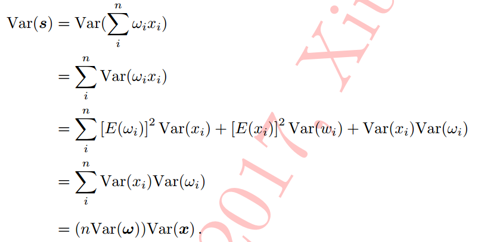
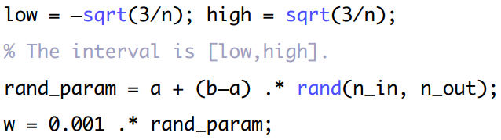
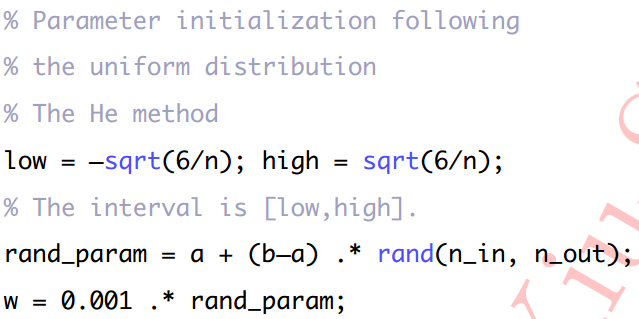

# 网络参数初始化

## 1. 全零初始化

参数全为0时导致网络不同神经元的**输出**必然相同，相同输出导致**梯度**更新完全相同，则更新后的**参数**保持一样的状态，无法进行模型的训练。

## 2. 随机初始化

> **参数初始化原则：所有参数的期望接近0，可将参数随机设定为接近0的一个很小的随机数（有正有负）** 
>
> 常用**高斯分布或者均匀分布**

（1）参数服从高斯分布:

> $w=\mathcal{N}(0,1)$

其中，高斯分布为均值为0，方差为1的标准高斯分布；输入神经元个数$n_i​$，输出神经元个数$n_o​$，0.001为控制参数量纲的因子，保证参数期望保持在接近0的较小数值范围。

**存在问题：**网络输出数据分布的方差会随着输入神经元个数的改变而改变（证明见下），因此需要在初始化的同时加入对方差大小的规范化。

（2）参数服从高斯分布，加入方差规范化

> $w=\mathcal{N}(0, std)$，其中，$std=\sqrt{2/{(num_i+num_o)}}$

**注意：** 上述方法就是著名的**Xavier参数初始化**方法，该方法比未做方差规范化的版本收敛更快。

**Xavier参数初始化原理**： 维持输入和输出数据分布方差的一致性。

具体可参考：[Xavier Initialization 的理解与推导（及实现）](https://blog.csdn.net/lanchunhui/article/details/70318941)【写的好】

证明：

> 如果两个变量X和Y相互独立，则它们乘积的方差为：（参考：[wiki](https://en.wikipedia.org/wiki/Variance#cite_note-6)）
> $$
> Var(XY)=[E(X)]^2Var(Y)+[E(Y)]^2Var(X)+Var(X)Var(Y)
> $$
>

**存在问题：** Xavier初始化没有考虑非线性映射函数对输入的影响，使用relu等非线性映射后输出数据的期望不是0

（3）He参数初始化方法

**要点：**参数服从高斯分布，加入方差规范化，**同时考虑非线性映射造成的影响**

**修改：**只需将（2）公式中的$sqrt(n)$改为$sqrt(n/2)$

（4）参数服从均匀分布

+ Xavier参数初始化

+ He参数初始化

## 3. 其他初始化

+ 利用预训练模型 
+ 数据敏感的参数初始化方法，根据自身任务数据集量身定做的参数初始化方式 [code](https://github.com/philkr/magic_init)

