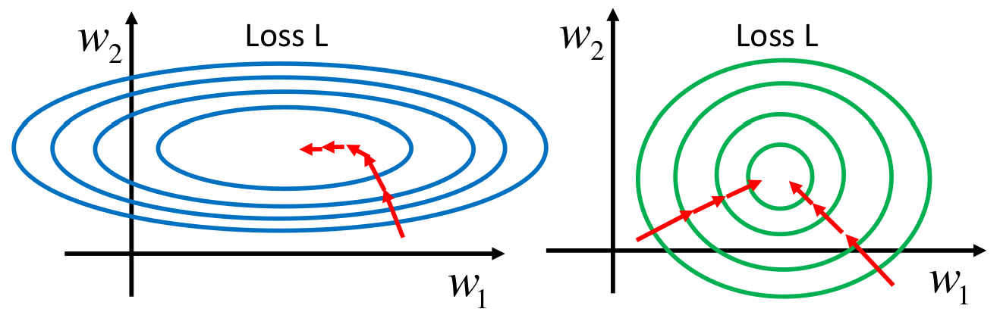
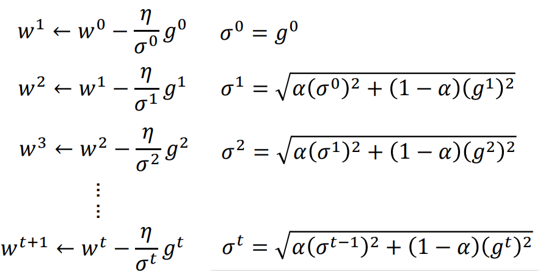
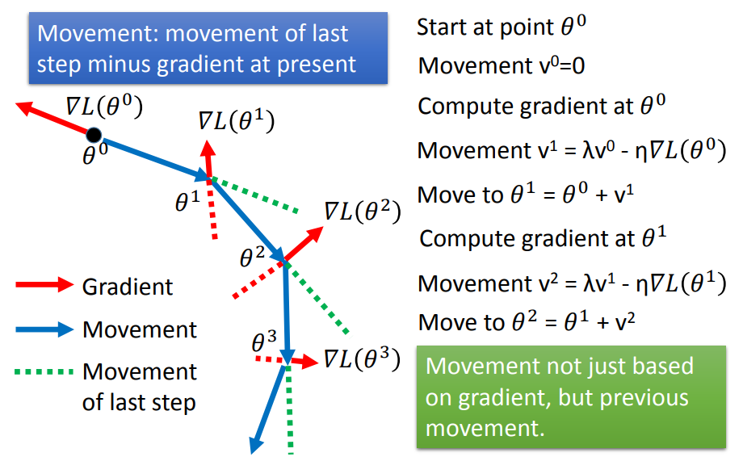
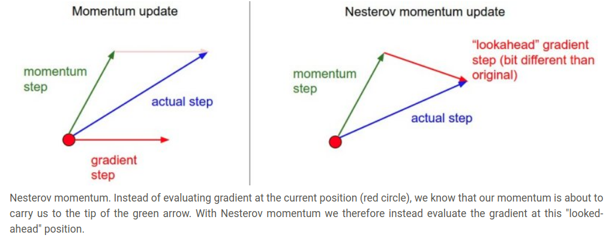
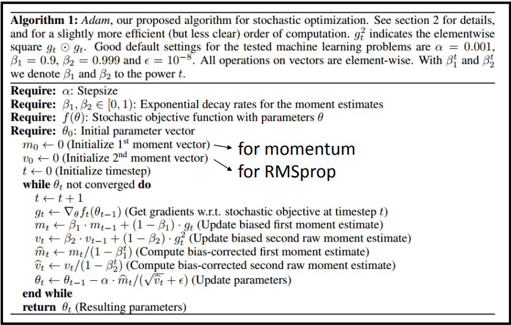
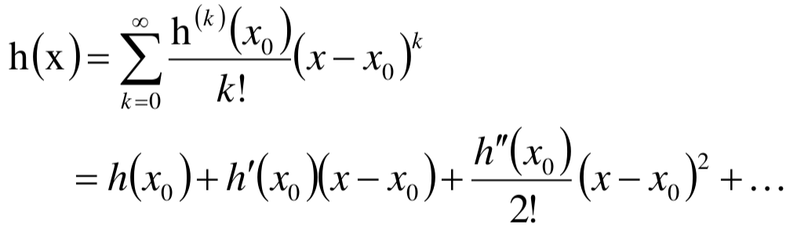
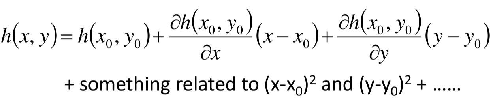
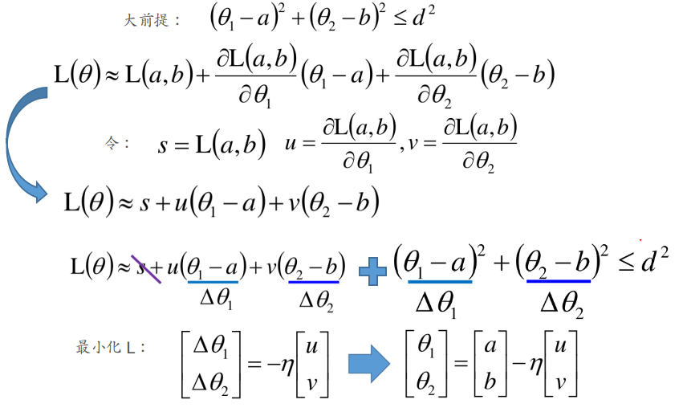

> 可以参考：[优化方法总结](https://zhuanlan.zhihu.com/p/22252270)，[CS231n中译](https://zhuanlan.zhihu.com/p/22252270)，[CS231n](http://cs231n.github.io/neural-networks-3/)

# 优化方法

## 1. 梯度下降法（GD）

参数更新形式：
$$
w^{t+1}\gets w^{t}-\eta g^t
$$

存在的问题：选择合适的学习率比较困难

### GD改进1：改变学习率

原因：不同的$\eta$会导致收敛速度不同，当$\eta$过大时会导致无法收敛（通常利用$Loss-\eta$图来确认$\eta$的选择）

① 采用变化的$\eta$：大多数情况下，刚开始的时候离"最优点"较远，可以使得步长稍微大些，随着迭代次数的增多，减小步长 --- $\eta^{t} =\eta/\sqrt{(t+1)}$

从而获得**Vanilla Gradient descent**：
$$
w^{t+1}\gets w^t-\eta ^t g^t
$$
存在的问题：同一种学习率并不一定适用于每一维的参数（不同维度可能尺寸以及变化快慢不同）

② 每个参数的学习率的变化取决于之前梯度的均方根

**Adagrad**：
$$
w^{t+1}\gets w^t-\frac{\eta^t}{\sigma^t}g^t
$$
其中的$\sigma^t=\sqrt{\frac{1}{t+1}\sum_{i=0}^t (g^i)^2}$（如$\sigma^2=\sqrt{1/3[(g^0)^2+(g^1)^2+(g^2)^2]}$）

将$\eta^t$的表达式代入上面式子，我们可以获得：
$$
w^{t+1}\gets w^t-\frac{\eta}{\sqrt{\sum_{i=0}^t(g^i)^2}}g^t
$$

（其中$g^t$反映一阶项，而$\sqrt{\sum_{i=0}^t(g^i)^2}$反映的是二阶导数，二阶导数越大，该值越大---二阶导数又是梯度变化衡量的依据，希望梯度变化巨大时，学习率小些）

### GD改进2：随机梯度下降法（SGD）

即采用部分数据来计算梯度（Batch data），具体表达式和GD是一样的

### GD改进3：特征归一化



当各个维度的数据数量级相差很大时，会导致收敛非常慢。常用的特征归一化方式为:
$$
x_i^r\gets \frac{x_i^r-m_i}{\sigma_i}
$$

## 2. RMSProp

在Adagrad的基础上更进一步：将当前梯度考虑的更多一些，且对过早的梯度遗忘掉一部分



## 3. Momentum

由于在梯度下降过程中，可能会停在local minima或者saddle point或者plateau上面，因此可以借鉴物理里面的动量概念（其实采用惯性这个词也蛮合适的）--- 即上一步的梯度更新方向会"带有惯性"，影响下一步的梯度更新



其实其中的$v^i$实际上是一系列之前梯度的权重和。

具体的数学形式如下：
$$
v^{t+1}=\lambda v^{t}-\eta g^t\\
\theta^{t+1}\gets \theta^{t}+v^{t+1}
$$

```python
# 动量更新
v = mu * v - learning_rate * dx # 与速度融合
x += v # 与位置融合
```

## 4. Nesterov动量

**Nesterov动量**与普通动量有些许不同，Nesterov动量的核心思路是，当参数向量位于某个位置**x**时，观察上面的动量更新公式可以发现，动量部分（忽视带梯度的第二个部分）会通过**mu \* v**稍微改变参数向量。因此，如果要计算梯度，那么可以将未来的近似位置**x + mu \* v**看做是“向前看”，这个点在我们一会儿要停止的位置附近。因此，计算**x + mu \* v**的梯度而不是“旧”位置**x**的梯度就有意义了。



具体的数学形式：
$$
\theta^{ahead} = \theta^{t} + \lambda v^{t}\\
v^{t+1}=\lambda v^t-\eta g^{t+1}(\theta^{ahead}) \\
\theta^{t+1}=\theta^t+v^{t+1}
$$

```python
x_ahead = x + mu * v
# 计算dx_ahead(在x_ahead处的梯度，而不是在x处的梯度)
v = mu * v - learning_rate * d(x_ahead)
x += v
```

## 5. Adam

具体的细节就不管啦，实际上Adam=RMSProp+Momentum



---

### 额外的内容：梯度下降法背后的理论依据

> 我们希望梯度下降法每次更新都能够使得：$L(\theta^0)>L(\theta^1)>L(\theta^2)>...$

大部分的优化问题可以从泰勒展开来一窥究竟：

**单变量情况下的泰勒展开：**



（当$x$和$x_0$非常接近时，我们有$h(x)\approx h(x_0)+h'(x_0)(x-x_0)$）

**多变量情况下的泰勒展开：**



（当$(x,y)$和$(x_0,y_0)$非常接近时，我们有$h(x, y)\approx h(x_0,y_0)+\frac{\partial h(x_0,y_0)}{\partial x}(x-x_0)+\frac{\partial h(x_0,y_0)}{\partial y}(y-y_0)$）

现在让我们来寻找从$(a,b)$点出发，寻找在一个小范围内使得损失$L$最小的参数：



因此梯度下降法可行的一个限制便是$\eta$的选择，$\eta$过大，上面式子的近似是不成立的，因此不一定达到最优点。此外，从泰勒展开来看，采用二阶泰勒更好，但是由于计算量太大，在深度学习里面很少用。

---


