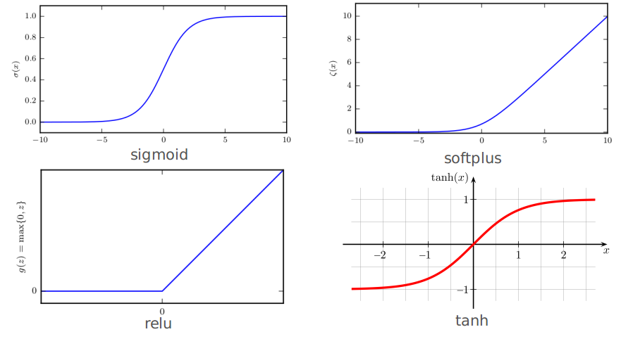
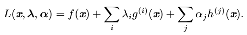
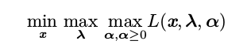
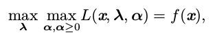
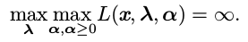
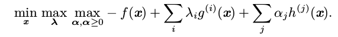
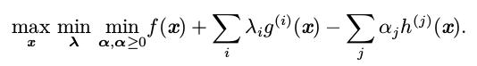

> 下述内容来自：[github](https://github.com/elviswf/DeepLearningBookQA_cn)，[github](https://github.com/exacity/deeplearningbook-chinese)

# 深度学习面试高频问题 (1)

### 1. 列举常见的一些范数及其应用场景，如 L0，L1，L2，L∞，Frobenius 范数

有时我们需要衡量一个向量的大小。在机器学习中，我们经常使用被称为范数(norm)的函数衡量向量大小。形式上，$L^p$范数定义如下：
$$
\Vert x\Vert_p=(\sum_i |x_i|^p)^{1/p}
$$

> 注：$p\in R, p\ge 1$

范数(包括$L^p$范数)是将向量映射到**非负值**的函数。直观上来说，向量$x$的范数衡量从原点到点$x$的距离。更严格地说，范数是满足下列性质的任意函数：

- $f(x)=0 \Rightarrow x=0$
- $f(x+y)\le f(x)+f(y)$（三角不等式）
- $\forall \alpha\in R,f(\alpha x)=|\alpha|f(x)$

当$p = 2$时，$L^2$范数被称为欧几里得范数(Euclidean norm)。它表示从原点出发到向量$x$确定的点的欧几里得距离。$L^2$范数在机器学习中出现地十分频繁，经常简化表示为$\Vert x\Vert$，略去了下标 2。平方$L^2$范数也经常用来衡量向量的大小，可以简单地通过点积$x^Tx$计算。

> $L^2$范数的一个应用：向目标函数添加一个正则项$\Omega(\theta)=\frac{1}{2}\Vert w\Vert^2_2$，使权重更接近原点。--- $L^2$也称为岭回归

平方$L^2$范数在数学和计算上都比$L^2$范数本身更方便。例如，平方$L^2$范数对$x$中每个元素的导数只取决于对应的元素，而$L^2$范数对每个元素的导数却和整个向量相关。但是在很多情况下，平方$L^2$范数也可能不受欢迎，因为它在原点附近增长得十分缓慢。在某些机器学习应用中，区分恰好是零的元素和非零但值很小的元素是很重要的。在这些情况下，我们转而使用在各个位置斜率相同，同时保持简单的数学形式的函数：$L^1$范数。$L^1$范数可以简化如下:
$$
\Vert x\Vert_1 = \sum_i |x_i|
$$
当机器学习问题中零和非零元素之间的差异非常重要时，通常会使用$L^1$范数。每当$x$中某个元素从 0 增加$ε$,对应的 $L^1$范数也会增加$ε$。

> $L^1$范数的一个应用：稀疏性，用于特征选择 --- $L^1$+线性模型=LASSO回归

有时候我们会统计向量中非零元素的个数来衡量向量的大小。有些作者将这种函数称为 “$L^0$范数’’，但是这个术语在数学意义上是不对的。向量的非零元素的数目不是范数，因为对向量缩放$\alpha$ 倍不会改变该向量非零元素的数目（这就违背了范数对应函数满足的第三条性质）。因此，$L^1$范数经常作为表示非零元素数目的替代函数。

另外一个经常在机器学习中出现的范数是$L^∞$范数，也被称为**最大范数(max norm)**。这个范数表示向量中具有最大幅值的元素的绝对值：
$$
\Vert x\Vert_\infty = max_i|x_i|
$$
有时候我们可能也希望衡量矩阵的大小。在深度学习中,最常见的做法是使用Frobenius 范数(Frobenius norm)：
$$
\Vert A\Vert_F=\sqrt{\sum_{i,j}A_{i,j}^2}
$$
其类似于向量的$L^2$范数。

两个向量的点积(dot product)可以用范数来表示。具体地：
$$
x^Ty=\Vert x\Vert_2\Vert y\Vert_2 cos\theta
$$

> 其中$\theta$表示x和y之间的夹角。

### 2. 简单介绍一下贝叶斯概率与频率派概率，以及在统计中对于真实参数的假设

频率派概率：直接与事件发生的频率相联系

> 类似我们反复实验无限次，有p的比例得到某个结果

贝叶斯概率：涉及到确定性水平

> 比如一个医生诊断了一个病人，说该病人患流感的几率为40%，但我们不能让病人有无穷多的副本，也没有任何理由去相信病人的不同副本在具有不同潜在条件下表现出相同的症状。此时我们用概率来表示一种"信任度"

关于更多这两者的"不同"，参见：[知乎](https://www.zhihu.com/question/20587681)

> 频率学派与贝叶斯学派探讨「不确定性」这件事时的出发点与立足点不同。频率学派从「自然」角度出发，试图直接为「事件」本身建模，即事件A在独立重复试验中发生的频率趋于极限p，那么这个极限就是该事件的概率。举例而言，想要计算抛掷一枚硬币时正面朝上的概率，我们需要不断地抛掷硬币，当抛掷次数趋向无穷时正面朝上的频率即为正面朝上的概率。
>
> 然而，贝叶斯学派并不从试图刻画「事件」本身，而从「观察者」角度出发。贝叶斯学派并不试图说「事件本身是随机的」，或者「世界的本体带有某种随机性」，这套理论根本不言说关于「世界本体」的东西，而只是从「观察者知识不完备」这一出发点开始，构造一套在贝叶斯概率论的框架下可以对不确定知识做出推断的方法。频率学派下说的「随机事件」在贝叶斯学派看来，并不是「事件本身具有某种客观的随机性」，而是「观察者不知道事件的结果」而已，只是「观察者」知识状态中尚未包含这一事件的结果。但是在这种情况下，观察者又试图通过已经观察到的「证据」来推断这一事件的结果，因此只能靠猜。贝叶斯概率论就想构建一套比较完备的框架用来描述最能服务于理性推断这一目的的「猜的过程」。因此，在贝叶斯框架下，同一件事情对于知情者而言就是「确定事件」，对于不知情者而言就是「随机事件」，随机性并不源于事件本身是否发生，而只是描述观察者对该事件的知识状态。

### 3. 概率密度的万能近似器

高斯混合模型(Gaussian Mixture Model)是概率密度的万能近似器(universal approximator)，在这种意义下，任何平滑的概率密度都可以用具有足够多组件的高斯混合模型以任意精度来逼近

> 概率密度的定义：
>
> 如果一个函数p是概率密度函数，必须满足下面几个条件：
>
> - p的定义域必须是$x$所有可能状态的集合
> - $\forall x\in X,p(x)\ge0​$，注意，我们并不要求$p(x)\le1​$
> - $\int p(x)dx=1$
>
> 概率密度函数$p(x)$并没有直接对特定的状态给出概率，相对的，它给出了落在面积为$\delta x$的无限小的区域内的概率为$p(x)\delta x$
>
> 我们可以对概率密度函数求积分来获得点集的真实概率质量。特别地，$x$落在集合$S$中的概率可以通过$p(x)$对这个集合求积分得到。在单变量的例子里，$x$落在区间$[a,b]$的概率是$\int_{[a,b]}p(x)dx$

### 4. 简单介绍一下 sigmoid，relu，softplus，tanh，RBF 及其应用场景

1. Sigmoid：$\sigma (x)=1/(1+exp(-x))$

   - 通常用来产生Bernoulli分布中的参数$\phi$
   - sigmoid函数通常在变量取绝对值非常大的正值或负值时会出现饱和现象

   > 其实感觉需要$[0,1]$范围值的情况可以考虑

2. softplus：$\zeta(x)=log(1+exp(x))$

   - 用来产生正态分布的$\beta$和$\sigma$参数，因为它的范围是$(0,\infty)$
   - 可以视为ReLU的平滑形式

3. relu：$g(z)=max(0, z)$

4. tanh：$tanh(x)=(e^{z}-e^{-z})/(e^{z}+e^{-z})$

5. 径向基函数：$h_i=exp(-\frac{1}{\sigma^2_i}\Vert W_{:,i}-x\Vert^2)$

   - 当$x$接近模板$W_{:,i}$时更加活跃；但是对大部分$x$都饱和到0，因此很难优化

### 5. Jacobian，Hessian 矩阵及其在深度学习中的重要性

雅克比矩阵的定义：一个函数$f:R^m\to R^n$，则此时$f$的雅克比矩阵$J\in R^{n\times m}$：
$$
J_{i,j}=\frac{\partial}{\partial x_j}f(x)_i
$$
海森矩阵，可以看做梯度的雅克比矩阵：
$$
H(f)(x)_{i,j}=\frac{\partial^2}{\partial x_i\partial x_j}f(x)
$$

> 海森矩阵是一个对称矩阵
>
> 在深度学习背景下，我们遇到的大多数函数的 Hessian 几乎处处都是对称的
>
> Hessian矩阵往往用来确定函数的曲率

### 6. KL 散度在信息论中度量的是哪个直观量

KL散度主要用来衡量两个分布之间的差异：
$$
D_{KL}(P||Q)=E_{x\sim P}\big[log\frac{P(x)}{Q(x)}\big]=E_{x\sim P}\big[log P(x)-log Q(x)\big]
$$

### 7. 数值计算中的计算上溢与下溢问题，如 softmax 中的处理方式

以softmax为例：
$$
softmax(x)_i=\frac{exp(x_i)}{\sum_{j=1}^n exp(x_j)}
$$
从理论分析上说，我们可以发现所有的输出都应该为$1/n$。从数值计算上说，当$c$量级很大时，这可能不会发生。如果$c$是很小的负数，$exp(c)$ 就会下溢(趋于0)。这意味着 softmax 函数的分母会变成 0，所以最后的结果是未定义的。当$c$ 是非常大的正数时，$exp(c)$ 的上溢再次导致整个表达式未定义。这两个困难能通过计算$softmax(z)$ 同时解决，其中 $z = x − max_i x_i$ 。简单的代数计算表明，softmax 解析上的函数值不会因为从输入向量减去或加上标量而改变。减去 $max_i x_i$ 导致 exp 的最大参数为 0，这排除了上溢的可能性。同样地，分母中至少有一个值为 1 的项，这就排除了因分母下溢而导致被零除的可能性。

### 8. 与矩阵的特征值相关联的条件数 (病态条件) 指什么，与梯度爆炸与梯度弥散的关系

**条件数表征函数相对于输入的微小变化而变化的快慢程度**。输入被轻微扰动而迅速改变的函数对于科学计算来说可能是有问题的，因为输入中的舍入误差可能导致输出的巨大变化。

考虑函数$f(x)=A^{-1}x$。当$A\in R^{n\times m}$具有特征值分解时，其条件数为：
$$
max_{i,j}|\frac{\lambda_i}{\lambda_j}|
$$
这是最大和最小特征值的模之比。当该数很大时，矩阵求逆对输入的误差特别敏感。

这种敏感性是矩阵本身的固有特性，而不是矩阵求逆期间舍入误差的结果。即使我们乘以完全正确的矩阵逆，病态条件的矩阵也会放大预先存在的误差。在实践中，该错误将与求逆过程本身的数值误差进一步复合

> 条件数的定义（原本的定义，上述的条件数是真实定义的下界）本身衡量的就是$A(x+\delta x)$中"扰动的影响"：
> $$
> \frac{\Vert \delta x\Vert_2}{\Vert x+\delta x\Vert_2}\le (\Vert A\Vert_2\Vert A^{-1}\Vert_2)\frac{\Vert \delta A\Vert_2}{\Vert A\Vert_2}
> $$
> 其中条件数定义：$cond(A)=\Vert A\Vert_2\cdot \Vert A^{-1}\Vert_2$
>
> > 关于这部分更进一步的推导和说明见：《矩阵分析与应用》p286~p293

### 9. 在基于梯度的优化问题中，如何判断一个梯度为 0 的零界点为局部极大值/全局极小值还是鞍点，Hessian 矩阵的条件数与梯度下降法的关系 

#### 一维情况

在临界点处$f'(x)=0$。

- $f''(x)>0$：局部极小点
- $f''(x)<0$：局部极大点
- $f''(x)=0$：是不确定的，$x$可以是一个鞍点或平坦区域的一部分

#### 多维情况

$\nabla_x f(x)=0$

- H正定：局部极小点
- H负定：局部极大点
- H特征值有正有负：鞍点

Hessian矩阵的条件数衡量二阶导数的变化范围，条件数越差（即条件数越大），梯度下降法会表现的很差 --- 从图像上看其实就是各维度"尺度不均匀"

### 10. KTT 方法与约束优化问题，活跃约束的定义

Karush–Kuhn–Tucker(KKT)方法是针对**约束优化**非常通用的解决方案。为介绍KKT方法，我们引入一个称为广义 Lagrangian(generalized Lagrangian) 或广义 Lagrange 函数(generalized Lagrange function)的新函数。

为了定义Lagrangian,我们先要通过等式和不等式的形式描述 S。我们希望通过 m 个函数$g (i)$和 n 个函数$h(j)$描述 S，那么 S 可以表示为$S = \{x | ∀i, g^{(i)} (x) = 0\ and\ ∀j, h^{(j)} (x) ≤ 0\}$。其中涉及$g^{(i)}$ 的等式称为**等式约束**，涉及$h^{(j)}$ 的不等式称为**不等式约束**

我们为每个约束引入新的变量$λ_i$和$α_j$ ,这些新变量被称为 KKT 乘子。广义Lagrangian 可以如下定义:

现在，我们可以通过优化无约束的广义 Lagrangian 解决约束最小化问题。只要存在至少一个可行点且$f (x)$ 不允许取$\infty$，那么

与如下函数有相同的最优目标函数值和最优点集$x$
$$
min_{x\in S}f(x)
$$
这是因为当约束满足时（此处是指$g^{(i)}=0$和$h^{(j)}\le 0$）：

而违反任意约束时：

这些性质保证不可行点不会是最佳的，并且可行点范围内的最优点不变。

要解决约束最大化问题，我们可以构造$−f (x)$的广义 Lagrange 函数，从而导致以下优化问题：

我们也可将其转换为在外层最大化的问题：

等式约束对应项的符号并不重要；因为优化可以自由选择每个$λ_i$的符号，我们可以随意将其定义为加法或减法。

不等式约束特别有趣。如果$h^{(i)}(x^∗) = 0$，我们就说这个约束$h^{(i)}(x)$是活跃(active) 的。如果约束不是活跃的，则有该约束的问题的解与去掉该约束的问题的解至少存在一个相同的局部解。一个不活跃约束有可能排除其他解。例如，整个区域(代价相等的宽平区域)都是全局最优点的凸问题可能因约束消去其中的某个子区域，或在非凸问题的情况下，收敛时不活跃的约束可能排除了较好的局部驻点。然而，无论不活跃的约束是否被包括在内，收敛时找到的点仍然是一个驻点。因为一个不活跃的约束$h^{(i)}$必有负值，那么$min_x max_{\lambda} max_{\alpha, \alpha\ge0} L(x, λ, α)$ 中的$α_i = 0$。因此，我们可以观察到在该解中$α ⊙ h(x) = 0$。换句话说,对于所有的 $i,α_i ≥ 0$ 或$h^{(j)} (x) ≤ 0$ 在收敛时必有一个是活跃的。为了获得关于这个想法的一些直观解释，我们可以说这个解是由不等式强加的边界,我们必须通过对应的 KKT 乘子影响 x的解，或者不等式对解没有影响，我们则归零 KKT 乘子。

我们可以使用一组简单的性质来描述约束优化问题的最优点。这些性质称为 Karush – Kuhn – Tucker(KKT)条件 (Karush, 1939; Kuhn and Tucker, 1951)。这些是确定一个点是最优点的必要条件，但不一定是充分条件。这些条件是：

- 广义 Lagrangian 的梯度为零
- 所有关于 x 和 KKT 乘子的约束都满足
- 不等式约束显示的 ‘‘互补松弛性’’: $α ⊙ h(x) = 0$。