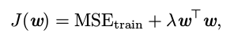
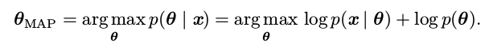
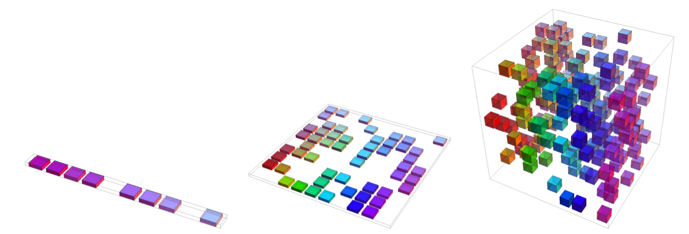
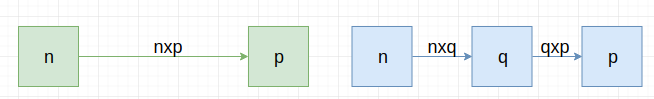

> 下述内容来自：[github](https://github.com/elviswf/DeepLearningBookQA_cn)，[github](https://github.com/exacity/deeplearningbook-chinese)

# 深度学习面试高频问题 (2)

### 11. 模型容量，表示容量，有效容量，最优容量概念

- 模型容量：是指其拟合各种函数的能力。

  > 容量低的模型可能在训练集上就会很难拟合目标函数，产生而欠拟合；容量高的模型或许会在训练集上可以很好的拟合目标函数，但不具备一定的泛化能力，导致过拟合。

- 表示容量：在训练模型的过程中，我们通过调整参数来降低训练误差，模型决定了学习算法可以从哪些函数簇里选择

- 有效容量：在实际训练机器学习模型中，从表示容量中选择最优函数是非常困难的，比如我们要拟合一个三次函数，而我们选择的容量中可能包括四次多项式，其实有效容量里是没有四次幂的。实际上我们训练出来的模型只是一个可以大大降低训练误差的函数，并不可能完美，也就说学习算法的有效容量，可能会小于模型的表示容量

### 12. 正则化中的权重衰减与加入先验知识在某些条件下的等价性

以加入权重衰减修正的线性回归为例：

- 当$\lambda=0$，我们没有任何偏好
- 越大的$\lambda$偏好范数越小的权重

> 关于先验与正则化中的权重衰减可以参考：[LR正则化与数据先验分布的关系](https://www.zhihu.com/question/23536142)
>
> ① Linear Regression：$y=Wx+\epsilon$，假设$\epsilon\sim N(0,\sigma^2)$
>
> 则可以知道：
> $$
> p(y^{(i)}|x^{(i)}, \theta)=N(Wx, \sigma^2)
> $$
> 再根据极大似然估计即可
>
> ② 对$w$引入协方差为$\alpha$的零均值高斯先验，则对应的就是加入$L_2$正则的情况

### 13. 高斯分布的广泛应用的缘由

1. 我们想要建模的很多分布的真实情况是比较接近正态分布的。中心极限定理说明很多独立随机变量的和近似服从正态分布。这意味着在实际中，很多复杂系统都可以被成功地建模成正态分布的噪声，即使系统可以被分解成一些更结构化的部分
2. 在具有相同方差的所有可能的概率分布中，正态分布在实数上具有最大的不确定性。因此，我们可以认为正态分布是对模型加入的先验知识量最少的分布

### 14. 最大似然估计中最小化 KL 散度与最小化分布之间的交叉熵的关系

首先来看下香农熵的定义：
$$
H(x)=E_{x\sim P}[I(x)]=-E_{x\sim P}[logP(x)]
$$
来看下KL散度：
$$
D_{KL}(P||Q)=E_{x\sim P}\big[log\frac{P(x)}{Q(x)}\big]=E_{x\sim P}[logP(x)-logQ(x)]
$$
再来看下交叉熵：$H(P,Q)=H(P)+D_{KL}(P||Q)$
$$
H(P,Q)=-E_{x\sim P}[logQ(x)]
$$

> 针对Q最小化交叉熵等价于最小化KL散度，因为Q并不参与被省略的那一项
>
> 其实感觉这种等价还是有些"怪怪"的，个人感觉加一个约束：$P(x),Q(x)$的取值域相同

### 15. 在线性回归问题，具有高斯先验权重的 MAP 贝叶斯推断与权重衰减的关系，与正则化的关系

原则上，我们应该使用参数$θ$的完整贝叶斯后验分布进行预测，但单点估计常常也是需要的。希望使用点估计的一个常见原因是，对于大多数有意义的模型而言，大多数涉及到贝叶斯后验的计算是非常棘手的，点估计提供了一个可行的近似解。我们仍然可以让先验影响点估计的选择来利用贝叶斯方法的优点，而不是简单地回到最大似然估计。一种能够做到这一点的合理方式是选择最大后验(Maximum A Posteriori， MAP)点估计。MAP 估计选择后验概率最大的点(或在$θ$是连续值的更常见情况下,概率密度最大的点)：

我们可以认出上式右边的$log p(x | θ)$对应着标准的对数似然项，$log p(θ)$对应着先验分布

例如，考虑具有高斯先验权重$w$的线性回归模型。如果先验是$N (w; 0, \frac{1}{\lambda} I^2 )$，那么上式的对数先验项正比于熟悉的权重衰减惩罚$λw^⊤ w$，加上一个不依赖于$w$也不会影响学习过程的项。因此，具有高斯先验权重的MAP 贝叶斯推断对应着权重衰减

正如全贝叶斯推断，MAP 贝叶斯推断的优势是能够利用来自先验的信息，这些信息无法从训练数据中获得。该附加信息有助于减少最大后验点估计的方差(相比于 ML 估计)。然而,这个优点的代价是增加了偏差。许多正规化估计方法，例如权重衰减正则化的最大似然学习，可以被解释为贝叶斯推断的 MAP 近似。这个适应于正则化时加到目标函数的附加项对应着$log p(θ)$。并非所有的正则化惩罚都对应着 MAP 贝叶斯推断。例如，有些正则化项可能不是一个概率分布的对数。还有些正则化项依赖于数据，当然也不会是一个先验概率分布。MAP 贝叶斯推断提供了一个直观的方法来设计复杂但可解释的正则化项。例如，更复杂的惩罚项可以通过混合高斯分布作为先验得到，而不是一个单独的高斯分布

### 16. 稀疏表示，低维表示，独立表示

**稀疏表示**：稀疏表示将数据集嵌入到输入项大多数为零的表示中。稀疏表示通常用于需要增加表示维数的情况，使得大部分为零的表示不会丢失很多信息。这会使得表示的整体结构倾向于将数据分布在表示空间的坐标轴上

**低维表示**：低维表示尝试将$x$中的信息尽可能压缩在一个较小的表示中

**独立表示**：独立表示试图分开数据分布中变化的来源，使得表示的维度是统计独立的

> 当然这三个标准并非相互排斥的。低维表示通常会产生比原始的高维数据具有较少或较弱依赖关系的元素。这是因为减少表示大小的一种方式是找到并消除冗余。识别并去除更多的冗余使得降维算法在丢失更少信息的同时显现更大的压缩。

### 17. 介绍维度灾难

> 当数据的相关维度增大时(从左向右)，我们感兴趣的配置数目会随之指数级增长。(左) 在这个一维的例子中，我们用一个变量来区分所感兴趣的 10 个区域。当每个区域都有足够的样本数时(每个区域对应图中的一个单元格)，学习算法能够轻易地泛化得很好。泛化的一个直接方法是估计目标函数在每个区域的值(可能是在相邻区域之间插值)。(中) 在二维情况下，对每个变量区分10个不同的值更加困难。我们需要追踪 10 × 10 = 100 个区域，至少需要很多样本来覆盖所有的区域。(右) 三维情况下,区域数量增加到了$10^3 = 1000$，至少需要那么多的样本。对于需要区分的d维以及v个值来说，我们需要$O(v^d)$ 个区域和样本。这就是维数灾难的一个示例

当数据的维数很高时，很多机器学习问题变得相当困难。这种现象被称为**维数灾难(curse of dimensionality)**。特别值得注意的是，一组变量不同的可能配置数量会随着变量数目的增加而指数级增长

由维数灾难带来的一个挑战是统计挑战。如上图所示，统计挑战产生于$x$的可能配置数目远大于训练样本的数目。为了充分理解这个问题，我们假设输入空间如图所示被分成单元格。空间是低维时，我们可以用由大部分数据占据的少量单元格去描述这个空间。泛化到新数据点时，通过检测和新输入点在相同单元格中的训练样本，我们可以判断如何处理新数据点。例如，如果要估计某点$x$处的概率密度，我们可以返回$x$处单位体积单元格内训练样本的数目除以训练样本的总数。如果我们希望对一个样本进行分类，我们可以返回相同单元格中训练样本最多的类别。如
果我们是做回归分析，我们可以平均该单元格中样本对应的目标值。但是，如果该单元格中没有样本，该怎么办呢？因为在高维空间中参数配置数目远大于样本数目，大部分单元格中没有样本。我们如何能在这些新配置中找到一些有意义的东西呢？许多传统机器学习算法只是简单地假设在一个新点的输出应大致和最接近的训练点的输出相同。

### 18. 在深度神经网络中，引入了隐藏层，放弃了训练问题的凸性，其意义何在

以完全没有激活函数$g(z)$为例。也可以认为这是使用单位函数作为激活函数的情况。我们已经看过线性单元可以用作神经网络的输出。它也可以用作隐藏单元。如果神经网络的每一层都仅由线性变换组成，那么网络作为一个整体也将是线性的。然而，神经网络的一些层是纯线性也是可以接受的。考虑具有$n$个输入和$p$个输出的神经网络层$h = g(W ^⊤ x + b)$。我们可以用两层来代替它，一层使用权重矩阵 U，另一层使用权重矩阵 V。如果第一层没有激活函数，那么我们对基于 W 的原始层的权重矩阵进行因式分解。分解方法是计算$h = g(V^⊤ U^⊤ x + b)$。如果 U 产
生了q个输出，那么 U 和 V 一起仅包含$(n + p)q$个参数，而$W$包含$np$个参数。如果 q 很小，这可以在很大程度上节省参数。这是以将线性变换约束为低秩的代价来实现的，但这些低秩关系往往是足够的。线性隐藏单元因此提供了一种减少网络中参数数量的有效方法

> 意义：
>
> 1. 减少网络参数
> 2. "层级"结构，可以更高效的构造特征
> 3. 其实也可以参考why deep is better than shallow

### 19. 局部不变形和平滑性的"局限性"

在很多问题中，最广泛使用的隐式 ‘‘先验’’ 是平滑先验(smoothness prior)，或局部不变性先验(local constancy prior)。这个先验表明我们学习的函数不应在小区域内发生很大的变化：
$$
f^\star(x)\approx f^\star(x+\epsilon)
$$
但这样往往存在一个限制：区分输入空间中$O(k)$个区间，所有的这些方法需要$O(k)$个样本

以西洋跳棋为例，基于局部泛化和平滑性或局部不变性先验，如果新点和某个训练样本位于相同的棋盘方块中，那么我们能够保证正确地预测新点的颜色。但如果新点所在的方块没有训练样本，学习器不一定能举一反三。如果仅
依靠这个先验，一个样本只能告诉我们它所在的方块的颜色。获得整个棋盘颜色的唯一方法是其上的每个方块至少要有一个样本。（而这对于高维的情况是几乎没法做到的）

因此我们往往需要提出更强的，更针对特定问题的假设。深度学习的核心思想是假设**数据由因素或特征组合产生**，这些因素或特征可能来自一个层次结构的多个层级。许多其他类似的通用假设进一步提高了深度学习算法。这些很温和的假设允许了样本数目和可区分区间数目之间的指数增益。深度的分布式表示带来的指数增益有效地解决了维数灾难带来的挑战。

### 20. 梯度爆炸的一些解决办法

> 参考：[梯度爆炸](https://zhuanlan.zhihu.com/p/32154263)

**1.重新设计网络模型**

在深层神经网络中，梯度爆炸问题可以通过将网络模型的层数变少来解决。此外，在训练网络时，使用较小批量也有一些好处。在循环神经网络中，训练时使用较小时间步长更新（也被称作[截断反向传播](https://link.zhihu.com/?target=https%3A//machinelearningmastery.com/gentle-introduction-backpropagation-time/)）可能会降低梯度爆炸发生的概率。

**2.使用修正线性激活函数**

在深度多层感知机中，当激活函数选择为一些之前常用的Sigmoid或Tanh时，网络模型会发生梯度爆炸问题。而使用修正线性激活函数（ReLU）能够减少梯度爆炸发生的概率，对于隐藏层而言，使用修正线性激活函数（ReLU）是一个比较合适的激活函数，当然ReLU函数有许多变体，大家在实践过程中可以逐一使用以找到最合适的激活函数。

**3.使用长短周期记忆网络**

由于循环神经网络中存在的固有不稳定性，梯度爆炸可能会发生。比如，通过时间反向传播，其本质是将循环网络转变为深度多层感知神经网络。通过使用长短期记忆单元（LSTM）或相关的门控神经结构能够减少梯度爆炸发生的概率。

对于循环神经网络的时间序列预测而言，采用LSTM是新的最佳实践。

**4.使用梯度裁剪**

在深度多层感知网络中，当有大批量数据以及LSTM是用于很长时间序列时，梯度爆炸仍然会发生。当梯度爆炸发生时，可以在网络训练时检查并限制梯度的大小，这被称作梯度裁剪。

*梯度裁剪是处理梯度爆炸问题的一个简单但非常有效的解决方案，如果梯度值大于某个阈值，我们就进行梯度裁剪。*

具体而言，检查误差梯度值就是与一个阈值进行比较，若误差梯度值超过设定的阈值，则截断或设置为阈值。

*在某种程度上，梯度爆炸问题可以通过梯度裁剪来缓解（在执行梯度下降步骤之前对梯度进行阈值操作）*

**5.使用权重正则化**

如果梯度爆炸问题仍然发生，另外一个方法是对网络权重的大小进行校验，并对大权重的损失函数增添一项惩罚项，这也被称作权重正则化，常用的有L1（权重的绝对值和）正则化与L2（权重的绝对值平方和再开方）正则化。

*使用L1或L2惩罚项会减少梯度爆炸的发生概率*

