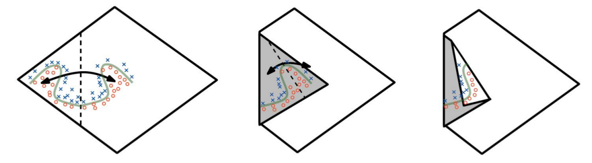
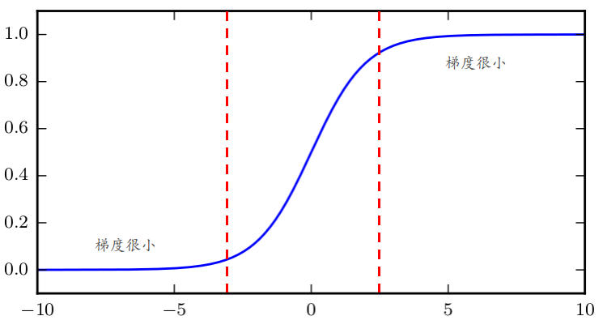
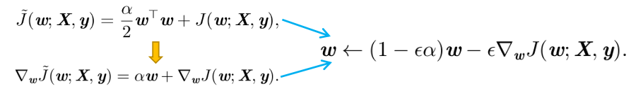
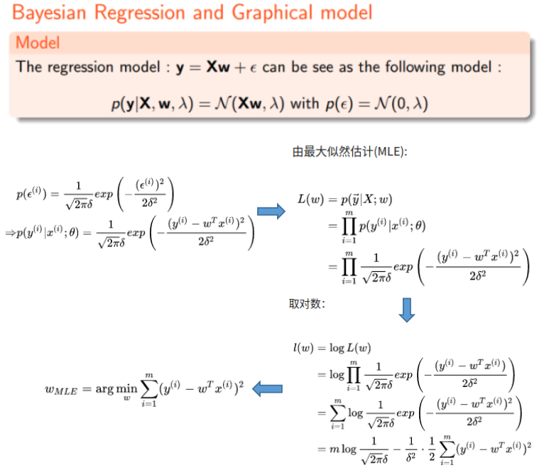
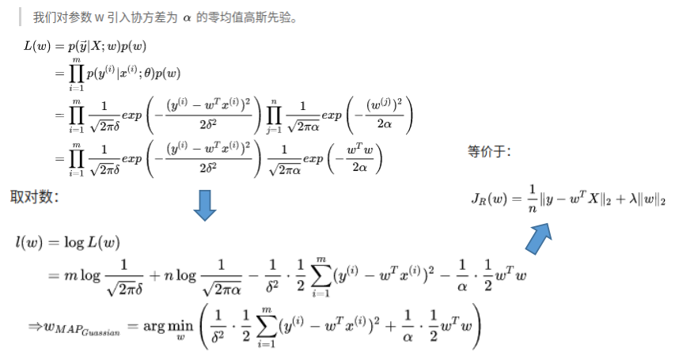
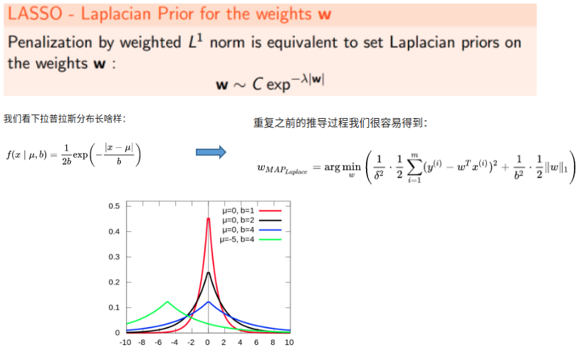

> 下述内容来自：[github](https://github.com/elviswf/DeepLearningBookQA_cn)，[github](https://github.com/exacity/deeplearningbook-chinese)

# 深度学习面试高频问题 (3)

### 21.MLP 的万能近似性质

**万能近似定理(universal approximation theorem)**表明：一个前馈神经网络如果具有线性输出层和至少一层具有任何一种 ‘‘挤压’’ 性质的激活函数(例如sigmoid激活函数)的隐藏层，只要给予网络足够数量的隐藏单元，它可以以任意的精度来近似任何从一个有限维空间到另一个有限维空间的 Borel 可测函数。前馈网络的导数也可以任意好地来近似函数的导数。Borel 可测的概念超出了本书的范畴；对于我们想要实现的目标，只需要知道定义在$\mathbb{R}^n$的有界闭集上的任意连续函数是 Borel 可测的，因此可以用神经网络来近似。神经网络也可以近似从任何有限维离散空间映射到另一个的任意函数。虽然原始定理最初以具有特殊激活函数的单元的形式来描述，这个激活函数当变量取绝对值非常大的正值和负值时都会饱和，万能近似定理也已经被证明对于更广泛类别的激活函数也是适用的，其中就包括现在常用的整流线性单元(ReLU)。

万能近似定理意味着无论我们试图学习什么函数，我们知道一个大的 MLP 一定能够表示这个函数。然而，我们不能保证训练算法能够学得这个函数。即使 MLP能够表示该函数，学习也可能因两个不同的原因而失败：首先，用于训练的优化算法可能找不到用于期望函数的参数值。其次，训练算法可能由于过拟合而选择了错误的函数。

### 22. 在前馈网络中，深度与宽度的关系及表示能力的差异

> 关于更深的整流网络具有指数优势的一个直观的几何解释，(左) 绝对值整流单元对其输入中的每对镜像点有相同的输出。镜像的对称轴由单元的权重和偏置定义的超平面给出。在该单元顶部计算的函数(绿色决策面)将是横跨该对称轴的更简单模式的一个镜像。(中) 该函数可以通过折叠对称轴周围的空间来得到。(右) 另一个重复模式可以在第一个的顶部折叠(由另一个下游单元)以获得另外的对称性(现在重复四次,使用了两个隐藏层)。

Montufar et al. (2014) 的主要定理指出，具有$d$个输入、深度为$l$、每个隐藏层具有$n$个单元的深度整流网络可以描述的线性区域的数量是：
$$
O\begin{pmatrix} \begin{pmatrix} n\\d \end{pmatrix}^{d(l-1)} n^d  \end{pmatrix}
$$
意味着，这是深度$l$的指数级

> 简单而言，深度增长的比宽度增长的快了指数的量级

### 23. 为什么交叉熵损失可以提高具有 sigmoid 和 softmax 输出的模型的性能，而使用均方误差损失则会存在很多问题。分段线性隐藏层代替 sigmoid 的利弊

> 参考：[CSDN](https://blog.csdn.net/guoyunfei20/article/details/78247263)

假设输出为$a=\sigma(wx+b)$（其中的$\sigma$为sigmoid或者softmax），我们以单维度为例，站在参数更新的角度来看（单维度采用sigmoid激活函数）

① 均分误差情况：$Loss=(y-a)^2/2$

则梯度下降法可以得到：
$$
\frac{\partial C}{\partial w}=(\sigma(z)-y)\sigma^{'}(z)x=(\sigma(z)-y)*\sigma^{'}(z)x \\
\frac{\partial C}{\partial b}=(\sigma(z)-y)\sigma^{'}(z)=(\sigma(z)-y)*\sigma^{'}(z) \\
$$

我们可以发现，当$z$很大或很小的时候，梯度很小，这会导致梯度更新很慢

> 当$x$确定的时候，$(\sigma(z)-y)x$可以看做一个缩放倍数

② 采用交叉熵：$C=-\frac{1}{n}\sum_x[ylna+(1-y)ln(1-a)]$

同样的来看下导数：
$$
\frac{\partial C}{\partial w_j}=\frac{1}{n}\sum_x x_j(\sigma(z)-y)
$$

> 推导用到了$\sigma^{‘}=1/(\sigma*(1-\sigma) )$

可以发现，导数里面并没有$\sigma^{’}(z)$这一项，而只取决于$\sigma(z)-y$，即受误差的影响。所以**当误差大的时候，权重更新就快，当误差小的时候，权重的更新就慢**。这是一个很好的性质。

#### ReLU替换Sigmoid的优劣

请见激活函数部分

### 24. 表示学习的发展的初衷？并介绍其典型例子: 自编码器

**表示学习**：使用机器学习来发掘表示本身，而不仅仅把表示映射到输出。学习到的表示往往比手动设计的表示表现得更好。并且它们只需最少的人工干预，就能让AI系统迅速适应新的任务。表示学习算法只需几分钟就可以为简单的任务发现一个很好的特征集，对于复杂任务则需要几小时到几个月。手动为一个复杂的任务设计特征需要耗费大量的人工时间和精力；甚至需要花费整个社群研究人员几十年的时间。

**表示学习发展的初衷**：许多人工智能任务都可以通过以下方式解决：先提取一个合适的特征集，然后将这些特征提供给简单的机器学习算法。然而，对于许多任务来说，我们很难知道应该提取哪些特征。

**自编码器**：自编码器由一个编码器(encoder)函数和一个解码器(decoder)函数组合而成。编码器函数将输入数据转换为一种不同的表示，而解码器函数则将这个新的表示转换到原来的形式。我们期望当输入数据经过编码器和解码器之后尽可能多地保留信息，同时希望新的表示有各种好的特性，这也是自编码器的训练目标。为了实现不同的特性，我们可以设计不同形式的自编码器。

### 25. 在做正则化过程中，为什么只对权重做正则惩罚，而不对偏置做权重惩罚

精确拟合偏置所需的数据通常比拟合权重少得多。每个权重会指定两个变量如何相互作用。我们需要在各种条件下观察这两个变量才能良好地拟合权重。而每个偏置仅控制一个单变量。这意味着，我们不对其进行正则化也不会导致太大的方差。另外，正则化偏置参数可能会导致明显的欠拟合

### 26. 在深度学习神经网络中，所有的层中考虑使用相同的权重衰减的利弊

在神经网络的情况下，有时希望对网络的每一层使用单独的惩罚，并分配不同的$\alpha$系数。寻找合适的多个超参数的代价很大，因此为了减少搜索空间，我们会在所有层使用相同的权重衰减

> 更多的是站在实践的角度

### 27. 正则化过程中，权重衰减与 Hessian 矩阵中特征值的一些关系，以及与梯度弥散，梯度爆炸的关系

待补充coming soon

这部分主要讨论$L_1$和$L_2$正则：

① $L_2$正则

> $L_2$正则也被称为岭回归或Tikhonov正则

我们可以看到，加入权重衰减后会引起学习规则的修改，即在每步执行通常的梯度更新之前先收缩权重向量(将权重向量乘以一个常数因子)。这是单个步骤发生的变化。

### 28. L1/L2 正则化与高斯先验/对数先验的MAP贝叶斯推断的关系

> 参考：[LR正则化与数据先验分布的关系](https://www.zhihu.com/question/23536142)

① Linear Regression的推导

② Ridge Regression（+L2正则）

③ Lasso（+L1正则）

> 对w引入拉普拉斯分布

### 29. 什么是欠约束，为什么大多数的正则化可以使欠约束下的欠定问题在迭代过程中收敛

**欠约束**：比如机器学习中许多线性模型，包括线性回归和PCA，都依赖于对矩阵$X^TX$求逆，只要$X^TX$是奇异的，这些方法就会失效。（另一方面也可以理解为方程个数小于未知量个数）

> 1. 奇异矩阵：指的是存在特征值为0
> 2. 而加入正则项后：$X^TX+\alpha I$是可逆的

大多数形式的正则化能够保证应用于欠定问题的迭代方法收敛。例如，当似然的斜率等于权重衰减的系数时，权重衰减将阻止梯度下降继续增加权重的大小。（例如：$w$能够实现完美分类，那么$2w$也能实现完美分类---而加入正则约束后，会选择$w$）

### 30. 为什么考虑在模型训练时对输入 (隐藏单元/权重) 添加方差较小的噪声，与正则化的关系

**输入加噪声**：在神经网络的输入层注入噪声 (Sietsma and Dow, 1991) 也可以被看作是数据增强的一种方式。对于许多分类甚至一些回归任务而言，即使小的随机噪声被加到输入，任务仍应该是能够被解决的。然而，神经网络被证明对噪声不是非常健壮。改善神经网络健壮性的方法之一是简单地将随机噪声添加到输入再进行训练。

> 对于某些模型而言，向输入添加方差极小的噪声等价于对权重施加范数惩罚

**权重加噪声**：这项技术主要用于循环神经网络。这可以被解释为关于权重的贝叶斯推断的随机实现。贝叶斯学习过程将权重视为不确定的，并且可以通过概率分布表示这种不确定性。向权重添加噪声是反映这种不确定性的一种实用的随机方法。

在某些假设下，施加于权重的噪声可以被解释为与更传统的正则化形式等同，鼓励要学习的函数保持稳定。我们研究回归的情形，也就是训练将一组特征$x​$映射成一个标量的函数$\hat{y}(x)​$，并使用最小二乘代价函数衡量模型预测值$\hat{y}(x)​$与真实值$y​$的误差：

