> 下述内容来自：[github](https://github.com/elviswf/DeepLearningBookQA_cn)，[github](https://github.com/exacity/deeplearningbook-chinese)

# 深度学习面试高频问题 (4)

### 31. 共享参数的概念及在深度学习中的广泛影响

**参数共享**：我们将各种模型或模型组件解释为共享唯一的一组参数，这种正则化方法称为参数共享。

**影响**：和正则化参数使其接近(通过范数惩罚)相比，参数共享的一个显著优点是，只有参数(唯一一个集合)的子集需要被存储在内存中。对于某些特定模型，如卷积神经网络，这可能可以显著减少模型所占用的内存。

① 多任务学习中

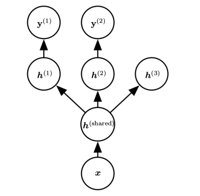

不同的监督任务(给定$x$预测$y^{(i)}$ )共享相同的输入$x$以及一些中间层表示$h^{(shared)}$ ，能学习共同的因素池。该模型通常可以分为两类相关的参数：

1. 具体任务的参数(只能从各自任务的样本中实现良好的泛化)。如上图中的上层。
2. 所有任务共享的通用参数(从所有任务的汇集数据中获益)。如上图中的下层

因为共享参数，其统计强度可大大提高(共享参数的样本数量相对于单任务模式增加的比例)，并能改善泛化和泛化误差的范围 (Baxter, 1995)。当然，仅当不同的任务之间存在某些统计关系的假设是合理(意味着某些参数能通过不同任务共享)时才会发生这种情况。

从深度学习的观点看，底层的先验知识如下：能解释数据变化(在与之相关联的不同任务中观察到)的因素中，某些因素是跨两个或更多任务共享的。

② 卷积神经网络

### 32. Dropout与Bagging集成方法的关系，以及 Dropout 带来的意义与其强大的原因

① Bagging

集成：通过结合几个模型降低泛化误差的技术(Breiman, 1994)。主要想法是分别训练几个不同的模型，然后让所有模型表决测试样例的输出。

> 为什么能降低误差：假设我们有$k$个回归模型。假设每个模型在每个例子上的误差是$\epsilon_i$ ，这个误差服从零均值方差为$E[\epsilon_i^2]=v$且协方差为$E[\epsilon_i\epsilon_j]=c$的多维正态分布。通过所有集成模型的平均预测所得误差是 $\frac{1}{k}\sum_i\epsilon_i$ 。集成预测器平方误差的期望是
> $$
> E[(\frac{1}{k}\sum_i \epsilon_i)^2]=\frac{1}{k^2}E[\sum_i (\epsilon_i^2+\sum_{j\ne i}\epsilon_i\epsilon_j)]=\frac{1}{k}v+\frac{k-1}{k}c
> $$
> 在误差完全相关即$c = v$的情况下，均方误差减少到$v$，所以模型平均没有任何帮助。在错误完全不相关即$c = 0$的情况下，该集成平方误差的期望仅为$\frac{1}{k} v$。这意味着集成平方误差的期望会随着集成规模增大而线性减小。换言之，平均上，集成至少与它的任何成员表现得一样好,并且如果成员的误差是独立的，集成将显著地比其成员表现得更好

bagging：允许重复多次使用同一种模型、训练算法和目标函数的方法（每个数据集从原始数据集中重复采样构成，和原始数据集具有相同数量的样例）

② Dropout

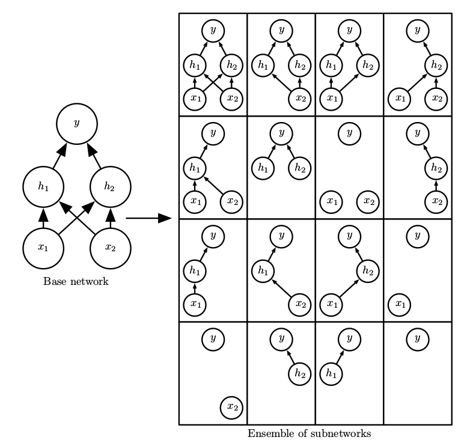

Dropout训练与Bagging训练不太一样。在Bagging的情况下，所有模型都是独立的。在Dropout的情况下，所有模型共享参数，其中每个模型继承父神经网络参数的不同子集。参数共享使得在有限可用的内存下表示指数级数量的模型变得可能。在Bagging的情况下，每一个模型在其相应训练集上训练到收敛。在Dropout的情况下，通常大部分模型都没有显式地被训练，因为通常父神经网络会很大，以致于到宇宙毁灭都不可能采样完所有的子网络。取而代之的是，在单个步骤中我们训练一小部分的子网络，参数共享会使得剩余的子网络也能有好的参数设定。这些是仅有的区别。除了这些，Dropout与Bagging算法一样。例如，每个子网络中遇到的训练集确实是有放回采样的原始训练集的一个子集。

> 待补充，关于dropout好的一个形象解释

### 33. 批量梯度下降法更新过程中，批量的大小与各种更新的稳定性关系

**采用批量梯度下降法的动机：**

1. n 个样本均值的标准差是$\sigma/\sqrt{n}$（利用性质$X+Y=N(\mu_x+\mu_y, \sigma^2_x+\sigma_y^2)$），其中$\sigma$是样本值真实的标准差。分母$\sqrt{n}$表明使用更多样本来估计梯度的方法的回报是低于线性的。比较两个假想的梯度计算，一个基于 100 个样本，另一个基于 10, 000 个样本。后者需要的计算量是前者的 100 倍，但却只降低了10倍的均值标准差。如果能够快速地计算出梯度估计值，而不是缓慢地计算准确值，那么大多数优化算法会收敛地更快(就总的计算量而言，而不是指更新次数)
2. 另一个促使我们从小数目样本中获得梯度的统计估计的动机是训练集的冗余。在最坏的情况下，训练集中所有的 m 个样本都是彼此相同的拷贝。基于采样的梯度估计可以使用单个样本计算出正确的梯度，而比原来的做法少花了 m 倍时间。实践中，我们不太可能真的遇到这种最坏情况，但我们可能会发现大量样本都对梯度做
   出了非常相似的贡献

**小批量的大小通常由下述几个原因决定：**

- 更大的批量会计算更精确的梯度估计，但是回报却是小于线性的。（上面的1）
- 极小批量通常难以充分利用多核架构。这促使我们使用一些绝对最小批量，低于这个值的小批量处理不会减少计算时间。（由于GPU的并行架构，以及多核CPU）
- 如果批量处理中的所有样本可以并行地处理(通常确是如此)，那么内存消耗和批量大小会正比。对于很多硬件设施，这是批量大小的限制因素。
- 在某些硬件上使用特定大小的数组时，运行时间会更少。尤其是在使用 GPU 时，通常使用2的幂数作为批量大小可以获得更少的运行时间。一般，2 的幂数的取值范围是 32 到 256，16 有时在尝试大模型时使用。
- 可能是由于小批量在学习过程中加入了噪声，它们会有一些正则化效果 (Wilson and Martinez, 2003)。泛化误差通常在批量大小为 1 时最好。因为梯度估计的高方差，小批量训练需要较小的学习率以保持稳定性。因为降低的学习率和消耗更多步骤来遍历整个训练集都会产生更多的步骤，所以会导致总的运行时间非常大

> 仅基于梯度$g$的更新方法通常相对鲁棒，并能使用较小的批量获得成功，如100。使用Hessian矩阵H，计算如$H^{−1}g$更新的二阶方法通常需要更大的批量，如10, 000

### 34. 如何避免深度学习中的病态，鞍点，梯度爆炸，梯度弥散

> 预备知识：
>
> 我们可以通过(方向)二阶导数预期一个梯度下降步骤能表现得多好。我们在当前点$x^{(0)}$ 处作函数$f (x)$的近似二阶泰勒级数：
>
> 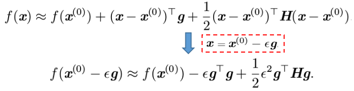
>
> 其中有3项：函数的原始值、函数斜率导致的预期改善、函数曲率导致的校正。当最后一项太大时，梯度下降实际上是可能向上移动的。当$g^⊤Hg$为零或负时，近似的泰勒级数表明增加$\epsilon$将永远使$f$下降。在实践中，泰勒级数不会在$\epsilon$大的时候也保持准确，因此在这种情况下我们必须采取更启发式的选择。当$g^⊤Hg$为正时，通过计算可得，使近似泰勒级数下降最多的最优步长为 $\epsilon^\star=g^Tg/(g^THg)$

**病态**：病态问题一般被认为存在于神经网络训练过程中。病态体现在随机梯度下降会"卡" 在某些情况，此时即使很小的更新步长也会增加代价函数。

当$\frac{1}{2} \epsilon^2 g^⊤ Hg$ 超过$\epsilon g^⊤ g$时,梯度的病态会成为问题。判断病态是否不利于神经网络训练任务，我们可以监测平方梯度范数$g^⊤ g$和$g^⊤ Hg$。在很多情况中，梯度范数不会在训练过程中显著缩小，但是$g^⊤ Hg$的增长会超过一个数量级。其结果是尽管梯度很强，学习会变得非常缓慢，因为学习率必须收缩以弥补更强的曲率。

**鞍点**：梯度为零的点，且在鞍点处，Hessian 矩阵同时具有正负特征值

实验中梯度下降似乎可以在许多情况下逃离鞍点

**梯度爆炸&梯度弥散**：假设某个计算图中包含一条反复与矩阵$W$相乘的路径。那么$t$步后，相当于乘以$W^t$ 。假设 $W$有特征值分解$W =Vdiag(λ)V^{−1}$ 。在这种简单的情况下，很容易看出
$$
W^t=(Vdiag(\lambda)V^{-1})^t=Vdiag(\lambda)^tV^{-1}
$$
当特征值$λ_i$不在1附近时，若在量级上大于 1 则会爆炸；若小于 1 时则会消失。梯度消失与爆炸问题(vanishing and exploding gradient problem)是指该计算图上的梯度也会因为$diag(λ)^t$大幅度变化。梯度消失使得我们难以知道参数朝哪个方向移动能够改进代价函数，而梯度爆炸会使得学习不稳定。

> 梯度爆炸的避免方法见：[Q20](./Question2.md)
>
> 梯度弥散的避免方法：往往是通过"更优"的激活函数

### 35. SGD 以及学习率的选择方法，带动量的 SGD 对于 Hessian 矩阵病态条件及随机梯度方差的影响

**SGD**：

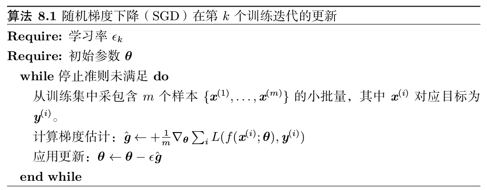

**SGD学习率选择**：学习率可通过试验和误差来选取，通常最好的选择方法是监测目标函数值随时间变化的学习曲线。与其说是科学，这更像是一门艺术，我们应该谨慎地参考关于这个问题的大部分指导。

> 若$\epsilon_0$太大，学习曲线将会剧烈振荡，代价函数值通常会明显增加。温和的振荡是良好的，容易在训练随机代价函数(例如使用 Dropout 的代价函数)时出现。如果学习率太小，那么学习过程会很缓慢。如果初始学习率太低，那么学习可能会卡在一个相当高的代价值。

**带动量的SGD**：

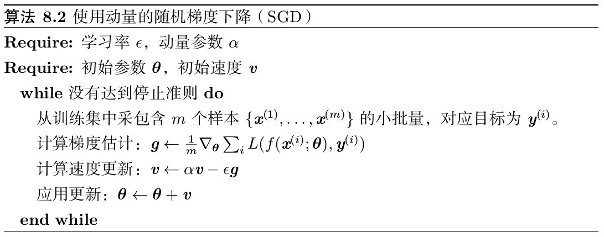

> 1. 动量方法 (Polyak, 1964) 旨在加速学习，特别是处理高曲率、小但一致的梯度，或是带噪声的梯度。动量算法积累了之前梯度指数级衰减的移动平均，并且继续沿该方向移动。
> 2. 速度$v$累积了梯度元素$∇ θ (\frac{1}{m}\sum_{i=1}^m L(f(x^{(i)}; θ), y^{(i)}))$。相对于$\epsilon, \alpha$越大，之前梯度对现在方向的影响也越大

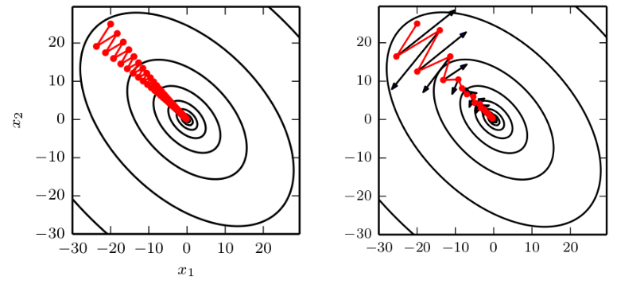

> 动量的主要目的是解决两个问题：Hessian 矩阵的病态条件和随机梯度的方差。我们通过此图说明动量如何克服这两个问题的第一个。等高线描绘了一个二次损失函数(具有病态条件的 Hessian 矩阵)。横跨轮廓的红色路径表示动量学习规则所遵循的路径，它使该函数最小化。我们在该路径的每个步骤画一个箭头，表示梯度下降将在该点采取的步骤。我们可以看到，一个病态条件的二次目标函数看起来像一个长而窄的山谷或具有陡峭边的峡谷。动量正确地纵向穿过峡谷，而普通的梯度步骤则会浪费时间在峡谷的窄轴上来回移动。比较左图，它也显示了没有动量的梯度下降的行为

**Nesterov动量**

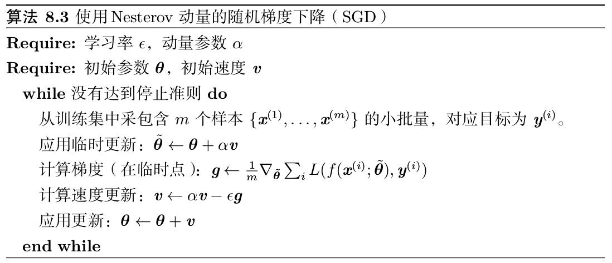

Nesterov 动量和标准动量之间的区别体现在梯度计算上。 Nesterov 动量中，梯度计算在施加当前速度之后。因此，Nesterov 动量可以解释为往标准动量方法中添加了一个校正因子

### 36. 初始化权重过程中，权重大小在各种网络结构中的影响，以及一些初始化的方法；偏置的初始化

① 初始化的影响：初始点能够决定算法是否收敛，有些初始点十分不稳定，使得该算法会遭遇数值困难，并完全失败。当学习收敛时，初始点可以决定学习收敛得多快，以及是否收敛到一个代价高或低的点。此外,差不多代价的点可以具有区别极大的泛化误差，初始点也可以影响泛化。

② 权重大小的影响：更大的初始权重具有更强的破坏对称性的作用,有助于避免冗余的单元。它们也有助于避免在每层线性成分的前向或反向传播中丢失信号—矩阵中更大的值在矩阵乘法中有更大的输出。如果初始权重太大，那么会在前向传播或反向传播中产生爆炸的值。在循环网络中，很大的权重也可能导致**混沌**(chaos)(对于输入中很小的扰动非常敏感，导致确定性前向传播过程表现随机)。在一定程度上，梯度爆炸问题可以通过梯度截断来缓解(执行梯度下降步骤之前设置梯度的阈值)。较大的权重也会产生使得激活函数饱和的值，导致饱和单元的梯度完全丢失。这些竞争因素决定了权重的理想初始大小。

③ 初始化方法：详见[参数初始化](DL/init/init.md)

④ 偏置的初始化：通常情况下，我们可以为每个单元的偏置设置启发式挑选的常数，仅随机初始化权重

### 37. 自适应学习率算法: AdaGrad，RMSProp，Adam 等算法的做法

① AdaGrad

AdaGrad 算法：独立地适应所有模型参数的学习率，缩放每个参数反比于其所有梯度历史平方值总和的平方根。具有损失最大偏导的参数相应地有一个快速下降的学习率,而具有小偏导的参数在学习率上有相对较小的下降。净效果是在参数空间中更为平缓的倾斜方向会取得更大的进步

> 在凸优化背景中，AdaGrad 算法具有一些令人满意的理论性质。然而，经验上已经发现，对于训练深度神经网络模型而言，从训练开始时积累梯度平方会导致有效学习率过早和过量的减小。AdaGrad 在某些深度学习模型上效果不错，但不是全部。

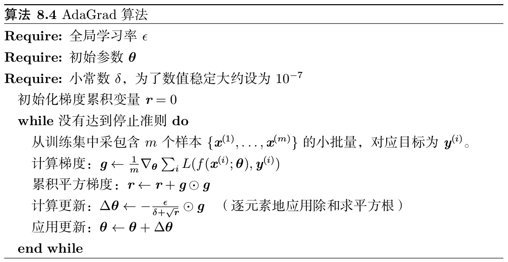

② RMSProp

RMSProp 算法 (Hinton, 2012) 修改 AdaGrad 以在非凸设定下效果更好，改变梯度积累为指数加权的移动平均。AdaGrad 旨在应用于凸问题时快速收敛。当应用于非凸函数训练神经网络时,学习轨迹可能穿过了很多不同的结构，最终到达一个局部是凸碗的区域。AdaGrad 根据平方梯度的整个历史收缩学习率，可能使得学习率在达到这样的凸结构前就变得太小了。RMSProp 使用指数衰减平均以丢弃遥远过去的历史，使其能够在找到凸碗状结构后快速收敛，它就像一个初始化于该碗状结构的 AdaGrad 算法实例。

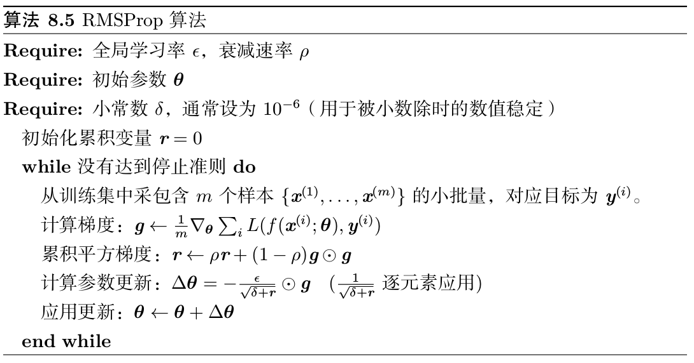

RMSProp 的标准形式如算法8.5所示，结合 Nesterov 动量的形式如算法 8.6 所示。相比于 AdaGrad，使用移动平均引入了一个新的超参数$\rho$，用来控制移动平均的长度范围。

> 经验上，RMSProp 已被证明是一种有效且实用的深度神经网络优化算法。目前它是深度学习从业者经常采用的优化方法之一

③ Adam

Adam可以看做：结合 RMSProp 和具有一些重要区别的动量的变种。

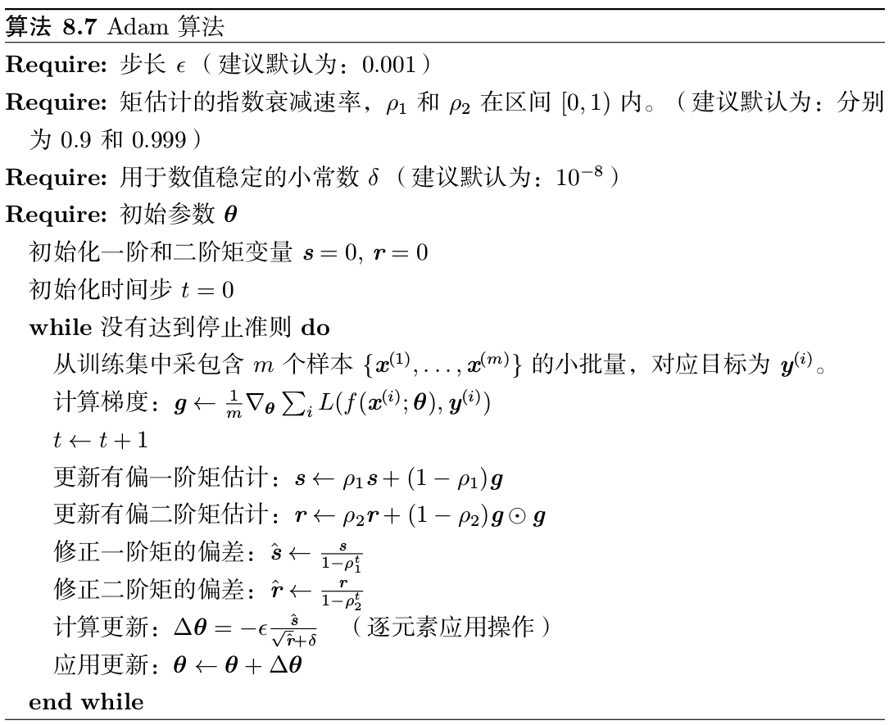

> 更"形象"的解释详见：[优化算法](../optim/optim.md)

### 38. 二阶近似方法: 牛顿法，共轭梯度，BFGS 等的做法

① 牛顿法

牛顿法是基于二阶泰勒级数展开在某点$\theta_0$附近来近似$J(\theta)$的优化方法，其忽略了高阶导数：

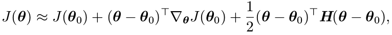

其中$H$是$J$相对于$\theta$的 Hessian 矩阵在$\theta_0$处的估计。如果我们再求解这个函数的临界点，我们将得到牛顿参数更新规则：

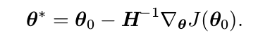

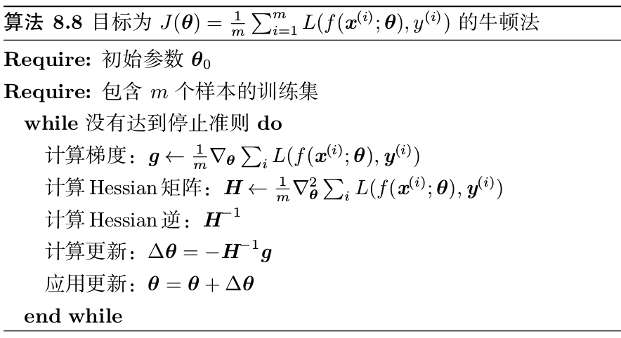

> 1. 牛顿法只适用于 Hessian 矩阵是正定的情况。在深度学习中，目标函数的表面通常非凸(有很多特征)，如鞍点。因此使用牛顿法是有问题的。如果 Hessian 矩阵的特征值并不都是正的，例如，靠近鞍点处，牛顿法实际上会导致更新朝错误的方向移动。这种情况可以通过正则化 Hessian 矩阵来避免。常用的正则化策略包括在 Hessian 矩阵对角线上增加常数$\alpha$。正则化更新变为：
>
> 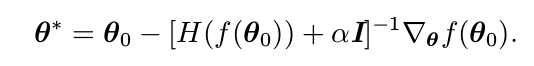
>
> 2. 除了目标函数的某些特征带来的挑战,如鞍点,牛顿法用于训练大型神经网络还
>    受限于其显著的计算负担

② 共轭梯度

### 39. Hessian 的标准化对于高阶优化算法的意义

### 40. 卷积网络中的平移等变性的原因，常见的一些卷积形式

