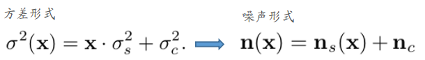
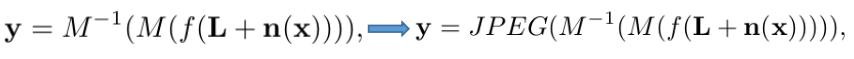
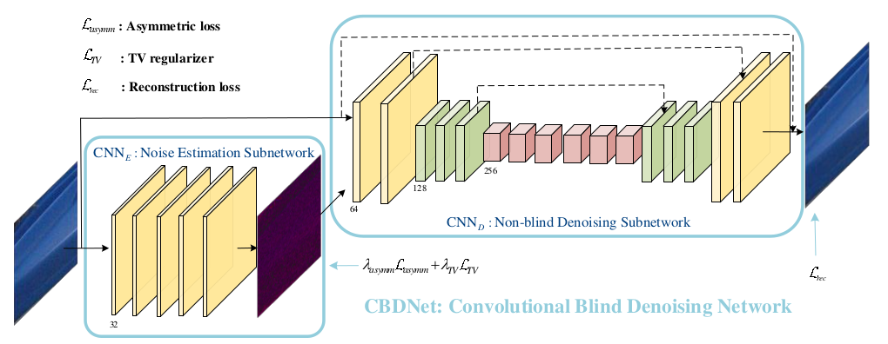
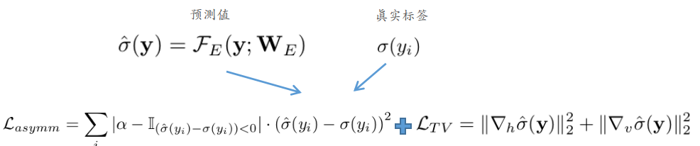
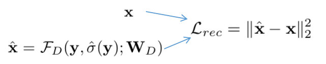

> 论文：[Toward Convolutional Blind Denoising of Real Photographs](https://arxiv.org/abs/1807.04686)

# Toward Convolutional Blind Denoising of Real Photographs

这篇文章的核心在下述几点：

- 如何构造一个更合理的image noise model（造更符合真实场景的图像）对训练CNN去噪网络非常重要。（这不是废话吗:cry:）
- 分为两块：盲去噪=预测"噪声map"+非盲去噪 
- 采用"非对称"学习方式：其实就是更倾向于选择高的噪声水平。（主要基于一个"事实"：sensitive to under-estimation error of nose，robust to over-estimation error）

## 1. Realistic Noise Model

（这块个人不太了解原理 --- 简单理解就是模拟更符合真实情况的噪声情况）

① realistic noise

更"符合真实"的噪声模型：$n(x)\sim N(0, \sigma(y))$（即每一点的噪声水平是不同的，与signal有关），从而点$x$的方差可以表示成：

> 其中的$n_s$取决于信号$x$，而其中的$n_c$为高斯白噪声

② 考虑真实情况相机的情况

> 其中的$n(x)$就是①中的情况，$f$代表camera reponse function---主要是将辐射度$L$转换到干净图像$x$上。$M$ --- 将sRGB图像转换为Bayer image。$M^{-1}$ --- 包含不同通道上的像素以及合成的噪声。JPEG考虑压缩的情况

在真实的训练时，作者采用下述数据：① synthetic images based on realistic noise model ② real photographs with nearly noise-free images

## 2. 网络结构

① $CNN_E$："估计噪声map"

> 1. 其中的$L_{asymm}$考虑了"非对称学习"，其中的$\alpha<0.5$，当$\hat{\sigma}-\sigma<0$取1，否则取0；（这样的话对于under-estimation，惩罚更大，而对于over-estimation，惩罚更小）
> 2. TV正则主要希望邻近的噪声方差不要变化过大

② $CNN_D$：非盲去噪

