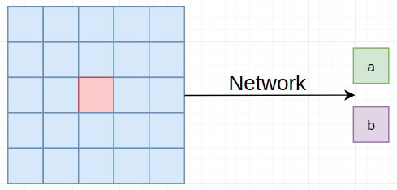
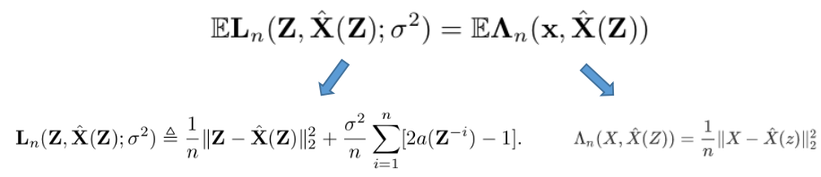
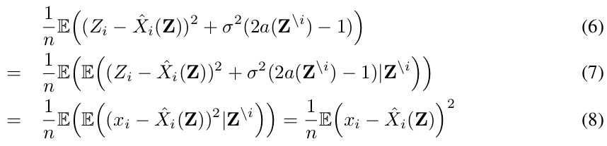
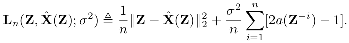
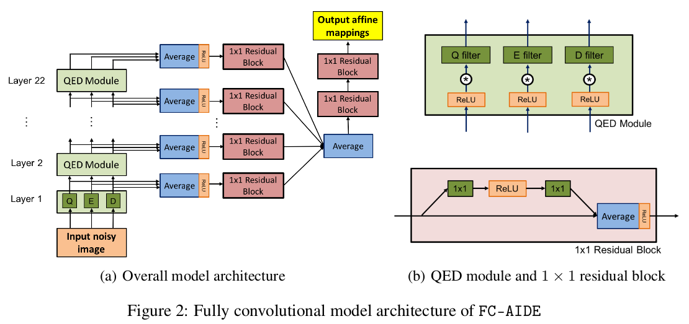
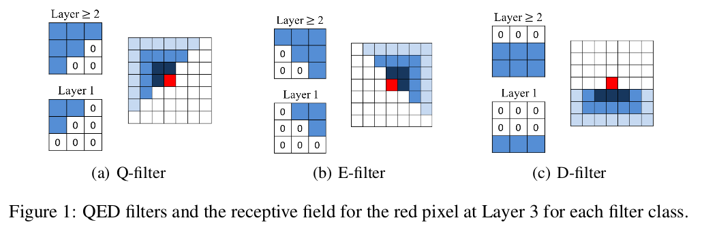
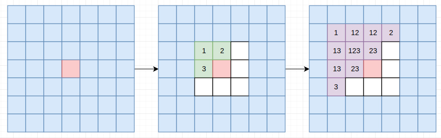
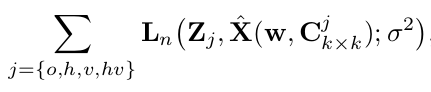
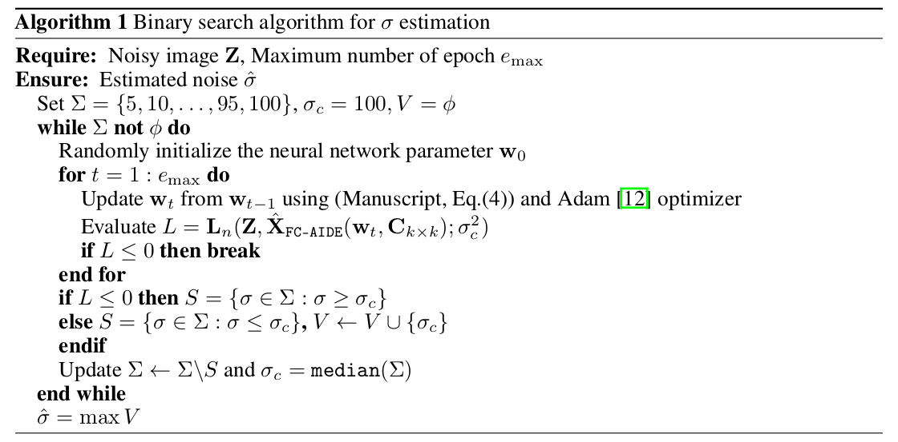

> 论文地址：[Fully Convolutional Pixel Adaptive Image Denoiser](https://arxiv.org/abs/1807.07569)

# Fully Convolutional Pixel Adaptive Image Denoiser

> 作者提出了一种去噪算法（并命名为FC-AIDE（Fully Convolutional Adaptive Image DEnoiser）），这种方法不仅能够通过有监督的方式学习一个去噪器（off-line的方式），还能够通过"适应性地调整去噪器"(adaptively fine-tune the denoiser) 的方式来对一张给定的噪声图片进行去噪。作者主要是在最近提出的Neural AIDE的基础上（这个框架主要基于上下文学习"像素的仿射映射"，并采用MSE的一种无偏估计作为损失函数）进一步改进的。作者针对Neural AIDE主要有三点改进：① 采用了全卷积架构来提升基础网络的性能 ② 引入数据增强方法来使得adaptive fine tunning效果更加"好" ③ 针对未知噪声水平，引入高效的方法估计噪声水平。FC-AIDE在两个数据集上均取得高于目前CNN-based的去噪方法，且在盲去噪问题上面也取得了不错的性能。

## 内容目录

下述主要分为以下几个部分介绍：

1. MSE的无偏估计
2. 整体去噪架构
3. data-augmentation for fine tunning
4. 预测噪声水平

先给出一些符号体系：

- $X$：不包含噪声的图（ground truth）
- $Z$：噪声图（noisy image）--- $Z=X+N$
- $\hat{X}(Z)$：去噪后的图（denoise image）

> 且假设$E(N)=0,\quad Cov(N)=\sigma^2 I_{n\times n}$ --- 即均值为0，各噪声之间相互独立且方差相等

## 1. MSE的无偏估计 

首先认为$\hat{X}(Z)$和$Z$的每个"对应像素点"之间存在特定的仿射函数：
$$
\hat{X}_i(Z)=a(Z^{-i})\cdot Z_i+b(Z^{-i})
$$
其中$Z^{-i}$代表除了像素点$i$之外的所有像素点；$a(Z^{-i})$和$b(Z^{-i})$可以将$Z^{-i}$作为输入，输出这两个参数：

下面我们来证明下面式子等价：

由于各点之间相互独立，我们不妨以单个点的角度进行证明：

> 注：其中的$Z^{\backslash i}$和前面的$Z^{-i}$含义相同

step1：(6)→(7)

利用了性质：$E(E(X|Y))=E(X)$

step2：(7)→(8)

① 在直接证明之前，先来证明$\mathbb{E}(Z_i\hat{X}_i(Z)|Z^{-i})=\mathbb{E}(X_i\hat{X}_i(Z)+\sigma^2a(Z^{-i})|Z^{-i})$
$$
E(Z_i\hat{X}_i(Z)|Z^{-i})=E((X_i+N_i)\hat{X}_i(Z)|Z^{-i})\\
=E(X_i\hat{X}_i(Z)+N_i\hat{X}_i(Z)|Z^{-i})=E(X_i\hat{X}_i(Z)+N_i(a(Z^{-i})(X_i+N_i)+b(Z^{-i}))|Z^{-i}) \\
=E(X_i\hat{X}_i(Z)+\sigma^2a(Z^{-i})|Z^{-i})
$$

> 主要运用了1. $Z_i=X_i+N_i$ 2. $E(N_i)=0$这些性质

② 平方项展开

> 为了写的不那么"冗长"：令$Y-\hat{X}_i$，$A-a(Z^{-i})$，$Z-Z_i$，$X-X_i$

$$
E((Z-Y)^2+\sigma^2(2A-1))=E(Z^2-2ZY+Y^2+\sigma^2(2A-1))\\
=E(Z^2-2(XY+\sigma^2A))+Y^2+\sigma^2(2A-1))\\
=E((X+N)^2-2XY+Y^2-\sigma^2)
$$

> 在第一个和第二个等号之间用到了①中的结论

③ 最后步骤
$$
E((X+N)^2-2XY+Y^2-\sigma^2|Z^{-i})=E(X^2+2XN+N^2-2XY+Y^2-\sigma^2|Z^{-i}) \\
=E(X^2-2XY+Y^2|Z^{-i})=E((X-Y)^2|Z^{-i})
$$

> 其中用到了$E(2XN)=0,E(N^2)=\sigma^2$

因此，通过上述内容我们知道优化MSE等价于优化下述表达式：

## 2. 整体去噪结构

当我们认为 $\hat{X}(Z)$和$Z$的每个"对应像素点"之间满足仿射函数：$\hat{X}_i(Z)=a(Z^{-i})\cdot Z_i+b(Z^{-i})$，我们只需通过网络结构来求解$a(Z^{-i})$和$b(Z^{-i})$对应的map：

> 其中Ouput affine mapping即对应$a$和$b$（大小和原图同大小）

下面介绍Q filter，E filter，D filter，引入这三个模块主要是为了满足$Z^{-i}$这个条件（希望并不用到该点的信息---主要是因为1中我们推导用到了这个假设）。作者专门设计了下述三个卷积形式：

> 可以通过下图帮助你理解（2次卷积操作的情况）
>
> 
>
> > 最右边的1,2,3对应第二幅的1,2,3

这样我们就能获得最终的$\hat{X}(Z^{-i})$。这部分可以看成有监督学习部分。（个人感觉这一部分应该直接采用MSE损失进行训练，然后在fine-tunning的时候再用$L_n$损失 --- 但论文中应该全都采用$L_n$作为优化目标（不太确定））

## 3. data-augmentation for fine tunning

为了解决数据缺乏的问题（其实应该说$L_n$和$\Lambda_n$之间的差异---因为期望相等不代表单个相等），因此可以采用下述数据增强的策略来定义损失：

> 其实o代表原图，h代表水平翻转，v代表垂直翻转，hv代表水平加垂直翻转

这样有助于减小$L_n$与$\Lambda_n$之间的差异

## 4. 预测噪声水平

下面主要解决如果噪声水平未知的情况。

我们的优化目标式子为：

从而我们存在下述情况（不妨假设真实的噪声水平为$\sigma^2$，"估计"的噪声水平为$\hat{\sigma}^2$）--- 一种不那么严谨的估计：

在理想情况下，$L_n$应该约等于0（根据等价于MSE的情况），那么在最佳情况下应该存在下述关系：

1.  $\frac{1}{n}\Vert Z-\hat{X}(Z)\Vert_2^2=\frac{1}{n}\Vert N\Vert_2^2=\sigma^2$
2. $\frac{1}{n}\sum a(Z^{-i})=0$
3. $L_n\approx \sigma^2-\hat{\sigma}^2$

① 如果$\hat{\sigma}\gg \sigma$，则会使得$L_n<0$

② 如果$\hat{\sigma}\gg \sigma$，则会使得$L_n>0$

所有可以采用的解法：利用二分查找算法，从一系列$\Sigma =\{5,10,...,95,100\}$中寻找最合适的$\sigma$（可以从大的开始，找到那个使得正数最小的情况即可以作为最后预测的噪声水平）

论文里面采用的方式：

