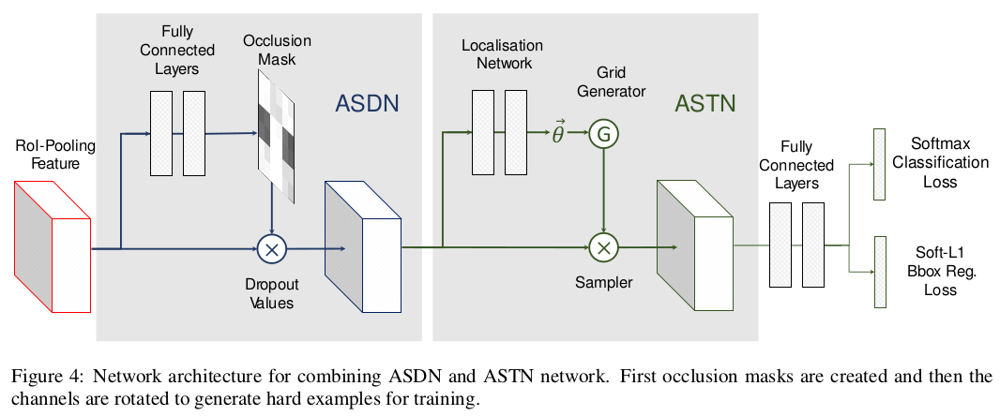

> 论文地址：[A-Fast-RCNN: Hard Positive Generation via Adversary for Object Detection](https://arxiv.org/abs/1704.03414)
>
> 下述内容主要来自：[A-Fast-RCNN总结](https://zhuanlan.zhihu.com/p/33936283)

# A-Fast-RCNN: Hard Positive Generation via Adversary for Object Detection

## 核心思想

这篇文章通过生成策略来使得RCNN尽可能去处理"更难（遮挡，形变物体）"的情况来提升网络的能力。

遮挡和形变是检测任务中影响模型性能的两个显著因素。增加网络对遮挡和形变的鲁棒性的一个方式是增加数据库的体量。但是由于"涵盖遮挡和形变"的分布是很广的（即遮挡和形变类型多种多样），即便增加数据，遮挡和形变的图片仍是占比较少的部分。另一个思路就是使用生成网络产生遮挡和形变图片。然而遮挡和形变的情况太多，直接生成这些图片还是比较困难的事情。

在这篇文章中，作者的思路是训练一个对手网络，让这个网络动态产生困难的遮挡和形变样本。以遮挡为例，作者希望被训练的检测网络会认为哪里的遮挡更难以处理。之后去遮挡这些区域的特征，从而让检测网络努力学习这些困难的遮挡情况。对于形变的情况同理。

与其它提升检测网络性能的方法，如换用更强大的主干网络、使用自上而下的网络设计等相比，本文提出的方法则是考虑如何更加充分地利用训练数据。（可以归属于OHEM的大类）

## 主要内容

**① 整体框架**

（ASDN："产生遮挡"，ASTN：发生形变 --- 两者都是针对feature map上面）

关于ASDN和ASTN采用的损失函数如下所示：
$$
L_A=-L_{softmax}(F_c(A(X)),C)
$$
（尽可能使之分错）

**② ASDN**

 ASDN的目标是根据物体region proposal的feature map，动态生成一个遮挡掩模（通过图中的全连接层产生）。将掩模对应的特征置0后，能给后续的分类器制造尽可能大的麻烦，从而让分类器学习更难的遮挡样本。

为了得到ASDN，作者分以下几步进行训练：

1. 训练迭代Fast RCNN约10K次，首先得到一个基本上可以进行检测的模型；
2. 之后单独训练ASDN用来预测具体遮挡的部位。首先proposal被分割为9个格子（这里应该是分割成和ROI-Pooling Feature同样格子数）。为了产生ASDN的训练信息，依次对这9个格子进行遮挡。遮挡后使分类损失最大的格子便是最值得去遮挡的格子。ASDN的训练损失函数便是去分类判断这9个格子，每个格子是不是最值得遮挡的那个；
3. ASDN的输出是一个分类概率组成的图。在使用输出结果的时候作者取分类为“最值得遮挡”的概率最高的1/2像素，随机选取这些像素中的1/3进行遮挡，剩下的2/3不遮挡，增加一定的随机因素（即将遮挡的这部分的feature map置0）；
4. 之后作者将ASDN和Fast RCNN组合在一起进行端到端训练。

**③ ASTN**

ASTN使用和STN(Spatial Transformer Network[2])一样的网络结构。其优化目标和STN不同，即训练一种仿射变换，使得分类器无法正确分类。实际使用中，几点注意事项

1. 需要对输出的旋转角度大小加以约束，否则容易出现将物体上下颠倒的极端但是并不常见的情况。作者采用顺时针和逆时针各10°的方式
2. 并不是将整个feature map沿着一个角度进行旋转，按channel将feature map划分成4块，这4块采用不同的角度进行旋转

在最终的使用时，ASDN和ASTN被级联组合在网络中。

**④ Others**

1. 作者通过一系列实验证明了该方法确实有效
2. 作者同OHEM[3]进行了对比。在VOC 2007数据集上，本文方法(71.4%)好于OHEM(69.0%)。但在VOC 2012上，本文方法(69.0%)逊于OHEM(69.8%)。作者解释该现象为两种方法分别强调不同层面的数据利用，是可以互补而不冲突的两种手段。将两者结合一起训练时，其结果(71.7%)达到了最好。

