> 论文地址：[Single-Shot Object Detection with Enriched Semantics](https://arxiv.org/abs/1712.00433)

# Single-Shot Object Detection with Enriched Semantics

> 摘要：作者提出了一种单阶段目标检测框架Detection with Enriched Semantics（DES）。主要的动机是希望通过语义分割分支（semantic segmentation branch）和全局激活模块（global activation module）来增强目标检测器的语义信息。其中语义分割分支采用的是"弱语义分割标签"（无需额外的分割标签，即采用的是目标框框里面的内容的粗分割）。于此同时，作者采用全局激活模块来学习各通道之间的关系(或称为各类别之间的关系---其实该模与SENet里面的类似)。在PASCAL VOC和MS COCO目标检测数据集上，均能验证该模型的有效性。尤其是在基于VGG16的DES上面，作者在VOC2007测试数据集上面取得了81.7的mAP，以及在COCO测试-开发集上取得了32.8的mAP，且能够在单卡(Titan XP)上面达到31.5ms/image。进一步，采用低分辨率的版本则可以在VOC2007上面取得79.7的mAP，速度则提升到13.0ms/image。

## 1. 结构和原理

先说明该文章主要解决的问题：主要解决SSD等一阶段方法"低层特征"上面语义信息不够的问题（语义信息不够就不能"分对"），当然例如DSSD等方法也是解决的思路。只是作者采用不同的"方式"，以及能够保证速度更快。

整体结构如下所示（现在心中有个全局的概念，后续会展开将每部分的思想）：

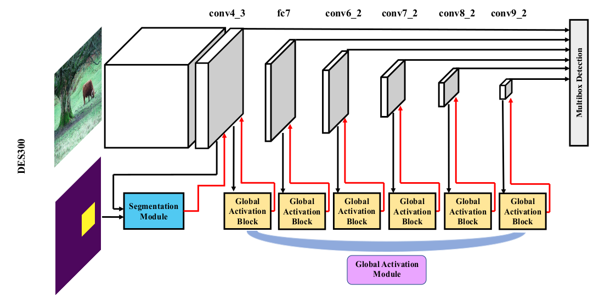

> 其主要增加的部分就是下面的部分。其他和SSD是完全一样的。

下面分别介绍Segmentation Module和Global Activation Block。

#### ① Segmentation Module

这部分只作用在"最低层特征conv4_3"上面，主要有两方面的考虑：1. 这一层的语义信息最弱，最需要补强。此外该层补强后同样能够影响后续层   2. 该层的size下采样的也最少，空间信息保留相对更完备---这对语义分割是有影响的。

这部分结构如下所示：

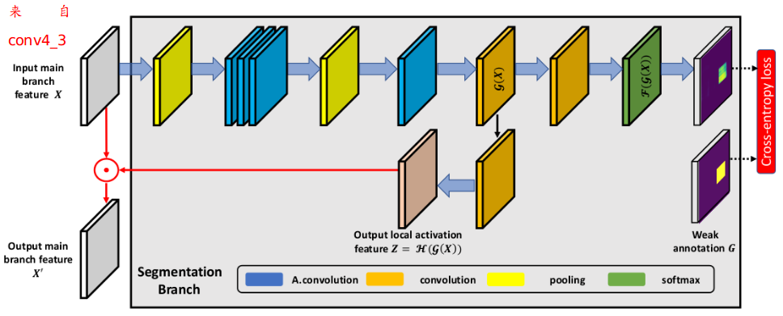

说明：

1. 图中的A. convolution代表的是astro convolution（主要为了增大感受野）

2. 其中到"中间部分"$\mathcal{G}(X)\in R^{C'\times H\times W}$，出来两路：

   - $Y=\mathcal{F}(\mathcal{G}(X))$：产生预测的语义分割label

   - $Z=\mathcal{H}(\mathcal{G}(X))\in R^{C\times H\times W}$：相当于语义分割部分的feature maps，用于"增强"$X\in R^{C\times H\times W}$部分的语义信息。（即$X'=X\odot Z$）

下面解答两个疑惑：

① 语义分割的ground truth怎么来的？

采用的是"粗语义"，直接将bbox内部的设置为该类别。如下图所示：

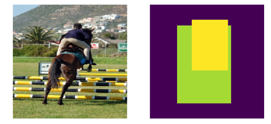

这里有个规定：如果一个像素同时被两个框框包围，选择bbox面积小的类别作为该像素的类别。

这部分训练就采用语义分割的损失函数即可

② 采用上述方式真的能"增强"吗？

其实DL就是"你希望它干什么"，就设计特定的层，然后利用损失函数等方式来使得特定层朝着你的"初衷"进行。（所以更像是你希望它怎么做，看它能不能完成）下面给出实验结果下$X,Z,X'$的情况（每一行都是单个通道下）：

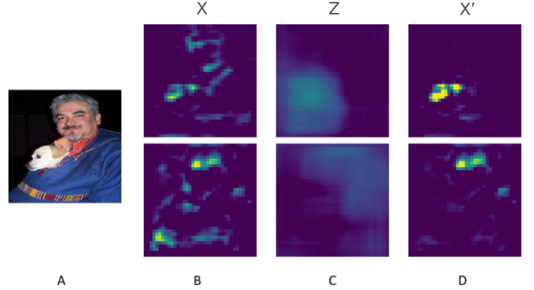

我们可以明显的发现融合后的特征更具代表性。

#### ② Global Activation Block

这部分其实说白了，也是为了使得语义信息更强

> 关于这部分的思想可以参考：[SENet](https://arxiv.org/abs/1709.01507)

这部分由三阶段构成：① spatial pooling  ② channel-wise learning  ③ broadcasted multiplying

① spatial pooling：就是"融合空间信息" ，只保留通道信息（$Z\in R^C$）

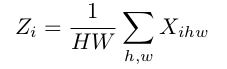

② channel-wise learning：寻找通道之间的关系

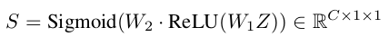

（其实就是两个全连接层 --- 其中$W_1\in R^{C_2\times C}$，$W_2\in R^{C\times C_2}$，其中$C_2=1/4\cdot C$）

③ broadcasted multiplying（即每个S的每个值乘以X对应的通道）

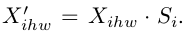

#### ③ 损失函数

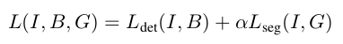

这里的$\alpha$是个超参数，作者通过蒸馏分析取得是$\alpha=0.1$

## 2. 实验分析

#### ① DES v.s. SSD

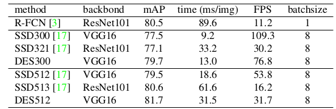

部分实验效果对比：

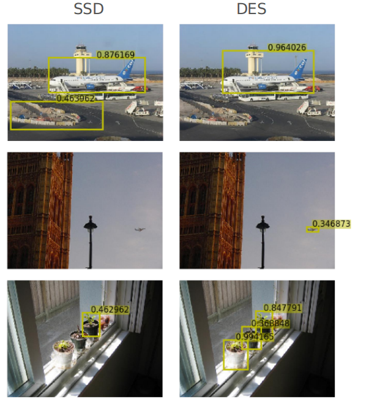

#### ② 蒸馏分析

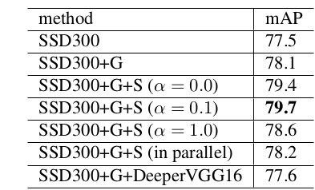

- G：global activation module
- S：Semantic Module