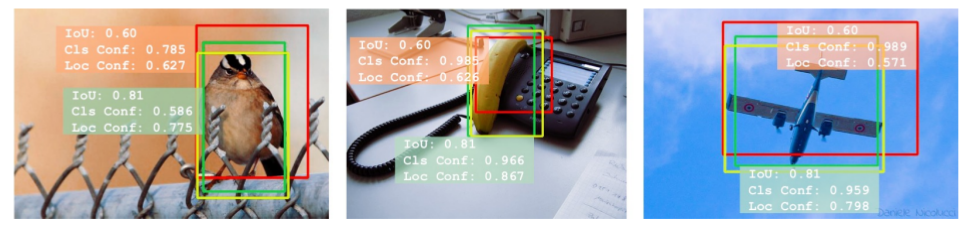
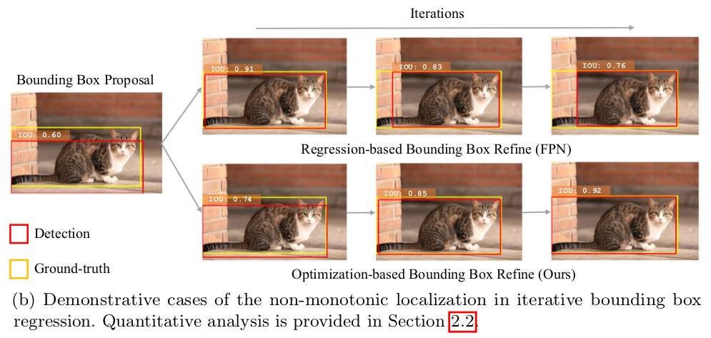
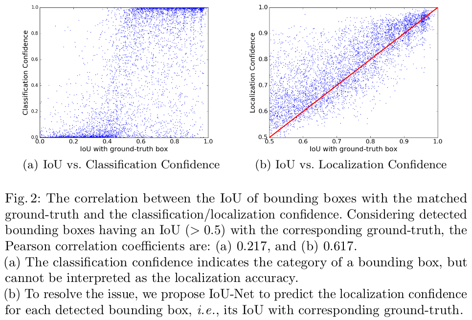
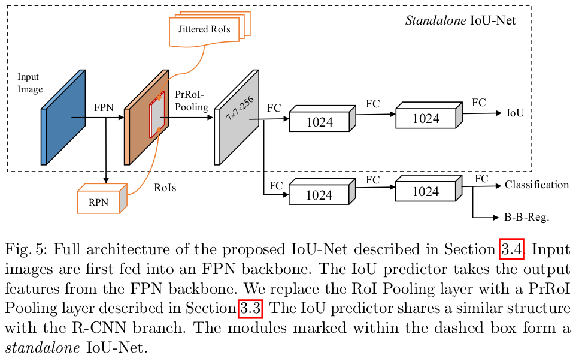
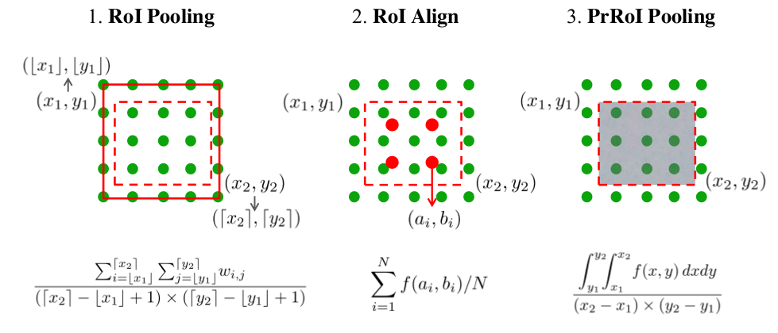
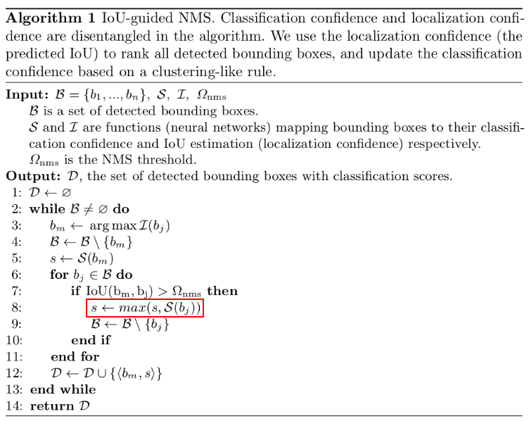
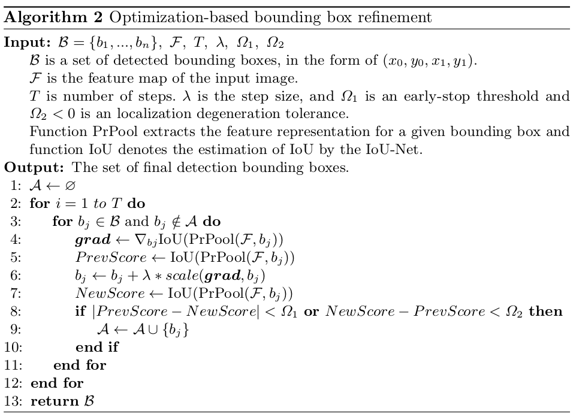
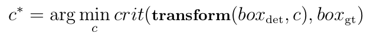
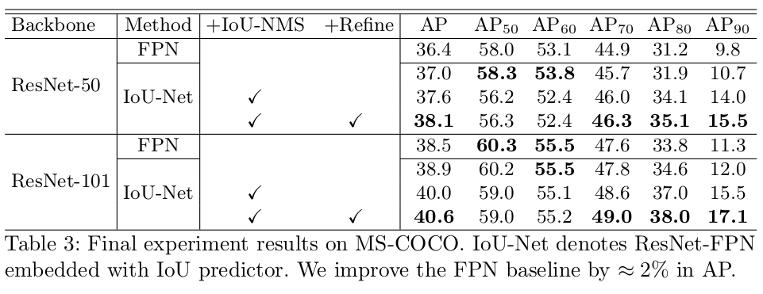

> 论文地址：[Acquisition of Localization Confidence for Accurate Object Detection](https://arxiv.org/abs/1807.11590)
>
> 参考：[解读](https://zhuanlan.zhihu.com/p/41462941)

# Acquisition of Localization Confidence for Accurate Object Detection

> 基于CNN-based的目标检测器往往依赖于bounding box regression和non-maximum suppression来进行目标定位。其中输出作为某类的概率自然反映了类别置信度，但整个框架"并没有"定位置信度。这带来的后果：可能会导致原本"正确的"定位框框在迭代回归的过程中"变差"甚至在NMS过程中被抑制。在这篇文章中，作者提出了IoU-Net，相比之前的框架多了对预测的框框和真实的目标框框之间的IoU的预测。该网络将该指标作为定位置信度，这将有助于NMS过程保留更好的框框。不仅如此，此文还将预测的IoU作为目标提出了optimization-based的框框"修正"方法。实验表明，该结构是有效的。

### 主要的创新点

- 分析了"缺乏"定位置信度存在的问题
- 多加了一路分支，用来预测IoU：可以作为定位置信度
- 提出了IoU-guided NMS：解决了分类置信度和定位准确性之间的"不一致"
- Precise RoI Pooling："更准确的"池化方法
- optimization-based bounding box refinement

### 1. "缺乏"定位置信度存在的问题 

> 黄色框框为ground truth，红色框框和绿色框框均为预测的结果（原始Faster-RCNN的情况）

存在的问题1：分类的置信度和定位精度之间的不一致性 --- 如上图的情况所示，红色框框的分类指标更高（cls conf），但是绿色的框框的定位精度更好（Loc conf---此处是指与ground truth的IoU）。这就会带来一个问题，在NMS方法中，是基于类别得分进行排序之后再剔除掉"冗余"，因此会选择红色框框而不是绿色框框。可实际上站在定位精度而言，绿色框框更好。

> 上面部分是常用的bounding box regression在迭代更新时的情况，下面部分是作者改进方法的情况

存在的问题2：由于缺乏了定位置信度，会使得广泛采用的bounding box regression方法的更新过程显得不太容易判断（或不易解释）。如上图所示，在FPN在参数更新时，反而会导致IoU下降（但损失确实是下降的，很可能基于regression而言，新的框框损失更小）

> 另一个很有利的佐证：classification confidence和IoU并没有太强的正相关，对于classification confidence高的bbox，其IoU分布很散，从0.6-1.0都有，这就会导致一些localization好的bbox因为classification confidence略低而被suppressed
>
> 

### 2. IoU-Net结构

其实就是多了上面那一路预测IoU的分支。

> 注意的是预测的IoU对应的label其实是RoIs与ground truth之间求得的IoU

其中的Precise RoI-Pooling结构如下所示：

> 其中的$f(x,y)=\sum_{i,j}IC(x,y,i,j)\times w_{i,j}$
>
> 关于具体实现等细节可以参考：[PreciseRoIPooling](https://github.com/vacancy/PreciseRoIPooling)

Precise RoI Pooling的几个优点：

1. 相比RoI Pooling：无"量化损失"
2. 相比RoI Align：省去了一个超参数---continuous points are sampled in the bin，如上图中采用N=4
3. 还有就是实验效果更好

### 3. IoU-guided NMS

主要解决上述存在的问题1。

说明：

1. 以预测的IoU替换classification confidence作为NMS的排序基准
2. 消除"冗余"时，我们是将其中"得分最高"的替换我们留下来的框框的得分。上述红色框框部分

### 4. optimization-based bounding box refinement 

主要解决第二个问题。

> 其中的IoU(*)就是IoU-Net预测IoU的那一路分支。上述迭代简单的理解就是对每个框框根据IoU进行更新，直到满足要求（两次更新差别很小或者更新反而降低了IoU）

bbox的"精修"问题可以表示为下述表达式：

基于回归的算法就是直接用前馈网络求 $c^\star$ ，迭代式的方法对输入分布很敏感，容易导致non- monotonic localization improvement，而本文提出的方法就是对PrRoI Pooling的关于坐标的IoU score进行梯度上升（梯度根据矩形的大小做scale），直至收敛。

### 5. 实验结果的情况

**模型的高AP的大部分收益来自于高阈值，在低阈值的时候表现一般。**

