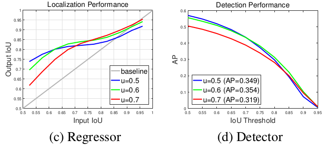
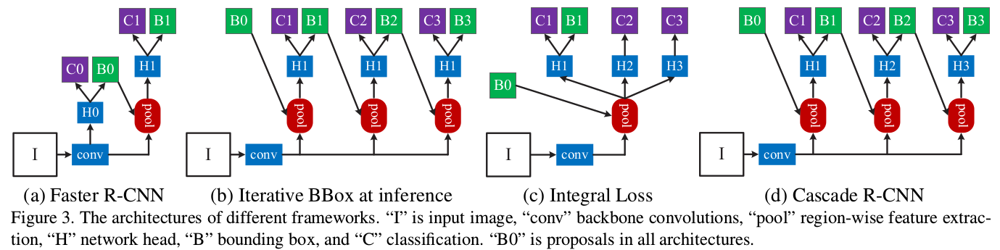
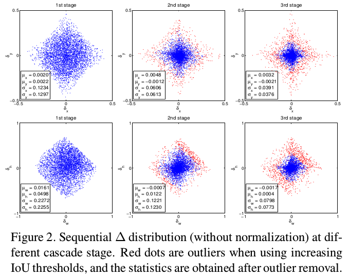
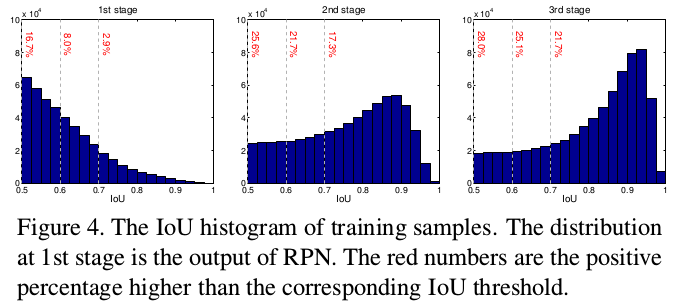

> [Cascade R-CNN: Delving into High Quality Object Detection](https://arxiv.org/pdf/1712.00726.pdf)
>
> 中译版本：[级联R-CNN：深入高品质目标检测](https://blog.csdn.net/qq_27725245/article/details/79897750)
>
> 下述主要参考：[Cascade R-CNN](https://zhuanlan.zhihu.com/p/36095768)

# Cascade R-CNN：Delving into High Quality Object Detection

## 主要研究内容

本文主要针对的是检测问题中的IoU阈值选取问题，众所周知，阈值选取越高就越容易得到高质量的样本，但是一味选取高阈值会引发两个问题：

1. 训练过程中的overfitting，随着IoU的增大，正样本数目呈指数减少
2. 在train和inference使用不一样的阈值很容易导致mis-match(这一点在下面会有解释)

作者为了解决上述问题就提出了一种muti-stage的architecture，核心就是利用不断提高的阈值，在保证样本数不减少的情况下训练出高质量的检测器。

核心要解决的问题：保证proposal的高质量(回归系数有好的效果)又不减少训练样本(避免过拟合)？

## 分析篇

### 1. Proposal IoU"修正情况"与设置的IoU阈值之间的关系

（c图中：x轴---proposal与gt之间的IoU，y轴---经过回归系数修正后的IoU  不同的线代表不同阈值训练出来的detector；  d图中：x轴---AP测试时选用的阈值(详细见mAP那篇内容)，y轴---AP结果）

从图中我们可以有下述几个发现：

1. 只有proposal自身的阈值和训练器训练用的阈值较为接近的时候，训练器的性能才最好（0.55~0.6的范围内阈值为0.5的detector性能最好，在0.6~0.75阈值为0.6的detector性能最佳，而到了0.75之后就是阈值为0.7的detector了；此处的性能也可以理解为不同颜色经过regressor修正的"幅度"---与灰色的线的距离）
2. 单一阈值训练出的检测器效果非常有限，以现在最常见的阈值0.5为例，由于所有IoU大于0.5的proposal都会被选中，那么对于IoU0.6~0.95的proposal来说，detector的表现就很差了。那么，我能不能直接选用0.7的高阈值呢？毕竟这样子0.5~0.7的proposal都被排除了，横轴0.7~0.95之间，红色线条的表现似乎不差啊？但是看到右图你就会发现，实际上detector的性能反而是最低的，原因是这样子**训练样本大大减少，过拟合问题非常严重**。

如何能保证proposal的高质量又不减少训练样本？**采用cascade R-CNN stages，用一个stage的输出去训练下一个stage，就是作者给出的答案**。留意到左图大部分线条都是在y=x的灰色线条之上的，这就说明某个proposal在经过detector后的IoU几乎必然是增加的，那么再经过一个更大阈值训练的detector，它的IoU就会更好。（即"多重回归修正"---而每次的IoU均为前一次修正后的结果）

### 2. 各种不同方法的分析

(a). Faster RCNN的方式就不介绍了

(b). Iterative BBox：采用了级联结构来对Box进行回归，使用的是完全相同的级联结构。但是这样以来，第一个问题：单一阈值0.5是无法对所有proposal取得良好效果的，如第1部分的图所示，proposal经过0.5阈值的detector后IoU都在0.75以上，再使用这一阈值并不明智；第二个，detector会改变样本的分布，这时候再使用同一个结构效果也不好。（证据见下图）

说明：注意每一列为"第k阶段IoU=0.5"时$\delta_x,\delta_y,\delta_w,\delta_h$的分布情况，可以明显发现其分布有明显的变化（这时采用同样的网络结构H1显然是不适合的）。我们可以看到，从1st stage到2nd stage，proposal的分布其实已经发生很大变化了，因为很多噪声(false positive)经过box reg实际上也提高了IoU，2nd和3rd中的那些红色点已经属于outliers，如果不提高阈值来去掉它们，就会引入大量噪声干扰，对结果很不利。从这里也可以看出，阈值的重新选取本质上是一个**resample**的过程，它保证了样本的质量。

(c). Integral loss：Iterative Loss实际上没有级联结构，从c图可以看出来，它只是使用了不同的阈值来进行分类，然后融合他们的结果进行分类推理，并没有同时进行Box reg。作者认为，从Figure 4中的第一个图可以看出来，当IoU提高的时候，proposal的比重下降非常迅速，这种方法没有从根本上克服overfit问题；另外，这种结构使用了多个高阈值的分类器，训练阈值却只能有一个，必然会导致mismatch问题而影响性能。

(d). Cascade R-CNN：主要为了解决前面提出的几个问题。当然，这里会有另一个问题，我们这样子真的不会减少样本数量么？虽然第1部分给了比较直观感性的解释，但是似乎还不够……作者给出了更加详细的实验证明：

从这张图，我们可以看到，1st stage大于0.5的，到2nd stage大于0.6的，到3rd stage大于0.7的……在这一个过程中proposal的样本数量确实没有特别大的改变，甚至还有稍许提升，和1中的内容结合起来看，应该可以说是非常强有力的证明了。

Cascade的优点：

- cascaded regression不断改变了proposal的分布，并且通过调整阈值的方式重采样
- cascaded在train和inference时都会使用，并没有偏差问题
- cascaded重采样后的每个检测器，都对重采样后的样本是最优的，没有mismatch问题

