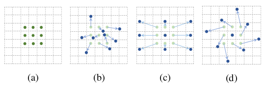
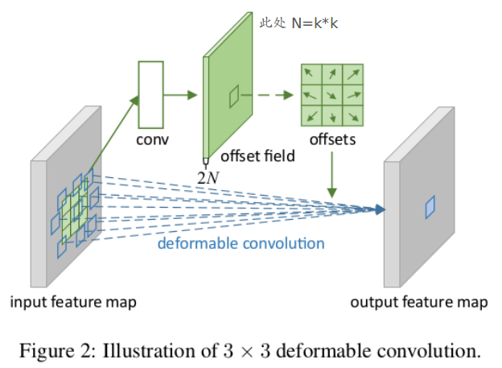
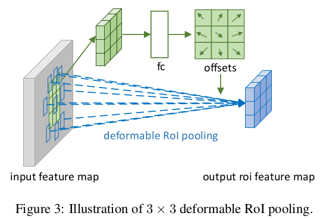
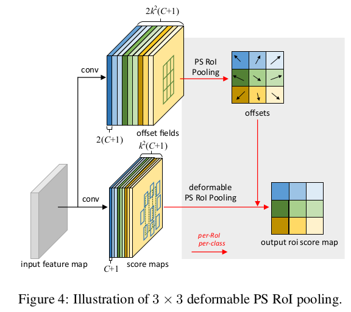
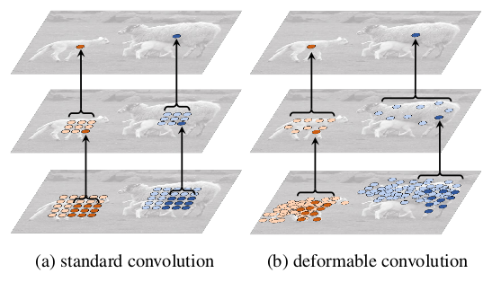
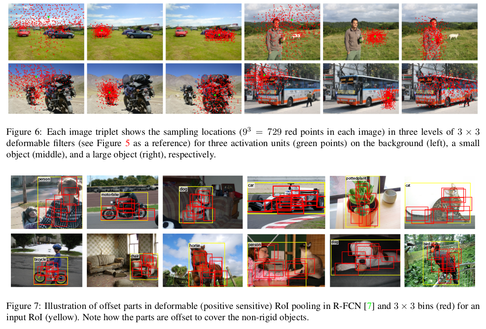

> 论文地址：[Deformable Convolutional Networks](https://arxiv.org/pdf/1703.06211.pdf)
>
> 下述内容来自：[Deformable CNN 中译](https://www.jianshu.com/p/940d21c79aa3)，[Deformable CNN2](https://www.zhihu.com/question/57493889)

# Deformable Convolutional Networks

## 主要贡献

1. 在卷积神经网络（convolutional neutral networks，CNN）中引入了学习空间几何形变的能力，得到可变形卷积网络（deformable convolutional networks），从而更好地解决了具有空间形变的图像识别任务。（同样的物体在图像中可能呈现出不同的大小、姿态、视角变化甚至非刚体形变，**如何适应这些复杂的几何形变是物体识别的主要难点**，也是计算机视觉领域多年来关注的核心问题）。
2. 为什么CNN不具备几何变形能力：现有的网络模型对于物体几何形变的适应能力几乎完全来自于数据本身所具有的多样性，其模型内部并不具有适应几何形变的机制。究其根本，是因为卷积操作本身具有固定的几何结构，而由其层叠搭建而成的卷积网络的几何结构也是固定的，所以不具有对于几何形变建模的能力。

## 主要内容

### 可变形卷积的"功能"

（注：其中(a) 所示的正常卷积规律的采样 9 个点（绿点），(b)(c)(d) 为可变形卷积，在正常的采样坐标上加上一个位移量（蓝色箭头），其中 (c)(d) 作为 (b) 的特殊情况，展示了可变形卷积可以作为尺度变换，比例变换和旋转变换的特殊情况）

### Deformable Convolution

说明：在输入的feature map上面在卷积产生一个offset field（大小和input feature mp相同，通道数=2xkxk---如3x3的卷积则对应通道为18），即每个位置的偏移量（注意偏移等等都是指的是坐标，此外，偏移后采用双线性插值来获得该处的feature值为多少）

### Deformable ROI Pooling

说明：此处的fc出来的结果为NxNx2（ROI pooling划分成NxN），即对每个小块采用相同的偏移，块内并没有单独再进行deform。

### Deformable PS ROI Pooling

和上述的ROI Pooling思想是一致的。

## 结果

### 图片帮助理解1

我们可以把deformable ConvNets分成两步，一是用一个深度全卷积网络从输入的图上得到特征图，二是，用一层具有特定功能的网络从特征图中产生结果。

在两层的标准卷积（a）中使用固定感受野和在可变形卷积（b）中使用可变形的感受野。顶部：顶部功能图上的两个激活单元，在不同尺寸和形状的两个对象上。激活来自3×3过滤器。中间：3×3过滤器在以前的特征图上的采样位置。另外两个激活单元被突出显示。底部：上一个特征图上两个级别的3×3滤波器的采样位置。两组位置突出显示，对应于上面突出显示的单位。

### 图片帮助理解2 

其实我们从上面图中可以发现，利用Deformable可以帮助模型将注意力更多地放在"真正有帮助"的区域

### 实验结果

作者分别在分割（DeepLab基础上）和检测（R-FCN基础上）均发现采用Deformable结构能够提升性能。