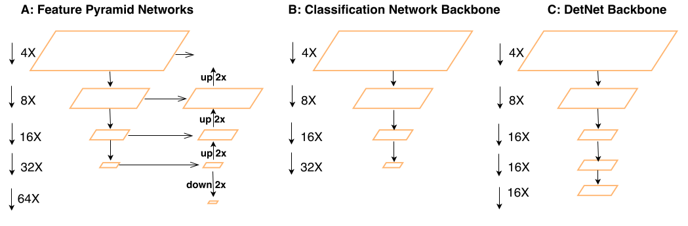
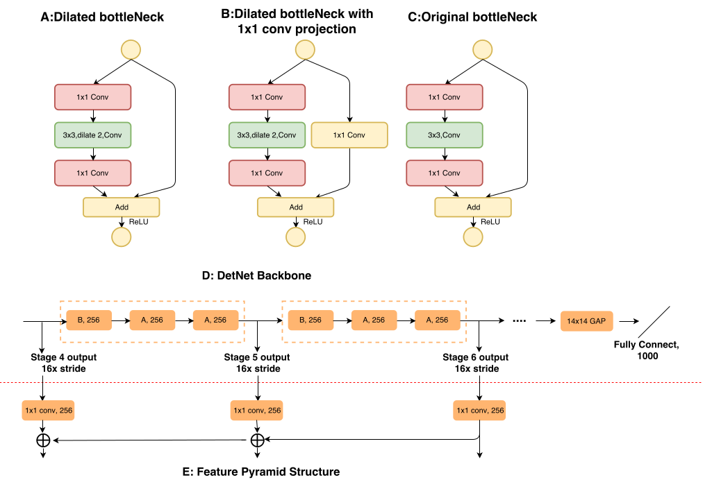

> [DetNet: A Backbone network for Object Detection](https://arxiv.org/pdf/1804.06215.pdf)

# DetNet: A Backbone network for Object Detection

## 主要创新点

- 分析了直接在ImageNet上预训练网络上进行fine-tune存在的问题（个人觉得对这部分分析的比较让人相信的是SNIP这篇文章）
- 提出了新的"骨架网络"DetNet：在保留更高分辨率（和Faster-RCNN等方法比）的同时保证感受野不减小（主要采用dilated的方式）

## 主要结构

### 保留更大的分辨率

上述图中：DetNet也是有FPN的结构的，这点别被图片误导

### 保证感受野不减小

1. 采用了Dilated的方式来增大感受野
2. B结构相对A结构分支(residual部分)部分采用卷积的形式：主要目的是为了保证不同的stage之间存在"明显"的差异（作者通过实验也解释了一下）
3. 可以发现channel数目相对少了，这是因为保证分辨率会带来更多的参数，所有选择采用较小的channel.
4. 前面stage1~stage3的结构形式和Faster RCNN里面的基本都是一样的。