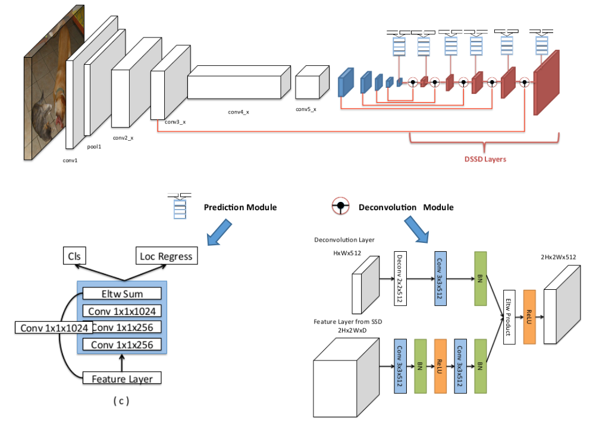
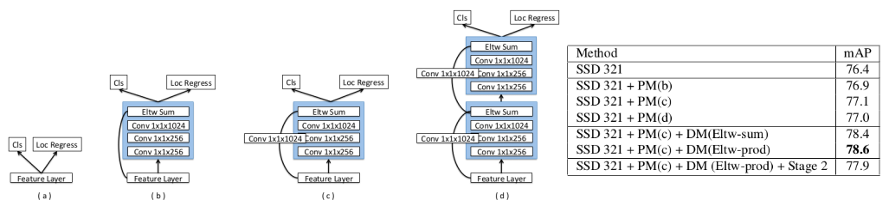
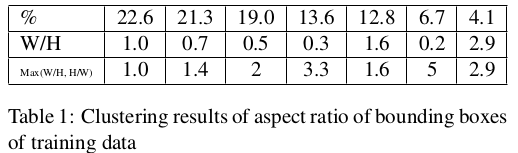

> 论文链接：[DSSD : Deconvolutional Single Shot Detector](https://arxiv.org/pdf/1701.06659.pdf)
>
> 下述内容主要来自：[DSSD1](https://zhuanlan.zhihu.com/p/33036037)，[DSSD2](http://jacobkong.github.io/posts/2938514597/)

#DSSD : Deconvolutional Single Shot Detector

## 主要改进（相比SSD）

1) 提出基于top down的网络结构，用反卷积代替传统的双线性插值上采样。（这部分个人觉得影响一般不会太大）

2) 在分类回归网络中引入残差单元，优化候选框回归和分类任务输入的特征图。

3) 采用两阶段训练方法。

其实总结起来：就是利用了top-down的结构来增强对小物体的识别能力

### 主要解决的问题

卷积神经网络在结构上存在固有的问题：高层网络感受野比较大，语义信息表征能力强，但是分辨率低，几何细节信息表征能力弱。低层网络感受野比较小，几何细节信息表征能力强，虽然分辨率高，但语义信息表征能力弱。SSD采用多尺度的特征图来预测物体，使用具有较大感受野的高层特征信息预测大物体，具有较小感受野的低层特征信息预测小物体。这样就带来一个问题：使用的低层网络的特征信息预测小物体时，由于缺乏高层语义特征，导致SSD对于小物体的检测效果较差。而解决这个问题的思路就是对高层语意信息和低层细节信息进行融合。作者采用Top Down的网络结构进行高低层特征的融合并且改进了传统上采样的结构。

## 整体结构

说明：

1. 关于Prediction Module作者对比了几种不同的结构：其思想主要来自于MS-CNN指出对每个子网络进行"增强"能够提示性能
2. Deconvolution Module中上面部分进行Deconv+Conv+BN中BN存在的原因：主要由于不同层的feature scale可能会不同，因此高低层特征融合时对低层特征进行BN操作（主要思想来自于ParseNet），以及采用的是elem-product而不是elem-sum！

### 关于Prediction Module的对比实验结果

通过说明c结构最佳，好像也没什么好解释的

### default box的优化

作者在论文中做了详细的分析和改进。为了得到PASCAL VOC 2007和2012 trainval图片里各个物体对应的真实位置框的长宽比例，作者用K-means对这些真是框内区域面积的平方根作为特征做了一个聚类分析。可以发现大部分的类别落在长宽比在1-3之间。因此，作者在DSSD中采用1.6,2.0,3.0三种比例

### 训练分阶段进行

DSSD作者在caffe的框架中将SSD的基础网络改成resnet101然后重新训练了一个新的SSD模型，以VOC的数据集为例，训练集使用的数据是VOC2007和VOC2012的trainval数据集，测试用的是07的测试集，训练时一共迭代了70k次，使用学习率为1e-3在前40k次iterations，然后调整学习率为1e-4、1e-5再分别训练20k次、10k次iterations。然后用用训练好的SSD模型来初始化DSSD网络。训练DSSD的过程分为两个阶段，第一个阶段，加载SSD模型初始化DSSD网络，并冻结SSD网络的参数，然后只增加反卷积模型(不添加预测模型)，在这样的条件下只训练反卷积模型，设置学习率为1e-3、1e-4分别迭代20k次和10k次；第二个阶段，fine-tune第一阶段的模型，解冻第一阶段训练时候冻结的所有参数，并添加预测模型，设置学习率为1e-3、1e-4再分别训练20k次、20k次iterations。