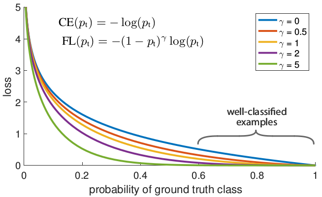
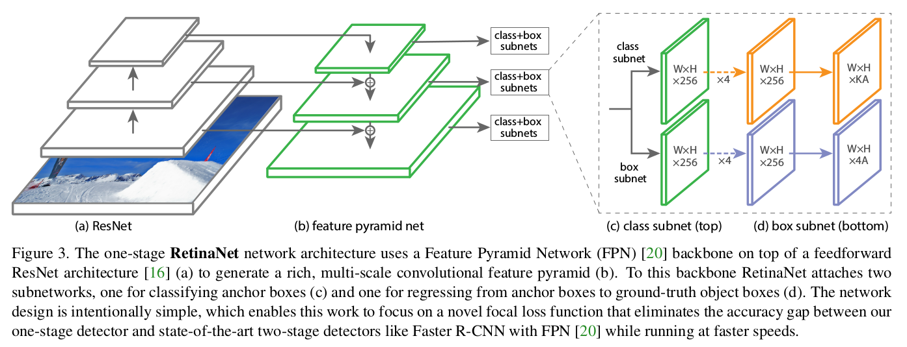
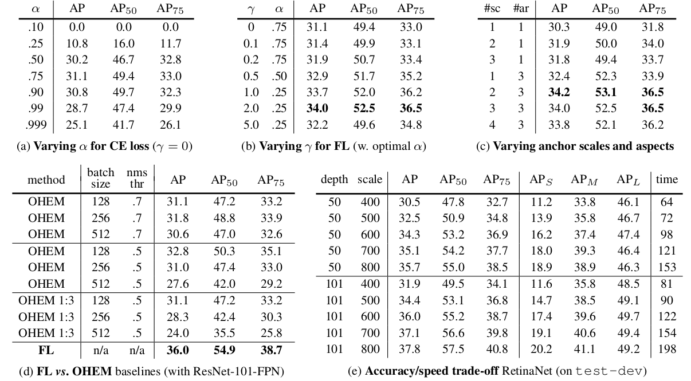

> 论文地址：[Focal Loss for Dense Object Detection](https://arxiv.org/pdf/1708.02002.pdf)
>
> 下述内容主要来自：[Focal loss1](https://xmfbit.github.io/2017/08/14/focal-loss-paper/), [Focal loss2](https://www.zhihu.com/question/63581984)

# Focal Loss For Dense Object Detection

Single stage detector不好的原因完全在于：

1. **极度不平衡的正负样本比例:** anchor近似于sliding window的方式会使正负样本接近1000：1，而且绝大部分负样本都是easy example，这就导致下面一个问题：
2. **gradient被easy example dominant的问题：**往往这些easy example虽然loss很低，但由于数量众多，对于loss依旧有很大贡献，从而导致收敛到不够好的一个结果。

所以作者的解决方案也很直接：直接按照loss decay掉那些easy example的权重，这样使训练更加bias到更有意义的样本中去。(即对那些"分的很正确"的样本更小的损失)

## 为什么要有Focal Loss？

目前主流的检测算法可以分为两类：one-state和two-stage。前者以YOLO和SSD为代表，后者以RCNN系列为代表。后者的特点是分类器是在一个稀疏的候选目标中进行分类（背景和对应类别），而这是通过前面的proposal过程实现的。例如Seletive Search或者RPN。相对于后者，这种方法是在一个稀疏集合内做分类。与之相反，前者是输出一个稠密的proposal，然后丢进分类器中，直接进行类别分类。后者使用的方法结构一般较为简单，速度较快，但是目前存在的问题是精度不高，普遍不如前者的方法。

论文作者指出，之所以做稠密分类的后者精度不够高，核心问题（central issus）是稠密proposal中前景和背景的极度不平衡。以我更熟悉的YOLO举例子，比如在PASCAL VOC数据集中，每张图片上标注的目标可能也就几个。但是YOLO V2最后一层的输出是13×13×513×13×5，也就是845845个候选目标！大量（简单易区分）的负样本在loss中占据了很大比重，使得有用的loss不能回传回来。

基于此，作者将经典的交叉熵损失做了变形（见下），给那些易于被分类的简单例子小的权重，给不易区分的难例更大的权重。同时，作者提出了一个新的one-stage的检测器RetinaNet，达到了速度和精度很好地trade-off。
$$
\text{FL}(p_t) = -(1-p_t)^\gamma \log(p_t)
$$

## Focal Loss

Focal Loss从交叉熵损失而来。二分类的交叉熵损失如下：
$$
\text{CE}(p, y) = \begin{cases}-\log(p) \quad &\text{if}\quad y = 1\\ -\log(1-p) &\text{otherwise}\end{cases}
$$
对应的，多分类的交叉熵损失是这样的：
$$
\text{CE}(p, y) = -\log(p_y)
$$
如下图所示，蓝色线为交叉熵损失函数随着$p_t$变化的曲线($p_t$是标注类别所对应的概率)。可以看到，当概率大于$.5$，即认为是易分类的简单样本时，值仍然较大。这样，很多简单样本累加起来，就很可能盖住那些稀少的不易正确分类的类别。

（说明：为了方便理解，你可以直接将ground truth视为1，而此时的loss就是损失---可以发现$p_t$离1越远，损失越大，但可以发现当离ground truth比较近时，蓝色线loss还是一个"不可忽略"的值：尤其是当ground truth为背景时，此时有大量的目标框框落在离"ground truth"比较近的地方，此时就会使得这部分"明明"已经相当确定的框框对损失函数产生巨大的影响）

为了改善类别样本分布不均衡的问题，已经有人提出了使用加上权重的交叉熵损失，如下（即用参数$α_t$来平衡，这组参数可以是超参数，也可以由类别的比例倒数决定）。作者将其作为比较的baseline。
$$
\text{CE}(p) = -\alpha_t\log(p_t)
$$
（比如正样本数量90，负样本10，此时我们就可以使得正样本对应的$\alpha_t=0.1$，负样本前面的为$0.9$）

作者提出的则是一个自适应调节的权重，即Focal Loss，定义如下。由上图可以看到$γ$取不同值的时候的函数值变化。作者发现，$γ=2$时能够获得最佳的效果提升。
$$
\text{FL}(p_t) = -(1-p_t)^\gamma\log(p_t)
$$
在实际实验中，作者使用的是加权之后的Focal Loss，作者发现这样能够带来些微的性能提升。即下面的表达式
$$
\text{FL}(p_t) = -\alpha_t(1-p_t)^\gamma\log(p_t)
$$

## RetinaNet网络结构

其实非常类似Faster RCNN去掉RPN后加上FPN结构（具体的一些细节可参考：[RetinaNet](https://github.com/kuangliu/pytorch-retinanet)）

## 其他

### 参数选择&方法比较

(a)：$\text{CE}(p) = -\alpha_t\log(p_t)$：前面的$\alpha_t$参数不同值的影响 --- 可以发现$\alpha=0.75$效果比较好，其实也蛮正常的，因为正样本比负样本少，因此相对而言，使得正样本损失系数比负样本大会使得效果更好

(b)：$\text{FL}(p_t) = -\alpha_t(1-p_t)^\gamma\log(p_t)$：可以发现$\gamma=2$时性能最好，此外$\alpha$会有影响，但是影响不是很大

(c)：anchor的scale和aspect数目选择

(d)：Focal Loss与OHEM的比较（与下述三种情况比较）：Focal loss各种吊打这三种方式，coco上AP的提升都在3个点左右，非常显著。值得注意的是，3的结果比2要更差，其实这也表明，其实正负样本不平衡不是最核心的因素，而是由这个因素导出的easy example dominant的问题。

1. 按照class比例加权重：最常用处理类别不平衡问题的方式
2. OHEM：只保留loss最高的那些样本，完全忽略掉简单样本
3. OHEM+按class比例sample：在前者基础上，再保证正负样本的比例（1：3）

(e)：不同网络结构情况下，速度和精度的"权衡"

### 初始化策略

对于一般的分类网络，初始化之后，往往其输出的预测结果是均等的（随机猜测）。然而作者认为，这种初始化方式在类别极度不均衡的时候是有害的。作者提出，应该初始化模型参数，使得初始化之后，模型输出稀有类别的概率变小（如$0.01$）。作者发现这种初始化方法对于交叉熵损失和Focal Loss的性能提升都有帮助。

在后续的模型介绍部分，作者较为详细地说明了模型初始化方法。首先，从imagenet预训练得到的base net不做调整，新加入的卷积层权重均初始化为$σ=0.01$的高斯分布，偏置项为0。对于分类网络的最后一个卷积层，将偏置项置为$b=−log((1−π)/π)$。这里的$π$参数是一个超参数，其意义是在训练的初始阶段，每个anchor被分类为前景的概率。在实验中，作者实际使用的大小是$0.01$。

这样进行模型初始化造成的结果就是，在初始阶段，不会产生大量的False Positive，使得训练更加稳定。

（主要在于初始化的时候，使得背景更容易被区分出来先 --- 这样可以大量减少False Positive）