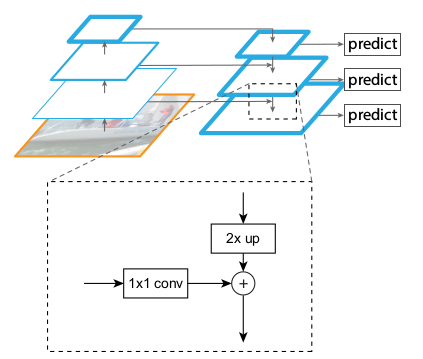
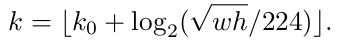

> [Feature Pyramid Networks for Object Detection](https://arxiv.org/pdf/1612.03144.pdf)
>
> 主要内容来自于：[FPN笔记](https://zhuanlan.zhihu.com/p/26743074)

# Feature Pyramid Network for Object Detection

## 核心思想

SSD、MSCNN等结构利用不同层的特征图进行不同尺寸的目标预测，又快又好，基于proposal的方法就坐不住了，所以这篇文章首先也采用了这种思路：在不同深度的特征层上预测不同尺寸的目标。

但是SSD为了预测小目标，就得把比较低的层拿出来预测，这样的话就很难保证有很强的语义特征，所以作者就想着，为什么不把高层的特征再传下来，补充低层的语义，这样就可以获得高分辨率、强语义的特征，有利于小目标的检测。

## 整体结构

FPN的top-down（右边）结构把每一层的channels都改成了256d（采用1x1的卷积来实现），然后每一层经过一个3x3的卷积消除上采样带来的混叠效应。

虚线框可以理解成特征融合的操作，1x1的卷积我认为有三个作用：使bottom-up对应层降维至256；缓冲作用，防止梯度直接影响bottom-up主干网络，更稳定；组合特征。上采样2x up作者采用的是nearest neighbor。加号是elementwise sum（DSSD中实验结果是elementwise product会好一点点）。

（说明：很多时候是采用elementwise sum之后再进行3x3的卷积）

### FPN结合Faster RCNN

① RPN与FPN结合（因为这一部分也涉及到"bbox"的回归系数和前景背景的分类）

在上图右侧的predict处加上RPN的head，即加上一个3x3的卷积和两个1x1的卷积预测类别和位置信息。然后在每一层分配不同scale的anchor boxes{32，64，128，256，512}，宽高比是{1:2，1:1，2:1}，也就是说负责预测的每一层的每一个位置都放置了15个anchors。（注意此处的anchor boxes是针对原图大小而言）

（需要注意的是：每一层的heads都是**共享参数**的---即卷积的参数）

② classification net与FPN结合

同样的，也是每一层都加上predictor head，即分类器和bb回归器。结构是：RoI pooling提取7x7的特征，然后经过两个1024-d fc层，然后是最终的分类和回归。

这里比较重要的一点是怎么把RoI分配给每一层，一般的想法是直接按照尺寸来分配，但是作者采用了下面的公式：（这部分看具体问题来设定）

（即$k_0=4$---因为Faster RCNN中采用ResNet的$C_4$，当ROI的面积小于$224^2$时，则放到"前面"层）

## 一些有趣的结论

1. 如果没有top-down的语义增强分支（仍然从不同的层输出），那么RPN的AR（average recall）会下降6%左右；
2. 如果不进行特征的融合（也就是说去掉所有的1x1侧连接），虽然理论上分辨率没变，语义也增强了，但是AR下降了10%左右！作者认为这些特征上下采样太多次了，导致它们不适于定位。**Bottom-up的特征包含了更精确的位置信息。**
3. 如果不利用多个层进行输出呢？作者尝试只在top-down的最后一层（分辨率最高、语义最强）设置anchors，仍然比FPN低了5%。需要注意的是这时的**anchors多了很多，但是并没有提高AR。**
4. 在RPN和classification net中，FPN中每一层的heads 参数都是共享的，作者认为共享参数的效果也不错就说明FPN中所有层的语义都相似---即feature map类似：这样就表面top的语义有传递给bottom的层。