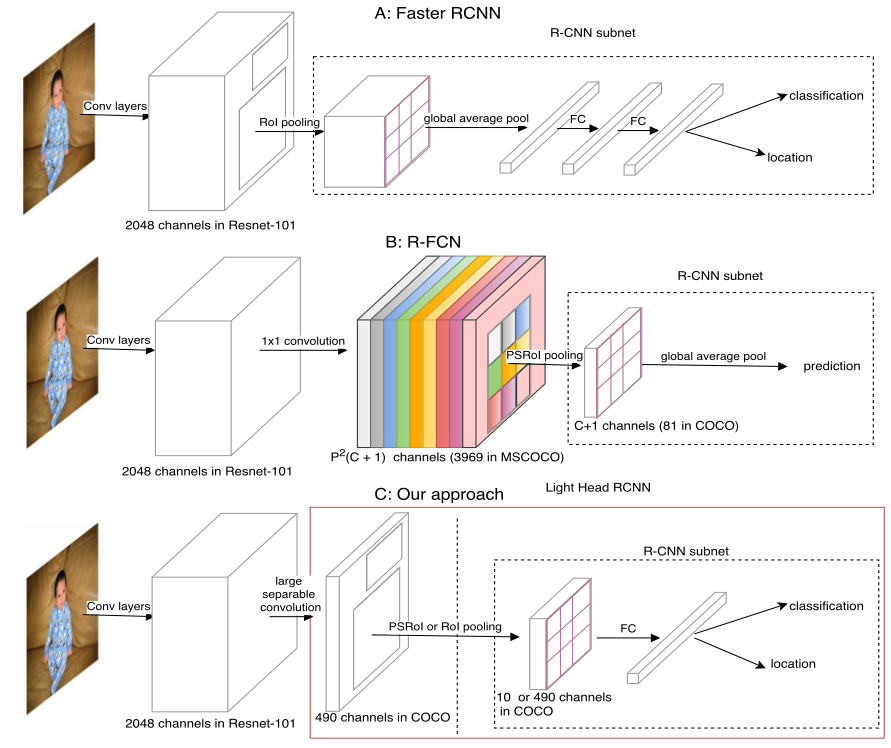
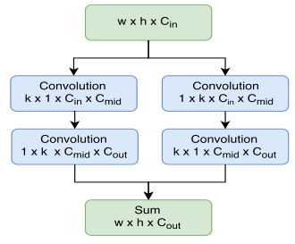

> [Light-Head R-CNN: In Defense of Two-Stage Object Detector](https://arxiv.org/pdf/1711.07264.pdf)
>
> 下述内容参考：[Light-Head CSDN](https://blog.csdn.net/u013010889/article/details/78647389)
>
> （这篇文章其实就是Faster RCNN和R-FCN的一个结合产物---真正的内容其实看那张图就够了：感觉这篇文章的解释性并没有R-FCN好，但效果好谁关心解释呢:joy:）

#Light-Head R-CNN: In Defense of Two-Stage Object Detector

## 动机

region-free的方法如YOLO，SSD，速度是很快，但是总体来说精度上还是不如两段的region-based系列的Faster rcnn(及加速版R-FCN)，那我们想要精度最高速度最快，就有两个做法了，提升region-free系列的精度，另一个就是提升region-based系列的速度了，本文就是后者。

在R-FCN文章中分析了由于Faster RCNN第二阶段每个proposal是不共享计算的，fc大量的参数和计算严重拖了速度(其实faster rcnn+res101已经做了努力，在res5c有个global pool到2014x1x1，不然第二阶段第一个fc参数更多。kaiming论文是C5作为fc6 fc7的，C5后面也依然有global pool，最后分类肯定要有一个全连接的，global pool之后参数也少很多(2048x1x1xC，不然就是2048x7x7xC))。而R-FCN就在着力于解决这个第二阶段的问题，通过生成一个$k^2*(C+1)$ channel的score map和PSRoIpooling可以去掉第二阶段的隐层fc，加速了很多。

但是R-FCN生成的score map是和C相关的，在MSCOCO上有81类需要生成7x7x81=3969个channel的score map，这个是耗时耗内存的。所以本文想生成一个thin 的feature map，这样可以显著加速还可以腾出"时间"在后面的rcnn部分做点文章提升精度。（其实就是"混血"---通过"少量"的全连接来弥补丢失channel带来的信息丢失）

## 整体框架

在Resnet101 res5c后利用大的可分离卷积，生成(α x p x p)个channel的feature map，α本文取10，p和其他框架一致取7，这个最终只有10x7x7=490，而且与类别数C无关，大大减少了计算量，第二阶段的rcnn 子网络，本文为了提升精度，相比R-FCN多了一个隐层fc（其实此时这个$\alpha$代表偶的channel和R-FCN是有区别的，所有也是为了区分），这是thin feature map为它省来的计算空间，所以速度依然很快。

### thin feature maps

这部分采用"分离"的形式用少量的参数实现大的kernel

