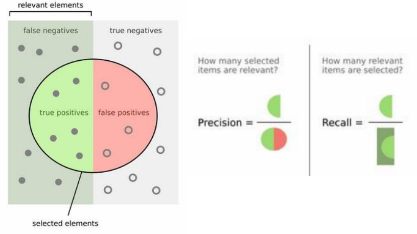
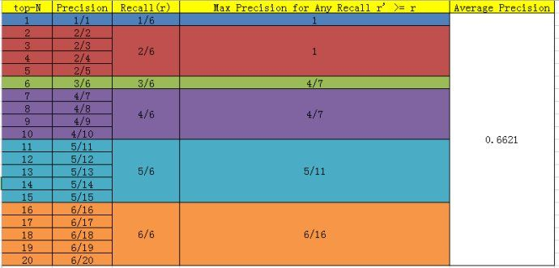
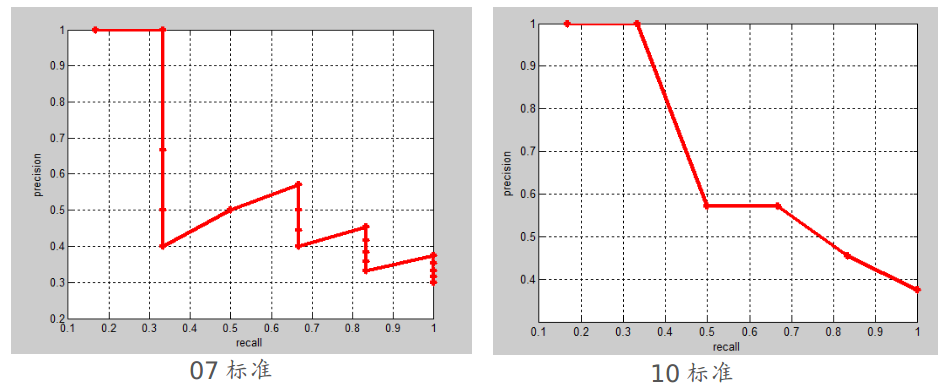
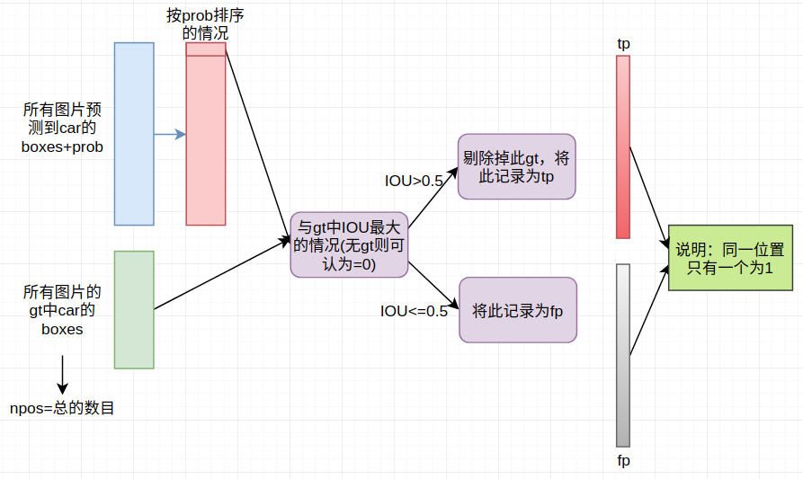
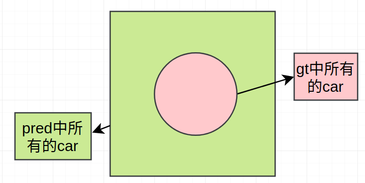

# mAP计算（object detection）

## 1. 基本概念

#### precision & recall



精度：precision=TP/(总的个数---TP+FP+TN+FN)

召回率：recall=TP/(真正正样本的数目---FN+TP)

#### AP（average precision）

假设检测样本中每N个样本中有M个正例，那么我们会得到M个recall值（1/M, 2/M, ..., M/M）（由于检测N'数量正样本时，precision有不同情况）,对于每个recall值r，我们可以计算出对应（`r' >= r`）的最大precision，然后对这些max precision取平均即得到最后的AP值。具体计算如图，top-N是指根据confidence降级排列后样本的排位号（eg. 1为confidence最大的图像9）：



（这里再额外说明一下：在`07_metric`中采用的策略有所不同---首先设定一组阈值，`[0, 0.1, 0.2, ..., 1]`。然后对于recall大于每一个阈值（比如`recall>0.3`），我们都会得到一个对应的最大precision。这样，我们就计算出了11个precision。AP即为这11个precision的平均值。这种方法英文叫做11-point interpolated average precision）

两种指标对应的图如下所示：（实际AP计算的也就是下面的面积的一种近似）



> 这部分有篇blog写的非常好（也介绍了目标检测中的计算方式. **推荐**）：[多目标检测中的AP](http://blog.sina.com.cn/s/blog_9db078090102whzw.html)

## 2. 目标检测中的情况

下述以单个类别为例（每种类别的计算方式是完全一样的）：



说明：

1. 所有预测到的car采用的策略是“放行”所有预测到的boxes（即score_threshold置为0.0：但很多文章实现时置为一个很小的值，对结果不影响。nms操作可以保留着）

2. 对于difficult的情况，IOU>0.5并不将此gt给去掉

3. tp和fp长度均和预测的car数目相等（每个位置为0或者1）--- 后续计算Precision和Recall均可以通过此来计算

   ```
   fp = np.cumsum(fp)
   tp = np.cumsum(tp)
   rec = tp / float(npos)
   prec = tp / np.maximum(tp + fp, np.finfo(np.float64).eps)
   ```
4. 关于AP的计算和基本概念中提到的完全一样

其中与概念中图相对应的图如下所示：

