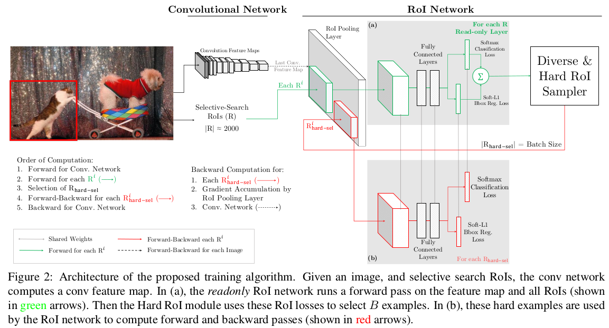

> 论文地址：[Training Region-based Object Detectors with Online Hard Example Mining](https://arxiv.org/pdf/1604.03540.pdf)

# Training Region-based Object Detectors with Online Hard Example Mining

## 主要思想

根据每个ROI对应的损失，选择损失较大的作为选择的ROI进行训练（每次专挑"难的"目标来"针对性"解决）。将bootstrapping的思想放到Fast RCNN等检测网络训练中来：主要分析了为什么不能直接将bootstrapping放到Fast RCNN中。

## 主要内容

### why not bootstrapping

关于bootstrapping内容可以参考[wiki](https://en.wikipedia.org/wiki/Bootstrapping_(statistics))：简单的理解就是，先从部分样本得到一个对这些样本效果不错的模型，再从全部样本中选择那些当前模型性能差的再来训练模型，不断交替迭代进行。

从描述可见：bootstrapping往往需要交替迭代，但是在CNN等模型中你用部分模型训练一个模型，再拿全部数据去寻找差的结果，再训练。这太费时费力了。

### OHEM

在目标检测问题中：训练时一般会有成千上万个ROIs，此时将全部ROIs都扔到损失里面显然不合适。常规的做法是选择1:3比例的前景和背景的ROIs放到最终的损失函数进行反向传播（这部分可以看RCNN系列）。但以前的做法是随机选择背景，而OHEM的思想就是在全部的框框中选择损失最大的B个作为损失函数进行反向传播。（其实简单的理解就是专挑"硬骨头"啃）

### 实现上的策略

采用"2个"相同的ROI网络部分：其中绿色部分只有前向传播，并不记忆反向传播的参数---主要是为了计算每个ROI的损失值，而红色部分的网络则包含前向和反向部分，主要用来将损失反向传播回去。（因为如果放在同一个结构里面，每次都会保存前向和反向的参数---因为计算反向传播时，参数是和前面的输入有关的。而如果不需要反向传播，就根本无需"保存"输入） 

说明：估计在Faster RCNN中并不需要这样的结构，因为一般从RPN出来的ROI数目往往已经比较少了。