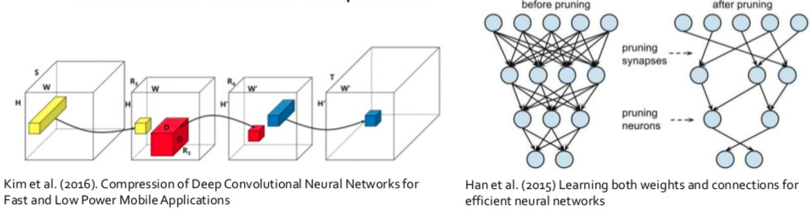
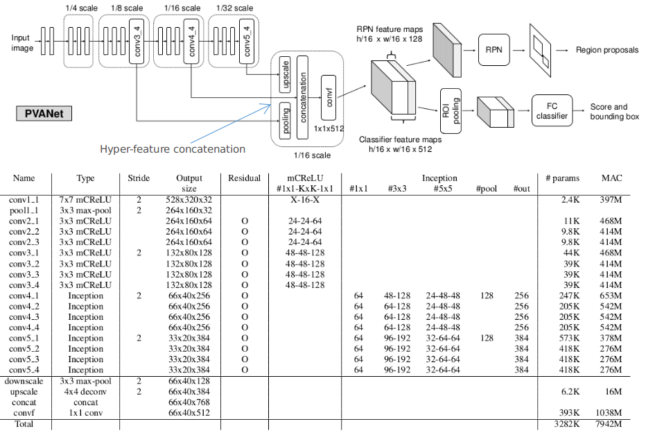
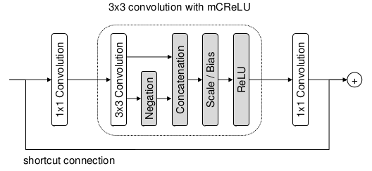
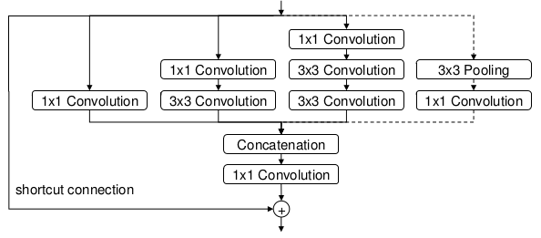
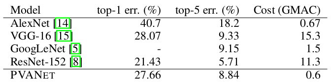
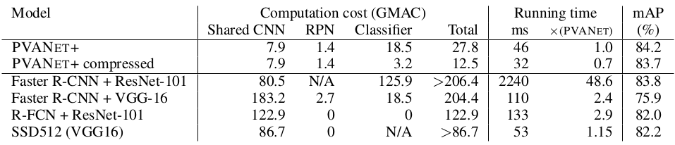

> 论文地址：[PVANet: Lightweight Deep Neural Networks for Real-time Object Detection](https://arxiv.org/pdf/1611.08588.pdf)
>
> 主要内容参考自：[PVANet解析](https://zhuanlan.zhihu.com/p/30173314)

#PVANet: Lightweight Deep Neural Networks for Real-time Object Detection

在目标检测中，降低计算量和提高实际应用的精确度同等重要。本文提出了一种新的网络结构，保持精度的同时降低计算量。创新包括使用C.ReLU,使用Inception structure和Hypernet多尺度思想。在VOC2012和VOC2007数据集分别获得84.9%和84.2%mAP的精度，且计算量低于 resnet-101 10%。

**这篇文章的"动机"主要在于：目前RCNN系列的目标检测方法精度虽然很高了，但是在速度上面还是不够快，计算量太大。此外，正是因为网络压缩等技术的发展，可以发现现在主流的网络其实有很多是"冗余"的。所有作者主要采用改进的CRELU+Inception重新设计更简洁的主干网络**

关于"网络压缩"的文章，可以看看下面两篇

整篇文章主要遵循下述几个思想：

- Deep but Narrow
- Modified concatenated ReLU
- Inception (加了residual连接)
- Hyper-feature concatenation

## 网络结构

整体结构如下所示：

几点说明：

1. 上述RPN只采用最后feature map的最后128个通道（作者表示从实验来看，这个数量的就够了）
2. mCReLU这列中的KxK（这一列的内容代表channel数量）和前面的Type这列的7x7或者3x3对应
3. MAC：the number of multiplications and accumulations
4. 假设输入图片大小为1056x640

这里和Faster RCNN主要的不同在于：

- 主干网络上面的不同，采用参数更少，计算量更少的结构
- RPN采用的feature map数量有些不同

### C.ReLU

C.ReLU的设计思路来源于对CNN中的activation patterns的观察：在前面的feature层，特征是成对出现的，比如"下三角"和"上三角"（output nodes tend to be "paired" such that one node's activation is the opposite side of another's.），所有可以对输出的feature直接乘以负数，就可以减少一半的通道数。

与原始的C.ReLU相比，论文在concatenation之后增加scaling and Bias（缩放和偏移---就是每个通道上面$ax+b$的操作），这允许每个channel filter的斜率和激活阈值与其相反的channel filter不同。

（注：这图是结合了卷积的mCReLU）

### Inception structure

Inception structure很容易理解，**GoogLeNet** 的V1~V4大名鼎鼎。作者认为使用Inception structure可以同时捕获大目标和小目标。为了捕获图像中的大目标，需要足够大的感受野，这个可以通过堆叠3x3的滤波器来达到。但是为了捕获小目标，则需要小一点的感受野，1x1的卷积核正好合适。可以避免大卷积核造成的参数冗余问题。(这篇论文在Inception结构上面加了个residual操作)

（其中的shortcut connection是指当输入输出需要下采样的时候(`stride=2`)时，需要shorcut---一般采用下采样操作即可）

### 其他几点需要了解的地方

- PVANet的RPN部分采用了42个anchor：6种尺寸，7种比例
- ROI pooling采用6x6
- 权重衰减策略采用plateau detection（这部分其实就是很多库都有的`ReduceLROnPlateau`: 指标长久没有变动，就降低学习率）
- 性能对比

1. PVANet的有效性（分类性能不差的前提下，运算量大量减少）
   
2. Object Detection性能（可以明显发现主干网络的运算量大大减少！）
   
   （注：此处的compressed是指对全连接层进行的---个人猜测类似PCA等方式来减少参数）

