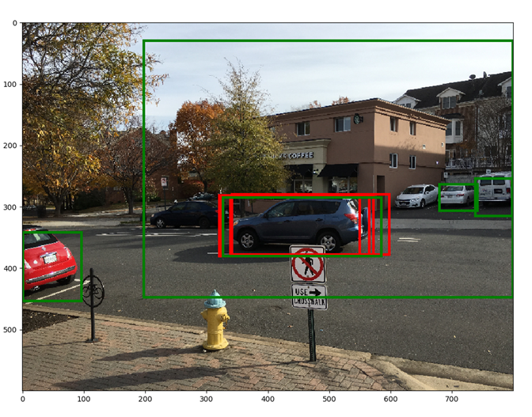

# RCNN系列

> 这部分其实写过的人很多，本身之前有“抄袭”自：[RCNN系列-CSDN](https://blog.csdn.net/shenxiaolu1984/article/details/51066975)（但由于笔记本上面图片丢失，忘了上传）～ 然后又看到一篇写的很详细的英文版：[Object Detection and Classification using R-CNNs](http://www.telesens.co/2018/03/11/object-detection-and-classification-using-r-cnns/)，索性翻译一下好了。（强烈推荐看原blog，个人翻译水平烂到不行 :smile:）

# 文章结构

- Part I  图像预处理：主要介绍对图片进行的预处理，记得要保证训练和测试阶段一致（减均值+除以255）
- Part II  网络结构：主要介绍网络中的三部分 --- “head”部分，RPN (region proposal network)部分和分类网络
- Part III  训练阶段实现细节：关于训练RCNN时的一些细节
- Part IV  测试阶段实现细节：关于测试RCNN时的一些细节
- Part V  附录

# Part I. 图片预处理

图片在输入网络前，经过下述预处理：

说明：

1. 默认采用的`targetSize=600,maxSize=1000`。
2. 从图片预处理来看，输入图像长宽，各图像大小未必一致（不超过`maxSize`情况下，最短边一致）

# Part II. 网络结构

RCNN的网络主要解决两个主要问题：

- 找出输入图片中“更可能包含”前景的区域（就是寻找ROI --- Region of Interest）
- 计算ROI包含物体的概率（更确切的说包含某类物体的概率）

在RCNN中，网络结构主要有三部分组成：

1. Head
2. RPN (Region Proposal Network)
3. Classification Network

整体的结构如下图所示：

# Part III. 训练阶段实现细节 

这部分主要介绍训练RCNN时的一些“细节”，一旦你理解了训练过程，理解测试(inference)过程是水到渠成的事情。训练阶段主要对RPN和分类网络进行参数更新，以及对head部分的参数进行fine-tune（这部分参数的初始化往往是直接拿ImageNet分类网络训练好的结果）。让我们来回顾一下RPN和分类网络主要的功能：RPN网络主要是产生一系列“良好”的候选ROIs，分类网络则是“预测”每个ROI包含什么物体(此处包括背景----注：这里只是说明这两个网络的主要功能，实际实现更“复杂”一些)。因此，要训练RCNN，我们必须要有每张图片的ground truth（物体在图片中的bounding boxes坐标以及其类别）。在目标检测中常用的两个数据集为：

- PASCAL VOC：[VOC 2007](http://host.robots.ox.ac.uk/pascal/VOC/voc2007/index.html)数据集包含9963张图片(训练集+验证集+测试集)，以及针对20种类别的24640个标签（一张图可能有多个标签）。这个数据集包含的20种类别如下所示：
  - Person：person
  - Animal：bird, cat, cow, dog, horse, sheep
  - Vehicle：aeroplane, bicycle, boat, bus, car, motorbike, train
  - Indoor：bottle, chair, dining table, potted plant, sofa, tv/monitor
- COCO（Common Objects in Context）：[COCO](http://cocodataset.org/#home)数据集更大，总共包含80种类别以及超过200K张图片。

RCNN能够将RPN和分类网络同时训练。

在进一步介绍之前，让我们先来理解在后续内容中经常出现的两个概念：bounding box regression coefficients (“框框回归系数”？)和bounding box overlap (重合率)

- bounding box regression coefficients (也常称作"regression coefficients"或"regression targets")：RCNN的一个目标是产生与物体边界（框住物体的框框）尽可能接近的bounding boxes。RCNN通过在模板框框(以左上角坐标和长宽的形式表示)上进行"regression coefficients"处理来完成这一目的。这些系数是采用下述方式计算获得的 (详见[Anon. 2014](http://www.telesens.co/2018/03/11/object-detection-and-classification-using-r-cnns/#ITEM-1455-4)论文的附录C)：设ROIs左上角坐标及长宽分别为$O_x,O_y, O_w,O_h$，ground truth左上角坐标及长宽分别为$T_x,T_y,T_w,T_h$，则“回归系数”（将ROIs变为ground truth）定义为下述形式：
  - $t_x=(T_x-O_x)/O_x,t_y=(T_y-O_y)/O_y,t_w=log(T_w/O_w),t_h=log(T_h/O_h)$：这些表达式均是可逆的。另一个需要指出的是，经过这些变换并没有改变boxes的形状
- intersection over uniou (IoU) overlap：我们需要定义一种衡量两个bounding box之间“相似性”的方法。这种度量方式既要简单高效又要符合直观认识 （两个框框完全重合为1，两个框框完全没有重合的地方则为0）。一种常用的度量方式为IoU重合率，它的计算方式如下图所示：

  
 

有了前面的“铺垫”，让我们正式进入对RCNN训练阶段的探索之旅。在实现层面而言，RCNN可以划分为如下图所示的不同的层

- Anchor Generation Layer：这个层产生一些列的anchors（即bounding boxes）--- 在“特征层的每个位置”产生9个anchors（3种比例3种大小的组合）
- Proposal Layer：利用"bounding box regression coefficients"的方式对上一层产生的anchors进行转换。然后利用anchor为前景的概率对转换后的anchors进行非极大值抑制操作（Non-maximum suppression --- 关于非极大值抑制详见附录）
- Anchor Target Layer：

## 1. Anchor Generation Layer

anchor generation layer产生一系列的bounding boxes（往往称作"anchor boxes"---利用3种比例和3种大小的组合），对于每一张图片而言，这些bounding boxes的大小都是相同的（不同大小的图片，左上角坐标位置会不同）。虽然绝大多数bounding boxes与前景(可以理解为ground truth)相差很远，但其中一些bounding boxes与前景非常接近。RPN网络的功能就是分辨这些boxes中哪些是"好的"boxes --- 找出可能包含前景物体的boxes并且作用target regression coefficients之后，使得其与前景物体更加“靠近”。

下图说明了如何产生anchor boxes：

  
 

## 2. Region Proposal Layer

目标检测方法往往需要一个"候选框生成系统"（region proposal system）来生成一系列的proposal（如稀疏方式的代表[selective search](https://arxiv.org/abs/1311.2524)方法，或稠密方式的代表[deformable part models](https://arxiv.org/pdf/1506.02025.pdf)）。在第一代的R-CNN中，采用selective-search方式来产生一系列proposal，而在这一代版本中(即Faster-RCNN)中，一种基于"滑动窗"的技术（即1. anchor generation layer中所描述的）来产生一系列稠密的proposals，之后再运用RPN网络根据proposal包含前景物体的概率来对这些proposals进行排名。总体而言，region proposal layer主要做下述两件事：

- 辨别一系列anchors是属于前景还是背景
- 通过"regression coefficients"对anchors的位置及长宽进行修正，从而进一步提高anchors的"质量"（如使得它们与边界与ground truth更加接近）

region proposal layer由RPN网络以及Proposal Layer, Anchor Target和Proposal Target Layer这三个层构成。关于这三个层将在后续更加详细的介绍。

### Region Proposal Network

  
 

RPN网络是在head network的feature map的输出上面接上卷积（图中称为rpn_net的部分）和relu层。之后，rpn_net的输出在两个分支分别接上`1x1`的卷积层来分别产生前景/背景概率和对应的bounding box"回归系数"。（数目上面满足：`anchor boxes的数目=class score的数目=bounding box回归系数=w/16*h/16*9`）

### Proposal Layer

Proposal layer对RPN网络产生的proposals中的前景利用非极大值抑制来"修剪"出合适数目的anchor boexs。具体流程如下图所示：

  
 

### Anchor Target Layer

anchor target layer的目的是能够选择"合适的"anchors来训练RPN网络：

1. 区分前景和背景
2. 针对前景boxes合适的"回归系数"

首先让我们来看下RPN网络的损失函数是如何的。通过损失函数我们将可以轻易发现Anchor Target Layer该怎么做才能符合要求。

#### Calculating RPN Loss

你应该还记得RPN层的作用是为了产生一系列"好的"bounding boxes。因此，它必须能够学会区分anchor box是属于前景或者背景，以及产生好的"回归系数"从而进一步改善前景anchor box的位置。RPN损失正是设计成鼓励网络尽可能往这方面靠。

RPN损失正是由类别损失和bounding box回归损失两部分组成。类别损失利用交叉熵（cross-entropy）来对错误分类的boxes进行惩罚，RPN回归损失则是基于网络返回的"回归系数"和真实的"回归系数"（通过与前景anchor box最近的ground truth计算获得）之间的距离。
$$
RPN\ Loss=Classification\ Loss+Bounding\ Box\ Regression\ Loss
$$
**Classification Loss**：$cross\_entropy(predicted\_class, actual\_class)$

**Bounding Box Regression Loss**：$L_{loc}=\sum_{u\in all\ foreground\ anchors}l_u$

没有必要对背景的anchors进行回归损失计算，因为它们没有对应的ground truth，关于$l_u$的定义如下所示：
$$
l_u=\sum_{i\in x,y,w,h}smooth_{L1}(u_i(predicted)-u_i(target))
$$
上式说明了单个前景anchor的回归损失计算方式（我们通过预测值(RPN获得的"回归系数")和目标"回归系数"(anchor对应的最近的ground truth)之间的差距来计算）。其中的平滑L1损失的定义如下：
$$
smooth_{L1}(x)=\begin{cases}\sigma^2x^2\quad\quad\quad\quad \|x\|<1/\sigma^2 \\ \|x\|-0.5/\sigma^2\ otherwise\end{cases}
$$
其中的$\sigma$可以自己设定(有些实现中取3)。友情提示：在python实现中利用一个mask array来确定出前景anchors，而不是采用for-if的操作

因此，为了计算损失函数，我们需要获得下面的度量标准：

1. 每个anchor boxes的类别标签（前景还是背景），以及相应的类别概率
2. 每个前景anchor boxes对应的目标"回归系数"（即对应ground truth的"回归系数"）

让我们回到anchor target layer上面来，来看看这些度量标准是如何被计算出来的。首先，我们选择那些落在图片范围内的anchor boxes（可以理解为对越界anchor boxes进行裁剪）；然后，计算每个anchor boxes与所有ground truth 的IoU（总共有`anchor boxes数目xground truth数目`），利用IoU信息，将下述两类boxes标记为前景：

1. 类型A：对于每个ground truth，与之具有最大IoU的anchor boxes
2. 类型B：那些与ground truths的最大IoU超过某个给定阈值的anchor boxes

这些满足boxes如下图所示：

  
 

只有那些与ground truth box的IoU超过某个阈值的anchor boxes才会被选做前景，这是为了避免RPN进行一些"绝望的工作"（学习"回归系数"将离ground truth非常远的anchor box强行转换过来）。相同的，我们将anchor box的IoU小于某个阈值的框框置为背景。友情提示：并不是所有的boxes非背景即前景，有些boxes我们压根不关心好嘛，这些boxes在RPN的损失函数中根本没有出现。

还有两个额外的参数：前景+背景的总数目和前景的比例。如果前景的数目超过比例，则随机将超过部分前景置为don't care。背景也是采用相同的策略。

接下来，我们只要计算前景框框和与之"最吻合"的ground truth之间的bounding box回归系数就好。这个没什么好说的，照着公式就好啦～

让我们通过anchor target layer的参数设定，输入/输出来对这一部分进行回顾：

**参数设定**：

- `TRAIN.RPN_POSITIVE_OVERLAP`：将anchor box选为前景的阈值（默认：0.7）--- 针对与所有ground truth最大的IoU
- `TRAIN.RPN_NEGATIVE_OVERLAP`：将anchor box选为背景的阈值（默认：0.3）--- 针对与所有ground truth最大的IoU
  （提示：那些落在0.3-0.7之间的区域don't cate，无视掉就好）
- `TRAIN.RPN_BATCHSIZE`：前景与背景boxes的总数目（默认：256）
- `TRAIN.RPN_FG_FRACTION`：前景的比例（默认：0.5）。如果找到前景的数目大于`TRAIN.RPN_FG_FRACTION * TRAIN.RPN_BATCHSIZE`，则随机选择超出数目的前景置为don't care

**输入**：

- RPN网络的输出（预测的前景/背景类别概率，回归系数）
- Anchor boxes（通过anchor generation layer产生的anchors）
- Ground truth boxes

**输出**：

- "好的"前景/背景boxes和其对应的类别概率
- "回归系数"

讨论完了anchor target layer，下面让我们继续探索proposal target layer，ROI Pooling layer和classification Layer，这些层主要是为类别层损失服务（此处的类别损失和anchor target layer中的类别可不同哦）。类似我们在探索anchor target layer中采用的策略，让我们先来看下类别层损失是如何定义的，以及我们需要哪些信息才能计算。

### Calculating Classification Layer Loss

类似RPN中采用的损失，类别层损失也由两部分构成：分类损失+bounding box回归损失
$$
Classification\ Layer\ Loss=Classification\ Loss+Bounding\ Box\ Regression\ Loss
$$
这里的损失和RPN损失主要的区别在于在RPN损失中是两种类别（前景or背景），而此处是处理所有的物体类别（包括背景）

其中的类别损失依旧利用预测类别和真实类别之间的交叉熵进行计算，计算方式如下图所示：

  
 
$$
\frac{-1}{Num\ Samples}\sum_{i\in Anchor\ Box\ Samples}log(e^{x[i][c_i]}/\sum_j e^{x[i][j]})
$$
而bounding box回归损失和RPN中的计算方式完全一样（只是此时每个anchor对应的gt是特定的类别）。

因此，针对类别层损失我们需要下面这些信息：

1. 预测的类别标签和bounding box"回归系数"（classification network的输出）
2. 每个anchor box的类别标签
3. 目标"回归系数"

下面让我们来看看如何通过proposal target和classification layer来产生这些信息

### Proposal Target Layer

proposal target layer是为了从proposal layer产生的ROIs中筛选出合适的ROIs，后续将这些合适的ROIs对应的feature map进行crop pooling处理。进而计算类别概率和"回归系数"

类似于anchor target layer，选择合适的proposal给后续的classification layer是非常重要的（一般是指那些与gt boxes具有很大IoU的proposal），否则容易使得后续的classification layer学不出来！

proposal target layer是针对proposal layer产生的ROIs进行处理。通过计算每个ROI与gt boxes之间的最大IoU，将其分为前景和背景：将那些超过阈值（`TRAIN.FG_THRESH`，默认：0.5）的ROIs置为前景，将那些阈值落在`TRAIN.BG_THRESH_LO`和`TRAIN.BG_THRESH_HI`之间的ROIs置为背景（默认为0.1和0.5）。这也算是针对背景的"hard negative mining"的一种（努力找难的背景来处理）

还有一个技巧来使得前景和背景的ROIs总数目等于某个常数：例如，如果背景特别少，则通过重复这些背景来填补，使之达到总数目。

接下来，计算每个ROI与之最匹配的gt box（包括背景ROIs）的"回归系数"。这些回归系数采用下述方式扩展到所有类别

  
 

其中的`bbox_inside_weights`数组的作用其实是mask，对于前景ROI仅有一个正确的类别为1。因此，当计算classification layer损失的bounding box regreesion部分时，只有前景的回归系数会被纳入考虑。

**输入**：

- 通过proposal layer产生的ROIs
- ground truth信息

**输出**：

- 通过IoU划分的前景和背景的ROIs
- ROIs对应的类别相关的"回归系数"

**参数**：

- `TRAIN.FG_THRESH`：（默认0.5）将IoU大于该阈值的ROIs当做前景
- `TRAIN.BG_THRESH_HI`：（默认0.5）
- `TRAIN.BG_THRESH_LO`：（默认0.1）将IoU置为两者之间的ROIs当做背景
- `TRAIN.BATCH_SIZE`：（默认128）前景和背景的总数目
- `TRAIN.FG_FRACTION`：（默认0.25）选择前景的比例，前景ROIs的数目不超过`batch_size*fg_fraction`

## 3. Crop Pooling

Proposal target layer产生一系列适合后续分类网络进行处理的ROIs（包含类别信息和"回归系数"）。下一步我们要做的就是从feature map中抽离出ROIs对应的feature map部分。而这些抽离出来的feature map则作为输入（整体结构图中的tail部分）放入到网络的剩余部分来产生每个ROIs对应的类别概率和"回归系数"。而Crop Pooling层的作用就是从feature map中提取出ROIs对应的feature map。

crop pooling的核心思想来源于[Spatial Transformation Networks](https://arxiv.org/pdf/1506.02025.pdf)这篇文章。其主要目的是通过"扭转函数"（warping function --- 采用`2x3`的仿射转换矩阵）来将输入的feature map进行"扭转"获得"扭转"后的特征层。类似下图的形式：

  
 

crop pooling包含两步：

1. 对于目标坐标(target coordinates)，通过仿射变化来产生源坐标(source coordinates)。
   $$
   \begin{bmatrix} x_i^s\\y_i^s \end{bmatrix} =\begin{bmatrix} \theta_{11}&\theta_{12}&\theta_{13}\\\theta_{21}&\theta_{22}&\theta_{23} \end{bmatrix}\cdot \begin{bmatrix} x_i^t\\y_i^t\\1 \end{bmatrix}
   $$
   其中$x_i^s,x_i^y,x_i^t,y_i^t$均是归一化之后的坐标，即满足$-1\le x_i^s,x_i^y,x_i^t,y_i^t\le 1$

2. 利用源坐标对应的input map来产生output map：在这一步，利用目标坐标与源坐标$(x_i^s,y_i^s)$的仿射关系并结合不同的采样机制来产生output map（例如一个目标坐标对应一个源坐标(包含小数形式)，采用双线性差值的方式来对源坐标的feature map进行差值来获得output feature map）

幸运的是，crop pooling可以利用PyTorch中的两个函数来实现：[torch.nn.functional.affine_grid](https://pytorch.org/docs/master/nn.html?highlight=grid_sample#affine-grid)通过仿射矩阵来获得采样坐标(即源坐标)，[torch.nn.functional.grid_sample](https://pytorch.org/docs/master/nn.html?highlight=grid_sample#grid-sample)函数则利用采样坐标和input feature map来获得对应的output feature map。而这部分函数的反向传播，PyTorch以及为我们实现好了。

为了使用crop pooling，我们需要按照下述过程去做：

1. 对ROI坐标"反映"在feature map上面：通过proposal target layer产生的ROI坐标是针对原图空间的（即800x600上面的坐标），因此要将其体现在feature map上面，则需要除以16（16仅仅是这种实现中采用的"缩小比例"）
2. 利用上面提到的PyTorch库函数的API，我们需要计算仿射变化矩阵。仿射变化矩阵采用下述方式计算。
3. 我们还需要知道target feature map上面$x,y$坐标轴上的数目，这是通过我们预先设定的参数获得的（即`POOlING_SIZE`，默认采用7）。因此，将feature map上面的非方形特征crop到方形上面来。这主要是为了保证在后续卷积和全连接时具有相同的尺寸。

  
 

（可能看到这里你有点懵逼了：其实原理非常简单 --- 将"目标坐标"通过仿射矩阵转换到"源坐标"（此处转换回来的坐标可能有小数，所以需要采用类似线性差值之类的方法），再将"源坐标"对应的特征给"目标坐标"位置即可 --- 而关于那种normalization之类的都是实现的细节罢了。）

### 4. Classification Layer

crop pooling层利用proposal target layer输出的ROI boxes和"head" 网络输出的feature map的信息，来产生"方形"的feature map（即"处理后"的ROI部分的feature map信息）。经过pool"处理"后的feature map再通过ResNet的第4层并接一个average pooling的操作，则每个ROI可以获得一个对应的1维特征向量，这部分操作如下图所示：

  
 

获得的特征向量再进一步传入两个全连接层（bbox_pred_net和cls_score_net）。其中的cls_score_net层为每个bounding box产生类别得分（如21种类别，再通过softmax可以产生类别的概率信息）。而bbox_pred_net层则为每个类别产生特定的"回归系数"，这部分可以和proposal target layer产生的坐标信息相结合来获得最终的bounding boxes，这部分的操作如下图所示：

  
 

整个结构中存在两次求"回归系数"，思考下两者有什么区别是有必要的。第一次出现在RPN网络中，第二次则是出现在classification网络中。

- 第一次是希望RPN网络能够产生更好的前景bounding boxes(与真实的物体边界更接近)。此时"回归系数"是将ROI box拉到其最接近的ground truth bounding box，这一阶段的目标"回归系数"是由anchor target layer产生的。我们很难精确地衡量这一阶段的学习是否发生且足够好（尤其是两个阶段并在一起训练），但我们可以想象RPN网络和后面的全连接层能够根据特征信息来知道如何进行调整。
- 第二次的"回归系数"是通过classification layer产生的，此时的"回归系数"是专门类别化的（可以看Proposal target layer部分）。关于目标"回归系数"（即作为ground truth的"回归系数"）则是由proposal target layer所产生的（理解为在那个阶段确定的更合理）。

训练classification layer时有一点需要说明：该层的梯度会传播会RPN网络。（=。=这好像是显而易见的吧～）

## Part IV. 测试阶段实现细节

关于测试阶段的流程图如下所示：

  
 

你可以发现在测试阶段，anchor target layer和proposal target layer并没有用到。RPN网络能够知道如何将anchor boxes划分为前景或者背景boxes，并产生好的bounding box"回归系数"。而proposal layer则对那些得分较高的anchor boxes进行"回归系数"操作，并利用NMS操作来消除那些具有很大重叠率的框框。我们可以通过下图更加清晰地认识到这一步究竟是怎么做的。然后将这一步获得的boxes传到classification layer来产生类别概率和"特定类别化"的box"回归系数"

| 
  
  |
| :----------------------------------------------------------: |
| 红色框框代表得分最高的6个anchors，绿色框框则代表经过RPN网络"回归系数"调整后的框框。我们可以发现绿色框框相较红色框框而言与物体更加紧凑。 |

| 
  
  |
| :----------------------------------------------------------: |
| 红色框框代表在NMS处理之前得分最高的5个框框，绿色框框则代表经过NMS处理之后得分最高的5个框框。我们可以通过"非极大值抑制"，一些之前没机会出现的框框现在出现了！。（此处均是经过RPN网络的"回归系数"调整后的） |

| 
  
  |
| :----------------------------------------------------------: |
| 在最后的类别得分数组中（维数n=21），我们选择对应某一前景类别的一列，此处选择汽车这一列。然后我们选择这一列中得分最高的那行（即最可能是汽车的proposal）。不妨称这一项为`car_score_max_idx`，现在将分类网络获得的"回归系数"作用到这一项上面，我们可以获得`21x4`的坐标。我们期望与car对应的那一个类别的位置信息相比经过其他类别的"回归系数"得到的结果"更精确"---事实也确实如此：图中**红色**对应的为原始的proposal box，**蓝色**的框框对应car的"回归系数"处理后的结果。而白色的框框则为其他类别的"回归系数"对应的结果。我们可以发现蓝色框框的结果最好，这也和预期相吻合。 |

为了展示classification网络之后的最终结果，我们对每个类别的最终结果进行非极大值抑制处理和阈值处理，所获得的结果如下图所示：

  
 

## Part V. 附录

### ResNet50 网络结构

  
 

  
 

### Non-Maximum Suppression（NMS）

非极大值抑制是消除候选框中重合率大于某个阈值的方法。首先，根据某种规则对boxes进行排序（通常利用右下角y坐标），然后我们每次将"最好"的box拿出来，再将boxes中与"最好的"box的重合率超过某个阈值的剔除掉。但在RCNN中，是通过为前景的概率来进行排序的。下图是两种不同策略的结果对比：

  
 

  
 

（关于非极大值抑制，也可以参考下：[NMS算法](https://chenzomi12.github.io/2016/12/14/YOLO-nms/)）