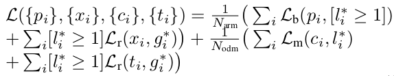

> [Single-Shot Refinement Neural Network for Object Detection](https://arxiv.org/pdf/1711.06897.pdf)
>
> 中文翻译版本：[RefineDet中文版](https://nanfei.ink/2018/01/15/Single-Shot%20Refinement%20Neural%20Network%20for%20Object%20Detection%E8%AE%BA%E6%96%87%E7%BF%BB%E8%AF%91/)

#Single-Shot Refinement Neural Network for Object Detection

## 核心思想

这篇文章主要想将One-Stage和Two-Stage的方法的优势结合起来（既要效果好又要速度快）：采用的核心思想是在类似SSD+FPN的框架上面增加了Two-Stage的"策略"（类似RPN先进行一次前景背景分类+bounding box的"粗"回归修正，再用分类网络进行类别分类+bounding box的"精"回归修正）--- 利用Anchor Refinement Module+Object Detection Module+Transfer Connection Block(这个可以视为连接前面两个Module的桥梁)来完成

## 主要框架

说明：

1. Anchor Refinement Module：这一部分结构和SSD基本是一致的，只是最后采用的二分类。主要目的是"模拟"Two Stage中的RPN结构 --- 对anchors进行"粗"修正，以及利用前景背景的信息剔除掉一部分"太明显"的背景。
2. Transfer Connection Block：这部分非常类似FPN结构，为了将高层语义信息与前面几层融合。以及使得Object Detection Module和Anchor Refinement Module的特征不同
3. Object Detection Module：其实也和SSD的head部分很类似，主要目的是对"粗"修正的anchors再进一步做"精"修正，以及进行多分类任务。

下述再多说几点论文中的情况：

1. 虽然作者说引入Anchor Refinement Module能够去掉一部分负样本，但最终实验的实验还是和SSD采用相同的策略：强行正负样本3:1，以及进行OHEM处理
2. 损失函数如下所示（和Faster RCNN中类似）：
   

### Ablation分析

其实从这部分对比也可以发现：negative anchor filtering（采用Anchor Refinement Module剔除掉一些负样本提升的效果一般）