> 下属内容来自：[relation networks for object detection笔记](https://blog.sunnyan.me/2018/04/18/relation-networks-for-object-detection/#实例检测阶段)

# Relation Networks for Object Detection

> **本文亮点：**
>
> - 将《Attention Is All You Need》中的 Attention 机制应用到目标检测领域，设计出的目标关系模块很容易集成到任意网络中。
> - 用目标关系模块代替传统NMS算法进行去重，检测网络完全可以端到端训练。

## 1. 摘要

在视觉领域，我们都知道，建模物体间的关系，有利于目标识别任务。但是在深度学习领域，很少有利用物体关系进行目标识别任务的。本文提出了一种**目标关系模块（Object Relation Module）**，它同时处理一组目标，对目标之间的外观特征关系和位置关系进行建模。该模块的输入输出维度相同（in-place），不需要额外的监督，因此很容易嵌入到已有网络中。实验表明，在目标检测网络的**目标识别**和**去重**两个阶段添加目标关系模块，可以提高检测精度，并实现完全的端到端目标检测器。

## 2. 介绍

目标关系模块使用了 Attention 机制，基本思想来源于 Google 的一篇 NLP 方向的文章[《Attention Is All You Need》](https://arxiv.org/abs/1706.03762)。作者设计的 Attention 权重由两部分组成，**外观特征关系权重**和**空间关系权重**。作者将目标关系模块应用到区域特征提取后的 FC 层，使目标特征包含物体间的关系信息，增强目标识别能力。作者还将目标关系模块应用到去重阶段，代替传统的 NMS 算法，提高网络识别精度，同时可以使网络进行端到端的训练，如下图所示。

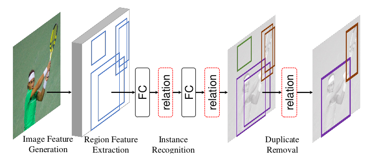

## 3. Attention模块

在 Google 的文章中，称这种 Attention 机制为“Scaled Dot-Product Attention”。计算过程如下式所示：

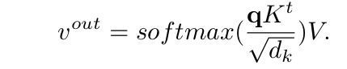

> 输入一个 $d_k$ 维的 query，一组 $d_k$ 维的 keys 和一组 $d_v$ 维的 values。q 与 K 点乘，得到一组相似度，除以 $\sqrt{d_k}$以减小数值的规模，防止 Softmax 输出非0即1。通过 Softmax 得到 V 的权重，对 V 加权求和得到一个输出 $v_{out}$。这里的$q,K,V$可以为同一种数据，比如都是物体的外观特征。

其运算的方式如下图所示：

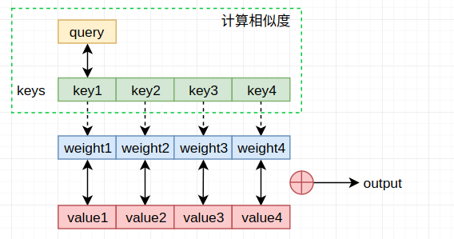

> 简单的理解就是："对于不同的value"采用不同的权重，而这个不同主要利用相似度来计算获得
>
> 关于attention based model更直观的解释：见[attention](https://github.com/AceCoooool/MLDS-Note/blob/master/ch5/ch5_3.md)

## 4. 目标关系模块

物体的特征由两部分组成，空间特征 $f_G$（4 维的 RoI 的 bbox 信息）和外观特征 $f_A$（RoI 区域特征，如FC层输出的1024维特征）。输入 N 个物体的特征 $\{(f^n_A,f^n_G)\}^N_{n=1}$，第 n 个物体关于其他所有物体的关系特征 $f_R(n)$ 表示为：

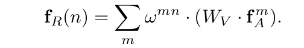

输出是所有外观特征的加权和。$W_V$ 是变换矩阵，对特征 $f^m_A$ 做线性变换。$W_V\cdot f^m_A$对应于values。$\omega^{mn}$ 表示第 n 个物体与其他物体的关系权重。其计算公式为：

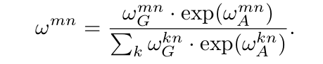

分母是一个归一化项。$\omega^{mn}_A$ 为外观权重，$\omega^{mn}_G$ 为空间权重。

> 其实直观上还是蛮好理解的："物体间的相似度"在这里理解为"物体间的相关度"更合理，而这个"相关度"与两个因素有关 --- ① 物体之间的位置关系 ② 物体之间的外观特征关系 （此处可以视为外观特征和位置关系的乘积---exp可以视为对外观特征进行加强）--- 举个例子：存在红绿灯的情况下，不太可能存在船，而出现汽车和人的可能性更高

### ① 外观权重

外观权重的计算公式为：

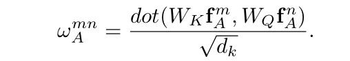

其中 $W_K, W_Q$ 均为投影矩阵，将外观特征降投影到 $d_k$ 维，通过内积比较特征的相似度。$W_Qf^n_A$ 对应于query，$W_Kf^m_A$ 对应于单个key。

> 其实就是计算两个特征之间的相关性

### ② 空间权重

空间权重的计算公式为：

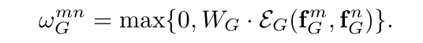

分为两步。

第一步，先计算两个物体之间的相关空间特征：

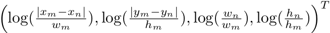

上式类似于边界框回归时的计算目标，保证了平移、缩放不变性。接下来使用《Attention Is All You Need》中的方法将4维的相关空间特征嵌入（Embedding）到高维，得到 $d_g$ 维特征 $\varepsilon_G(f^m_G,f^n_G)$

第二步，将嵌入的特征与 $W_G$ 点乘，得到标量的权重 $\omega^{mn}_G$，如果权重小于0，则取0。

### ③ 合起来

在目标关系模块中，作者将 $N_r$ 个关系特征 $f^i_R(n)$ 进行连接（concatenate），再加到第 n 个物体的外观特征 $f^n_A$ 上作为模块最后的输出：

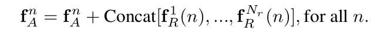

这里，假设外观特征$f_A$是$d_f$维的，为了使拼接后的特征维度也为$d_f$，则线性变换矩阵$W_V$的维度应为$d_f/N_r$。

> 这里需要注意一下，和原先定义的式子：$f_R(n)=\sum_{m} \omega^{mn} \cdot (W_V \cdot f_A^m)$略有不同

其结构如下所示：

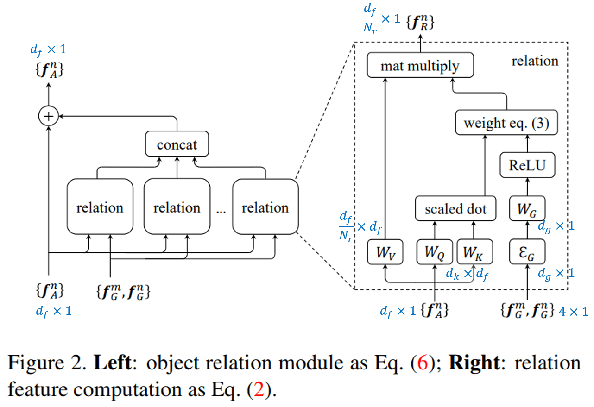

> 你可能会好奇为什么这么设计：说实话，这种都是仁者见仁智者见智的问题，完全可以自己设计更合理的方式来衡量目标之间的"相关性"

## 5. 应用到目标检测

Faster R-CNN，FPN，DCN 等目标检测网络，RoI Pooling 层输出的特征都会与2个全连接层相连，然后预测类别得分和边界框回归。大致流程如图3所示，这里 FC 层输出的维度大小为1024。

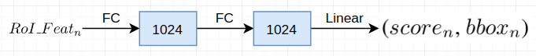

作者在每个 FC 层后，加入目标关系模块，保证输入 N 个 proposals 前后，特征维度不发生变化。大致流程如下图所示。

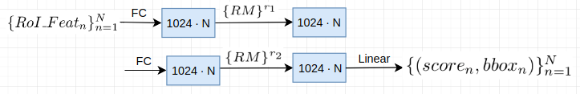

> 这里提一点：最后学到的bbox其实是偏移，所以输入到RM模块的位置信息是RPN等输出的结果

网络的检测部分，由 2fc 变为了 2fc+RM（Relation module），所以上述过程其实如下图所示：

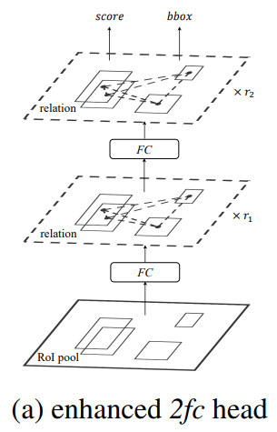

### 去重阶段

作者将去重看作一个二分类问题，其流程如下图所示：

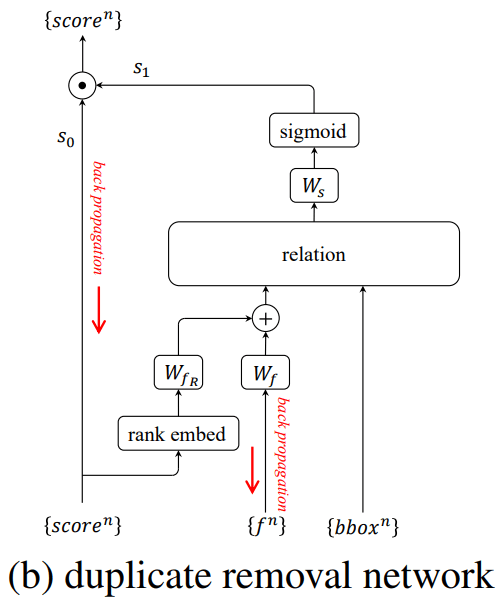

在分类和边界框回归分支，网络输出了分类得分 s0 和预测的边界框 bbox。作者先将 N 个物体的得分从大到小排序，每一个物体排序的序号（rank）∈[1,N]。与 $f_G$ 的处理方式类似，作者将 rank 值嵌入到一个高维空间，维度大小为128。然后将 rank 特征，和 2fc+RM 层之后的1024维的外观特征分别通过矩阵 $W_{fR}$ 和 $W_f$ 投影到128维，再按元素相加。将该特征和bbox特征输入到关系模块中，通过矩阵 $W_s$ 对输出的关系特征线性分类，再使用 Sigmoid 函数得到二分类得分 s1（1表示是正确的bbox，0表示多余的bbox）。最后用 $s0*s1$ 表示最终的分类得分。

去重阶段正负样本选取：对于每一个 ground truth box，选取边界框回归阶段 $IoU ≥η$ 的框中得分最高的为正样本，其他为负样本。

$s0*s1$ 的设计很巧妙，避免了正负样本不平衡的问题，对于负样本，损失函数为:
$$
L = -\log(1 - s_0 s_1)
$$
反向传播的梯度为：
$$
\frac{\partial L}{ \partial s_1} = \frac{s_0 } {(1 - s_0 s_1)}
$$
由于负样本 s0 很小，因此对优化目标影响很小。

推断阶段，每一类物体都要独立的使用去重网络进行处理。也就是说，如果检测的物体种类很多时（COCO有80类），以及检测的目标很多（N=300）时运行时间可能会很长。但是作者说，物体原始得分 s0 通常都很小，接近于0。通过实验发现，一幅图片中只有12%的类别，得分大于0.01；在这些类别中，只有6.8%的物体，得分大于0.01。去掉这些不重要的类别和得分，检测精度不受影响。

在实践中，去重网络使用 GPU 执行，耗时约为 2ms。NMS 和 Soft NMS 使用 CPU 执行，耗时约为 5ms。