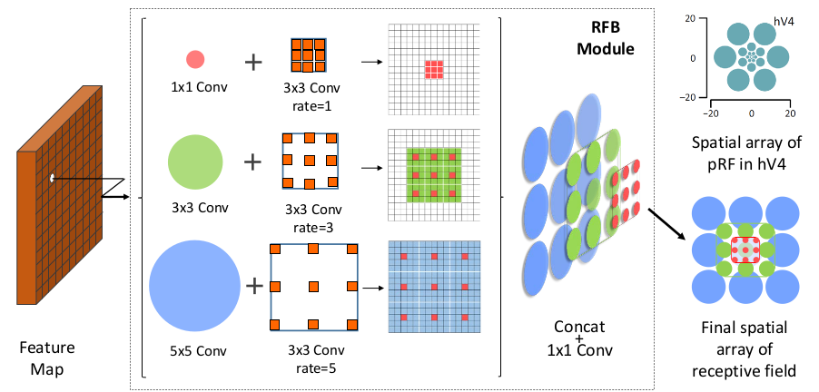
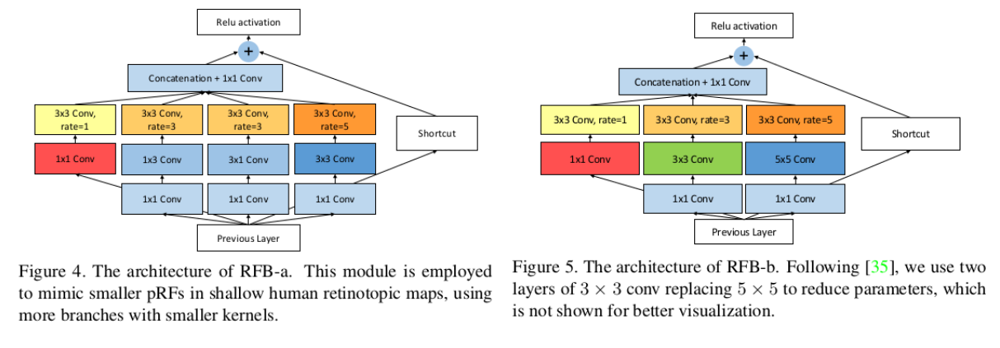
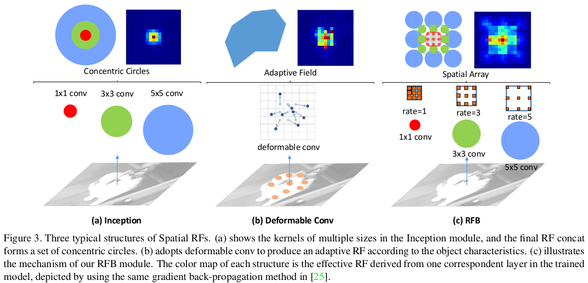
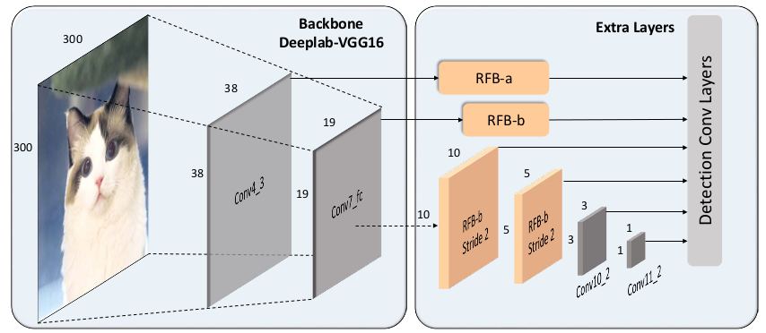

> 论文地址：[Receptive Field Block Net for Accurate and Fast Object Detection](https://arxiv.org/pdf/1711.07767.pdf)
>
> 参考内容：[RFB1](http://www.dapalm.com/?p=69)

#Receptive Field Block Net for Accurate and Fast Object Detection

## 主要思想

基于Inception的结构，进一步扩展成大的卷积后跟一个大的dilated，从而使得size和eccentricity之间存在正相关（简单的理解：不同kernel的卷积代表不同的size，而不同的dilated情况则代表不同的eccentricity --- 作者是说借鉴了人类感受野的研究情况）

## 主要内容

### RFB结构

上边是更"可视化"的结构，下边是具体实现采用的方式（两种不同的方式---其实和Inception结构非常相似---只是后续加了一个包含dilated结构的3x3卷积）

### 为什么RFB结构

从上述比较图其实可以发现：RFB结构包含的信息从里外到，包含的信息范围更广也更丰富。

### SSD+RFB

在SSD的"输出"接上RFB结构来增加feature的"丰富性"

## 实验结果

作者做了一系列对比实验等等，感兴趣可以看下论文。