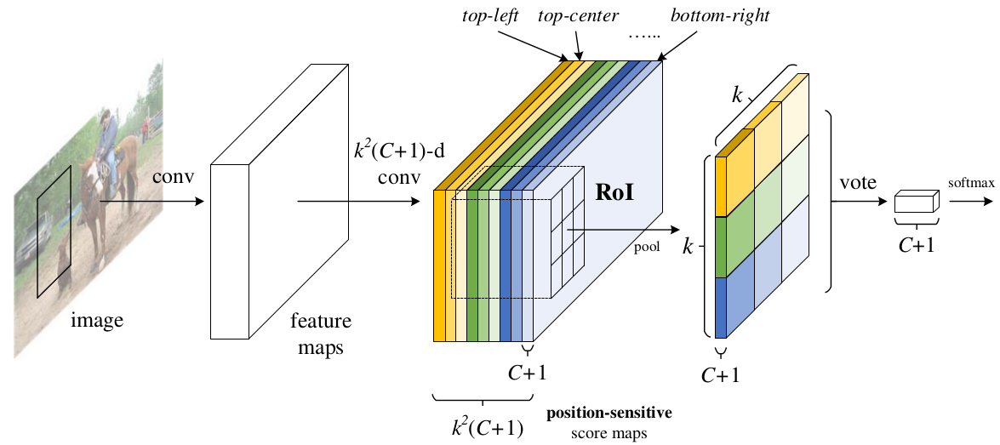
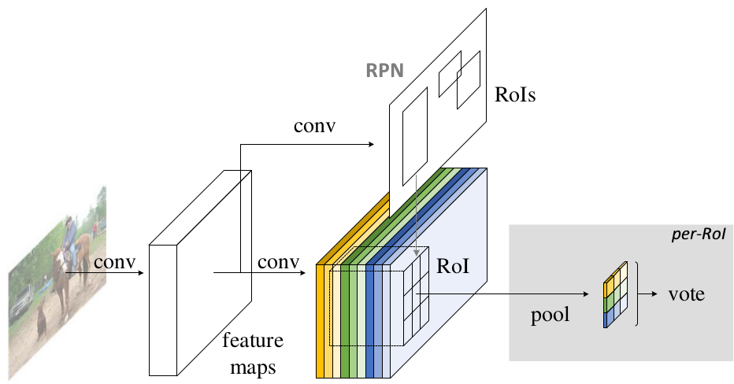
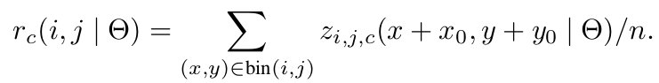
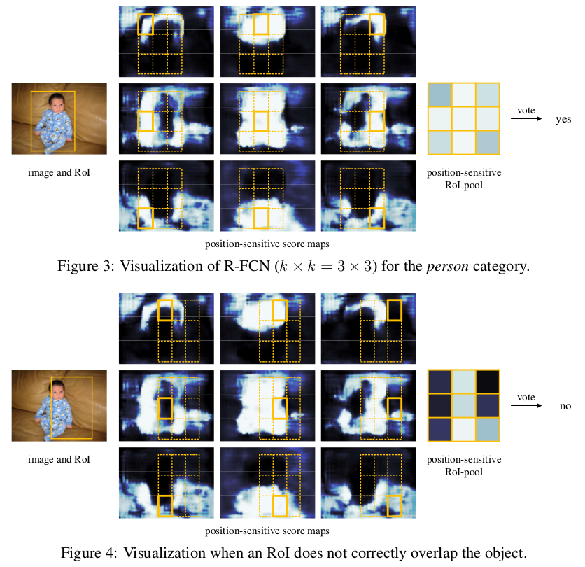
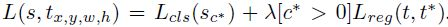

> 大部分内容直接抄自：[详解R-FCN](https://zhuanlan.zhihu.com/p/30867916)（由于个人比较懒，每次会先找下有没有总结比较好的部落格）
>
> 论文链接：[R-FCN:Object Detection via Region-based Fully Convolutional Networks](https://arxiv.org/pdf/1605.06409.pdf)

## R-FCN:Object Detection via Region-based Fully Convolutional Networks

## 主要贡献

解决了“**分类网络的位置不敏感性**（translation-invariance in image classification）”与“**检测网络的位置敏感性**（translation-variance in object detection）”之间的矛盾，在提升精度的同时利用“位置敏感得分图（position-sensitive score maps）”提升了检测速度。

（一个简单的例子：在分类的时候，一个物体旋转平移等等并不会改变其类别；而在检测的时候，bounding box是会随着物体的变化而改变的）

## 动机

Faster R-CNN是首个利用CNN来完成proposals的预测的（RPN网络），之后的很多目标检测网络都是借助了Faster R-CNN的思想。而Faster R-CNN系列的网络都可以分成2个部分：

1. **Fully Convolutional subnetwork** before RoI Layer
2. **RoI-wise subnetwork**

第1部分就是直接用普通分类网络的卷积层，用其来提取共享特征，然后一个RoI Pooling Layer在第1部分的最后一张特征图上进行提取针对各个RoIs的特征向量（或者说是特征图，维度变换一下即可），然后将所有RoIs的特征向量都交由第2部分来处理（分类和回归），而第二部分一般都是一些全连接层，在最后有2个并行的loss函数：softmax和smoothL1，分别用来对每一个RoI进行分类和回归，这样就可以得到每个RoI的真实类别和较为精确的坐标和长宽了。

这里要注意的，第1部分都是像VGG、GoogleNet、ResNet之类的基础分类网络，这些网络的计算都是所有RoIs共享的，在一张图片测试的时候只需要进行一次前向计算即可。而对于第2部分的RoI-wise subnetwork，它却不是所有RoIs共享的，因为这一部分的作用就是“给每个RoI进行分类和回归”，所以当然不能共享计算。那么现在问题就出在这里，首先第1部分的网络具有“位置不敏感性”，而如果我们将一个分类网络比如ResNet的所有卷积层都放置在第1部分用来提取特征，而第2部分则只剩下全连接层，这样的目标检测网络是“位置不敏感translation-invariance”，所以其检测精度会较低，并且也白白浪费了分类网络强大的分类能力（does not match the network's superior classification accuracy）。而ResNet论文中为了解决位置不敏感的缺点，做出了一点让步，即将RoI Pooling Layer不再放置在ResNet-101网络的最后一层卷积层之后而是放置在了“卷积层之间”，这样RoI Pooling Layer之前和之后都有卷积层，并且RoI Pooling Layer之后的卷积层不是共享计算的，它们是针对每个RoI进行特征提取的，所以这种网络设计，其RoI Pooling Layer之后就具有了“位置敏感性translation-variance”，但是这样做牺牲了测试速度，因为所有RoIs都要经过若干层卷积计算，测试速度会很慢。

那么到底怎么办？要精度还是要速度？R-FCN的回答是：都要！！！

## 网络设计

### position-sensitive score map

这张图就是R-FCN的网络结构图，其主要设计思想就是“位置敏感得分图position-sensitive score map”。现在就对着这张图来解释其设计思路。如果一个RoI含有一个类别c的物体，那么作者将该RoI划分为$k\times k$个区域，分别表示该物体的各个部位，比如假设该RoI中含有人这个物体，k=3，那么就将“人”划分为了9个子区域，top-center区域毫无疑问应该是人的头部，而bottom-center应该是人的脚部，而将RoI划分为$k\times k$个区域是希望这个RoI在其中的每一个区域都应该含有该类别c的物体的各个部位，即如果是人，那么RoI的top-center区域就必须含有人的头部。而当这所有子区域都含有各自对应的该物体的相应部位后，那么分类器才会将该RoI判断为该类别。物体的各个部位和RoI的这些子区域是“一一映射”的对应关系。

好了，现在我们知道了一个RoI必须是$k\times k$个子区域都含有该物体的相应部位，才能判断该RoI属于该物体，如果该物体的很多部位都没有出现在相应的子区域中，那么就判断该RoI为背景类别。那么现在的问题就是“网络如何判断一个RoI的$k\times k$个子区域都含有相应部位呢？”前面我们是假设知道每个子区域是否含有物体的相应部位，那么我们就能判断该RoI是否属于该物体还是属于背景。那么现在的任务就是“判断RoI子区域是否含有物体的相应部位”。

这就是position-sensitive score map设计的核心思想了。R-FCN会在共享卷积层的最后再接上一层卷积层，而该卷积层就是“位置敏感得分图position-sensitive score map”，该score map是什么意义呢？首先它就是一层卷积层，它的height和width和共享卷积层的一样，但是它的$channels=k^2(C+1)$ ，如上图所示。那么C表示物体类别种数再加上1个背景类别，每个类别都有$k^{2}$个score maps。现在我们先只针对其中的一个类别来讨论，假设是人这个类别，那么其有$k^{2}$个score maps，每一个score map表示“原图image中的哪些位置含有人的某个部位”，而该score map会在含有“该score map对应的人体的某个部位”的位置有“高响应值”，也就是说每一个score map都是用来“描述人体的其中一个部位出现在该score map的何处，而在出现的地方就有高响应值”。那么好了既然是这样，那么我们只要将RoI的各个子区域对应到“属于人的每一个score map”上然后获取它的响应值不就好了。对，就是这样。但是要注意，由于一各score map都是只属于“一个类别的一个部位”的，所以RoI的第$i$个子区域一定要到第$i$张score map上去找对应区域的响应值，因为RoI的第$i$的子区域需要的部位和第$i$张score map关注的部位是一样的，所以就是这样的对应关系。那么现在该RoI的$k\times k$个子区域都已经分别“属于人的$k^{2}$个score maps”上找到其响应值了，那么如果这些响应值都很高，那么就证明该RoI是人呀~对吧。不过，当然这有点不严谨，因为我们只是在“属于人的$k^{2}$个score maps”上找响应值，我们还没有到属于其它类别的score maps上找响应值呢，万一该RoI的各个子区域在属于其它类别的上的score maps的响应值也很高，那么该RoI就也有可能属于其它类别呢？是吧，万一2个类别的物体本身就长的很像呢？所以呢，当然就是看那个类别的响应值更高了。

好了，这就是position-sensitive score map的全部思想了，应该很容易理解了把O(∩_∩)O~

### Position-sensitive RoI pooling

上一部分，我们只是简单的讲了下“RoI的$k\times k$个子区域在各个类别的score maps上找到其每个子区域的响应值”，我们并没有详细讲这个“找到”是如何“找”的呢？这就是这一部分的“位置敏感RoI池化操作了（Position-sensitive RoI pooling）”，字面意思理解就是“池化操作是位置敏感的”，现在就来解释“池化操作是怎么个位置敏感法”。

看这图，通过RPN提取出来的RoI区域，其是包含了“坐标、长宽”的4值属性的，也就是说不同的RoI区域能够对应到score map的不同位置上，而一个RoI会分成$k\times k$个bins（也就是子区域。每个子区域bin的长宽分别是$h/k$和$w/k$），每个bin都对应到score map上的某一个区域（上图已经很明显的画出来了）。那么好既然该RoI的每个bin都对应到score map上的某一个子区域，那么池化操作就是在该bin对应的score map上的子区域执行，且执行的是平均池化。我们在上一部分已经讲了，第$i$个bin应对在第$i$个score map上找响应值，那么也就是在第$i$个score map上的“该第$i$个bin对应的位置”上进行池化操作，且池化是取“bin这个范围内的所有值的平均值”。并且由于有$C+1$个类别，所以每个类别都要进行相同方式的池化。（下图的公式就是池化操作的计算方式）

对于每个类别，它都有$k^{2}$个score maps，那么按照上述的池化方式，可以RoI针对该类别可以得到$k^{2}$个值，那么一共有$C+1$个类别，那么一个RoI就得到$k^{2}(C+1)$个值，就是上图的“channels=$C+1$ ，size=$k\times k$ ”的特征图。那么对于每个类别，该类别的$k^{2}$个值都表示该RoI属于该类别的响应值，那么将这$k^{2}$个数相加就得到该类别的score，那么一共有$C+1$个scores，那么将这$C+1$个数使用简单的softmax函数就可以得到属于各个类别的概率了（注意，这里不需要使softmax分类器了，只需要使用简答的softmax函数，因为这里就是通过简单的比大小来判断最终的类别的）。

### position-sensitive regression

前面的“position-sensitive score map”+“Position-sensitive RoI pooling”得到的值是用来分类的，那么自然就有相应的操作得到的值用来回归。按照“position-sensitive score map”+“Position-sensitive RoI pooling”思路，其会让每一个RoI得到$C+1$个数作为每个类别的score，那么现在每个RoI还需要$4$个数作为“回归的偏移量”，也就是“坐标和长宽”的偏移量，所以仿照分类设计的思想，还需要一个类似于position-sensitive score map的用于回归的score map。那么现在就这样设计：在ResNet的共享卷积层的最后一层上，接上一个与position-sensitive score map并行的（sibling）score maps，该score maps用于regression，暂且命名为“regression score map”，而该regression score map的维度应当是$4k^{2}$，那么在经过Position-sensitive RoI pooling操作后，每一个RoI就会得到 $4$个数作为“该RoI的坐标和长宽的偏移量”了。

## 网络的训练

###为什么position-sensitive score map能够具有“在含有某个类别的物体的某个部位的区域上有高响应值”

这种有高响应值现在只是作者自己在yy的啊，如果网络不满足这一点的话，那么前的所有分析都gg了啊。好，现在我们就大致解释一下为什么训练该网络能够让网络最终满足这一点。首先根据网络的loss公式，如果一个RoI含有人这个物体，那么该RoI通过“position-sensitive score map”+“Position-sensitive RoI pooling”得到的$C+1$个值中属于人的那个值必然会在softmax损失函数的要求下“变得尽量的大”，那么如何才能使得属于人的这个值尽量的大呢？那么我们现在就要想到，属于人的这个预测值是怎么来的？在前面的分析，我们已经知道它是通过Position-sensitive RoI pooling这种池化操作的来的，那么也就是说使得$C+1$ 个值中属于人的那个值尽量大，必然会使得position-sensitive score map中属于人的那个score map上的“该RoI对应的位置区域的平均值”尽量大，从而也就是该score map上在该区域上的响应值尽量大，因为只有该区域的响应值大了，才能使得预测为人的概率大，才会降低softmax的loss。（这里要认清一个事实：Deep Learning是"需求导向"的，即我希望你做什么，然后给你设计了特定的损失函数，然后你就乖乖地学就好～而没有硬性的解释）

所以这种end-to-end的训练会达到这一目的，并且从论文中的下图也可以看出来：

### 损失函数

使用如上的损失函数，对于任意一个RoI，计算它的softmax损失，和“当其不属于背景时的回归损失”。这很简单，因为每个RoI都被指定属于某一个GT box或者属于背景，即先让GT box选择与其IoU最大的那个RoI，然后再对剩余RoI选择与GT box的IoU>0.5的进行匹配，而剩下的RoI全部为背景类别。那么RoI有了label后，loss自然很容易计算出来。

而唯一不同的就是，为了减少计算量，作者将所有RoIs的loss值都计算出来后，对其进行排序，并只对“最大的128个损失值对应的RoIs”执行反向传播操作，其它的则忽略（OHEM策略）。并且训练策略也是采用的Faster R-CNN中的4-step alternating training进行训练。

在测试的时候，为了减少RoIs的数量，作者在RPN提取阶段就将RPN提取的大约2W个proposals进行过滤：

1. 去除超过图像边界的proposals
2. 使用基于类别概率且阈值IoU=0.7的NMS过滤
3. 按照类别概率选择top-N个proposals

所以在测试的时候，一般只剩下300个RoIs，当然这个数量是一个超参数。并且在R-FCN的输出300个预测框之后，仍然要对其使用NMS去除冗余的预测框。（这些细节看Faster RCNN那篇文章）

