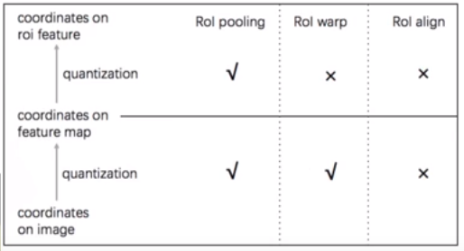
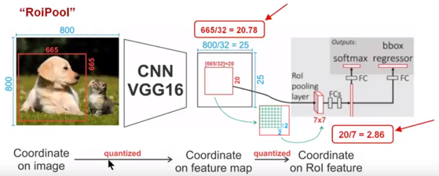
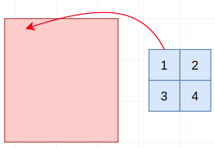
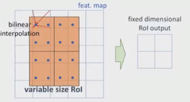
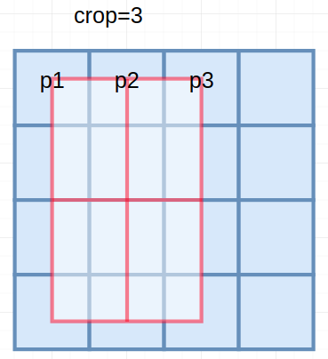

# 三种常用的ROI处理方式

> 这部分可以参考：[ROI Align](http://blog.leanote.com/post/afanti.deng@gmail.com/b5f4f526490b) (其实这娃也是从youtube上面的一个视频上面看过来的) 
>
> 图片来源于 ICCV17上何恺明的演讲视频。[视频](https://www.youtube.com/watch?v=g7z4mkfRjI4) [ppt](http://kaiminghe.com/iccv17maskrcnn/maskrcnn_iccv2017_oral_kaiminghe.pdf)
>
> *Mask R-CNN***Kaiming He**, Georgia Gkioxari, Piotr Dollár, and Ross Girshick
> IEEE International Conference on Computer Vision (**ICCV**), 2017 (**Oral**). [**ICCV Best Paper Award (Marr Prize)**](https://www.computer.org/web/tcpami/iccv-best-paper-award)
> [arXiv](https://arxiv.org/abs/1703.06870)   [talk](https://www.youtube.com/watch?v=g7z4mkfRjI4)   slides: [ICCV tutorial](http://kaiminghe.com/iccv17tutorial/maskrcnn_iccv2017_tutorial_kaiminghe.pdf)  [ICCV oral](http://kaiminghe.com/iccv17maskrcnn/maskrcnn_iccv2017_oral_kaiminghe.pdf)  [COCO workshop](http://presentations.cocodataset.org/COCO17-Detect-MaskRCNN.pptx)   **code/models**

首先给出三种ROI的特点总结图：

## 1. ROI Pooling

在常见的两级检测框架（比如Fast-RCNN，Faster-RCNN，RFCN）中，ROI Pooling 的作用是根据预选框的位置坐标在特征图中将相应区域池化为固定尺寸的特征图，以便进行后续的分类和包围框回归操作。由于预选框的位置通常是由模型回归得到的，一般来讲是浮点数，而池化后的特征图要求尺寸固定。故ROI Pooling这一操作存在两次量化的过程。

- 将候选框边界量化为整数点坐标值。
- 将量化后的边界区域平均分割成 k x k 个单元(bin),对每一个单元的边界进行量化。

事实上，经过上述两次量化，此时的候选框已经和最开始回归出来的位置有一定的偏差，这个偏差会影响检测或者分割的准确度。在论文里，作者把它总结为“不匹配问题（misalignment）。

下面我们用直观的例子具体分析一下上述区域不匹配问题。如上图所示，这是一个Faster-RCNN检测框架。输入一张800x800的图片，图片上有一个665x665的包围框(框着一只狗)。图片经过主干网络提取特征后，特征图缩放步长（stride）为32。因此，图像和包围框的边长都是输入时的1/32。800正好可以被32整除变为25。但665除以32以后得到20.78，带有小数，于是ROI Pooling 直接将它量化成20。接下来需要把框内的特征池化7x7的大小，因此将上述包围框平均分割成7x7个矩形区域。显然，每个矩形区域的边长为2.86，又含有小数。于是ROI Pooling **再次把它量化到2**。经过这两次量化，候选区域已经出现了较明显的偏差（如图中绿色部分所示）。更重要的是，该层特征图上0.1个像素的偏差，缩放到原图就是3.2个像素。**那么0.8的偏差，在原图上就是接近30个像素点的差别**，这一差别不容小觑。

## 2. ROI Crop

每个roi-bin经过仿射变化回去获得输入坐标（在对输入坐标进行双线性差值处理），该bin出的feature map即为输入坐标对应的feature map进行双线性差值后的结果。（更详细的介绍，请见：[RCNN](https://github.com/AceCoooool/Job-notebook/blob/master/detection/rcnn/RCNN.md)中的介绍）

## 3. ROI Align

为了解决ROI Pooling的上述缺点，作者提出了ROI Align这一改进的方法(如上图所示)。ROI Align的思路很简单：取消量化操作，使用双线性内插的方法获得**坐标为浮点数**的像素点上的图像数值,从而将整个特征聚集过程转化为一个连续的操作。值得注意的是，在具体的算法操作上，ROI Align并不是简单地补充出候选区域边界上的坐标点，然后将这些坐标点进行池化，而是重新设计了一套比较优雅的流程，如下图所示：

- 遍历每一个候选区域，保持浮点数边界不做量化。
- 将候选区域分割成k x k个单元，每个单元的边界也不做量化。
- 在每个单元中计算固定四个坐标位置，用双线性内插的方法计算出这四个位置的值，然后进行最大池化操作。

这里对上述步骤的第三点作一些说明：这个固定位置是指**在每一个矩形单元（bin）中按照固定规则确定的位置**。比如，如果采样点数是1，那么就是这个单元的中心点。如果采样点数是4，那么就是把这个单元平均分割成四个小方块以后它们分别的中心点。显然这些采样点的坐标通常是浮点数，所以需要使用插值的方法得到它的像素值。在相关实验中，作者发现将采样点设为4会获得最佳性能，甚至直接设为1在性能上也相差无几。事实上，ROI Align 在遍历取样点的数量上没有ROIPooling那么多，但却可以获得更好的性能，这主要归功于解决了misalignment的问题。值得一提的是，我在实验时发现，ROI Align在VOC2007数据集上的提升效果并不如在COCO上明显。经过分析，**造成这种区别的原因是COCO上小目标的数量更多，而小目标受misalignment问题的影响更大（比如，同样是0.5个像素点的偏差，对于较大的目标而言显得微不足道，但是对于小目标，误差的影响就要高很多）。**

（说明：目前看到的大部分的C实现，都是基于采样点数为1---采样类似下图的策略）

（关于这部分的实现：可以参考个人的实现---[align&pool](https://github.com/AceCoooool/RoIAlign-RoIPool-pytorch)）