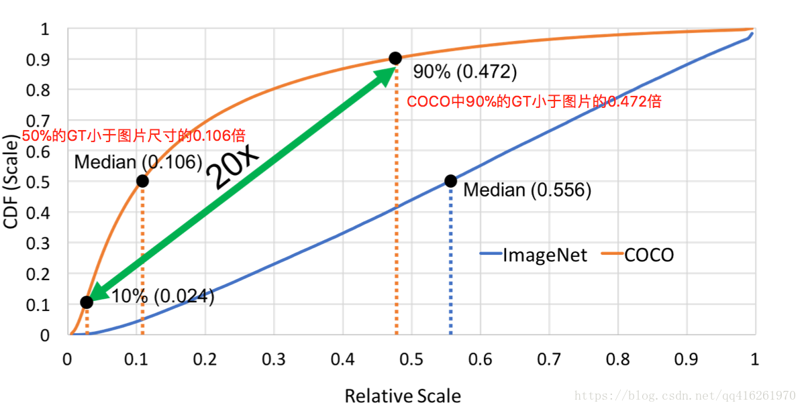
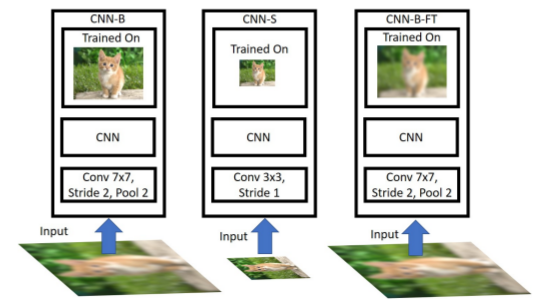
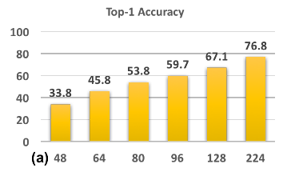
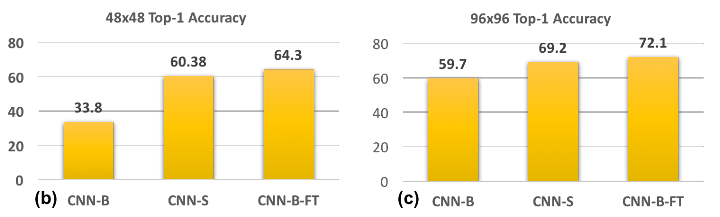
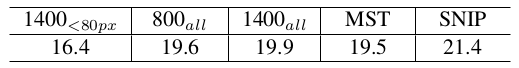
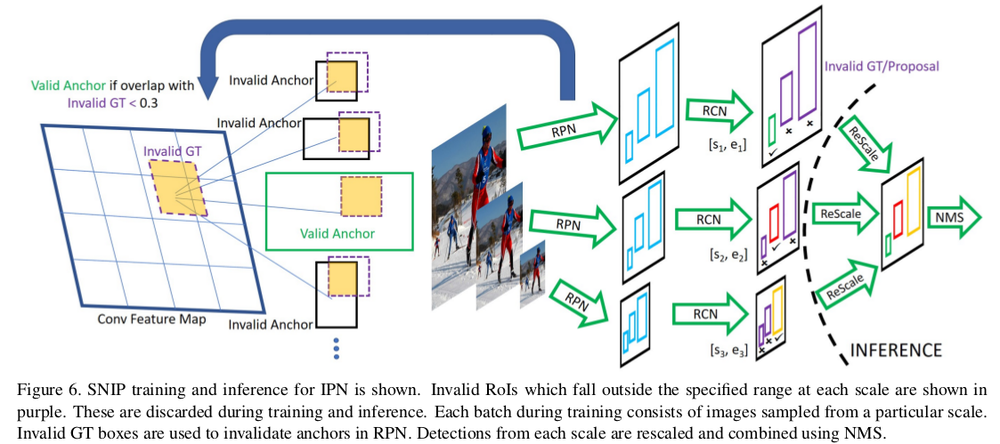

> [An Analysis of Scale Invariance in Object Detection - SNIP](https://arxiv.org/pdf/1711.08189.pdf)
>
> 这篇文章进行了很多分析，而如果只关心最后的思想，可以直接跳到后面。
>
> 下述内容参考：[SNIP分析](https://blog.csdn.net/qq416261970/article/details/79774909)

# An Analysis of Scale Invariance in Object Detection - SNIP

这篇文章想表达的思想：ImageNet上预训练上的模型你直接拿过来用是存在一些小问题的（由于尺寸差异带来的影响，大物体和小物体效果不好），你要尽可能保证你的物体都和预训练模型训练时采用的输入大小相近效果才好！所有才有了SNIP结构，说白了就是"改良的多尺度"

## 分析篇

## 1. 分类和检测数据集的差异

分类任务已经做到了误差率2%(ImageNet). 为什么在COCO上才62%? 这么悬殊的距离主要因为检测数据集中包含了大量小物体。

（横坐标代表物体占图片的比例，纵坐标代表小于此比例的数据占总数据集的比例）

从上图我们可以发现：COCO数据集有存在非常大的尺度变化的样本（尺寸相差可达20倍之多，且这些小样本数目也有近10%）这就导致了我们使用ImageNet(或其他分类)预训练模型时, 有严重的**domain-shift**问题。

### 解决尺度多样化常用的方法

- 深浅特征融合（如FPN方法）
- 采用Dilated/Deformable等方法增大感受野，来提升识别大物体的能力
- 每层独立predict
- 多尺度训练/测试

存在的问题

1. 浅层小尺寸，深层大尺寸：（如MS-CNN）会导致浅层预测小尺寸时，缺乏抽象的语义信息。（即没有高层的语义信息，对分类等性能会大打折扣）
2. 特征融合/特征金字塔：（如FPN）存在的问题是若一个25x25的目标物体，即使融合上采样x2也仍然只有50x50的大小。这与预训练模型的224x224还是存在很大差距的（这与下面第2个问题提到的问题有关）

> 尽管Feature Pyramids **有效**的综合了多卷积层特征图信息，但是对于very small/large objects 检测效果不是很好

### 上述方法没有考虑到的两个问题

1. 检测中把图片放大了再使用，对性能提升至关重要吗 (Faster-RCNN中通常480x640的尺寸要放大到800x1200 --- COCO中的图片大小在480x640左右)？
2. 将在ImageNet训练好的参数，迁移到检测问题上时，fine-truning的策略：应该选用固定范围大小(如64x64 ~ 256x256)的物体进行，还是采用所有范围大小的物体进行。（此处的大小指物体大小，而不是指图片大小---因为目标检测最后进行分类时的特征只来自于ROI区域）

## 2. 对比分析实验

主要为了分析上面提出的两个问题

### 尺度差异问题（domain-shift和训练/测试匹配中）

下述实验采用的几个模型：

(左图：原图224x224训练，伪高清测试；  中间：低清训练，低清测试(如80x80)；右图：原图训练，伪高清fine-tune，伪高清测试)

主要分为下述几种不同的实验分析

**1. CNN-B：原图训练/伪高清测试**

CNN-B是一个在224x224尺度上训练的模型, 其stride=2. 我们将测试图片降采样到 [48x48, 64x64, 80x80, 96x96,128x128], 然后再放大回224x224用于测试. 结果如图: 

**结论:** 训练/测试尺度(实际上是清晰度)差距越大, 性能跌的越厉害. 因为不用与训练尺度相互匹配的尺度进行测试, 会使得模型无法达到optimal。（这可以回答上面的问题2：如果我们只取某些范围的进行fine-tune，则会导致训练和测试之间尺寸的不匹配）

**2. CNN-S：低清训练/低清测试 & 3. CNN-B-FT：原图训练, 伪高清微调/伪高清测试 **

据结果看到, 训/测尺度匹配后, 性能大幅提升. 同样将48换成96也得到一致的结果.

把由原图训练的CNN-B用伪高清去做微调. 最终CNN-B-FT的结果甚至好于CNN-S.

**结论：**

- 从**CNN-B-FT**的实验可以得出: 在高清训练集学出来的模型依然有办法在低清晰度的图片上做预测. 直接用低清晰度图片微调好过将stride降低重新训练一个.

- 推广到目标检测上, 当尺度不同时, 我们可以选择更换在ImageNet上pre-trained网络架构（不建议）. 或者我们根据上述结论, 直接使用同一个网络架构, **因为在分类任务上学到的大目标权重可以帮助我们在小目标上的分类.**

其实上面实验主要说明了两个问题：1. 对"预训练"进行fine-tune是很有必要的（因为COCO和ImageNet中大小物体比例相差悬殊） 2. 训练和测试采用不同的大小对性能是有影响的（至少对于分类而言）。 3. 作者给出的实验想表达让我们尽可能地将ROI物体都缩放到和预训练模型大小相近吧（包括训练阶段）

### 尺度变化分析

（COCO中图片大小一般在480x640左右）

在类似Faster-RCNN中，训练一般采用800x1200，测试采用1400x2000（原因：为了克服小目标问题才进行放大的，而由于受限制于GPU的内存，才使得训练大小比测试小） --- 这就存在上面提到的尺度不一致问题。

作者又设计了下述这些对比实验：

---

**实验1**：分别采用800x1400（对应$800_{all}$）和1400x2000（对应$1400_{all}$）进行训练(也可以认为是fine-tune)。

结果：正如之前分析的一样, 当训/测尺度一致时, 得到的结果最好. 所以$1400_{all}$胜出。

分析：但是为什么只超过了一点点呢? 因为在考虑小物体的分类性能而放大图片的同时, 也将**中/大**尺度的样本放大得太大, 导致无法正确识别.（你要扭转下观念：在目标检测中，我们用于分类的特征只存在于ROI，你可以将此尺寸理解为输入ResNet的输入，此时就会与预训练模型的224x224相差巨大---所以效果差）

---

**实验2**：只用小物体进行fine-tune（大小<80px的物体），而忽略所有大于80px的物体。

结果：表中的$1400_{<80px}$

分析：跟预想的不一样, 为什么性能下降这么多? 其根本原因是因为这种做法抛去了太多的样本(~30%), 导致训练集丰富性下降, 尤其是抛弃的那些尺寸的样本。

---

**实验3**：多尺度训练保证了各个尺度的样本, 都有机会被缩放到合理的尺度区间参与训练.

结果：表中的MST

分析：其最终性能跟$800_{all}$没太大差别, 主要原因和实验1类似, 因为这一次引入了**极大/极小**的训练样本.

---

其实上述这么多实验对比巴拉巴拉的，就是想说明：请将物体尺寸变得尽可能和预训练模型的输入相近

## 改进的结构（*）

改进的思想其实也是很简单的：每张图都进行多尺度输入，而不同尺寸来提取不同大小的物体 --- 大尺寸提取小物体，小尺寸提取大物体（注意和训练时多尺度输入的区分，此处的单图多尺度你可以看成一个整体，而不是简单的数据集增强）

RPN中标签：

1. 用**所有**的GroundTruth给Anchors分配好+/-标签
2. 根据第i个尺度下的**valid range:$[s_i,e_i]$, 将GroundTruth根据是否落在范围内分为Valid/Invalid GT**
3. 对应第i个尺度，如果ROI大小落在$[s_i,e_i]$范围内，则标记为valid
4. 去除那些$IoU(anchors|InvalidGT)>0.3$的Anchors

FC阶段的标签：

1. 用**所有**的GroundTruth给ProposalRoIs分配好类别标签
2. 弃用不在$[s_i^c,e_i^c]$范围内的GT和Proposals