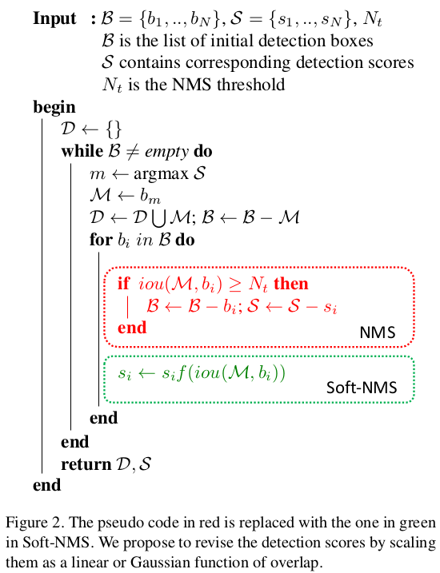
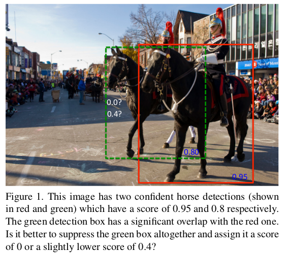
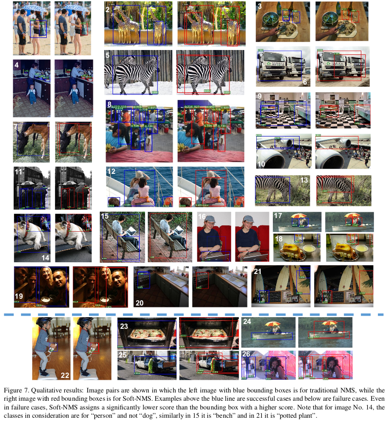

> 论文链接：[Improving Object Detection With One Line of Code](https://arxiv.org/pdf/1704.04503.pdf)
>
> 中文译版：[Improving Object Detection With One Line of Code](https://xzhewei.github.io/2017/11/11/%E8%AE%BA%E6%96%87%E7%AC%94%E8%AE%B0%E3%80%8ASoft-NMS-%E2%80%93-Improving-Object-DetectionWith-One-Line-of-Code%E3%80%8B/)

#Improving Object Detection With One Line of Code

将原本的"硬阈值删除"，改为了"软抑制---即对重叠较大的区域，减少它的score"

## Soft-NMS

### NMS存在的问题

如上图所示，左边的马和右边的马具有很大的重叠（不妨假设其已经超过了NMS-IOU阈值），如果采用NMS就会将左边的马直接删除掉。

NMS的re-score函数如下所示：
$$
s_i=\begin{cases}s_i,\quad iou(M,b_i)<N_t\\ 0,\quad\ iou(M,b_i)\ge N_t \end{cases}
$$
NMS存在的问题有下述两点：

- 当NMS阈值取得比较小时(如0.3)：比较容易将周边的一些前景框框给去没掉，从而导致精度变差（尤其在AP采用大的IOU进行测试时）
- 当NMS阈值取得比较大时(如0.7)：会导致false positive情况增多（注意：NMS阈值越大，容忍性越大，附近框框被保留的可能性越大）

为了解决上述问题，作者给出了soft-nms：对于IOU大于NMS-阈值的情况，将得分减小而不是直接置为0。主要提出了两种re-score函数：

Linear-S-NMS
$$
s_i=\begin{cases}s_i,\quad\quad\quad\quad\quad\quad\quad\quad iou(M,b_i)<N_t\\ s_i(1-iou(M,b_i)),\quad\ iou(M,b_i)\ge N_t \end{cases}
$$
Gaussian-S-NMS
$$
s_i=s_ie^{-iou(M,b_i)^2/\sigma},\forall b_i\notin D
$$
（其实你可以发现这两个函数均是对IOU更大的score进行更大的惩罚）

## 直观效果

可以发现：

- No.8 中有一个横跨多个人人群的BBox，它与多个BBox有交集，NMS不足以抑制，但是S-NMS可以对其得分进行多次衰减。No.9 中也有相似的现象。
- No.1 中在女士手包周围的BBox被抑制了。
- No.4 中在碗旁边的虚警被抑制
- NO.2,5,6,13 中的动物有些被NMS抑制掉了，但是S-NMS只是稍微降低了得分，但是仍然保留了下来

