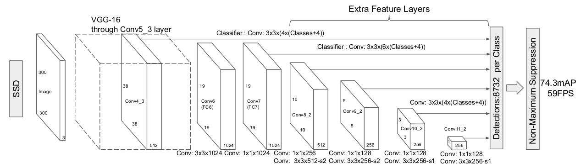
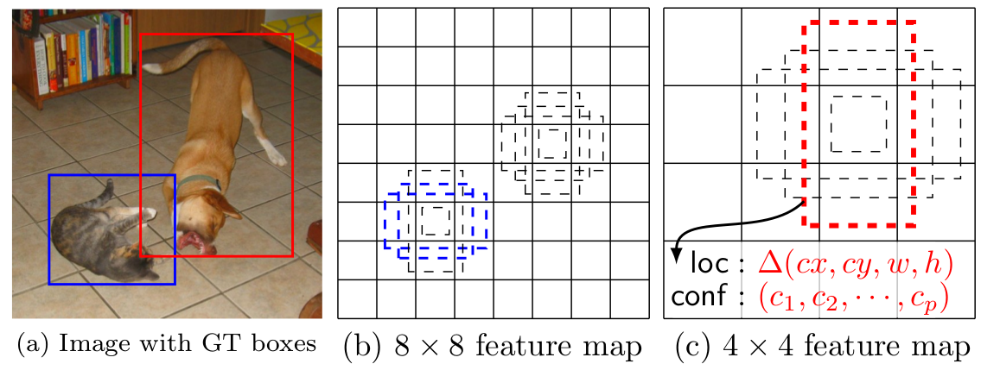
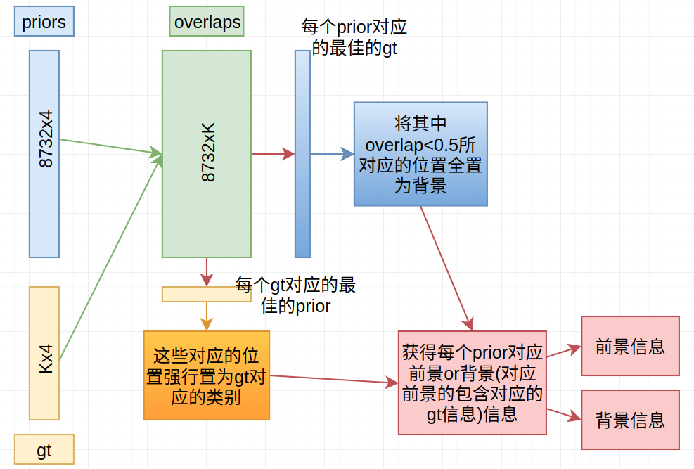
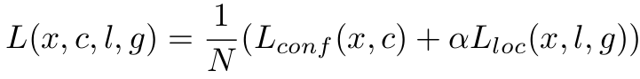
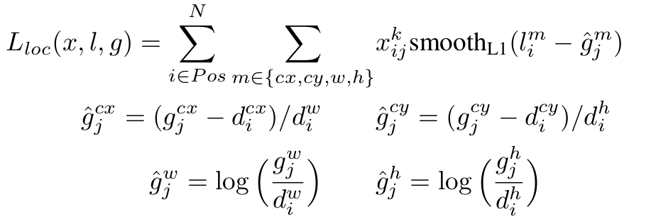
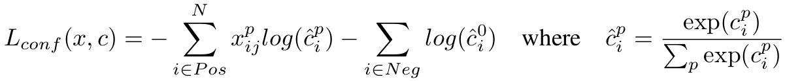
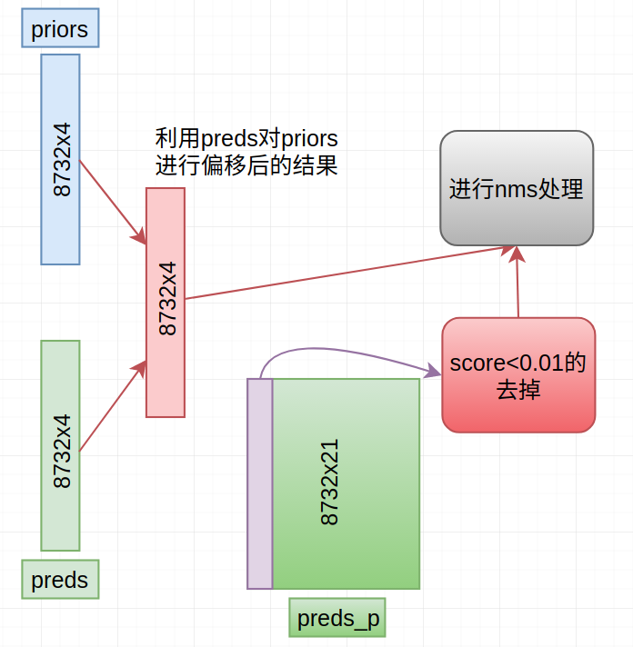
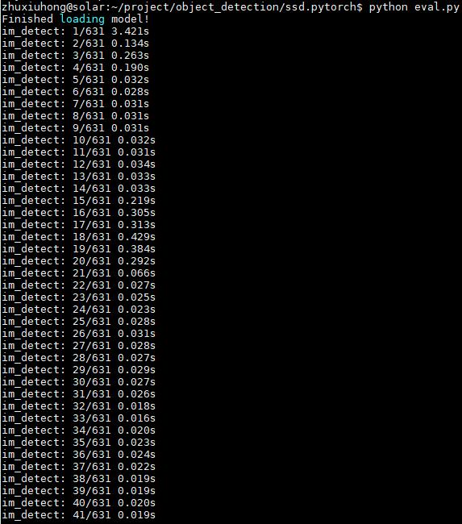
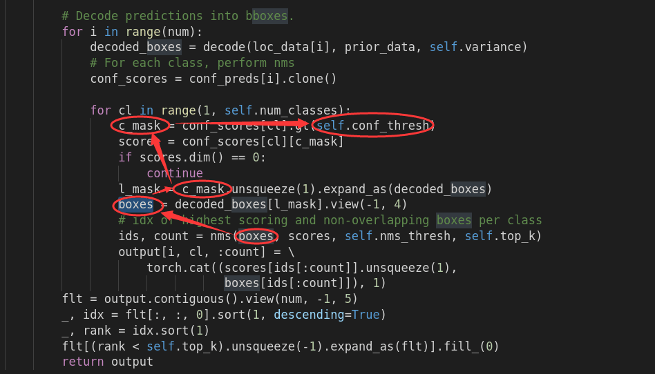

# SSD(Single Shot MultiBox Detector)

> 说明：如果对这个结构比较熟，请直接跳到 **3.常问问题** 部分（请加上你认为会问到的问题）

## 1. 思想

主要的贡献：

1. 在不同的feature maps上面去预测类别和位置补偿信息，从而能够"缓解"YOLO难以检测到小目标物体的问题。

## 2. 主要框架

说明：

1. 总过有6个feature maps出来，每个后续都会接两个卷积来获得类别和位置信息（类别信息：$(h*w)\times 21$，位置信息：$(h\times w)\times 4$ ----其中21代表VOC上的20类+背景，h和w则为此特征feature map的大小）
2. 第一个feature map后面接有一个L2Norm层
3. 6个feature maps上面每个位置对应的anchor分别为为$(4,6,6,6,4,4)$个
4. 总共相当于有8732($38*38*4+19*19*6+10*10*6+5*5*6+3*3*4+1*1*4=8732$)个位置和类别信息信息
5. 一般实现的时候会先提取出8732x4个priors（可以视为模板框框，与每个feature maps上的每个位置一一对应）

> 这些模板框框如下图所示：
>
> 
>
> 具体实现时采用的anchor情况：
>
> h1=min, h2=sqrt(min, max) （不同feature map上面的min和max取得不同---大致和scale比例成正比）
>
> - 4个的情况：`(h1, h1)，(h2, h2)，(h1*sqrt(2), h1/sqrt(2))，(h1/sqrt(2), h1*sqrt(2))`
> - 6个的情况：`(h1, h1)，(h2, h2)，(h1*sqrt(2), h1/sqrt(2))，(h1/sqrt(2), h1*sqrt(2))，(h1*sqrt(3), h1/sqrt(3))，(h1/sqrt(3), h1*sqrt(3))`

### 2.1 训练阶段

根据ground truth和priors，按照下述流程获得对应的前景和背景信息（相当于8732个prior对应前景or背景的信息）：

（注：前景包含的信息---对应gt的类别，以及从prior到gt的位置偏移）

有了这些信息，就可以来定义损失函数了：

#### 位置损失（只针对前景信息）

（注：1. 其中的d指的是prior信息，g指的是gt信息，l代表网络输出信息  2. 对应的$\hat{g}$在具体实现时经过了“放大”，g_x,g_y放大了10倍，g_w,g_h放大了5倍）

#### 类别损失

在具体实现时采取**正样本：负样本=1:3**的比例。采用OHEM策略来获取负样本（选择使得损失最大的前3*pos个负样本），因此类别损失如下：

（其实就是cross-entropy：但在具体实现时，是先计算每个prior对应的类别损失，再对负样本中的损失进行排序，选择最大的3*pos个）

### 2.2 测试阶段

说明：

1. 对priors进行偏移是需要将训练时采用的“放大”策略“缩小”回去
2. preds_p相对训练阶段，经过了softmax处理
3. 上述紫色部分代表对每个类别均进行上述处理
4. nms处理采用的IOU阈值为0.45
4. 最后保留下来的所有框框只取得分高的前200个
5. 在后续输出时，会只显示score大于0.6的框框。（此处不加这个约束主要为了mAP测量）

## 3. 常问问题

**Q1：为什么对第一个feature map采用L2Norm操作？**

A1：主要因为[ParseNet](http://www.cs.unc.edu/~wliu/papers/parsenet.pdf)这篇文章指出conv4_3相比较于其他的layers，有着不同的feature scale，因此使用L2Norm方式将此层缩小到和其他feature map相近的scale

**Q2：为什么在位置损失时采用variance进行放大？**

A2：除以variance是对预测box和真实box的误差进行放大，从而增加loss，增大梯度，加快收敛。（其实这个具体真的有没有用个人看作者也没给出非常好的解释）

> 可以参考：[caffe社区](http://www.caffecn.cn/?/question/640)，[原作者github](https://github.com/weiliu89/caffe/issues/155)

**Q3：priors中负样本远远多于正样本数目，如何解决样本不均衡问题？**

A3：强行将正负样本数目固定到`pos:neg=1:3`（注：其实在训练阶段，每次迭代时进入损失的boxes数目是不同的）。此外可以再拓展一下，说明采用**OHEM**类似的策略来选择这些负样本

**Q4：为什么不同feature map上面采用的anchor数目不同？**

A4：论文中对第1个和最后2个(38x38, 3x3, 1x1)采用4个anchor，而其他feature maps采用6个anchor。主要基于的考虑是小目标(38x38对应)和大目标(3x3和1x1对应)在实际图片中所占的比例相对会比较少，因此可以采用少点的anchor，减少参数。

**Q5：为什么不将SSD用于小目标检测？【大疆一面问题】** 

A5：请参考[为什么SSD(Single Shot MultiBox Detector)对小目标的检测效果不好？](https://www.zhihu.com/question/49455386/answer/117198011)

> 个人认为还不错的解释：① 前面浅层的情况虽然位置信息强，但语义信息不足；后面层语义信息强，位置信息不足；这就导致还是很难定位小目标---解决方案DSSD，FPN等  ② 候选anchors被划分为大物体的概率要明显大于小物体 (根据IoU的话)---个人感觉SNIP这篇文章给出了不错的解释

**Q6：同样是resize到300*300，测试不同的单张图片时SSD为什么存在比较大时间差异？** （问这个问题就太无聊了！）

A6：处理第一张图片，存在参数初始化问题，所以时间长；

后续时间差异主要原因在**非极大值抑制**处理上，具体流程如下：

default box --> 经过阈值筛选后的box --> nms --> output

即不同测试图片经过阈值筛选后剩下的box的个数可能不一样，导致nms存在处理时间的差异

参考代码说明：

**Q7：特征图的channels怎么表示同一个空间大小的特征信息？** 

A7：可以通过卷积里面的参数学习到具体不同box的位置信息