# YOLO系列

> 这部分大部分内容拷贝自: [YOLO论文总结](https://xmfbit.github.io/2017/02/04/yolo-paper/)（这娃写的太好了，我就主要补充常见问题）。老规矩，熟悉的话直接看最后的**常见问题**

## 1. YOLO v1

> 我们提出了一种新的物体检测方法YOLO。之前的目标检测方法大多把分类器重新调整用于检测（这里应该是在说以前的方法大多将检测问题看做分类问题，使用滑动窗提取特征并使用分类器进行分类）。我们将检测问题看做回归，分别给出bounding box的位置和对应的类别概率。对于给定输入图像，只需使用CNN网络计算一次，就同时给出bounding box位置和类别概率。由于整个pipeline都是同一个网络，所以很容易进行端到端的训练。
> YOLO相当快。base model可以达到45fps，一个更小的model（Fast YOLO），可以达到155fps，同时mAP是其他可以实现实时检测方法的两倍。和目前的State of the art方法相比，**YOLO的localization误差较大，但是对于背景有更低的误检（False Positives）**。同时，YOLO能够学习到更加泛化的特征，例如艺术品中物体的检测等任务，表现很好。

和以往较为常见的方法，如HoG+SVM的行人检测，DPM，RCNN系方法等不同，YOLO接受image作为输入，直接输出bounding box的位置和对应位置为某一类的概率。（我们可以把它和目前的State of the art的Faster RCNN方法对比。Faster RCNN方法需要两个网络RPN和Fast RCNN，其中前者负责接受图像输入，并提出proposal。后续Fast RCNN再给出这些proposal是某一类的概率。）也正是因为这种"直来直去"的方法，YOLO才能达到这么快的速度。也真是令人感叹，网络参数够多，数据够多，什么映射关系都能学出来。。。下图就是YOLO的检测系统示意图。在test阶段，经过单个CNN网络前向计算后，再经过非极大值抑制，就可以给出检测结果。

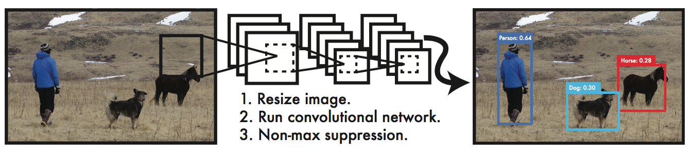

### 1.1 基本思想

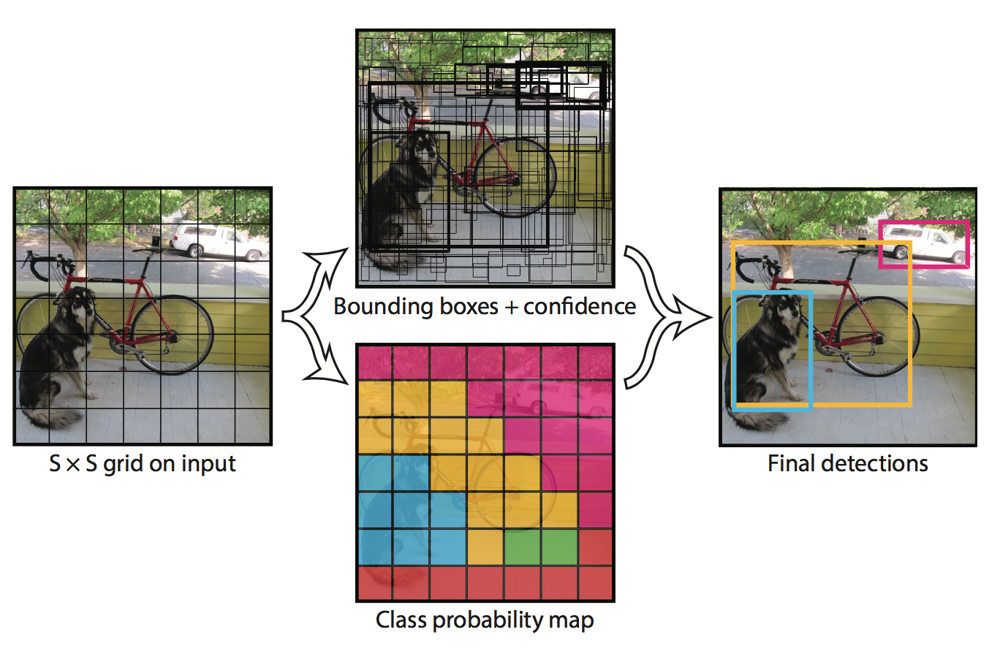

- 网格划分：将输入image划分为$S\times S$个grid cell，如果image中某个object box的中心落在某个grid cell内部，那么这个cell就对检测该object负责（responsible for detection that object）。同时，每个grid cell同时预测$B$个bounding box的位置和一个置信度。这个置信度并不只是该bounding box是待检测目标的概率，而是该bounding box是待检测目标的概率乘上该bounding box和真实位置的IoU的积。通过乘上这个交并比，反映出该bounding box预测位置的精度。如下式所示：
  $$
  \text{confidence} = P(\text{Object})\times \text{IoU}_{\text{pred}}^{\text{truth}}
  $$

- 网络输出：每个bounding box对应于5个输出，分别是$x,y,w,h$和上述提到的置信度。其中，$x,y$代表bounding box的中心离开其所在grid cell边界的偏移。$w,h$代表bounding box真实宽高相对于整幅图像的比例。$x,y,w,h$这几个参数都已经被bounded到了区间$[0,1]$上。除此以外，每个grid cell还产生$C$个条件概率，$P(Classi|Object)$。注意，我们不管$B$的大小，每个grid cell只产生一组这样的概率。在test的非极大值抑制阶段，对于每个bounding box，我们应该按照下式衡量该框是否应该予以保留。
  $$
  \text{confidence}\times P(\text{Class}_i|\text{Object}) = P(\text{Class}_i)\times \text{IoU}_{\text{pred}}^{\text{truth}}
  $$

- 实际参数：在PASCAL VOC进行测试时，使用$S=7, B=2$。由于共有20类，故$C=20$。所以，我们的网络输出大小为$7×7×30$

### 1.2 网络模型结构

Inspired by GoogLeNet，但是没有采取inception的结构，简单地使用了$1×1$的卷积核。base model共有24个卷积层，后面接2个全连接层，如下图所示。

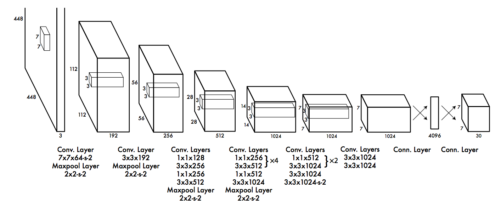

另外，Fast YOLO使用了更小的网络结构（9个卷积层，且filter的数目也少了），其他部分完全一样。

### 1.3 训练

同很多人一样，这里作者也是先在ImageNet上做了预训练。使用上图网络结构中的前20个卷积层，后面接一个average-pooling层和全连接层，在ImageNet 1000类数据集上训练了一周，达到了88%的top-5准确率。

由于[Ren的论文](https://arxiv.org/abs/1504.06066)提到给预训练的模型加上额外的卷积层和全连接层能够提升性能，所以我们加上了剩下的4个卷积层和2个全连接层，权值为随机初始化。同时，我们把网络输入的分辨率从$224×224$提升到了$448×448$。

在最后一层，我们使用了线性激活函数；其它层使用了leaky ReLU激活函数。(参数设为0.1)

很重要的问题就是定义很好的loss function，为此，作者提出了以下几点说明：

- loss的形式采用误差平方和的形式（真是把回归进行到底了。。。）
- 由于很多的grid cell没有目标物体存在，所以给有目标存在的bounding box和没有目标存在的bounding box设置了不同的比例因子进行平衡。具体来说：$\lambda_{coord}=5,\lambda_{noobj}=0.5$
- 直接使用$w$和$h$，这样大的box的差异在loss中占得比重会和小的box不平衡，所以这里使用$\sqrt{w}$和$\sqrt{h}$。
- 上文中已经提到，同一个grid cell会提出多个bounding box。在training阶段，我们只想让一个bounding box对应object。所以，我们计算每个bounding box和ground truth的IoU，以此为标准得到最好的那个bounding box，其他的认为noobj。

> 其中很重要的一点：只有Confidence有涉及到noobj --- 所以该"结果"其实是很影响最终性能的

loss函数的具体形式见下图（实在是不想打这一大串公式。。）。其中，$\mathbb{1}_i$表示是否有目标出现在第$i$个grid cell。$\mathbb{1}_{i,j}$表示第$i$个grid cell的第$j$个bounding box是否对某个目标负责。

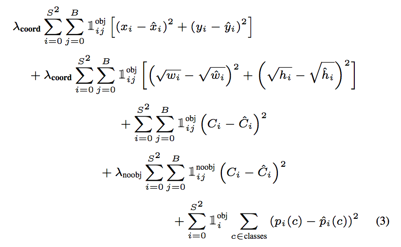

（说明：对于noobj的时候 $\hat{C_i}=0$，而关于obj的时候$\hat{C_i}=1$或者等于IOU: 实现时有选项，但个人更偏向于觉得采用1更合理。）

## 2. YOLO v2

YOLO V2是原作者在V1基础上做出改进后提出的。为了达到题目中所称的Better，Faster，Stronger的目标，主要改进点如下。当然，具体内容还是要深入论文。

- 受到Faster RCNN方法的启发，引入了anchor。同时使用了K-Means方法，对anchor数量进行了讨论，在精度和速度之间做出折中；
- 修改了网络结构，去掉了全连接层，改成了全卷积结构；
- 引入了WordTree结构，将检测和分类问题做成了一个统一的框架，并充分利用ImageNet和COCO数据集的数据。

下面，还是先把论文的摘要意译如下：

> 我们引入了YOLO 9000模型，它是实时物体检测的State of the art的工作，能够检测超过9K类目标。首先，我们对以前的工作（YOLO V1）做出了若干改进，使其成为了一种在实时检测方法内在PASCAL VOC和COCO上State of the art的效果。通过一种新颖的多尺度训练方法（multi-scale training method）， YOLO V2适用于不同大小尺寸输入的image，在精度和效率上达到了很好地trade-off。在67fps的速度下，VOC2007上达到了76.8mAP的精度。40fps时，达到了78.6mAP，已经超过了Faster RCNN with ResNet和SSD的精度，同时比它们更快！最后，我们提出了一种能够同时进行检测任务和分类任务的联合训练方法。使用这种方法，我们在COCO detection dataset和ImageNet classification dataset上同时训练模型。这种方法使得我们能够对那些没有label上detection data的数据做出detection的预测。我们使用ImageNet的detection任务做了验证。YOLO 9000在仅有200类中44类的detection data的情况下，仍然在ImageNet datection任务中取得了19.7mAP的成绩。对于不在COCO中的156类，YOLO9000成绩为16.0mAP。我们使得YOLO9000能够在保证实时的前提下对9K类目标进行检测。

根据论文结构的安排，对论文提出的各条改进措施进行介绍。

### 2.1 主要的改进

在YOLO V1的基础上，作者提出了不少的改进来进一步提升算法的性能（mAP），主要改进措施包括网络结构的改进（第1，3，5，6条）和Anchor Box的引进（第3，4，5条）以及训练方法（第2，7条）。

### 改进1：引入BN层（Batch Normalization）

Batch Normalization能够加快模型收敛，并提供一定的正则化。作者在每个conv层都加上了了BN层，同时去掉了原来模型中的drop out部分，这带来了2%的性能提升。

### 改进2：高分辨率分类器（High Resolution Classifier）

YOLO V1首先在ImageNet上以$224×224$大小图像作为输入进行训练，之后在检测任务中提升到$448×448$。这里，作者在训练完224大小的分类网络后，首先调整网络大小为$448×448$，然后在ImageNet上进行fine tuning（10个epoch）。也就是得到了一个高分辨率的cls。再把它用detection上训练。这样，能够提升4%。

### 改进3：引入Anchor Box

YOLO V1中直接在CNN后面街上全连接层，直接回归bounding box的参数。这里引入了Faster RCNN中的anchor box概念，不再直接回归bounding box的参数，而是相对于anchor box的参数。

作者去掉后面的fc层和最后一个max pooling层，以期得到更高分辨率的feature map。同时，darknet网络接受$416×416$（而不是448）大小的输入image。这是因为我们想要最后的feature map大小是奇数，这样就能够得到一个center cell（比较大的目标，更有可能占据中间的位置）。由于YOLO conv-pooling的效应是将image downsamplig 32倍，所以最后feature map大小为$416/32=13$。

与YOLO V1不同的是，我们不再对同一个grid cell下的bounding box统一产生一个数量为$C$的类别概率，而是对于每一个bounding box都产生对应的$C$类概率。和YOLO V1一样的是，我们仍然产生confidence，意义也完全一样。

使用anchor后，我们的精度accuracy降低了，不过recall上来了。（这也较好理解。原来每个grid cell内部只有2个bounding box，造成recall不高。现在recall高上来了，accuracy会下降一些）。

### 改进4：Dimension Cluster

在引入anchor box后，一个问题就是如何确定anchor的位置和大小？Faster RCNN中是手工选定的，每隔stride设定一个anchor，并根据不同的面积比例和长宽比例产生9个anchor box。在本文中，作者使用了聚类方法对如何选取anchor box做了探究。这点应该是论文中很有新意的地方。

这里对作者使用的方法不再过多赘述，强调以下两点：

- 作者使用的聚类方法是K-Means；

- 相似性度量不用欧氏距离，而是用IoU，定义如下：
  $$
  d(\text{box}, \text{centroid}) = 1-\text{IoU}(\text{box}, \text{centroid})
  $$

使用不同的$k$，聚类实验结果如下，作者折中采用了$k=5$。而且经过实验，发现当取$k=9$时候，已经能够超过Faster RCNN采用的手工固定anchor box的方法。下图右侧图是在COCO和VOC数据集上$k=5$的聚类后结果。这些box可以作为anchor box使用。

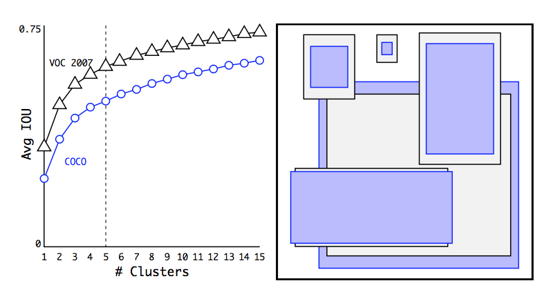

### 改进5：直接位置预测（Direct Location Prediction）

我们仍然延续了YOLO V1中的思路，预测box相对于grid cell的位置。使用sigmoid函数作为激活函数，使得最终输出值落在$[0,1]$这个区间上。

在output的feature map上，对于每个cell（共计$13×13$个），给出对应每个bounding box的输出$t_x,t_y,t_w,t_h$, 。每个cell共计$k=5$个bounding box。如何由这几个参数确定bounding box的真实位置呢？见下图。

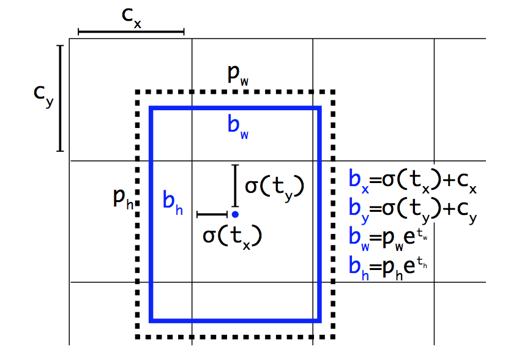

设该grid cell距离图像左上角的offset是$(c_x,c_y)$，那么bounding box的位置和宽高计算如下。注意，box的位置是相对于grid cell的，而宽高是相对于anchor box的。(即$p_w,p_h$是anchor box)

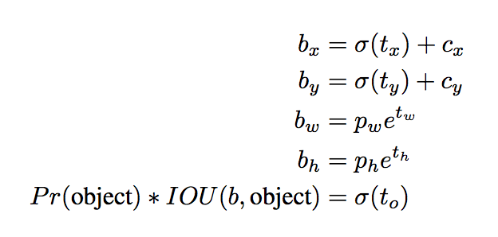

### 改进6：Fine-Gained Features

这个trick是受Faster RCNN和SSD方法中使用多个不同feature map提高算法对不同分辨率目标物体的检测能力的启发，加入了一个pass-through层，直接将倒数第二层的$26×26$大小的feature map加进来。

在具体实现时，是将higher resolution（也就是$26×26$）的feature map stacking在一起。比如，原大小为$26×26×512$的feature map，因为我们要将其变为$13×13$大小，所以，将在空间上相近的点移到后面的channel上去，如下图所示（Reorg_Layer）

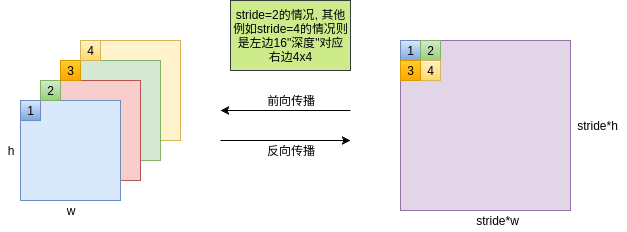

（说明：结合的方式是将高分辨层先卷积减少通道数再Reorg_Layer获得的结果和低分辨层进行concat，之后再卷积一次）

### 改进7：多尺度训练（Multi-Scale Training）

在实际应用时，输入的图像大小有可能是变化的。我们也将这一点考虑进来。因为我们的网络是全卷积神经网络，只有conv和pooling层，没有全连接层，所以可以适应不同大小的图像输入。所以网络结构上是没问题的。

具体来说，在训练的时候，我们每隔一定的epoch（例如10）就随机改变网络的输入图像大小。由于我们的网络最终降采样的比例是32，所以随机生成的图像大小为32的倍数，即$\{320,352,…,608\}$。

在实际使用中，如果输入图像的分辨率较低，YOLO V2可以在不错的精度下达到很快的检测速度。这可以被用应在计算能力有限的场合（无GPU或者GPU很弱）或多路视频信号的实时处理。如果输入图像的分辨率较高，YOLO V2可以作为state of the art的检测器，并仍能获得不错的检测速度。对于目前流行的检测方法（Faster RCNN，SSD，YOLO）的精度和帧率之间的关系，见下图。可以看到，作者在30fps处画了一条竖线，这是算法能否达到实时处理的分水岭。Faster RCNN败下阵来，而YOLO V2的不同点代表了不同输入图像分辨率下算法的表现。对于详细数据，见图下的表格对比（VOC 2007上进行测试）。

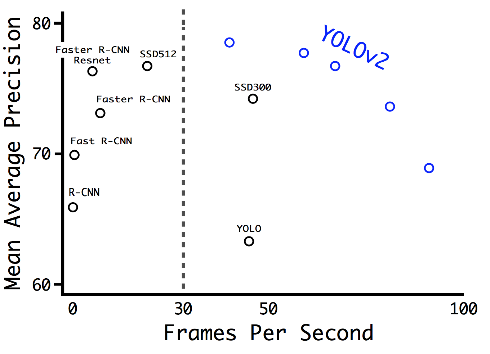

### 总结

在Better这部分的末尾，作者给出了一个表格，指出了主要提升性能的措施。例外是网络结构上改为带Anchor box的全卷积网络结构（提升了recall，但对mAP基本无影响）和使用新的网络（计算量少了~33%）。

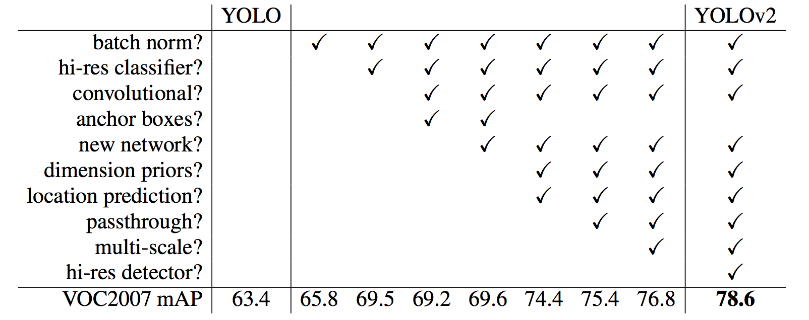

### 2.2 训练

首先给出输入的一些处理（仅仅列出个人在移植官方参数时碰到的情况）：

1. 输入采用RGB，而非BGR（采用`OpenCV`库时要小心）
2. 输入并没有减去均值（在SSD等网络结构都是减去均值的）
3. 图像像素值缩放到了0-1，而不是0-255

### 损失函数

关于obj与noobj的划分可以通过下图来说明：

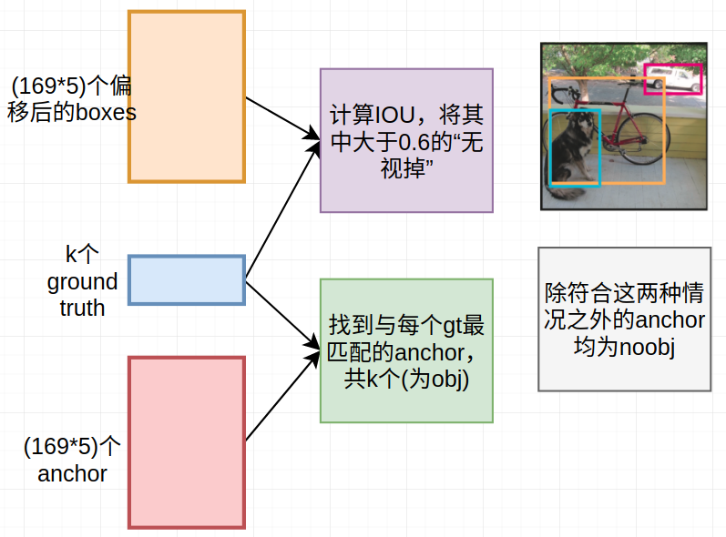

位置损失：（其实就是K个进行sum）
$$
L_{loc}=\sum_{obj}[(t_x-\sigma(p_x))^2+(t_y-\sigma (p_y))^2+(t_h-p_h)^2+(t_w-p_w)^2]
$$
类别损失：（其实其中x有K个）
$$
L_{cls}= \sum_{obj}-\log\left(\frac{\exp(x[class])}{\sum_j \exp(x[j])}\right)
$$
Confidence损失：
$$
L_{conf}=5\times \sum_{obj}(C_i-1)^2+\sum_{noobj}(C_i-0)^2
$$

> 实现上的几个注意事项：
>
> 1. 由于可以发现损失均没有经过avg操作，所有损失的大小其实是和batch_size近似呈正比，因此学习率要除以batch_size，不然不同batch_size下容易发散
> 2. 在训练时，前几轮要进行warm处理。所谓的warm就是前几轮令所有的anchors尽量往其所在的cell的中心去靠，即$\sigma(p_x),\sigma(p_y)$尽可能等于0.5，而$p_h,p_w$尽可能等于0（具体实现就是coord_mask默认置为1，而非0）

## 3. YOLO v3

直接给出整体架构的图：

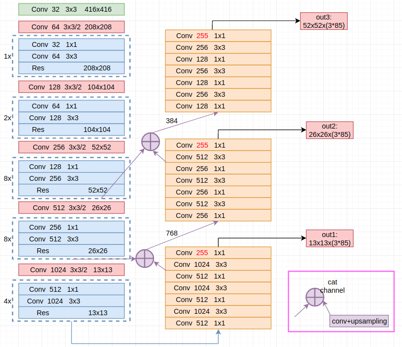

（注：其中每个Conv代表Conv2d+BN+Leaky ReLU，除了最后加红的255卷积就仅仅只是Conv）

### 几大改进

1. 采用更深的网络：darknet53（借鉴ResNet）
2. 使用多尺度预测：借鉴FPN（即对应图中3个out）
3. 分类预测：不用softmax做分类了，而是使用独立的logisitc做二分类。这种方法的好处是可以处理重叠的多标签问题，如Open Image Dataset。在其中，会出现诸如`Woman`和`Person`这样的重叠标签。（即一个位置可以含有多个类别）

作者还贴心地给出了什么方法没有奏效。

- anchor box坐标(x,y)的预测。预测anchor box的offset，no stable，不好。
- 线性offset预测，而不是logistic。精度下降。
- focal loss。精度下降。
- 双IoU阈值，像Faster RCNN那样。效果不好。

## 4. 常见问题

**Q1：为什么说YOLO这类One-Stage的方法是回归，而Faster RCNN等Two-Stage的方法是分类？**

A1：这个问题其实我也有点纳闷。我理解的角度就是Two-Stage认为回归是指先筛选出一堆Proposal（而筛选其实就可以看成二分类问题），而One-Stage没有采用这种方式，而是直接对所有的Boxes(Proposal)进行处理

**Q2：关于YOLO的损失函数？**

A2：这部分看前面的介绍，主要抓住noobj和obj如何划分，以及noobj只针对Confidence即可。（需说明一点，在YOLOv1和YOLOv2里面各项参数之前的系数已经发生了改变）

> 关于这类方法在小目标上面效果不好的原因：

**Q3：YOLO到YOLOv3的改进**

A3：① 从bone网络结构来看：YOLOv1采用Inspired by GooLeNet；YOLOv2采用darknet19；YOLOv3采用darknet53；（这种网络结构设计，作者一方面是借鉴比较新的网络结构，另一方面主要是站在运算速度上面来考虑---GPU利用率最大化）  ② 损失函数上面来看：YOLOv1全程回归损失（尤其注意下x,y,w,h上面的处理）；YOLOv2则对类别采用CrossEntropy以及对位置损失采用类似Faster RCNN里面的“处理方式”；YOLOv3则在类别上面，对每个类别做二分类处理   ③ 一些训练技巧方面：这部分主要可以说利用K-mean获得anchors，以及多尺度输入等