> 论文地址：[DenseBox: Unifying Landmark Localization with End to End Object Detection](https://arxiv.org/abs/1509.04874)
>
> 参考自：[DenseBox slide](https://www.slideshare.net/ssuser2b0431/densebox)

#DenseBox: Unifying Landmark Localization with End to End Object Detection

> 摘要：我们如何利用单个全卷积网络（FCN）来处理目标检测任务呢？在这里，作者提出了DenseBox，能够直接用FCN预测类别和位置信息，且可以进行端到端的训练（类似YOLO的框架）。这篇文章的主要贡献有两方面：1. 只要小心地设计和优化，单个FCN也能够很好的进行目标检测  2. 进行多任务学习（在这里作者结合landmark localization）可以进一步提高DenseBox的性能。作者分别在MALF人脸检测数据集和KITTI车辆检测数据集上进行实验，均取得了很好的结果。
>

## 1. 结构和原理

整体结构如下所示：

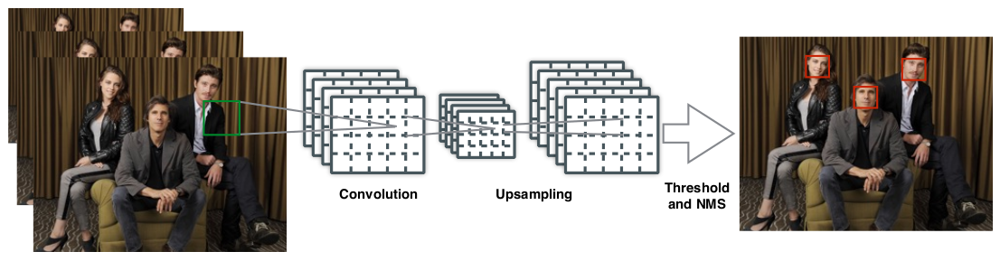

说明：1. 在测试阶段采用Image pyramid结构（但是训练阶段，single image） 2. 经过一系列卷积，池化，上采样操作后输出最后的feature map（大小为$H/4\times W/4\times 5$） 3. 将最后的feature map转化为bounding boxes，并过滤掉低于阈值的框框，以及运用NMS去除重叠情况。

下面针对算法进行详细的介绍。

#### ① Ground-Truth的选择

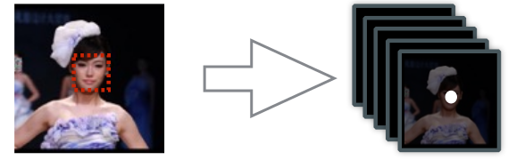

首先，我们知道最后的feature map为$H/4\times W/4\times 5$，这五个通道代表的含义为：

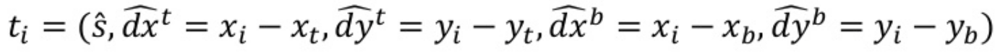

- $\hat{s}$：是否包含物体的得分
- $\hat{dx}^t,...,\hat{dy}^t$：代表当前坐标与target左上角和右下角的"距离"

下面我们就来说明训练图片的产生方法：

- 我们裁剪一块大小为$240\times 240$且以检测物体中心（利用label确定）为中心的块，那么经过卷积操作最后输出为$60\times 60\times 5$的feature map（因为经过了4倍的下采样）
- $\hat{s}$对应label的确定：我们令检测物体中心半径$r_c$范围内的位置为1，其他位置为0（$r_c$设置为物体框框大小的0.3）
- 位置label的确定：这个很简单，就是根据上面式子的定义即可

> 这样我们其实就以及明确了ground truth --- 即5个通道对应的label具体是什么
>
> 1. 需要注意的点：如果一个patch里面存在多个人脸，那么如果它的中心落在"原本的face box" （0.8~1.25）范围内就也将其视为正样本，否则无视掉

#### ② 模型设计

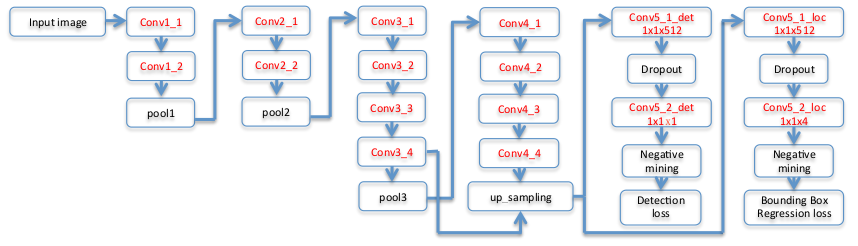

这幅图其实画的"挺乱"的，其实和YOLO的主干基本一样：

1. backbone采用VGG的前面几层
2. 将conv3_4和conv4_4进行融合，再上采样一次
3. 最后两路分支其实就是一路，输出$H/4\times W/4\times 5$

#### ③ 损失函数

分类损失：

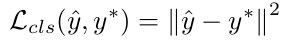

> 至于为什么不使用hingle loss或者cross-entropy，没为什么....作者就是任性，且效果也不错

位置损失：

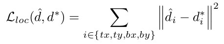

下面在具体实现时的"处理"（主要为了样本平衡和训练收敛）：

1. 忽略"灰色地带"：灰色地带定义为所有正样本（见①中定义方式）附近2个像素点的负样本。$f_{ign}=1$代表当前位置为灰色地带
2. Hard Negative Mining：保证正负样本比例为$1:1$（且负样本中有一半来自"最困难的负样本"，另一半随机从负样本中选择）$f_{sel}=1$代表被选中的负样本

有了上述的处理，我们真正选中的"位置"其实就可以用一个Mask来表示：

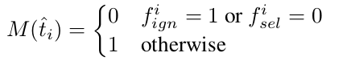

因此总的损失函数如下所示（只考虑正样本的位置损失）：

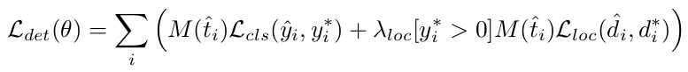

> 其中的$\lambda_{loc}$在这里取3

#### ④ Refine with Landmark Localization

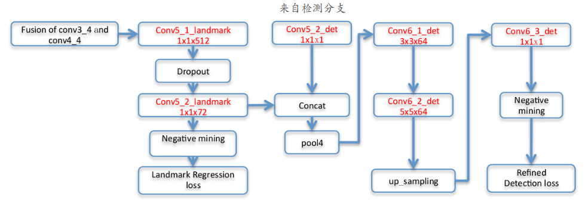

其实别想复杂了，就是一个网络架构两路分支，分别处理两个任务：目标检测+landmark localization。而两个任务联合训练能够提示目标检测性能（主要增强了分类性能 --- 这种联合结构你可以想想Mask-RCNN就好）

联合训练的损失函数如下：

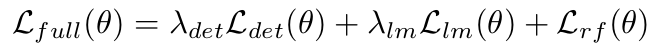

## 2. 实验分析

在MALF数据集上的结果：

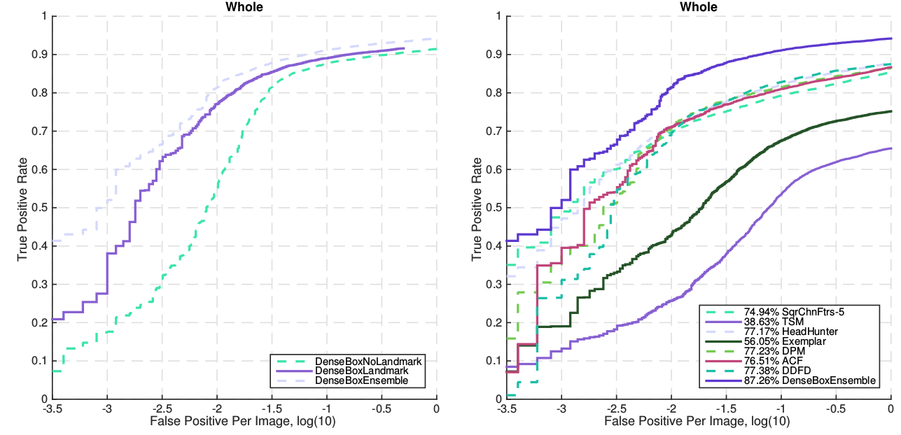

#### 实验效果图

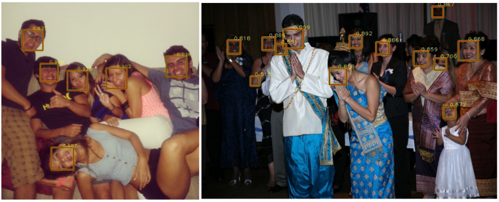

