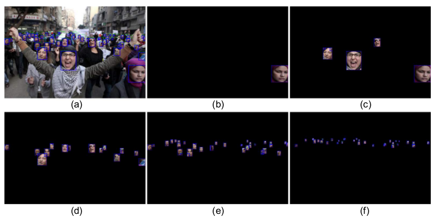

> 论文地址：[Face Attention Network: An Effective Face Detector for the Occluded Faces](https://arxiv.org/abs/1711.07246)
>
> 代码地址：[github](https://github.com/rainofmine/Face_Attention_Network)

#Face Attention Network: An Effective Face Detector for the Occluded Faces

> 摘要：随着深度卷积网络的运用，人脸检测已经取得了非常大的提高。但是，如何克服遮挡问题依旧是个挑战（比如戴口罩或者戴太阳眼镜都会带来影响）。一般而言，提升解决遮挡的能力往往会带来误检的风险（即将背景识别为人脸）。在这篇文章中，作者提出了一种新的人脸检测网络：Face Attention Network （FAN），这个结构能够在保证速度的前提下，显著提升存在遮挡情况下人脸检测的召回率（TP/(FN+TP)） 。尤其是提出了anchor层面的注意力机制，能够突出人脸区域的特征。结合采用的anchor分配策略和数据增强方法，作者在人脸检测公开数据集WiderFace和MAFA上均取得了当前最好的性能。

## 1. 结构和原理

作者采用的整个结构是基于[RetinaNet](https://arxiv.org/abs/1708.02002)，在上面的基础上再加上Attention模块。整体结构如下所示：

说明：

1. 此处为了可视化方便，只画出了三个detector layers；实际作者的实验中采用的是5个detector layers（即上图中右边cls+reg+attention subnets分支有5个）。而选择的detector layers对应的大小为：`[H/8, W/8], [H/16, W/16], [H/32, W/32], [H/64, W/64], [H/128, W/128] `（后续我们将其标记为`l3, l4, l5, l6, l7`）
2. 其中的$A$代表每个位置的anchor个数，论文中为6（2种ratios和3种scales，但是代码中采用的是3种ratios和3种scales）
3. 预测阶段，最后的结果还需要经过NMS处理

下述对每一些细节进行阐述和说明。

#### ① Attention Subnet

首先先说明这部分设计的原则：

1. 将不同大小的人脸分配到不同的特征层
2. 突出人脸部分的特征，而将人人脸部分的特征"消减"
3. 产生更多的遮挡来帮助训练

从上图我们非常容易看出这部分的结构输出的是$H\times W\times 1$（和feature map同样大小），此处它们的作用非常类似分割问题里面的mask（只是是二分类的情况），我们希望它们能够帮助遮挡住非人脸的部分。如下图所示为我们希望attention部分学的ground truth：

> 其中的(b)~(f)分别对应l7~l3的分支，我们将所有的ground truth划分为5部分；（**具体多少到多少划分到哪一级需要查看代码**）
>
> 其实我们可以简单的认为$H\times W\times 1$的ground truth就是一张0-1的图（上面有人头的地方是1，没有人头的地方是0）

那么attention loss就非常简单了：
$$
L_{attention}=\sum_k BCELoss(m_k, m_k^\star)
$$

> 其中的$m_k^\star$为ground truth（0-1的值）

下面是几点说明：

1. 这么做的好处：比如一个戴着太阳镜的人，脸的其他部分基本可以看做只有皮肤，如果我们的network具备识别出这部分，很容易将人体其他部分误检为人脸。而将attention只关注到脸上就能大大减少误检的情况
2. 最后将该"attention mask"与feature map相乘时经过了exp处理：主要是为了进一步突出人脸部分

下图是真实实验时，attention部分学到的"mask"：

#### ② Anchor分配策略

首先，作者利用WiderFace数据集来查看ground truth的大小分布，如下图所示：

很容易可以发现，80%的人脸大小集中在16~406的大小之间。所以作者在不同特征分支上采用的anchors大小为$16^2\sim 406^2$（在代码中采用的分别是$32^2,64^2,128^2,256^2,512^2$）

此外每个位置的anchor又进行了一定的缩放，论文中采用的为：

1. 缩放比例：$1,2^{1/3},2^{2/3}$（这就能保证每个ground truth至少与一个anchor的IoU大于等于0.6）
2. 长宽比例：$1:1,1.5:1$（主要基于人脸一般采用正方型，但是正常而言，人脸可得要长>宽 --- 代码中采用$1:1,1:1.5,1:2$三种比例）

再具体实验中，将与Ground truth的IoU大于0.5的设为正样本，小于0.4的设为负样本，其他的忽略掉

#### ③ 数据集增强

1. 为了进一步增加遮挡的情况（真实数据集里面大概只有16%的情况存在遮挡），我们会刻意对ground truth进行遮挡，挡住范围为$[0.3,1]$（这部分可能个人理解错了）
2. 随机翻转
3. 色彩对比度调整等

#### ④ 损失函数

1. 其中的$L_c$为分类损失（0-1分类），采用focal loss
2. 其中的$L_r$为回归损失（只针对ground truth），采用L1损失
3. 其中的$L_a$为attention损失，采用sigmoid cross entropy

## 2. 实验分析

#### ① Anchor设置的比较

作者比较了三种anchor的策略

- RetinaNet setting：采用和RetinaNet相同的Anchor设置
- Dense Setting：每个位置采用8个anchor（每个位置4种尺寸和2种比例 --- 所以全部的anchor变为$8^2\sim 645^2$ --- 因为4种尺寸相当于$\times 1,\times 2^{1/3},\times 2^{2/3},\times 2$）
- Our FAN Baseline：该实验采用的设定

我们可以发现，anchor setting对结果影响很大，尤其是对hard的情况

#### ② Attention mechanism

采用Attention机制在两个数据集上的表现（左WiderFace，右MAFA）

我们可以发现attention机制能够帮助在"困难"情况上取得更好的效果

#### ③ 数据集增强

采用不同的"策略"对于性能的提升：

#### ④ 一些实验效果

