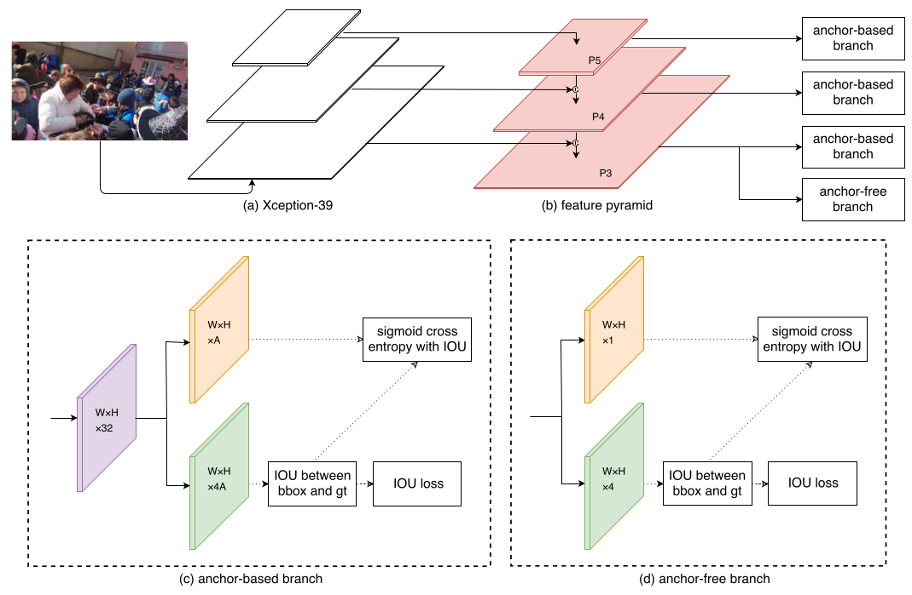
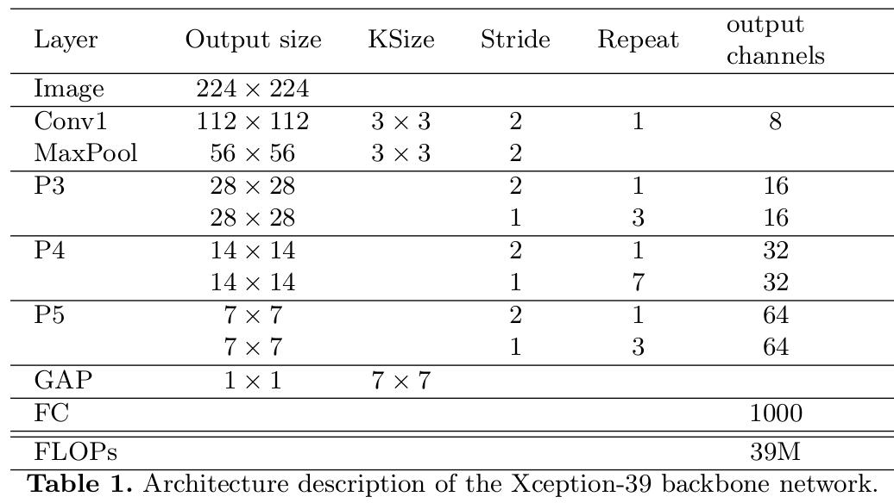
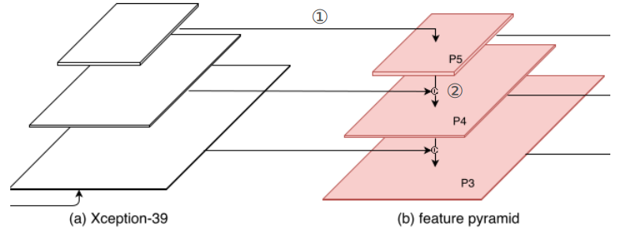
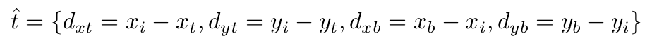
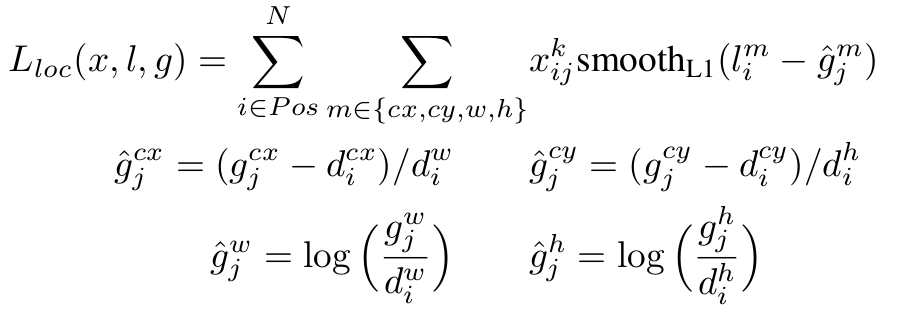
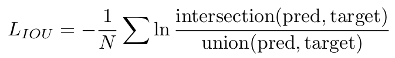
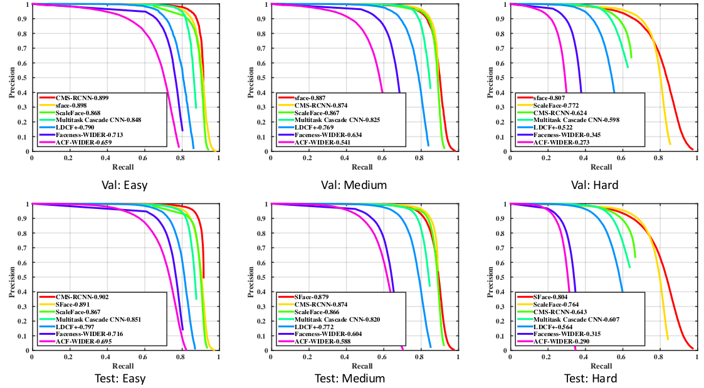
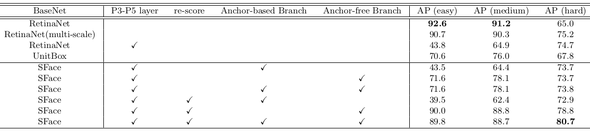
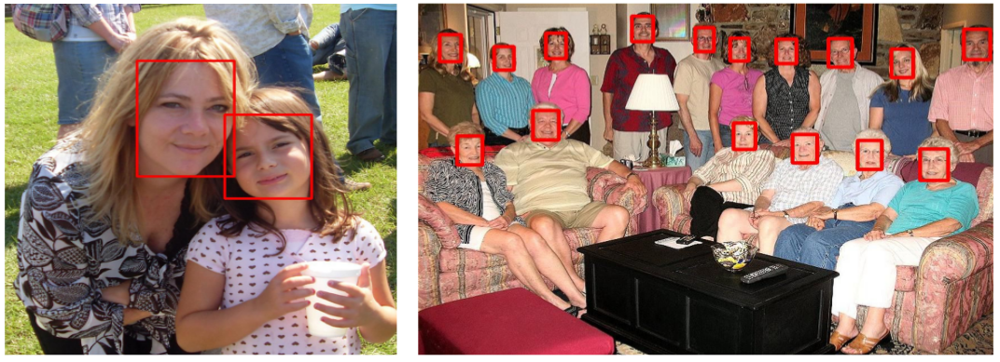

> 论文地址：[SFace: An Efficient Network for Face Detection in Large Scale Variations](https://arxiv.org/abs/1804.06559)

# SFace: An Efficient Network for Face Detection in Large Scale Variations

> 摘要：人脸检测在非常多领域有非常多的运用（如人脸识别）。虽然伴随着CNN的发展，人脸识别也取得了非常大的进步，但是对于人脸之间的尺寸差异非常大的情况（比如高清图片或视频中大量存在）仍然处理的并不好。在这篇文章中，作者提出一种新的方法SFace来解决该问题，主要是通过将anchor-base的方法和anchor-free的方法结合起来来解决尺寸差异问题。此外，一个新的数据集4K-Face用来衡量该结构在尺寸差异巨大的数据集上的性能。该结构在这个新的数据集4K-Face上能够获得满意的效果，此外该结构能够在WIDER FACE数据集上每秒处理50帧，且保证80%的AP。该方法与准确率相近的方法相比，速度上面快了一个数量级。

## 1. 结构和原理

#### 解决尺度差异巨大的方法

一般而言，存在两种方法来解决scale variation问题：

1. 从输入角度解决：采用不同尺度的输入进行处理，在将最后的结果结合起来。
   存在的问题：① 增加了计算量，导致速度慢 ② 需要一些后处理算法来将不同的结果进行融合
2. 从模型角度解决：采用anchor-base方法或者采用anchor-free的方法显式地处理
   存在的问题：① anchor-base依赖于数据集，不同数据集就容易导致性能急剧下降。 ② anchor-free的方法往往性能方面比不上anchor-base的方法

### 整体结构

其中最指的注意的是在P3分支有一个anchor-free branch

下面针对每一个部分详细说明：

#### ① backbone

> 主要的一个设计准则：简单+高效（其实主要为了实时性）

基础网络采用的是Xception-39（主要是为了能够更快，该结构在ImageNet上面的性能为top-1 error为44.9%， top-5 error为21.4%），其具体结构如下所示：

说明：

1. 右边的FPN结构就如上图所示为三个分支，分别来自P3（下采样8），P4（下采样16），P5（下采样32）（关于为什么使用三个分支：主要是作者通过实验说明三个分支足够了，更高效）

2. 其中的GAP为global average pooling，这步加FC主要是为了利用ImageNet进行预训练

3. 其中的FPN部分的结合方式：① 采用的是1x1的卷积，将通道数降到32 ② 采用上采样，再加到feature上面

   

#### ② Anchor-base分支

采用的anchor参数如下所示：

- anchor size：$P3:16^2$，$P4:32^2$，$P5:64^2$（这部分大小的设置主要来源于大部分anchor-based的方法在这三个分支上采用的方式）
- anchor ratio：$1:1$和$1:1.5$
- anchor scales：$2^0,2^{1/3},2^{2/3}$

其实说白了就是在每个不同feature层面每个位置均有6个anchor模板。我们希望输出的$W\times H\times 4A$主要来对这些anchor进行调整使之和ground truth"相匹配"

> 1. IoU大于0.5的为positive，小于0.4的为背景
>
> 暂不介绍分类情况，后续会说明

#### ③ Anchor-free分支 

这部分主要为了处理尺寸超过anchor-base分支的情况。此时假设这些ground-truth的情况为左上角$(x_t,y_t)$，右下角$(x_b,y_b)$，此时我们认为那些落在ground truth方框内的坐标$(x_i, y_i)$所需要学习的"内容"如下所示：

> 即这一支路网络输出的"坐标"信息

#### ④ 采用IOU的分类信息

由于anchor-based和anchor-free分支里面的confidence scores和localization manners是不同的，所以我们如何将两者（的损失函数）结合起来就是一个问题。我们先来看下分类分支输出"如果采用原本的定义"会代表什么：

- anchor-based方法中，我们对应分类分支的ground truth（0或1）其实取决于预先定义的anchor和ground truth之间的IoU是否落在$[0.5,1]$之间，而与位置偏移等等没什么关系。
- anchor-free方法中，往往认为ground truth中心点一定半径内的坐标为ground truth，其他的位置视为背景。依旧和位置偏移没什么关系

从上面分析我们不难发现，分类分支与定位准确之间没有显性的关系。因此这样直接将两者的分类损失加起来显然不太合理，因此这里对分类分支的"预测"结果更改一下：我们的分类分支输出的是**预测值**和**目标值**之间的IOU。

所以综上所示，我们可以下出对应的损失函数：

1. anchor-based分支的位置损失（采用类似SSD等方法里面smooth L1的方式）：
   

2. anchor-free分支的位置损失（采用IoU的方式）：
   

3. 分类损失：
   $$
   L_{class}=Focal\ Loss(y_{pred},iou(pred, gt))
   $$

## 2. 实验分析

首先说明一些实验中的处理：

1. 对训练集图像随机裁剪（正方形），如果裁剪结果包含ground truth的中心，将其保留（否则重新裁剪）；之后再将裁剪结果缩放到600x600
2. 百分之50的概率随机左右翻转
3. 采用color jitter变化
4. 测试的时候，对与WIDER FACE图片按照最短边缩放到1500处理（等比例）；而4K-Face数据则直接输入就好
5. 需要将最终的结果采用NMS处理

#### ① 在WIDER FACE上面的precision-recall曲线

第一行为在验证集上的结果，第二行在测试集上的结果。（可以发现SFace的效果最好）

#### ② Ablation分析

其中的re-score即为上面采用的是IoU分类指标。

#### ③ 实验效果图

