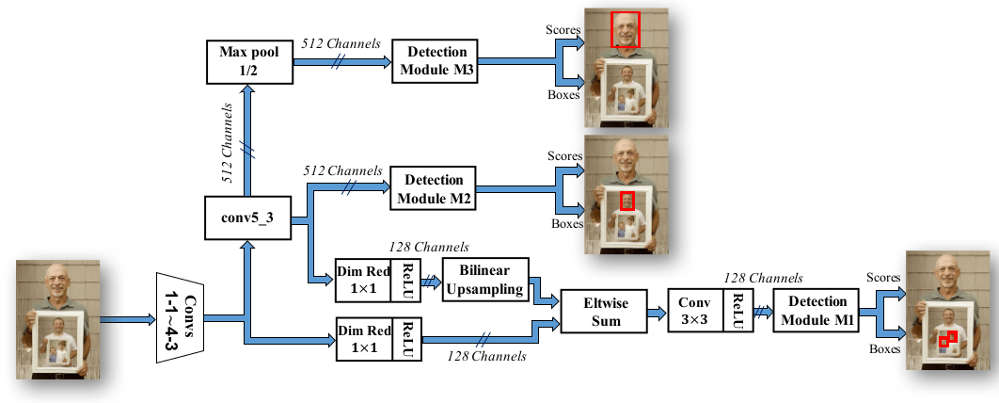
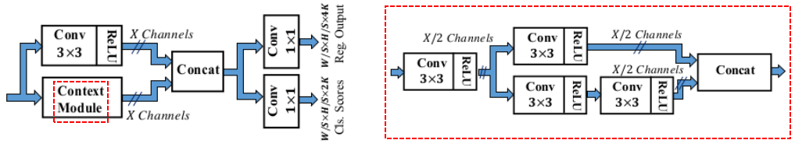
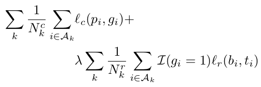
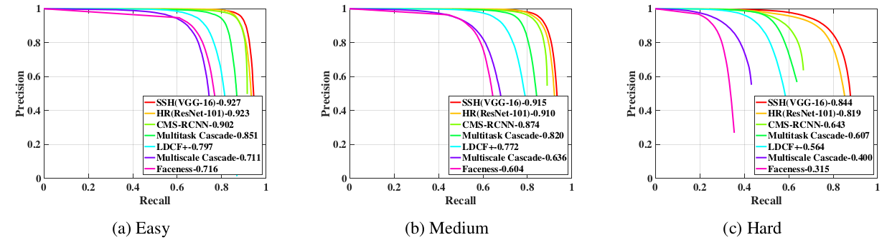
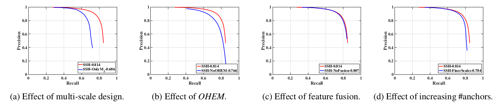
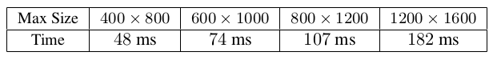
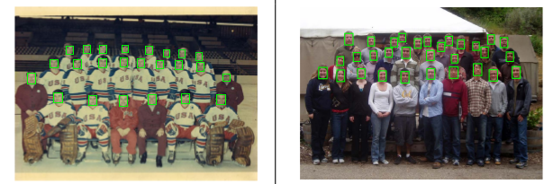

> 论文地址：[SSH: Single Stage Headless Face Detector](https://arxiv.org/abs/1708.03979)
>
> 代码地址：[SSH-caffe](https://github.com/mahyarnajibi/SSH)

#SSH: Single Stage Headless Face Detector

> 摘要：作者提出了一种名为Single Stage Headless（SSH）的人脸检测框架。不同于两阶段（proposal + classification）的检测器，SSH人脸检测属于单阶段检测结构（直接利用分类网络前面的卷积结构）。即SSH没有head部分（指的是RCNN系列的head），但是它依旧能够取得当前最好的效果。此外，该结构也不依赖于多尺度的输入来解决"人脸多尺度"的问题，而是采用不同层级来检测不同大小的目标。这使得SSH更快且更轻量级（因为head需要参数量较大）。惊喜的是，基于"去掉head"的VGG-16SSH结构比当前基于Res-Net-101的人脸检测效果更好，由于SSH并不采用多尺度输入，因此速度什么它快了接近5倍。此外，如果将多尺度输入再加上去，该结构能够在WIDER数据集上取得当前最好的效果（AP提升了2.5%），SSH在FDDB和Pascal-Faces数据集上也取得当前最好的效果，且在单卡GPU上能够达到50ms/image。

## 1. 结构和原理

主要的几点创新：

1. 采用one-stage的方式，能更快
2. 采用多level的形式，从而在不同level上面检测不同scalde的人脸（这样就无需多scale的输入了）

下面对一些细节进行说明。

#### ① Detection Module

在SSH中，采用三个Detection Module（M1，M2，M3 --- 具体结构如上所示）每个Module的输出size也不同，以及对应的anchor也不一样：（下面的S，X代表上图中的情况，anchors只有两个---单种1:1的比例）

- M1：S=8，X=128，anchors大小$16^2,32^2$
- M2：S=16，X=256，anchors大小$64^2, 128^2$
- M3：S=32，X=256，anchors大小$256^2, 512^2$

关于该模块设计的"思想"说明：

- M1分支前面采用了conv5_3上采样的结果，主要为了增强这部分的上下文信息
- 而Detection Module的设计原则可以认为将不同感受野的情况融合起来（Context Module可以认为是5x5和7x7两路分支） --- 这部分思想你可以认为来自Inception系列

#### ② 损失函数

其中$l_c$为分类损失（$A_k$代表该位置包含的anchor）--- 采用cross-entropy，$l_r$代表位置损失 --- 同目标检测里面的位置损失。

训练的一些说明：

1. 将与target的IoU>0.5的视为正样本，IoU<0.3的视为负样本。其他的无视掉（即也不放进分类误差）
2. 采用OHEM策略，每张图片选择256个框框（正负样本比例1:3，且两者均采用OHEM策略选取---正样本选择得分最低的，负样本选得分最高的）

测试的时候：

1. 输出1000个得分最高的anchors，再利用NMS，且阈值设置为0.3

## 2. 实验分析

#### ① WIDER上的效果

#### ② 蒸馏分析

a. 不采用"多scale"分支对比

b. OHEM策略

c. M1是否采用conv5_3的特征

d. 采用更多的anchor 

#### ③ 预测速度

不同输入大小情况下面的预测耗时：

#### ④ 实验效果

