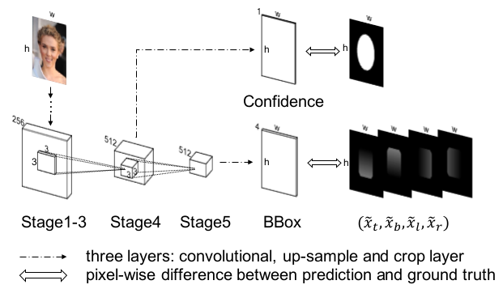
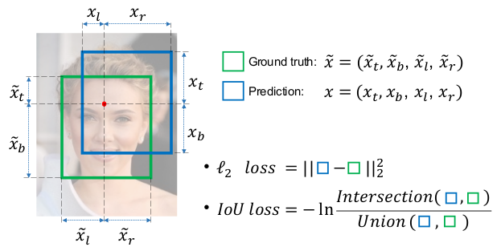
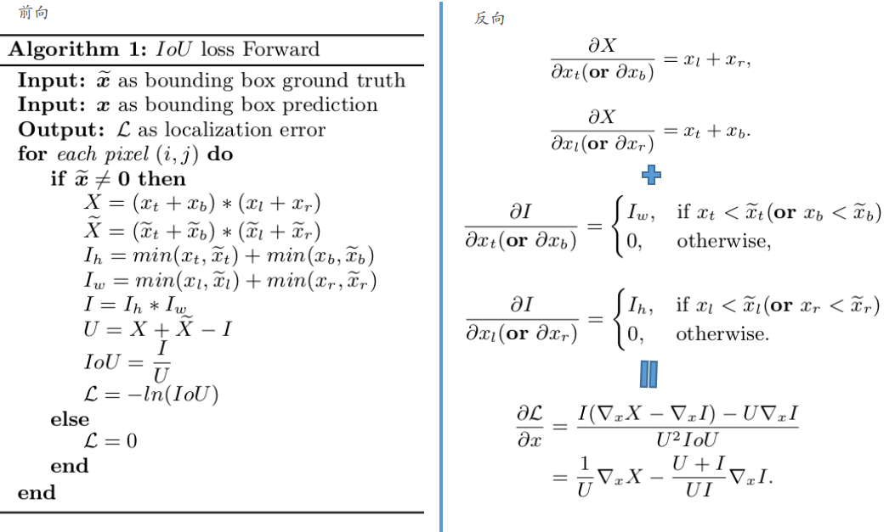
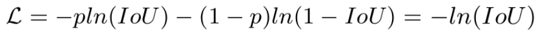
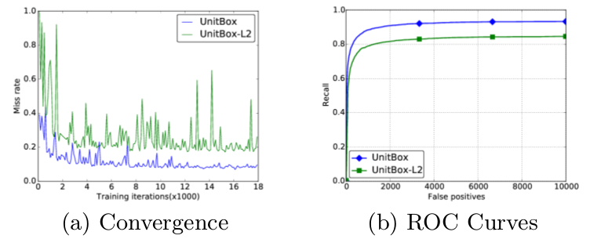
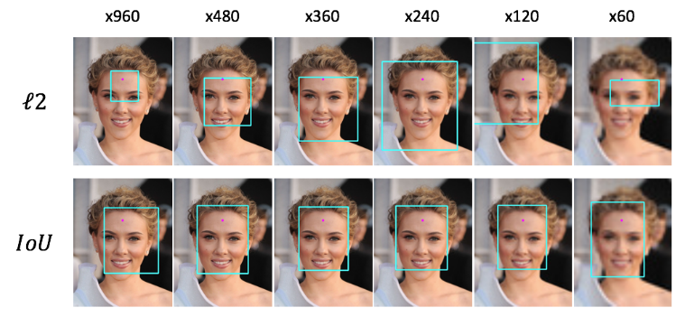
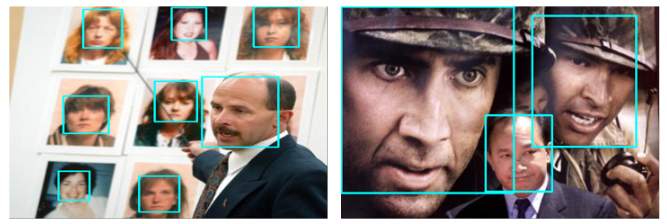

> 论文地址：[UnitBox: An Advanced Object Detection Network](https://arxiv.org/abs/1608.01471)

# UnitBox: An Advanced Object Detection Network

> 摘要：现在的目标检测方案中，大部分运用CNN来"预测"候选框的"偏移"，这比传统的候选框产生方案更具优势。但是，大部分CNN方法假设目标框框是由四个独立变量构成，从而可以采用L2损失对每个变量单独计算损失。但是，这种过于简单的假设其实和我们的直观认知相违背（这几个量是相关的），因此这可能会降低定位精度。为了解决该问题，作者针对定位提出了Intersection over Union（IoU）损失，这种损失将四个变量视为一个"整体"。借助于CNN和IoU损失（作者将这种新结构称之为UnitBox），新的结构能够在准确率和定位精度上面均取得好的效果，此外该结构对不同尺寸和形状具有更好的鲁棒性。作者利用UnitBox在人脸检测任务FDDB数据集上取得了当前最好的效果。

## 1. 结构和原理

整体结构如上所示，其实就是VGG出来两个分支（就和检测的两路分支非常类似）

下面稍微有些细节需要说明一下：

1. confidence分支：虚线代表conv1x1（`512->1`）+上采样（估计是8x）
2. bbox分支：虚线代表conv1x4（`512->4`）+上采样（估计是16x）
3. stage5的存在：作者是认为bounding box分支相比confidence分支需要更大的感受野。（这点有些奇怪）

#### ① IoU损失

上图给出了L2损失和IoU损失的对比。（作者没有指出一点，是否采用IoU损失就不需要anchor了？）

先说下$L2$损失存在的问题：

1. 几个变量之间是相关的，
2. 对于不同尺度的情况，对应的损失是不一样的，大的框框往往对于的损失会更大（所有往往需要针对这一点进行处理）

> 其实关于这方面的讨论，可以看：[IoU-Net](https://arxiv.org/abs/1807.11590)

下面给出具体的IoU损失计算方式：

> 其实看懂前向就好了～

我们可以发现其实IoU损失就是对IoU的cross-entropy：

从这式子也可以看出来Iou损失能够处理不同尺寸的情况（因为对损失并不造成干扰）

#### ② 整体损失

- 分类损失：这部分其实就是简单的cross-entropy
- 位置损失：上面的IoU损失

## 2. 实验分析

#### ① L2损失 v.s. IoU损失

#### ② scale的鲁棒性

- 说明：上述x960等代表图片的分辨率，可以看到x60代表小图，x960代表大图（缩放到同尺寸方便比较），可以明显发现L2损失对于scale是敏感的，会受影响。

#### ③ 实验效果图

