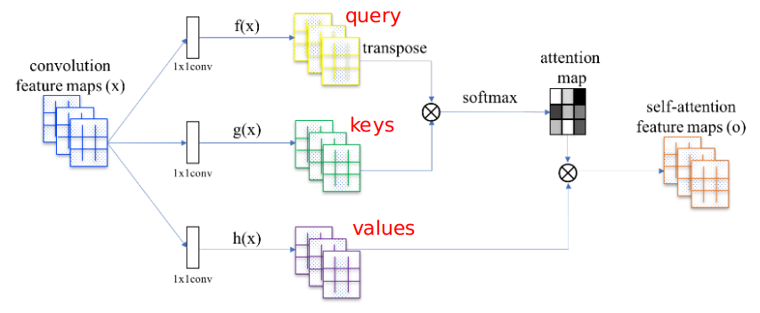
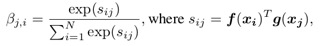
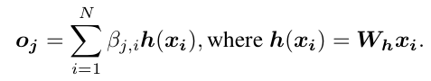
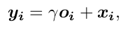
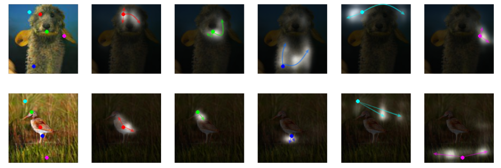

# Self-Attention Generative Adversarial Networks

> 论文地址：[Self-Attention Generative Adversarial Networks](https://arxiv.org/abs/1805.08318)

> 在这篇文章中，作者提出了一种"注意力机制驱动，能够与更长范围建立依赖关系"的图像生成模型Self-Attention Generative Adversarial Network（SAGAN）。之前单纯基于卷积的GANs生成高分辨率特征的细节只依赖于低分辨率特征层上面的局部点，而在SAGAN中，细节的产生则通过所有位置的特征。除此之外，判别器D也能够更好的检查输出图像上的点之间与全局其他点之间的联系，有助于提高判别器的能力。此外，最近的一些研究表明对生成器G施加一些约束能够改善GAN的性能，因此，作者将spectral normalization添加到生成器上面，并发现确实能够改善性能（注：原本SNGAN文章里，SN只用在判别器D上面）。该模型取得了当前最好的性能，在ImageNet数据集上面，将目前发布的最好的Inception score的GAN的性能从36.8提高到52.52，并且将Frechet Inception distance从27.62降到18.65。将attention层可视化也能发现生成器G上面的点不仅仅只是受到"局部邻居点"的影响，更加受到全局形状和某些方面更关联点的影响。

## 1. 目录

- 注意力机制
- 提高GAN训练稳定的方法
- 可视化注意力机制

## 2. 注意力机制

> 其实和我们在其他几篇"有用到注意力机制"的论文完全一样

step1：建立attention map

其中$\beta_{j,i}$代表对于key $j$，与query $i$之间的"相似度"

step2：产生输出

获得key $j$对应的输出$o_j$

step3：scale一下

将$\gamma$初始化为0，其实就是希望训练过程中，一开始还是和GAN类似，后续逐渐增加attention机制的影响

## 3. 提高GAN训练稳定的方法 

1. 在生成器G里面也加入spectral normalization
2. 训练G和训练D采用不同的学习率

## 4. 可视化注意力机制

从上图我们可以发现，每个点对应的attention map其实更"倾向于"受到与之关联更加密切的部分（比如眼睛和眼睛等等）！

