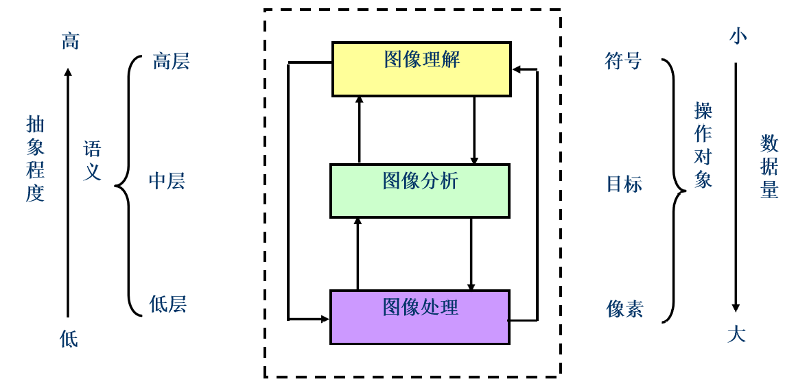
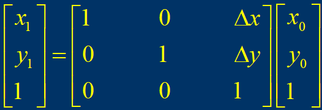

# ch1 概述

## 1. 概述（上）

**数字图像处理的三个层次**： 

**图像的采样和量化**：

- 图像的采样：空间坐标$(x,y)$的数字化
- 图像的量化：图像幅值$f$的离散化

**图像的不同描述方式** ：

- RGB格式从物理和光学角度描述颜色不同
- HSI（H---hue色度，S---saturation饱和度，I---intensity强度）则是根据视觉的主观感觉对颜色进行描述，其中色度H表明颜色的种类；饱和度S表示颜色深、浅、浓、淡程度；I表示强度（intensity），它决定了像素的像素的整体亮度，而不考虑色彩

**图像处理的特点**：

1. 处理精度高，再现性好：计算机图像处理，其实质是对图像数据进行运算。由于计算机技术的飞速发展，计算精度和准确性不断提高；另外，用相同的方法对同一图像进行多次处理，其再现性好
2. 处理方法的多样性：由于图像处理是通过程序实现的，因此，设计不同的图像处理程序，可以实现各种不同的处理目的
3. 图像数据量庞大
4. 处理费时：由于图像数据量大，因此处理比较费时。特别是处理结果与中心像素邻域有关的处理过程花费时间更多
5. 图像处理技术综合性强

**数字图像处理的目的**：

1. 提高图像的视感质量， 以达到赏心悦目的目的
2. 提取图像中所包含的某些特征或特殊信息， 以便于分析
3. 对图像数据进行变换、 编码和压缩， 以便于图像的存储和传输

## 2. 概述（下）

### ① 统计特性

单幅图像的统计特性

1. 图像的信息量：一幅图像如果共有$k$种灰度值，并且各灰度值出现的概率分别为$p_1, p_2, p_3, ... , p_k$，根据香农定理，图像的信息量可采用如下公式计算
   $$
   H=-\sum_{i=1}^k p_i log p_i
   $$

2. 图像灰度平均值：灰度均值是指一幅图像中所有像素灰度值的算术平均值，根据算术平均的意义，计算公式如下
   $$
   \bar{f}=\frac{\sum_{i=0}^{M-1}\sum_{j=0}^{N-1} f(i,j)}{MN}
   $$

3. 图像灰度众数：图像灰度众数是指图像中出现次数最多的灰度值。其物理意义是指一幅图像中面积占优的物体的灰度值信息

4. 图像灰度中值：图像灰度中值是指数字图像全部灰度值中处于中间的值，当灰度级数为偶数时，则取中间的两个灰度值的平均值

5. 图像灰度方差：灰度方差反映各像素灰度值与图像平均灰度值的离散程度
   $$
   S=\frac{\sum_{i=0}^{M-1}\sum_{j=0}^{N-1}[f(i, j)-\bar{f}]^2}{MN}
   $$

6. 图像灰度值域：图像的灰度值域是指图像最大灰度值和最小灰度值之差，计算公式如下
   $$
   f_{range}(i,j)=f_{max}(i,j)-f_{min}(i,j)
   $$

多幅图像间的统计特性

1. 协方差：设$f(i,j)$ 和$g(i,j)$表示大小为$M×N$的两幅图像，则两者之间的协方差计算公式为
   $$
   S_{gf}^2=S_{fg}^2=\frac{1}{MN}\sum_{i=0}^{M-1}\sum_{j=0}^{N-1}[f(i,j)-\bar{f}][g(i,j)-\bar{g}]
   $$

2. 相关系数：相关系数反映了两个不同波段图像所含信息的重叠程度，它是表示图像不同波段间相关程度的统计量
   $$
   r_{fg}=\frac{S_{fg}^2}{S_{ff}\cdot S_{gg}}
   $$

### ② 基本运算

1. 点运算：像素值（像素点的灰度值）通过运算之后，可以改善图像的显示效果。这是一种像素的逐点运算（点运算与相邻的像素之间没有运算关系，是原始图像与目标图像之间的映射关系。是一种简单但却十分有效的图像处理方法）。其实就是$B(x,y)=f(A(x,y))$，主要的运用

   - 对比度增强
   - 光度学标定
   - 显示标定
   - 轮廓线

2. 代数运算：指两幅输入图像之间进行点对点的加、减、乘、除运算得到输出图像的过程；主要有下述四种形式：

   - $C(x,y) = A(x,y)+ B(x,y)$：去除“叠加性”随机噪音；生成图像叠加效果
   - $C(x,y) = A(x,y) - B(x,y)$：消除背景影响；差影法(检测同一场景两幅图像之间的变化)
   - $C(x,y) = A(x,y) \times B(x,y)$：图像的局部显示
   - $C(x,y) = A(x,y) \div B(x,y)$：常用于遥感图像处理中

3. 几何运算：（通常也称为仿射变换）图像处理中对图像平移、旋转、放大和缩小，这些简单变换以及变换中灰度内插处理等。一般采用：

   

   ​

   ​