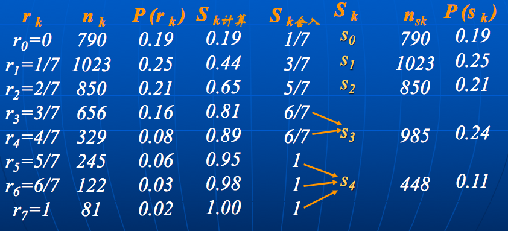

# ch3 图像增强

**图像增强的定义**：按我们的需要突出一幅图像中的某些“有用”信息，同时削弱另外一些“无用”信息的图像处理方法

**图像增强的目的**：通过对图像的处理，使图像比处理前更适合一个特定的应用。也就是为了某种应用目的去改善图像的质量

- 改善图像的视觉效果
- 突出图像的特征，便于计算机处理

图像增强的方法可以分为下述几类：

## 1. 图像增强 --- 空间域

**基于空间域灰度变换的图像增强方法是一种点处理方法**（不会改变像素点之间的空间关系）

### ① 直接灰度变换

这种方式：快，简单，但往往效果有限

> 其实就是$y=f(x)$的变化

### ② 基于直方图的图像增强

主要分为两大类：直方图均衡化+直方图规定化

**I. 直方图均衡化**

目的：将原始图像的直方图变为均衡分布的形式，即将一已知灰度概率密度分布的图像，经过某种变换，变成一幅具有均匀灰度概率密度分布的新图像。  图像均衡化处理后，图像的直方图是平直的，即各灰度级具有相同的出现频数，那么由于灰度级具有均匀的概率分布，图像看起来就更清晰了

主要步骤：

1. 求出图像中所包含的灰度级$r_k$,可以定为$0\sim L-1$
2. 统计各灰度级的像素数目$n_k (k=0,1,2,…L-1)$
3. 计算图像直方图
4. 计算变换函数：$S_k=T(r_k)=\sum_{j=0}^k P_r(r_j)=\sum_{j=0}^k\frac{n_j}{n}$
5. 用变换函数计算映射后输出的灰度级$S_k$
6. 统计映射后新的灰度级$S_k$的像素数目$n_k$
7. 计算输出图像的直方图

> 下图为一个例子：假设像素值为`0,1/7,...,1`
>
> 

本质：直方图均衡化实质上是减少图像的灰度级以换取对比度的加大。在均衡过程中，原来的直方图上频数较小的灰度级被归入很少几个或一个灰度级内，故得不到增强。若这些灰度级所构成的图像细节比较重要，则需采用局部区域直方图均衡

缺点：

- 将原始函数的累积分布函数作为变换函数，只能产生近似均匀的直方图
- 在某些情况下，并不一定需要具有均匀直方图的图像

**II. 直方图规定化**

目的：修改一幅图像的直方图，使它与另一幅图像的直方图匹配或具有一种预先规定的函数形状。（当需要具有特定的直方图的图像时，可按照预先设定的某个形状人为的调整图像的直方图）

这部分具体的操作就不细讲了

### ③ 空间域滤波

定义：空间域滤波是基于**邻域处理**的增强方法，它应用某一模板对每个像素与其周围邻域的所有像素进行某种数学运算得到该像素的新的灰度值，新的灰度值的大小不仅与该像素的灰度值有关，而且还与其邻域内的像素的灰度值有关

可以分为下述两大类：

**I 图像平滑之均值滤波**

基本思想：用几个像素灰度的平均来代替一个像素原来的灰度值，实现图像的平滑

方式1：简单平均法 --- $\bar{f}(x,y)=\frac{1}{M\times N}\sum_{(u,v)\in S}f(u,v)$

这种方式往往会导致边缘模糊

> 1. 如果噪声的分布是独立同分布的，那么这样处理就会使得噪声的方差变为原来的1/(MN) --- 因为$(x_1+x_2+...x_N)/N\sim \Omega(0, \sigma^2/N)$ （用到了$X+Y=\Omega(\mu_x+\mu_y, \sigma^2_x+\sigma^2_y)$）
> 2. 一般M和N的值不宜过大，一方面会对速度有影响，另一方面会使图像变模糊，尤其使在边缘和细节处

方式2：领域加权平均 --- $g(x, y) = \sum_{(u,v)\in S} w(u,v)\cdot f(u,v)$

> 邻域平均法属于低通滤波的处理方法，它在抑制噪声的同时使图像变得模糊，即图像的细节(例如边缘信息)被削弱

**II 图像平滑之中值滤波**

基本思想：用一个窗内的中值代表该区域的值

特点：

- 对大的边缘高度，中值滤波较邻域均值好得多，而对于较小边缘高度，两种滤波只有很少差别
- 中值滤波是非线性的
- 中值滤波在抑制图像随机脉冲噪声方面甚为有效。且运算速度快，便于实时处理
- 中值滤波去除孤立线或点干扰，而保留空间清晰度较平滑滤波为好；但对高斯噪声则不如平滑滤波

**III 图像锐化**

采用梯度法：主要有下面两种方法

典型梯度算法 --- $G[f(x,y)]=([f(x,y)-f(x+1,y)]^2+[f(x,y)-f(x, y+1)]^2)^{1/2}$

Roberts梯度算法 --- $G[f(x,y)]=([f(x,y)-f(x+1,y+1)]^2+[f(x+1,y)-f(x, y+1)]^2)^{1/2}$

> 在具体实现时，往往采用绝对差分方式（即去掉二次方和外面的平方根）
>
> 如下图所示：
>
> 

梯度的特点：

- 图像轮廓上，像素灰度有陡然变化，梯度值很大
- 图像灰度变化平缓区域，梯度值很小
- 等灰度区域，梯度值为零

可以利用上述特点，对梯度大于某个阈值的情况进行特殊处理

## 2. 图像增强 --- 频域

频率平面与图像空域特性的关系

- 图像变化平缓的部分靠近频率平面的圆心，这个区域为低频区域
- 图像中的边、噪音、变化陡峻的部分，以放射方向离开频率平面的圆心，这个区域为高频区域

### ① 低通滤波

滤掉高频部分，保留低频部分；在频域中实现平滑处理：
$$
G(u,v)=H(u,v)F(u,v)
$$

主要的其实就是转移函数$H(u,v)$：

1. 理想低通滤波器：
   $$
   H(u,v)=\begin{cases}1\quad D(u,v)\le D_0\\
   0\quad D(u,v)>D_0 \end{cases}
   $$
   其中$D(u,v)=(u^2+v^2)^{1/2}$

   - 但是理想低通：在物理上不可实现，有抖动现象，滤除高频成分使图像变模糊

2. 巴特沃斯低通滤波器：
   $$
   H(u,v)=\frac{1}{1+\sqrt{2}-1[D(u,v)/D_0]^{2n}}
   $$

   - 没有明显的跳跃
   - 模糊程度减少
   - 尾部含有较多的高频，对噪声的平滑效果不如理想低通滤波器

3. 指数形低通滤波器：
   $$
   H(u,v)=exp(ln(1/\sqrt{2})[D(u.v)/D_0]^n)
   $$

   - 有更加平滑的过滤带，平滑后的图像没有跳跃现象
   - 与2相比，衰减更快，所以比2处理的图像更模糊一些

4. 梯形低通滤波器：
   $$
   H(u,v)=\begin{cases} 1\quad D(u,v)\le D_0 \\ [D(u,v)-D_1]/(D_0-D_1)\quad D_0<D(u,v)\le D_1 \\
   0\quad D(u,v)>D_1 \end{cases}
   $$

上述四种低通滤波器的对比如下：

|    类别     | 振铃程度 | 图像模糊程度 | 噪声平滑效果 |
| :-------: | :--: | :----: | :----: |
|  理想低通滤波器  |  严重  |   严重   |   最好   |
| 巴特沃斯低通滤波器 |  较轻  |   轻    |   好    |
| 指数形低通滤波器  |  无   |   较轻   |   一般   |
|  梯形低通滤波器  |  无   |   很轻   |   一般   |

> 振铃程度是指：指输出图像的灰度剧烈变化处产生的震荡，就好像钟被敲击后产生的空气震荡
>
> 其实很有高斯低通滤波器等等
>
> 
>
> - 其中的高斯低通滤波和指数形非常类似

### ② 高通滤波

这部分其实就是低通反转一下，常用于把高频分量相对突出，显然可使轮廓清晰

