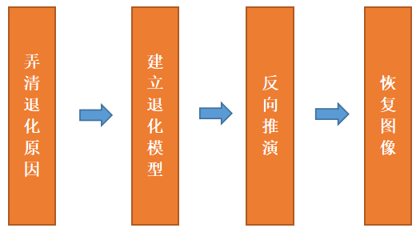

# ch4：图像复原

图像退化：在景物成像过程中，由于目标的高速运动、散射、成像系统畸变和噪声干扰，致使最后形成的图像存在种种恶化， 称之为"退化"。（退化的形式有图像模糊或图像有干扰等）

图像复原：图像复原是将图像退化的过程加以估计,并补偿退化过程造成的失真,以便获得未经干扰退化的原始图像或原始图像的最优估值，从而改善图像质量的一种方法。  （图像复原是图像退化的逆过程）

> 典型的图像复原方法是根据图像退化的先验知识建立一个退化模型以此模型为基础，采用滤波等手段进行处理，使得复原后的图像符合一定的准则，达到改善图像质量的目的

图像复原的一般过程：

图像增强 v.s. 图像复原

- 图像增强是为了突出图像中感兴趣的特征，增强后的图像可能与原始图像存在一定的差异。（评判图像增强质量好坏的是主观标准）
- 图像复原是针对图像退化的原因做出补偿，使恢复后的图像尽可能接近原始图像。（评判图像复原质量好坏的是客观标准）

> 对于一幅已经退化的图像，通常的做法是先做复原再做增强

离散退化模型：$g=Hf+n$

## 1. 图像复原的方法

主要有下述几种方式：

1. 代数复原方法
2. 逆滤波复原方法
3. 中值滤波复原方法

### ① 代数复原方法

图像复原的主要目的是当给定退化的图像$g(x,y)$及系统$h(x,y)$和噪声$n(x,y)$的某种了解或假设，估计出原始图像$f(x,y)$。其代数表达式即为$g=Hf+n$，此时可用线性代数中的理论解决复原问题

例如转换为$\Vert g-Hf\Vert^2$ 的最小二乘问题（如果我没记错的话，这是基于假设噪声是高斯分布），那么求解$f$就直接等于：$\hat{f}=(H^TH)^{-1}H^T g$

> 当然这种方式需要我们先知道H

注：后续两个方法感觉课件没怎么讲，后续再补充

## 2. 图像相似度测量方法（复原好坏衡量指标）

下述$g$代表原始图像， $\hat{g}$ 代表复原后的图像，$f$ 代表退化的图像

### ① 平均绝对误差（MAE）

平均绝对误差的计算是把被评价图像与原始图像各点灰度差的绝对值之和除以图像的大小，其值越小表示与原始图像的偏差越小，图像质量越好
$$
MAE=\frac{\sum_{i=1}^M\sum_{j=1}^N|g(i,j)-\hat{g}(i,j)|}{M\times N}
$$

### ② 均方误差（MSE）

$$
MSE=\frac{\sum_{i=1}^M\sum_{j=1}^N[g(i,j)-\hat{g}(i,j)]^2}{M\times N}
$$

### ③ 归一化均方误差（NMSE）

$$
NMSE=\frac{\sum_{i=1}^M\sum_{j=1}^N[g(i,j)-\hat{g}(i,j)]^2}{\sum_{i=1}^M\sum_{j=1}^N [g(i,j)]^2}
$$

### ④ 信噪比（SNR）和峰值信噪比（PSNR）

越大代表质量越好
$$
SNR=10log_{10}\frac{\sum_{i=1}^M\sum_{j=1}^N g(i,j)^2}{\sum_{i=1}^M\sum_{j=1}^N[g(i,j)-\hat{g}(i,j)]^2}\\
PSNR=10log_{10}\frac{255^2\times M\times N}{\sum_{i=1}^M\sum_{j=1}^N[g(i,j)-\hat{g}(i,j)]^2}
$$

### ⑤ 信噪比改善因子（ISNR）

图像复原相对退化图像的改善程度
$$
ISNR=10log_{10}\frac{\sum_{i=1}^M\sum_{j=1}^N[f(i,j)-g(i,j)]^2}{\sum_{i=1}^M\sum_{j=1}^N[g(i,j)-\hat{g}(i,j)]^2}=PSNR_f-PSNR_g
$$

### 无参照图像情况下

一般采用拉普拉斯算子和方法，以及灰度平均梯度值方法

