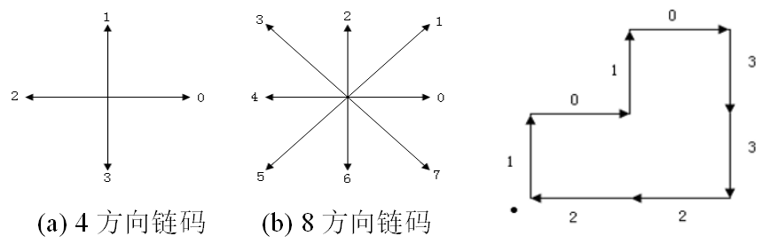

# ch5. 图像特征与配准

这部分看后续补充吧~

## 边界链码

最简单的链码：跟踪边界并赋给每两个相邻像素的连线一个方向值。常用的有4方向和8方向链码

下面例子以4编码为例

1. 链码：上述图对应的4方向链码为 --- 10103322
2. 归一化链码：把原链码看作由各方向数构成的自然数，将该码按一个方向循环，使其**构成的自然数最小**，此时形成归一化链码，也称**规格化链码**。上述情况对应的归一化链码为 --- 01033221
3. **一阶差分链码：**通过计算相邻两个元素方向变化（**逆时针方向**）的数字得到。就是前一个数字变化到后一个数字需要经过的步数，注意是**逆时针方向**，比如**1->1经过0步，1->0经过3步**（） ---- 该例子的结果为31330303

