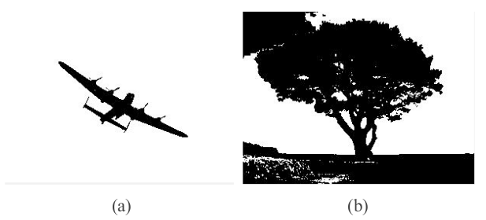
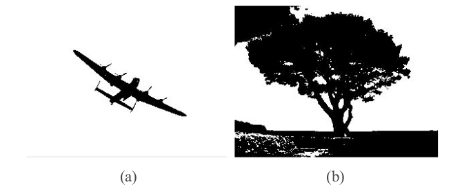
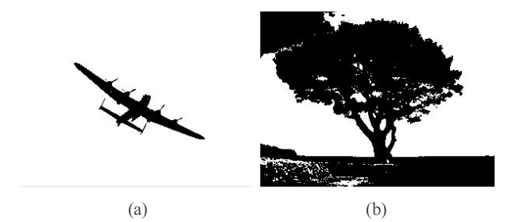
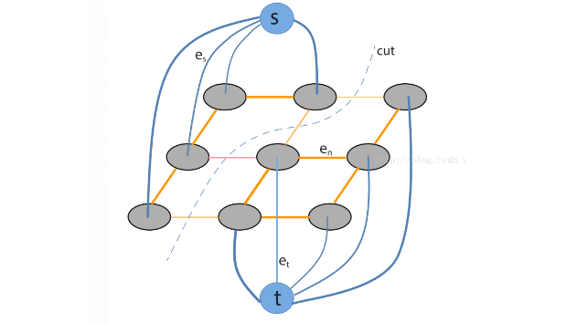

> 这部分内容主要来自：yebo

# ch6. 二值分割

## 1. 常用的评测方法

|                | 目标 | 非目标 |
| :------------: | :--: | :----: |
|  被检测为目标  |  TP  |   FP   |
| 被检测为非目标 |  FN  |   TN   |

### ①  PA (Pixel Accuracy)

PA为像素精度，表示标记正确的像素占总像素的比例，计算公式如下所示：
$$
PA=\frac{\sum TP+\sum TN}{\sum TP+\sum FP+\sum TN+\sum FN}=\frac{预测对的}{总的像素点}
$$

### ②  IoU (Intersection over Union)

IoU为交并比，计算公式如下所示：
$$
IoU=\frac{\sum TP}{(\sum TP+\sum FP)+(\sum FN+\sum TP)-\sum TP}
$$

> 可以将原本的目标视为"一块"，通过各种方法分割后的目标视为"另一块"：IoU指的是这两块的交集/这两块的并集

## 2. 阈值法

阈值法的思想很简单，其关键在于找到一个最佳阈值，然后将图像中的像素值分别与这个阈值做比较，大于阈值分为一类，小于阈值的为另外一类，从而实现对图像的二值化处理。下面是两种常用的阈值方法

### ① 最大类间方差法（Otsu）

最大类间方差法是由Otsu等人于1978年提出，通过遍历所有灰度值，选取其中使分割结果类间方差最大的那一个作为最优阈值，一直被广泛使用。类间方差衡量两类之间的可分离性能，具体到图像分割中就是目标与背景的差异程度，类间方差越大，表示这两类的差异性越大，说明分割结果越好。因此最大类间方差的算法思想是：找到一个最佳阈值，使得使用此阈值进行划分时取得最大的类间方差。不过Ostu方法也有其局限性，当图像中目标占比很小时，Ostu方法分割结果不好，这点与迭代阈值法类似。计算类间方差的公式如下：
$$
V(T)=w_a(\mu_a-\mu)^2+w_b(\mu_b-\mu)^2
$$

> 其中，$V(T)$为两类的类间方差，$w_a$为A类频率，$\mu_a$为A类平均灰度；$w_b$为B类频率，$\mu_b$为B类平均灰度，$\mu$为图像总体平均灰度。

根据定义不难知道存在下述关系：
$$
w_a+w_b=1\\
\mu=\mu_a\times w_a+\mu_b\times w_b
$$
从而$V(T)$等价于：
$$
V(T)=w_a\times w_b\times (\mu_a-\mu_b)^2
$$
在灰度范围内遍历T，找到使得两类总方差$V(T)$取最大值的T，即为最佳分割阈值

上图为Otsu分割示例。(a) PA=0.9877，IoU=0.7814；(b) PA=0.8945 ，IoU=0.8262

### ② 迭代阈值法

选取一个初始阈值，一般可选取为图像的平均灰度$T_0$，然后以$T_0$为阈值，将图像进行分割得到两部分，分别计算两部分的平均灰度，小于$T_0$的部分平均灰度值为$T_A$，大于$T_0$的部分平均灰度值为$T_B$。计算：
$$
T_1=(T_A+T_B)/2
$$
将$T_1$作为新的全局阈值代替$T_0$，重复以上过程，直至$T_K$收敛，即$T_{K+1}=T_K$

> 如果原始图像直方图有明显的双峰，谷底较深，且目标大小占整幅图像的比重不至于太小，则迭代阈值法可以很快收敛并取得满意的分割精度。但是如果不满足上述条件，则迭代法所选取的阈值可能不会取得满意结果

迭代阈值法分割示例。(a) PA=0.9877，IoU=0.7814；(b) PA=0.8937 ，IoU=0.8247

### ③ Fuzzy C-Means (FCM)

模糊C均值(Fuzzy C-Means)，简称FCM，是在K均值算法的基础上发展而来的，引入了模糊的概念，是K-均值算法的推广。模糊C均值算法引入了隶属度的概念，使得某个像素点不再直接属于某一类，而是用介于[0,1]之间的数字来表示其隶属于某一类的程度。FCM最先由Dunn等人提出，Bezdek等人对其进行了改进， FCM通过迭代不断更新隶属度函数和聚类中心，从而得到图像的模糊分类，算法具有很好的收敛性。

FCM算法原理：设$\{x_i,i=1,2,...,n\}$是n个样本组成的样本集合，在图像分割问题中每个像素点即为一个样本，C为设定的分类数目，在PET分割中C为2， $m_j$为每个聚类的中心，$\mu_j(x_i)$是第i个样本对第j类的隶属度函数。因此目标函数可以写为：
$$
J_{FCM}=\sum_{j=1}^C\sum_{i=1}^n [\mu_j(x_i)]^p\Vert x_i-m_j\Vert^2
$$
其中隶属度函数应该满足以下条件：

对于任意的j 和i ：
$$
\mu_j(x_i)\in [0,1]
$$
对于任意的i：
$$
\sum_{j=1}^C\mu_j(x_i)=1
$$
参数$p\gt 1$，用于控制聚类结果的模糊程度，通常P取值为2，聚类中心和隶属度函数的更新公式如下（1-1）：
$$
m_j=\frac{\sum_{i=1}^n \mu_j(x_i)^p x_i}{\sum_{i=1}^n \mu_j(x_i)^p}\quad j=1,2,...,C \\
\mu_j(x_i) = \frac{1/(\Vert x_i-m_j\Vert^2)^{1/(p-1)}}{\sum_{i=1}^n 1/(\Vert x_i-m_j\Vert^2)^{1/(p-1)}} \quad i=1,2,..n;j=1,2,...,C
$$

> 关于如何计算这个更新公式：
>
> 将$\sum_{j=1}^C\mu_j(x_i)=1$引入拉格朗日乘子法构造新的目标函数：
> $$
> J_{FCM}=\sum_{j=1}^C\sum_{i=1}^n [\mu_j(x_i)]^p\Vert x_i-m_j\Vert^2+\lambda (\sum_{j=1}^C\mu_j(x_i)-1)
> $$
> 分别对$\mu_j(x_i)$和$m_j$求导等于0，即可获得上述结果

整个FCM算法的流程如下所示：

1. 设定参数 --- 聚类数目 $C=2$，参数 $p=2$

2. 初始化 --- 初始化各类聚类中心 $m_j$

3. 迭代：

   - 用当前聚类中心根据 1-1 计算隶属度函数$\mu_j$
   - 用当前隶属度矩阵根据 1-1 更新各个聚类中心

   直到聚类中心稳定

4. 输出 --- 将每个像素点$x_i$划分为$argmax_j \mu_j(x_i)$，输出分割结果

FCM分割示例。(a) PA=0.9877，IoU=0.7814；(b) PA=0.8933 ，IoU=0.8233

相比于前面的迭代阈值和Otsu算法这两种阈值方法，FCM能够更方便的解决多分类问题。另外，FCM是基于模糊理论的，因此对于存在不确定性和模糊性等特点的图像，FCM具有更强的分割能力

FCM的局限性：FCM需要提前选好聚类数C和初始聚类中心，并且对这两者的选取很敏感；另外，与阈值法类似，FCM只考虑了图像的灰度特征，而忽略了图像中丰富的空间信息，因此可能导致分割的结果不连续，因此需要一些后处理操作来保证分割结果空间的连通性。

## 4. 自适应区域生长

### ① 区域生长法

区域生长从对象 (Object) 内种子 (Seed) 区域开始，逐步将满足相关规则的相邻像素加入到当前区域。其三要素是：种子点的选取，生长规则，以及生长终止条件。在PET分割中常用的一种区域生长算法是CCRG (Confidence Connected Region Growing) 算法。

置信连通区域生长算法(CCRG)：$S(f)=CCRG(I,f)$

1. 输入 --- I：输入图像，f：松弛因子

2. 设置参数 --- 迭代次数：$J=8$，松弛因子：$f=constant$

3. 初始化 --- 在目标内部选取一个种子点 $X_0$
   计算以$X_0$为中心的$3\times 3$窗口的均值$m_0$和标准差$\sigma_0$
   当前区域$R=\{X_0\}$

4. 迭代：

   For i=1: J
   	$m_i=m_{i-1};\sigma_{i}=\sigma_{i-1}$
   	对R所有领域像素X：
   	If $I(X)\in [m_i-f\sigma_i, m_i+f\sigma_i]$, add X into R
   	if no more X can be added：break;

           更新R的均值和标准差：$m_i=meam[I(R)]; \sigma_i=std[I(R)]$

   End

5. $V(f)$=当前分割所得区域R

然而，为所有对象确定一个最优的松弛因子（ORF）是具有挑战性的，因为小 *f* 限制像素包含只有那些具有非常类似于目前的区域的强度，可能导致欠增长；而大 *f* 放松纳入条件，可能导致过度增长到邻近区域或背景。

> 其实本质就是将相似的像素连起来

### ② 自适应区域生长 

果可以自适应选择最优松弛因子*f* ，则可以改善分割结果。基于最大曲率的自适应区域生长算法（ARG_MC）的思想是：在一个f序列上对每一个*f* 进行CCRG算法，则对每一个f产生一个分割面积S(分割所得前景的面积)，作出*f* - *S*曲线，基于最大曲率的意思是，找到*f* - *S*曲线的第一个最大曲率处，此处表示区域生长刚好达到目标的边缘，对应的*f*即为最佳松弛因子。但原始*f* - *S*曲线并不平滑，导致其对应的曲率曲线不稳定，因此考虑先用平滑的误差函数拟合*f* - *S* 曲线，然后再计算拟合*f* - *S* 曲线的曲率曲线，继而求出最佳松弛因子*f*。

拟合函数为：
$$
v=a+b\times G(c\times (f-d))
$$
其中：$G(\cdot )=(1+erf(\cdot))/2$，$erf(\cdot)$为误差函数，$a,b,c,d$为拟合参数

曲率反映曲线的弯曲程度。可以用不同的方法来逼近数字曲线的曲率。

## 5. 图模型法（这部分可以再看下算法导论）

图割（Graph Cut）方法的思想是将图像映射成**无向加权图**，其中图的每个顶点对应图像的一个像素点，图的边对应图像相邻像素之间的关系，边的权重由相邻像素之间在灰度、或纹理等方面的相似性所决定，权重必须满足非负性条件。对图进行分割，就是移除图特定的边，将图分成不同的子图

### ① **最小割模型**

Min Cut模型在原来图模型的基础上增加了一个源节点s和一个汇节点t，并且源节点与汇节点分别与每个像素点构成一条边，如上图所示。Min Cut 模型实现的过程中一个关键的步骤是如何为图的边设计合理的加权值。

Min Cut模型中的边可以分为三种：

1. 连接源节点**s**到每个像素点的边，记为s-link。从s到像素点x的权值记为$C_s(x)$
2. 连接每个像素点到汇节点**t**的边，记为t-link。从像素点x到t的权值记为$C_t(x)$
3. 各像素点之间的边，记为n-link

n-link连接相邻的像素点，反映的是像素点之间的相似程度，包含图像的局部信息。S-link和T-link的权重表示的是将像素点x分为背景或前景的“全局可能性”，包含图像的全局信息。

> n-link：往往像素越相似，边上的值越大

由于Min Cut模型的思想是：在将图分割为子图的过程中，要使移除的边权值总和尽量小。因此，对于连接各像素点的边n-link，位于图像边缘两侧的像素点，它们构成的边应该具有小权值，而在非边缘区域的相邻像素点，它们之间的权值应该尽量大，这样在分割的过程中，才有更大概率在边缘处进行划分。如果要求在最终分割结果中，与源节点**s**相连的像素点分为前景，与汇节点**t**相连的像素点分为背景，则对于连接像素点与源节点的边 s-link，应包含前景的先验信息，如灰度直方图等。对于连接像素点与汇节点的t-link，则包含背景的先验信息。

如果图像中目标与背景有较大的灰度差异，s-link和t-link的权值构造方法可以是：
$$
\begin{cases} C_s(x)=|I(x)-cs| \\
C_t(x) = |I(x)-ct| \end{cases}
$$
其中$I(x)$为体素点$x$的灰度值，$cs$和$ct$为两个常数。（即cs）

图构造好之后，将原图分为两个集合S和T，s-t割模型如下：
$$
\begin{cases} s\in S,t\in T \\
S\cup T=\{X,s,t\}\\
S\cup T=\empty \end{cases}
$$

> 其中X是由所有像素点构成的集合。

割的容量定义为：
$$
c(S,T)=sum\{c(u,v), 其中u\in S,v\in T\}
$$
$c(u,v)$表示顶点$u,v$之间边的权重

### ② 最大流算法

最大流问题：流（flow）从s-t网络的源节点s流入，汇节点t流出，流经这个网络的最大流量定义为图的最大流

最大流最小割定理：流经 s-t网络的最大流，等于其s-t割的最小容量

因此最小割问题可以转化为最大流问题来求解。最大流的目标函数及约束条件为： 
$$
max_{p_s}\sum_{v\in V}p_s(v) \\
s.t.\quad |p(e_n)|\le C(e_n);\ 0\le p_s(v)\le C_s(v);\  0\le p_t(v)\le C_t(v)\\
 \sum_{e_n\in N_v}p(e_n)-p_s(v)+p_t(v)=0
$$
其中p为流量，C为边的容量，V为图中除s和t之外的顶点集合，即由所有像素点构成的集合，$N_v$为这些顶点组成的边的集合。约束条件表明流量必须小于容量（即边的权值）；而且，除源节点s和汇节点t之外，所有中间节点必须满足流入等于流出，即流入该节点的总流量等于流出这个节点的总流量。

上式是一个离散组合优化问题，一般通过搜索策略不断寻找图的增广路径来求解，但这种离散化方法一个明显的缺点是存在网格偏差

## 6. 变分法

### ① MS模型

变分模型法将图像看做一个以空间位置为自变量的函数*f*，构造关于*f*的能量泛函，然后对能量泛函最小化。最小化方法是，对*f*求变分，利用梯度下降法求解。变分模型法中的一个经典模型是Mumford-Shah 模型

Mumford-Shah 模型（以下简称MS模型）是由Mumford 和Shah 于1989 年提出的。MS模型提出了一种能量泛函最小化方法，以找到最优的分段光滑函数*f*，使得*f*逼近观测图像。其能量函数为：
$$
F(f,K)=\frac{1}{2}\int_\Omega (f-g)^2dA+\beta \int_{\Omega/K}|\nabla f|^2dA+\alpha \int_Kd\sigma
$$
其中：$g$为观测图像，$f$为分段光滑的目标图像，表示整个3D图像域，K表示图像边缘，$\Omega/K$表示非边缘区域，$dA=dxdydz$；能量泛函$F(f,k)$的第一项为保真项，表示目标图像$f$与观测图像间相似程度，第二项要求目标图像$f$非边缘区域应该尽量光滑，第三项表示对边缘的总长度的正则。该泛函中有两个未知量$f$和$K$。$f$是定义在图像域$\Omega$上的函数，而K是$\Omega$的一个子集，该能量函数难以直接求解。Ambrosio 和 Tortorelli于1990 年提出用$\Gamma$收敛将边缘$K$改写成隐式的，从而解决了以上问题。$\Gamma$收敛形式为：
$$
F_\varepsilon(f,v)=\frac{1}{2}\int_{\Omega}(f-g)^2 dA+\beta \int_{\Omega}v^2|\nabla f|^2dA+\alpha \int_\Omega[\varepsilon |\nabla v|^2+\frac{1}{4\varepsilon}(v-1)^2]dA
$$
且我们很容易发现：$\lim_{\varepsilon\to 0}F_{\varepsilon}(f,v)=F(f,k)$

其中$\varepsilon$为一个很小的正常数，$v$为定义在图像域中的函数，$v$接近0时表示图像的边缘，接近1时表示非边缘区域，理想情况下，有：
$$
v(x,y,z)=\begin{cases}0, \quad (x,y,z)位于图像边缘\\
1,\quad (x,y,z)位于非边缘区域\end{cases}
$$
其中：$\varepsilon |\nabla v|^2+\frac{1}{4\varepsilon}(v-1)^2$中$L_2$正则$\varepsilon |\nabla v|^2$使得v是平滑的，$\varepsilon\to 0$，则对$v$的平滑性要求降低，同时要求$v$在大部分区域为1，除了$|\nabla f|^2$很大的地方；从而平滑了图像，同时保护了边缘。$F_{\varepsilon}(f,v)$是关于$f,v$的泛函，初始化时，设$v(x,y)=0$，当能量函数取得最小值时，$v(x,y)$在图像边缘处的点接近为0，不在图像边缘上的点，值接近为1

