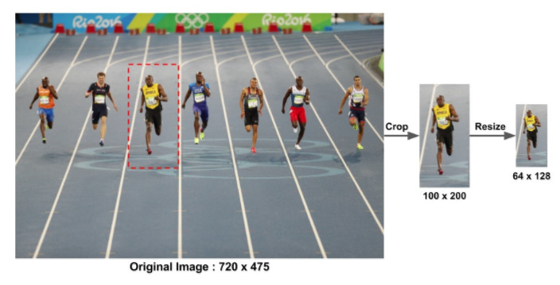
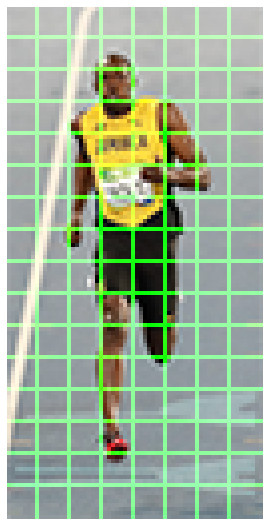
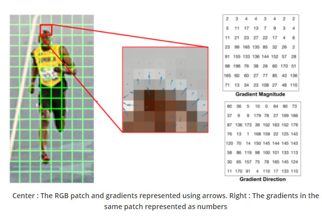
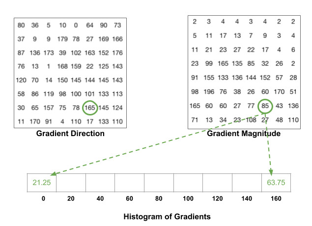
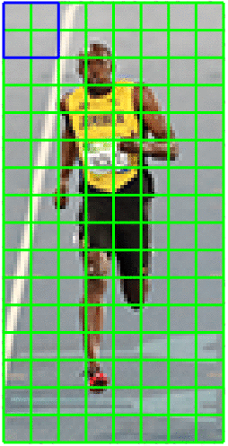
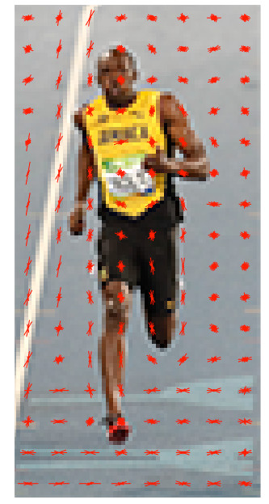

> 下属内容来自：[图像学习之如何理解方向梯度直方图---汪思颖](https://www.leiphone.com/news/201708/ZKsGd2JRKr766wEd.html)

# ch7. HOG算子

## 特征描述子(Feature Descriptor)

特征描述子就是图像的表示，抽取了有用的信息，丢掉了不相关的信息。通常特征描述子会把一个$w\times h\times 3$(宽高，3个channel)的图像转换成一个长度为n的向量/矩阵（此处n并不一定等于$w\times h\times 3$）。比如一副$64\times 128\times 3$的图像，经过转换后输出的图像向量长度可以是3780。

什么样子的特征是有用的呢？假设我们想要预测一张图片里面衣服上面的扣子，扣子通常是圆的，而且上面有几个洞，那你就可以用边缘检测(edge detector)，把图片变成只有边缘的图像，然后就可以很容易的分辨了，那么对于这张图边缘信息就是有用的，颜色信息就是没有用的。而且好的特征应该能够区分纽扣和其它圆形的东西的区别。

方向梯度直方图(HOG)中，梯度的方向分布被用作特征。沿着一张图片X和Y轴的方向上的梯度是很有用的，因为在边缘和角点的梯度值是很大的，我们知道边缘和角点包含了很多物体的形状信息。

## 怎么计算方向梯度直方图呢

我们会先用图像的一个patch来解释。

### 第一步：预处理

Patch可以是任意的尺寸，但是有一个固定的比例，比如当patch长宽比$1:2$，那patch大小可以是$100\times 200$， $128\times 256$或者$1000\times 2000$但不可以是$101\times 205$。

这里有张图是$720\times 475$的，我们选$100\times 200$大小的patch来计算HOG特征，把这个patch从图片里面抠出来，然后再把大小调整成$64\times 128$。

### 第二步：计算梯度图像

首先我们计算水平和垂直方向的梯度，再来计算梯度的直方图。可以用下面的两个kernel来计算，也可以直接用OpenCV里面的kernel大小为1的Sobel算子来计算。

接着，用下面的公式来计算梯度的幅值$g$和方向$\theta$:
$$
g=\sqrt{g_x^2+g_y^2} \\
\theta = arctan\frac{g_y}{g_x}
$$
计算得到的gradient图如下：

> 左边：x轴的梯度绝对值      中间：y轴的梯度绝对值     右边：梯度幅值

从上面的图像中可以看到x轴方向的梯度主要凸显了垂直方向的线条，y轴方向的梯度凸显了水平方向的梯度，梯度幅值凸显了像素值有剧烈变化的地方。(注意：图像的原点是图片的左上角，x轴是水平的，y轴是垂直的)

图像的梯度去掉了很多不必要的信息(比如不变的背景色)，加重了轮廓。换句话说，你可以从梯度的图像中轻而易举的发现有个人。

在每个像素点，都有一个幅值(magnitude)和方向，对于有颜色的图片，会在三个channel上都计算梯度。那么相应的幅值就是三个channel上**最大的幅值**，角度(方向)是最大幅值所对应的角。

### 第三步：在8*8的网格中计算梯度直方图

在这一步，上面的patch图像会被分割成$8\times 8$大小的网格(如下图)，每个网格都会计算一个梯度直方图。那为什么要分成$8\times 8$的呢？用特征描述子的一个主要原因是它提供了一个紧凑(compact)/压缩的表示。一个$8\times 8$的图像有$8\times 8\times 3=192$个像素值，每个像素有两个值(幅值magnitude和方向direction，三个channel取最大magnitude那个)，加起来就是$8\times 8\times 2=128$，后面我们会看到这128个数如何用一个9个bin的直方图来表示成9个数的数组。不仅仅是可以有紧凑的表示，用直方图来表示一个patch也可以更加抗噪，一个gradient可能会有噪音，但是用直方图来表示后就不会对噪音那么敏感了。

> 这个patch的大小是$64\times 128$,分割成$8\times 8$的cell，那么一共有$64/8 * 128/8 = 8*16=128$个网格

对于$64\times 128$的这幅patch来说，$8\times 8$的网格已经足够大来表示有趣的特征比如脸，头等等。

直方图是有9个bin的向量，代表的是角度$0,20,40,60.....160$。

我们先来看看每个8*8的cell的梯度都是什么样子：

> 中间: 一个网格用箭头表示梯度 右边: 这个网格用数字表示的梯度

中间这个图的箭头是梯度的方向，长度是梯度的大小，可以发现箭头的指向方向是像素强度变化方向，幅值是强度变化的大小。

右边的梯度方向矩阵中可以看到角度是0-180度，不是0-360度，这种被称之为"无符号"梯度("unsigned" gradients)，因为一个梯度和它的负数是用同一个数字表示的，也就是说一个梯度的箭头以及它旋转180度之后的箭头方向被认为是一样的。那为什么不用0-360度的表示呢？在事件中发现unsigned gradients比signed gradients在行人检测任务中效果更好。一些HOG的实现中可以让你指定signed gradients。

下一步就是为这些$8\times 8$的网格创建直方图，直方图包含了9个bin来对应$0,20,40,...160$这些角度。

下面这张图解释了这个过程。我们用了上一张图里面的那个网格的梯度幅值和方向。根据方向选择用哪个bin, 根据幅值来确定这个bin的大小。先来看蓝色圆圈圈出来的像素点，它的角度是80，副值是2，所以它在第五个bin里面加了2，再来看红色的圈圆圈圈出来的像素点，它的角度是10，副值是4，因为角度10介于0-20度的中间(正好一半)，所以把幅值一分为二地放到0和20两个bin里面去。

> 梯度直方图

这里有个细节要注意，如果一个角度大于160度，也就是在160-180度之间，我们知道这里角度0，180度是一样的，所以在下面这个例子里，像素的角度为165度的时候，要把幅值按照比例放到0和160的bin里面去。

> 角度大于160的情况

把这$8\times 8$的cell里面所有的像素点都分别加到这9个bin里面去，就构建了一个9-bin的直方图，上面的网格对应的直方图如下：

> $8\times 8$网格直方图

这里，在我们的表示中，Y轴是0度(从上往下)。你可以看到有很多值分布在0,180的bin里面，这其实也就是说明这个网格中的梯度方向很多都是要么朝上，要么朝下。

### 第四步: 16*16块归一化

上面的步骤中，我们创建了基于图片的梯度直方图，但是一个图片的梯度对于整张图片的光线会很敏感。如果你把所有的像素点都除以2，那么梯度的幅值也会减半，那么直方图里面的值也会减半，所以这样并不能消除光线的影响。所以理想情况下，我们希望我们的特征描述子可以和光线变换无关，所以我们就想让我们的直方图归一化从而不受光线变化影响。

先考虑对向量用l2归一化的步骤是：
$$
v = [128, 64, 32] \\
[(128^2) + (64^2) + (32^2) ]^{0.5}=146.64
$$
把v中每一个元素除以146.64得到$[0.87,0.43,0.22]$

考虑另一个向量$2* v$，归一化后可以得到向量依旧是$[0.87, 0.43, 0.22]$。你可以明白归一化是把scale给移除了。

你也许想到直接在我们得到的$9*1$的直方图上面做归一化，这也可以，但是更好的方法是从一个$16*16$的块上做归一化，也就是4个$9*1$的直方图组合成一个$36*1$的向量，然后做归一化，接着，窗口再朝后面挪8个像素(看动图)。重复这个过程把整张图遍历一遍。

> hog-16x16-block-normalization

### 第五步：计算HOG特征向量

为了计算这整个patch的特征向量，需要把$36*1$的向量全部合并组成一个巨大的向量。向量的大小可以这么计算:

1. 我们有多少个$16*16$的块？水平7个，垂直15个，总共有$7*15=105$次移动。
2. 每个$16*16$的块代表了$36*1$的向量。所以把他们放在一起也就是$36*105=3780$维向量。

#### 可视化HOG

通常HOG特征描述子是画出$8*8$网格中$9*1$归一化的直方图，见下图。你可以发现直方图的主要方向捕捉了这个人的外形，特别是躯干和腿。

