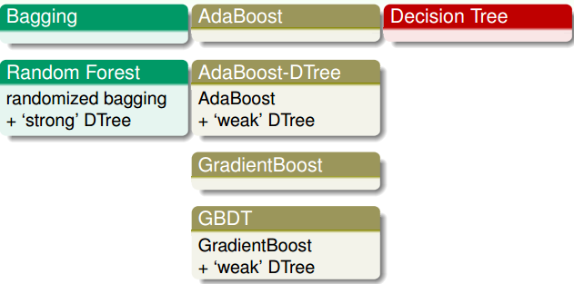

# 机器学习

这部分主要总结各类经典的机器学习算法。

## 基础概念

- [x] [偏差和方差](basic/basic.md)
- [x] [生成模型和判别模型](basic/basic.md)
- [x] [先验概率和后验概率](basic/basic.md)

## 分类

- [x] [基于线性回归的分类](classification/classification.md)：将不同类别采用不同"数值"来表示，再按照回归的方式进行即可---只是效果往往不好
- [x] [基于概率模型的回归](classification/classification.md)：主要介绍基于高斯分布近似的概率生成模型
- [x] [逻辑斯蒂回归](classification/classification.md)：逻辑斯蒂回归，以及几种方法的比较

## SVM

- [x] [线性SVM](svm/SVM1.md)：引入"大边界"的概念，尽可能使解具有更强的鲁棒性（可以视为一种正则化策略）
- [x] [核函数的SVM](svm/SVM2.md)：主要为了在扩展线性SVM的"非线性"能力时，不增加过大的计算量
- [x] [柔性SVM](svm/SVM2.md)：防止由于噪声导致"硬分类"的过拟合，采用对"越界"情况进行惩罚从而达到柔性的概念
- [x] ["通用型"SVM形式](svm/SVM2.md)：svm的表达形式其实可以看做$min\ 1/2w^Tw+C\sum \hat{err}$的形式（相当于加了正则项的损失函数---只是计算损失可能采用稀疏的数据）--- 正是这个等价形式，赋予了SVM无限的扩展可能：改为其他的损失形式(可能会带来的问题就是破坏了SVM的稀疏计算性---利用SV)
- [x] [SVR](svm/SVM2.md)：将损失改变回归形式，普通的二次型并不能保证稀疏，因此采用的是tube回归($err=max(0,|y-s|-\epsilon)$, 真正用到时又改了一下)

## Aggregation

- [x] [模型融合的方式](aggregation/aggregation.md)
- [x] [Bagging（averaging blending）](aggregation/aggregation.md)：每次从数据集$A$中(假设大小为N)等概率地取出元素，取N次构成的数据集$A'$。可以进行多次这样的操作，这样我们就能获得多个数据集。
- [x] [AdaBoost（linear blending）](adaboost/adaboost.md)：每次获得的模型性能或许都不强，但下一个模型都是根据上一个模型的弱点进行"补强"（上一个模型分错的加入更多的权重）。这样就相当于虽然单独每个都不强，但"各有所长"，合起来就可以秒天秒地。
- [x] [Decision Tree（stacking blending）](decisionTree/decisionTree.md)：(主要研究了其一个子例：CART) 非常类似我们做决策的方式（划分的策略），不断根据"划分条件"将问题划分为子问题，再不断划分直到不能再划分为止
- [x] [Random Forest（bagging+CART）](randomforest/randomforest.md)：利用bagging能够降低variance，来降低CART overfitting的可能性
- [x] [Gradient Boosted Decision Tree（GBDT=gradboost+decision tree）](gbdt/gbdt.md)：（推导了adaboost是gradboost的一个子例）将gradboost和decision tree结合起来

## 正则化

- [x] [L1正则](regularize/regularize.md)：L1正则具有稀疏的功能
- [x] [L2正则](regularize/regularize.md)：L2正则主要防止模型过拟合（相当于约束输入随着输出变化的程度）
- [x] L1+L2正则：这部分不太了解